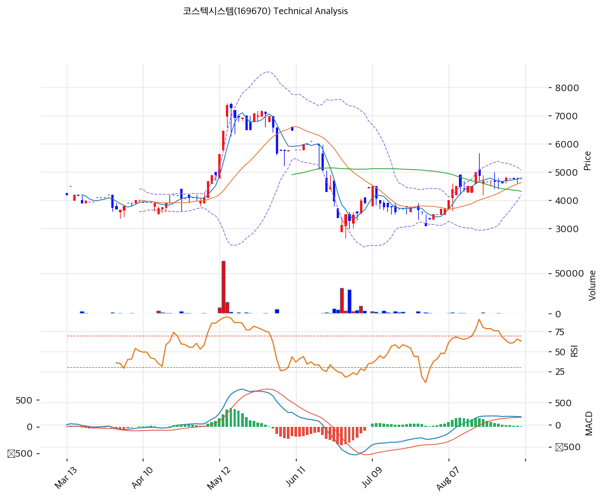

# 코스텍시스템(169670) 기술적 분석

---

## 차트

---

## 가격 현황

| 항목 | 값 |
|------|-----|
| 현재가 | 4,800원 (+0.21%) |
| 52주 고가 | 7,370원 |
| 52주 저가 | 3,105원 |
| 52주 범위 위치 | 39.7% |
| 거래량 | 20일 평균 대비 0.28x |

코넥스 종목이라 일 거래량 자체가 수백~수천 주 수준이다. 아래 지표들은 유동성이 충분한 종목과 같은 신뢰도로 읽을 수 없다. 특히 캔들 형태는 단일 호가 체결만으로도 만들어질 수 있어, 대량 거래를 동반한 구간만 유효한 신호로 취급했다.

---

## 차트 패턴 분석

### 캔들스틱 패턴

| 패턴 | 위치 | 신뢰도 | 해석 |
|------|------|--------|------|
| 적삼병(연속 장대양봉) | 5월 초~중순 | 강 | 대량 거래(5만주 이상) 동반 상승. 3,900원대에서 7,370원까지 갭을 만들며 올랐고 거래량이 뒷받침돼 신뢰도가 높다 |
| 하락 장악형 | 6월 초 | 강 | 창업자 별세 공시(6월 3일) 직후 장대음볼이 직전 양봉을 완전히 덮었다. 추세 전환 신호로 실제 하락이 이어졌다 |
| 망치형 | 6월 말 (3,105원) | 중 | 저점에서 아래꼬리를 길게 남기며 반등했고 거래량이 재차 급증했다. 매도 소진 국면으로 읽힌다 |
| 도지 연속 | 8월 하순~현재 | 중 | 4,600\~5,000원 구간에서 몸통이 짧은 캔들이 반복된다. 거래량 감소를 동반해 방향성 상실 상태다 |

### 가격 구조 패턴

- **박스권 수렴** (신뢰도: 강)
  8월 중순 5,400원 고점을 찍은 뒤 4,600\~5,000원 사이 400원 폭 안에서 3주째 횡보 중이다. 밴드 폭 19.0%는 6월 급락기 대비 절반 수준으로 좁혀졌다. 거래량이 20일 평균의 0.28배까지 말라 있어 전형적인 수렴 국면이며, 이탈 방향이 다음 추세를 결정한다.

- **이중 바닥 시도** (신뢰도: 중)
  6월 말 3,105원과 7월 중순 3,3xx원대에서 두 번 저점을 확인한 뒤 반등했다. 넥라인은 8월 중순 고점 5,400원 부근이며, 이를 거래량 동반 돌파하면 패턴이 완성된다. 목표가는 넥라인에서 저점까지 폭(약 2,300원)을 더한 7,700원 부근이나, 코넥스 유동성상 이 계산은 참고 이상의 의미를 두기 어렵다.

- **하락 추세선 저항** (신뢰도: 중)
  5월 고점 7,370원과 8월 고점 5,400원을 잇는 하락 추세선이 현재 5,200원 부근에 걸쳐 있다. 8월 이후 상승 시도가 이 선에서 두 번 저지됐다.

### 다이버전스

- **RSI 상승 다이버전스** (신뢰도: 중, 이미 실현)
  6월 말 가격이 3,105원까지 밀리는 동안 RSI는 20 근처에서 저점을 높였다. 이후 7\~8월 반등으로 신호가 소화됐다. 현시점 유효한 신호는 아니지만, 바닥 형성 과정이 지표상 확인됐다는 근거는 된다.

- **MACD 하락 다이버전스 조짐** (신뢰도: 약)
  8월 중순 가격 고점 5,400원에서 MACD 히스토그램이 정점을 찍은 뒤, 가격이 4,800원대를 유지하는 동안 히스토그램은 +8까지 축소됐다. 가격은 버티는데 모멘텀만 빠지는 형태다. 다만 거래량이 극도로 얇아 신호 강도를 낮게 봐야 한다.

### 패턴 종합 판단

6월 급락과 저점 확인, 7\~8월 반등까지는 거래량을 동반한 유효한 움직임이었다. 문제는 8월 중순 이후다. 5,400원 저항에서 되밀린 뒤 거래량이 말랐고, MACD 모멘텀은 줄고 있는데 가격만 4,800원에 붙어 있다. 캔들 구조는 방향성 상실, 다이버전스는 약한 하락 쪽을 가리킨다. 상충 신호는 스토캐스틱 골든크로스뿐이며 중립 구간(41)에서 나온 것이라 힘이 약하다.

---

## 이동평균선

비정배열 상태다.

| MA | 값 | 현재가 괴리율 | 위치 |
|----|-----|--------------|------|
| MA5 | 4,788원 | +0.25% | 위 |
| MA20 | 4,631원 | +3.65% | 위 |
| MA60 | 4,316원 | +11.21% | 위 |
| MA120 | 4,612원 | +4.08% | 위 |
| MA200 | 5,035원 | -4.67% | 아래 |

**해석**: 현재가는 MA200을 제외한 모든 이평선 위에 있다. 단기 흐름은 살아 있으나 MA120(4,612원)이 MA60(4,316원)보다 위에 있어 중기 추세는 아직 하락 정렬이다. MA200 5,035원이 1차 저항이며, 이 선을 회복해야 정배열 전환의 출발점이 된다. 하방에서는 MA20 4,631원과 MA120 4,612원이 겹치는 4,610\~4,630원 구간이 1차 지지다.

---

## 보조 지표

### RSI(14): 61.6 (중립)

과매수 기준선 70 아래에 있으나 중립 상단이다. 5월 초 85, 6월 말 20, 8월 중순 85로 극단을 오간 뒤 내려오는 중이다. 방향은 하향이고 아직 과열도 침체도 아니다.

### MACD(12,26,9)

| 항목 | 값 |
|------|-----|
| MACD | 182 |
| Signal | 175 |
| Histogram | +8 |
| 크로스 상태 | 매수 구간 (수축 중) |

**해석**: MACD가 시그널 위에 있어 형식상 매수 구간이지만 히스토그램이 +8까지 줄어 데드크로스 직전이다. 두 선이 거의 붙어 있어 며칠 안에 크로스 방향이 결정된다.

### 볼린저밴드(20, 2σ)

| 항목 | 값 |
|------|-----|
| 상단 | 5,072원 |
| 중단 (MA20) | 4,631원 |
| 하단 | 4,190원 |
| 밴드 폭 | 19.0% |
| 현재 위치 | 중간 |

**해석**: 밴드 폭 19.0%는 5\~6월 변동기(40% 이상) 대비 절반 이하로 축소됐다. 스퀴즈 진행 중이며, 거래량 0.28배와 함께 보면 에너지 축적 국면이다. 상단 5,072원 돌파 또는 하단 4,190원 이탈이 방향 결정 신호가 된다.

### 스토캐스틱(14, 3, 3)

| 항목 | 값 |
|------|-----|
| Slow %K | 41.1 |
| Slow %D | 40.8 |
| 크로스 상태 | 골든크로스 |
| 판단 | 중립 |

---

## 지지/저항

### 피보나치 되돌림/확장

| 구분 | 비율 | 가격 | 현재가 대비 |
|------|------|------|-----------|
| Swing High | — | 7,370원 | +53.5% |
| 되돌림 | 0.786 | 6,457원 | +34.5% |
| 되돌림 | 0.618 | 5,741원 | +19.6% |
| 되돌림 | 0.5 | 5,238원 | +9.1% |
| 되돌림 | 0.382 | 4,734원 | -1.4% |
| 되돌림 | 0.236 | 4,112원 | -14.3% |
| Swing Low | — | 3,105원 | -35.3% |
| 확장 | 1.272 | 1,945원 | -59.5% |
| 확장 | 1.382 | 1,476원 | -69.3% |
| 확장 | 1.618 | 469원 | -90.2% |
| 확장 | 2.0 | — | — |

※ 피보나치 기준: 하락 추세 (Swing High 7,370원 → Swing Low 3,105원)
※ 하락 확장 구간은 산술적으로만 산출된 값이다. 자본총계 119억원과 BPS 4,150원을 감안하면 실질 하방은 확장선보다 훨씬 위에서 지지된다.

### 추세선

| 추세선 | 방향 | 현재 교차가 | 포인트 수 | 해석 |
|--------|------|-----------|---------|------|
| 지지선 | 상승 | 4,350원 | 3개 | 6월 말 3,105원, 7월 중순, 8월 초 저점을 잇는 상승 지지선. MA60 4,316원과 겹쳐 유효성이 높다 |
| 저항선 | 하락 | 5,200원 | 2개 | 5월 고점 7,370원과 8월 고점 5,400원을 잇는 하락 저항선. MA200 5,035원과 근접해 저항대를 형성한다 |

### PRZ (Potential Reversal Zone)

| 방향 | 가격 범위 | 신뢰도 | 근거 |
|------|---------|--------|------|
| 저항 | 5,035\~5,238원 | 강 | MA200 + 하락 추세선 + 피보나치 0.5 + 볼린저 상단이 200원 폭 안에 겹침 |
| 지지 | 4,610\~4,734원 | 강 | MA20 + MA120 + 피보나치 0.382 + 볼린저 중단이 겹침 |
| 지지 | 4,316\~4,350원 | 중 | MA60 + 상승 추세선 |

### 종합 지지/저항 테이블

| 구분 | 가격 | 근거 |
|------|------|------|
| 저항 | 5,741원 | 피보나치 0.618 |
| 저항 | 5,238원 | 피보나치 0.5, PRZ 상단 |
| 저항 | 5,035원 | MA200, 하락 추세선 |
| **현재가** | **4,800원** | — |
| 지지 | 4,734원 | 피보나치 0.382, 피봇 |
| 지지 | 4,631원 | MA20, 볼린저 중단 |
| 지지 | 4,316원 | MA60, 상승 추세선 |
| 지지 | 4,190원 | 볼린저 하단 |

---

## 시그널 종합

| 지표 | 내용 | 시그널 |
|------|------|--------|
| **차트 패턴** | 박스권 수렴, MACD 하락 다이버전스 조짐, 이중 바닥 미완성 | ⚪ |
| 이동평균선 | 비정배열, MA200 아래 4.7% | ⚪ |
| RSI | 61.6, 중립 상단에서 하향 | ⚪ |
| MACD | 매수 구간이나 히스토그램 +8로 수축 | ⚪ |
| 볼린저밴드 | 밴드 폭 19.0%, 중간 위치, 스퀴즈 진행 | ⚪ |
| 스토캐스틱 | K 41.1 / D 40.8 골든크로스, 중립 구간 | ⚪ |
| 거래량 | 0.28x, 약함 | ⚪ |

**종합 판단**: 🟢 매수 0개 / 🔴 매도 0개 / ⚪ 중립 7개 → **중립**

7개 지표가 전부 중립을 가리키는 것은 그 자체가 정보다. 6월 급락 이후 형성된 바닥은 유효하지만 8월 중순 5,400원 저항을 뚫지 못한 채 에너지가 소진됐다. 현재는 5,035\~5,238원 저항대와 4,610\~4,734원 지지대 사이 좁은 구간에 갇혀 있으며, 볼린저 스퀴즈와 거래량 고갈이 겹쳐 이탈 시 변동폭이 클 가능성이 있다. 방향은 차트가 아니라 2026년 상반기 차입금 차환과 삼성전자 HBM 평가 결과 같은 펀더멘털 이벤트가 결정할 공산이 크다.

---

## 전략 제안

### 보유 중인 경우
- **홀드**
- 익절 라인: 1차 5,238원(피보나치 0.5, PRZ 저항 상단), 최종 5,741원(피보나치 0.618)
- 손절 라인: 4,316원 (MA60과 상승 추세선 동시 이탈)
- 리스크/리워드: 최종 목표 기준 1.9 (상승 941원 / 하락 484원)

### 진입 대기인 경우
- **관망**
- 1차 진입가: 4,631원 (MA20·볼린저 중단, PRZ 지지대 상단)
- 2차 진입가: 4,316원 (MA60·상승 추세선)
- 진입 조건: 볼린저 상단 5,072원을 20일 평균의 2배 이상 거래량으로 돌파하거나, 지지대 진입 시 반등 캔들에 거래량이 붙는 경우로 한정한다. 거래량 없는 돌파는 코넥스에서 되돌려지는 사례가 많다. 유동성이 얇아 시장가 주문은 피하고 분할 지정가로 접근해야 한다.
