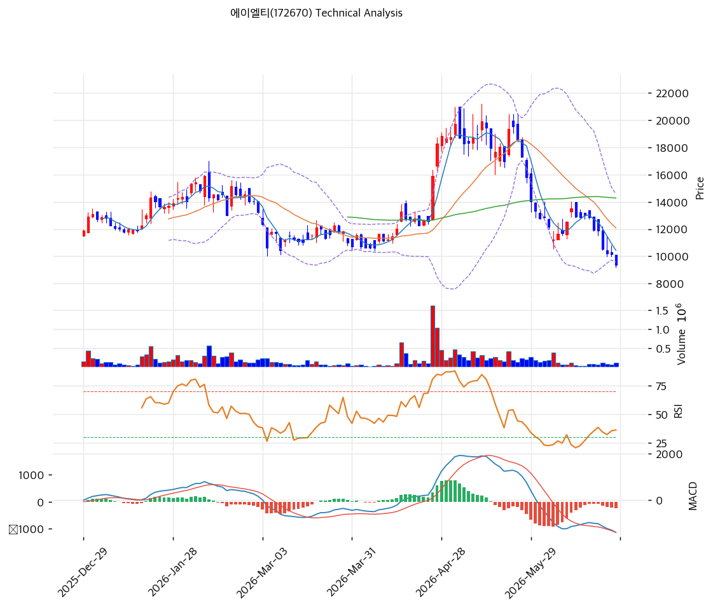

# 기술적분석

2026-06-26 | T2 Technical Analysis

***

## 차트

***

## 1. 가격 현황

| 항목        | 값                   |
| --------- | ------------------- |
| 현재가       | 9,380원 (**-7.86%**) |
| 52주 고가    | 19,900원             |
| 52주 저가    | 6,700원              |
| 52주 범위 위치 | 20.3% (저점권)         |
| 거래량비      | 0.93x (평이)          |
| RSI       | 27.5 (**과매도 🟢**)   |

> 52주 고가(19,900원) 대비 **-53% 하락**한 저점권(9,380원, pos 20.3%)에 위치하며 **오늘 -7.86% 추가 급락**. 모든 이동평균선(MA20 12,078·MA60 14,274·MA200 12,240) 아래로 **완전 역배열·하락 추세**가 뚜렷하다. RSI 27.5·스토캐 4.8로 **과매도** 진입, 볼린저 하단(9,586) 이탈 직전. 추세는 하락이나 단기 과매도 반등(기술적) 가능 구간. 52주 저점(6,700)이 최후 지지.

***

## 2. 차트 패턴 분석

### 2.1 구조·캔들

| 패턴        | 위치              | 신뢰도 | 해석       |
| --------- | --------------- | --- | -------- |
| 장기 하락 추세  | 전 이평선 아래        | 상   | 추세 미전환   |
| 과매도 급락    | RSI 27.5·-7.86% | 중   | 단기 반등 여지 |
| 볼린저 하단 이탈 | 9,380<하단 9,586  | 중   | 과매도 심화   |

* **장기 하락 추세 지속** (신뢰도: 상): MA20\~MA200 모두 위에서 역배열, 추세 미전환. 고점 19,900서 -53%.
* **과매도 단기 반등 여지** (신뢰도: 중): RSI 27.5·스토캐 4.8·볼린저 하단 이탈로 기술적 반등 가능하나, 추세 추종 매수는 시기상조.

### 2.2 다이버전스

* **하락 모멘텀 가속** (신뢰도: 중): MACD 매도·히스토그램 확산(-250)으로 하락 모멘텀 진행 중. 과매도는 반등 트리거이나 추세 반전 신호 아님. 거래량 평이(0.93x)로 투매 클라이맥스 미확인.

***

## 3. 이동평균선 — 완전 역배열

| MA    | 값      | 괴리율    | 위치 |
| ----- | ------ | ------ | -- |
| MA5   | 10,434 | -10.1% | 아래 |
| MA20  | 12,078 | -22.3% | 아래 |
| MA60  | 14,274 | -34.3% | 아래 |
| MA120 | 13,579 | -30.9% | 아래 |
| MA200 | 12,240 | -23.4% | 아래 |

**해석**: 5개 이평선 모두 위에 있는 **완전 역배열(하락 추세)**. MA60 괴리 -34.3%로 중기 추세가 깊은 하락. 단기 반등 시 1차 저항은 MA5(10,434)·피봇 R1(9,930), 추세 전환은 MA20(12,078) 회복이 최소 조건. 현 위치는 이평선과의 괴리가 커 **기술적 되돌림(반등) 여지**는 있으나 추세는 하락.

***

## 4. 보조 지표

### RSI(14) — 27.5 (과매도 🟢)

과매도(30) 진입. 단기 반등 트리거 가능하나, 추세 하락 중이라 반등 폭은 제한될 수 있음.

### MACD

| MACD   | Signal | Hist | 크로스    |
| ------ | ------ | ---- | ------ |
| -1,385 | -1,135 | -250 | 매도(확산) |

영선 깊은 아래에서 매도·히스토그램 확산 → 하락 모멘텀 진행. 반등은 단기 기술적 성격.

### 볼린저밴드(20,2σ)

| 상단     | 중단     | 하단    | 밴드폭   |
| ------ | ------ | ----- | ----- |
| 14,569 | 12,078 | 9,586 | 41.3% |

현재가 9,380은 하단(9,586) 이탈. 밴드폭 41.3%로 변동성 큼. 하단 이탈은 과매도 신호이나 추가 하락 변동성도 의미.

### 스토캐스틱

| %K  | %D  | 판단        |
| --- | --- | --------- |
| 4.8 | 8.3 | 과매도 데드크로스 |

극단 과매도권. 반등 시 골든크로스 전환 주시.

***

## 5. 지지/저항

| 구분      | 가격        | 근거              |
| ------- | --------- | --------------- |
| 저항      | 19,900    | 52주 고가          |
| 저항      | 14,274    | MA60            |
| 저항      | 12,598    | 피보 0.786        |
| 저항      | 12,078    | MA20 (추세 전환 관문) |
| 저항      | 10,434    | MA5             |
| 저항      | 9,930     | 피봇 R1           |
| **현재가** | **9,380** | 저점권·과매도         |
| 지지      | 9,000     | 피봇 S1           |
| 지지      | 8,620     | 피봇 S2           |
| 지지      | 6,700     | 52주 저점          |

***

## 6. 시그널 종합

| 지표    | 내용         | 시그널 |
| ----- | ---------- | --- |
| 차트 패턴 | 장기 하락·과매도  | ⚪   |
| 이동평균선 | 완전 역배열     | 🔴  |
| RSI   | 27.5 — 과매도 | 🟢  |
| MACD  | 매도(확산)     | 🔴  |
| 볼린저밴드 | 하단 이탈(과매도) | 🟢  |
| 스토캐스틱 | 과매도 데드크로스  | 🟢  |
| 거래량   | 평이         | ⚪   |

**종합 판단**: 🟢 매수 3개 / 🔴 매도 2개 / ⚪ 중립 2개 → **혼조 (하락 추세 속 과매도 반등 대기)**

52주 고가 대비 -53% 하락 후 오늘 -7.86% 급락하며 **과매도(RSI 27.5·스토캐 4.8·볼린저 하단 이탈)** 에 진입했다. 단기 기술적 반등 여지는 있으나, MA 완전 역배열·MACD 매도 확산으로 **추세는 명확히 하락**이다. 추세 추종 매수는 **MA20(12,078) 회복 확인 후**가 안전하며, 단기 반등 베팅은 52주 저점(6,700)을 손절선으로 한 고위험 영역이다. 실적 턴어라운드(영업흑자 정착) 확인이 추세 반전의 전제.

***

## 7. 전략 제안

### 보유 중인 경우

* **홀드/관망 (과매도 반등 주시)**
* 익절/반등 매도: 9,930(R1)·10,434(MA5)·12,078(MA20) 단계
* 손절: 8,620(피봇 S2)·6,700(52주 저점) 이탈
* 하락 추세·CB·실적 변동성, 분할 대응

### 진입 대기인 경우

* **과매도 단기 반등 또는 추세 전환 확인 후 (고위험)**
* 1차(반등 베팅): 8,620\~9,000 (과매도, 손절 6,700)
* 2차(추세 확인): 12,078(MA20) 회복 후
* 진입 조건: PBR 0.9x 자산가치이나 영업적자·차입금 895억(현금 81억)·CB 풋 부담. **과매도 단기 반등은 투기적, 추세 추종은 MA20 회복+실적 흑자 정착 확인 후**. 52주 저점·CB 풋(2026.10)·신사업(SiC·MC) 진척 주시.
