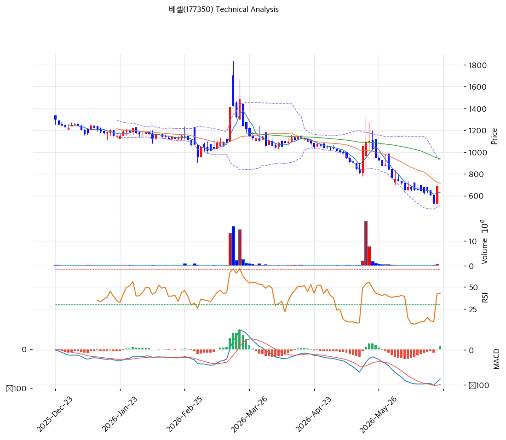

# 기술적분석

2026-06-23 | T2 Technical Analysis

***

## 차트

***

## 1. 가격 현황

| 항목        | 값            |
| --------- | ------------ |
| 현재가       | 690원 (0.00%) |
| 52주 고가    | 1,701원       |
| 52주 저가    | 531원         |
| 52주 범위 위치 | 13.6% (저점권)  |
| 거래량비      | 0.0x (한산)    |
| RSI       | 43.2 (중립)    |

> 52주 고가(1,701원) 대비 **-59% 하락**한 저점권(690원, pos 13.6%)에 위치. 저가(531원)에서는 +30% 반등. 단기선(MA5 632) 위로 반등했으나 **MA20(712)·MA60(939)·MA120(1,056)·MA200(1,167)** 모두 아래로 **중장기 하락 추세**가 뚜렷하다. RSI 43.2 중립, 거래 한산(초소형). 추세 전환을 논하기엔 이르고, 저점 바닥 모색 국면.

***

## 2. 차트 패턴 분석

### 2.1 구조·캔들

| 패턴         | 위치         | 신뢰도 | 해석          |
| ---------- | ---------- | --- | ----------- |
| 장기 하락 추세   | 모든 중장기선 아래 | 상   | 추세 미전환      |
| 저점 반등 시도   | 531→690    | 중   | 단기선(MA5) 회복 |
| MACD 매수 전환 | hist +8    | 약   | 하락 모멘텀 둔화   |

* **장기 하락 추세 지속** (신뢰도: 상): MA20\~MA200 모두 위에서 아래로 정렬(역배열), 추세 미전환.
* **저점 단기 반등** (신뢰도: 중): 52주 저점(531) 후 690까지 반등, MA5(632) 위. MA20(712) 돌파가 1차 관문.

### 2.2 다이버전스

* **하락 모멘텀 둔화** (신뢰도: 약): MACD 매수 전환(히스토그램 +8)·스토캐 골든크로스로 낙폭은 줄었으나, 거래 한산·역배열로 추세 신뢰 약함.

***

## 3. 이동평균선 — 완전 역배열

| MA    | 값     | 괴리율    | 위치 |
| ----- | ----- | ------ | -- |
| MA5   | 632   | +9.1%  | 위  |
| MA20  | 712   | -3.1%  | 아래 |
| MA60  | 939   | -26.5% | 아래 |
| MA120 | 1,056 | -34.7% | 아래 |
| MA200 | 1,167 | -40.9% | 아래 |

**해석**: MA5만 위, MA20\~MA200 모두 아래로 **완전 역배열(하락 추세)**. MA200 괴리 -40.9%로 장기 추세는 깊은 하락. **MA20(712) 돌파가 단기 반등 1차 관문**이며, 이후 MA60(939)이 강한 저항. 단기선(MA5) 회복은 낙폭 과대에 따른 기술적 반등 성격이 강하다.

***

## 4. 보조 지표

### RSI(14) — 43.2 (중립)

중립 하단. 과매도(30) 위로 반등했으나 추세 전환 신호는 아님.

### MACD(12,26,9)

| MACD | Signal | Hist | 크로스       |
| ---- | ------ | ---- | --------- |
| -83  | -91    | +8   | 매수 전환(미약) |

영선 깊은 아래에서 매수 전환·히스토그램 소폭 +. 하락 모멘텀 둔화이나 영선 회복까지는 멀다.

### 볼린저밴드(20,2σ)

| 상단  | 중단  | 하단  | 밴드폭   |
| --- | --- | --- | ----- |
| 917 | 712 | 508 | 57.3% |

밴드폭 57.3%로 변동성 큼. 현재가 690은 중단(712) 아래·하단(508) 위. 중단 돌파 시 반등, 하단(508) 이탈 시 추가 하락.

### 스토캐스틱

| %K   | %D   | 판단        |
| ---- | ---- | --------- |
| 42.9 | 23.9 | 골든크로스(중립) |

중립권 골든크로스, 단기 반등 모멘텀.

***

## 5. 지지/저항

| 구분      | 가격      | 근거                  |
| ------- | ------- | ------------------- |
| 저항      | 1,701   | 52주 고가              |
| 저항      | 1,551   | 추세선 저항              |
| 저항      | 1,167   | MA200               |
| 저항      | 1,056   | MA120               |
| 저항      | 1,047   | ⚠️ CB 전환가(물량 출회 구간) |
| 저항      | 939     | MA60                |
| 저항      | 712     | MA20·볼린저 중단 (1차 관문) |
| **현재가** | **690** | 저점권 반등              |
| 지지      | 632     | MA5                 |
| 지지      | 531     | 52주 저점              |
| 지지      | 508     | 볼린저 하단              |

> ⚠️ **CB 전환가 1,047원이 기술적 저항이자 물량 출회 구간**이다. 주가가 이 부근에 도달하면 CB 전환·차익 매물이 상단을 누를 수 있다.

***

## 6. 시그널 종합

| 지표    | 내용          | 시그널 |
| ----- | ----------- | --- |
| 차트 패턴 | 장기 하락·저점 반등 | ⚪   |
| 이동평균선 | 완전 역배열      | 🔴  |
| RSI   | 43.2 — 중립   | ⚪   |
| MACD  | 매수 전환(미약)   | 🟢  |
| 볼린저밴드 | 중단 아래       | ⚪   |
| 스토캐스틱 | 골든크로스       | ⚪   |
| 거래량   | 한산          | ⚪   |

**종합 판단**: 🟢 매수 1개 / 🔴 매도 1개 / ⚪ 중립 5개 → **중립 (하락 후 저점 바닥 모색)**

52주 저점(531) 반등 후 MA20(712)을 시험하는 국면이나, 중장기선이 완전 역배열로 **추세는 미전환**이다. MACD·스토캐 단기 반등 신호는 낙폭 과대에 따른 기술적 반등 성격이 강하다. **MA20(712)·MA60(939) 회복 전까지는 하락 추세 내 반등**으로 보수적 접근이 필요하며, eVTOL 테마發 변동성·CB 전환가(1,047) 물량 출회를 함께 봐야 한다.

***

## 7. 전략 제안

### 보유 중인 경우

* **홀드 (MA20 돌파 주시)**
* 익절: 712(MA20)·939(MA60)·1,047(CB가·물량 경계) 단계
* 손절: 531(52주 저점)·508(볼린저 하단) 이탈
* 초소형·테마 변동성, 분할 대응 필수

### 진입 대기인 경우

* **저점 분할·소액 (고위험)**
* 1차 진입가: 632(MA5)\~690 (저점권)
* 2차 진입가: 531\~508 (52주 저점·볼린저 하단)
* 진입 조건: PBR 0.33x 자산 저평가이나 본업 적자·CB 희석·테마 의존. **MA20(712) 회복·일회성 제외 본업 개선 확인 전까지 소액 투기성 한정**. CB 전환가(1,047) 물량·eVTOL 테마 변동성 유의.
