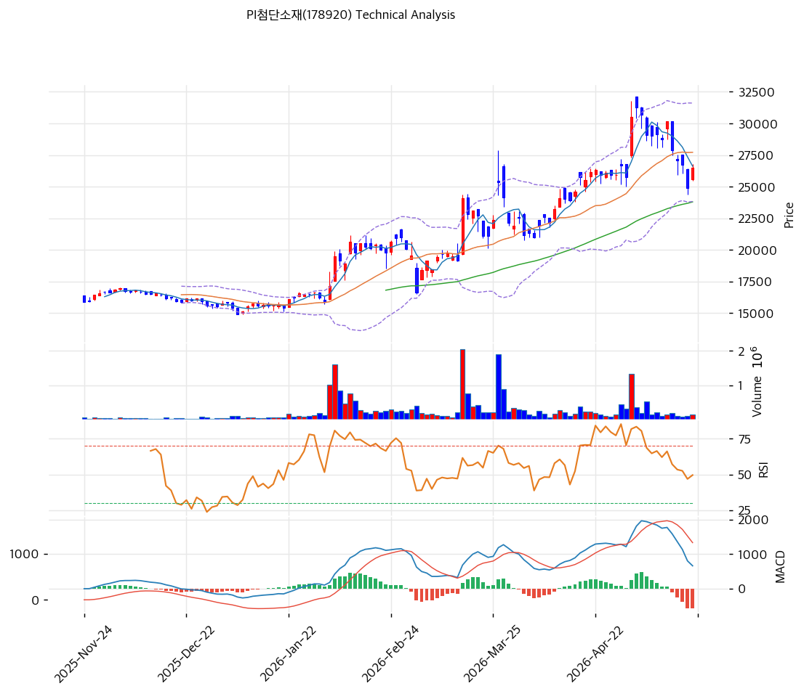

# PI첨단소재(178920) 기술적 분석

2026-05-21 | T2 Technical Analysis

---

## 차트

---

## 1. 가격 현황

| 항목 | 값 |
|------|-----|
| 현재가 | 26,500원 (52주 71%, 정점 31,250원 대비 -15%) |
| 52주 고가 | 31,250원 (2026-04) |
| 52주 저가 | 14,920원 |
| 52주 범위 위치 | 71% |
| 거래량 | 데이터 결손 (차트상 2·3·5월 거래량 폭증) |

---

## 2. 차트 패턴 분석

### 2.1 캔들스틱 패턴

| 패턴 | 위치 | 신뢰도 | 해석 |
|------|------|--------|------|
| 음봉·조정 | 최근 5일 | 중 | 정점 31,250원 대비 -15% 조정 |
| 적삼병 | — | — | 단기 하락 |
| **정점 후 조정 + Stoch 과매도** | 2026-04 정점 | 강 | 사이클 일부 둔화 시그널 + 단기 반등 임박 |

### 2.2 가격 구조 패턴

- **단계적 상승 + 정점 후 조정** (신뢰도: 강)
  2025-11~2026-01 박스권 (14,000~17,000원) → 2026-02 21,000원 1차 정점 → 박스권 18,000~22,000원 → 2026-04 31,250원 2차 정점 → 2026-05 -15% 조정. **사이클 일부 둔화 시그널 + 박스권 (24,000~28,000원) 통합 단계**.

- **Stoch K 19.1 과매도 + RSI 49.5 = 단기 반등 임박** (신뢰도: 강)
  과매도 영역 진입 = 단기 -5~-10% 추가 하락 후 반등 가능성.

### 2.3 다이버전스

- **MACD 매도 (-576)** (신뢰도: 강)
  MACD 663 < Signal 1,239, 히스토그램 -576. 단기 추세 약화.

- **RSI 49.5 + Stoch 19 과매도** (신뢰도: 강)
  RSI 50 임계 임박 + Stoch 극단 과매도 = 단기 평균회귀 기회.

### 2.4 패턴 종합 판단

정점 후 -15% 조정 + Stoch 과매도 + MACD 매도 = **사이클 일부 둔화 + 단기 반등 임박**. 펀더멘털 (PI필름 글로벌 1위·26Q1 OPM 21.8%·순현금 +387억) 정합 시 추가 -5~-10% 하락 후 반등 합리적.

---

## 3. 이동평균선 — 정배열 (일부 훼손)

| MA | 값 | 현재가 괴리율 | 위치 |
|----|-----|--------------|------|
| MA5 | 26,620원 | -0.5% | 아래 |
| MA20 | 27,718원 | -4.4% | 아래 |
| MA60 | 23,791원 | +11.4% | 위 |
| MA200 | 19,222원 | +37.9% | 위 |

**해석**: 단기 MA5·MA20 아래, 중장기 MA60·MA200 위 = **단기 조정·장기 추세 유지**. MA60 (23,791원) 영역 = 1차 강력 지지.

---

## 4. 보조 지표

### RSI(14) — 49.5 (중립, 50 임계 임박)

50 임계 임박 — 단기 평균회귀 기회.

### MACD(12,26,9)

| 항목 | 값 |
|------|-----|
| MACD | 663 |
| Signal | 1,239 |
| Histogram | **-576** |
| 크로스 상태 | 매도 (확대 부재) |

**해석**: 매도 신호 잔여이나 히스토그램 절대값 점차 축소 가능.

### 볼린저밴드(20, 2σ)

| 항목 | 값 |
|------|-----|
| 상단 | 31,611원 |
| 중단 (MA20) | 27,718원 |
| 하단 | 23,824원 |
| 밴드 폭 | 28.1% |
| 현재 위치 | 중간 |

**해석**: 밴드 폭 28.1% 평균. 중간 위치 = 추가 상승·하락 모두 가능.

### 스토캐스틱(14, 3, 3)

| 항목 | 값 |
|------|-----|
| Slow %K | **19.1** |
| Slow %D | 23.4 |
| 크로스 상태 | 데드크로스 |
| 판단 | 🔴 **과매도** |

**해석**: K 19 = 극단 과매도. 단기 반등 시그널 강력.

---

## 5. 지지/저항

### 종합 지지/저항

| 구분 | 가격 | 근거 |
|------|------|------|
| 저항 | 31,611원 | BB 상단 |
| 저항 | 31,250원 | 52주 정점 |
| 저항 | 27,718원 | MA20 |
| **현재가** | **26,500원** | — |
| 지지 | 26,620원 | MA5 |
| 지지 | 23,824원 | BB 하단 |
| 지지 | 23,791원 | **MA60 (1차 강력 지지)** |
| 지지 | 19,222원 | MA200 |
| 지지 | 14,920원 | 52주 저점 |

---

## 6. 시그널 종합

| 지표 | 시그널 |
|------|--------|
| 차트 패턴 (정점 후 조정 + 과매도) | 🟢 (반등 임박) |
| 이동평균선 (단기 아래·장기 위) | ⚪ |
| RSI 49.5 (중립) | ⚪ |
| MACD 매도 (-576) | 🔴 |
| 볼린저밴드 중간 | ⚪ |
| 스토캐스틱 19 🔴 과매도 | 🟢 (반등) |
| 거래량 (5월 폭증 후 감소) | ⚪ |

**종합 판단**: 매수 2 / 매도 1 / 중립 4 → **중립 (반등 시그널 강력)**

**Stoch 19 + RSI 50 임계 = 단기 반등 임박**. MACD 매도 잔여이나 펀더멘털 정합 = 분할 매수 적기.

---

## 7. 전략 제안

### 보유 중
- **홀드 + 분할 익절**
- 1차 익절: 31,250원 (52주 고, +18%)
- 2차 익절: 35,000원 (+32%)
- 손절: 23,791원 (MA60 이탈, -10%)

### 진입 대기 → **진입 적기 영역**
- **즉시 분할 매수 권장**
- 1차 진입: 26,500원 (현재가, 직접 진입)
- 2차 진입: 23,791원 (MA60, -10%)
- 3차 진입: 19,222원 (MA200, -27%)
- 진입 조건: MACD 골든크로스 + RSI 50 회복
- **펀더멘털 우호**: PI필름 글로벌 1위 + 26Q1 OPM 21.8% + 순현금 +387억 + Arkema 54% 안정 — 과매도 + 펀더멘털 정합 매수 적기
