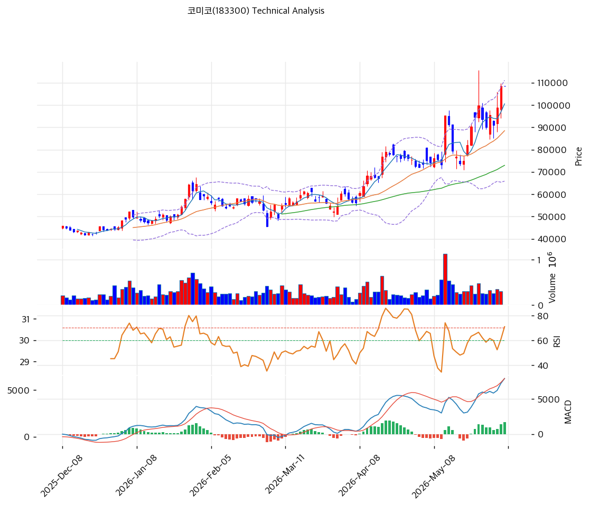

# 기술적분석

***

## 가격 위치

현재가 **108,600원** (보합) — **52주 신고가** 갱신, 52주 위치 **100%** (고가 108,600원 / 저가 28,878원). 1년 **+276%** (28,878→108,600). 본업 가동률 회복 + 미코세라믹스 재평가 + 파운드리 증설 모멘텀. 외국인 20일 +35.5만주 순매수. RSI 67.9 중립(과매수 직전).

## 이동평균선

| 이평선   |        값 |    이격도 |  위치 |
| ----- | -------: | -----: | :-: |
| MA5   | 100,500원 |  +8.1% |  위  |
| MA20  |  88,463원 | +22.8% |  위  |
| MA60  |  72,939원 | +48.9% |  위  |
| MA120 |  62,024원 | +75.1% |  위  |
| MA200 |  56,614원 | +91.8% |  위  |

**완전 정배열 True**. MA200 대비 +91.8%, MA20 대비 +22.8% 이격. 1년 +276% 급등(앞 2종목 +500%+ 대비 완만)으로 이격은 있으나 상대적으로 과열 덜함.

## 모멘텀 지표

* **RSI 67.9 (중립)** — 70 직전, 과매수 근접이나 여유
* **MACD 7,929 / 시그널 6,238 / 히스토 +1,690** — 매수 + 강한 확장. 상승 모멘텀 강함
* **스토캐스틱 K=76.9 / D=64.9** — 골든크로스, 중립\~과매수
* **볼린저밴드** — 상단 111,076 / 중심 88,463 / 하단 65,849, 폭 51.1%, **중간**. 변동성 확대
* **거래량비** — 당일 데이터 공백(보합)

## 피보나치 되돌림 (스윙 28,878 / 108,600)

| 레벨    |      가격 | 성격               |
| ----- | ------: | ---------------- |
| 0.236 | 89,800원 | 1차 지지 (MA20 근접)  |
| 0.382 | 78,150원 | 2차 지지            |
| 0.5   | 68,740원 | 중기 지지 (MA60 근접)  |
| 0.618 | 59,330원 | 깊은 조정 (MA200 근접) |
| 0.786 | 45,940원 | 추가 조정            |

## 지지/저항 (S\&R)

* **저항**: 108,600원(52주 고가) / 110,772원(전략 TP·피봇 R1) / 111,076원(BB 상단)
* **지지**: **100,500원(MA5)** / **88,463원(MA20·BB 중심·피보 0.236 근접·PRZ)** / 78,150원(피보 0.382) / 72,939원(MA60) / 65,849원(BB 하단)

## 종합 시그널 & 전략

**시그널: 매수 2 / 매도 1 / 중립 4 → 매수우위** (정배열 + MACD 강한 확장)

* **전략**: HOLD(홀드) — **TP 110,772원 / SL 108,600원**. WAIT(관망) e1 108,600원 / e2 88,463원
* **눌림목 매수**: 1년 +276% 급등이나 RSI 67.9·MA20 +22.8%로 앞 2종목 대비 **과열은 덜함**. 신고가 돌파 시도 구간으로 **MA5 100,500원 \~ MA20 88,463원(PRZ) 눌림목 분할 매수** 권고. 깊은 조정 시 MA60 72,939원
* **상방**: 52주 고가 108,600원 돌파 시 110,772원 → 신고가 행진. 미코세라믹스·파운드리 증설 모멘텀이 동력
* **하방**: MA20 88,463원 이탈 시 78,150원 → MA60 72,939원. 본업 마진 압박·과매수 시 조정
* **변곡점**: 미코세라믹스 성장·본업 OPM 회복이 추세 핵심. 부채비율 278%로 증설 투자기 재무 모니터링
