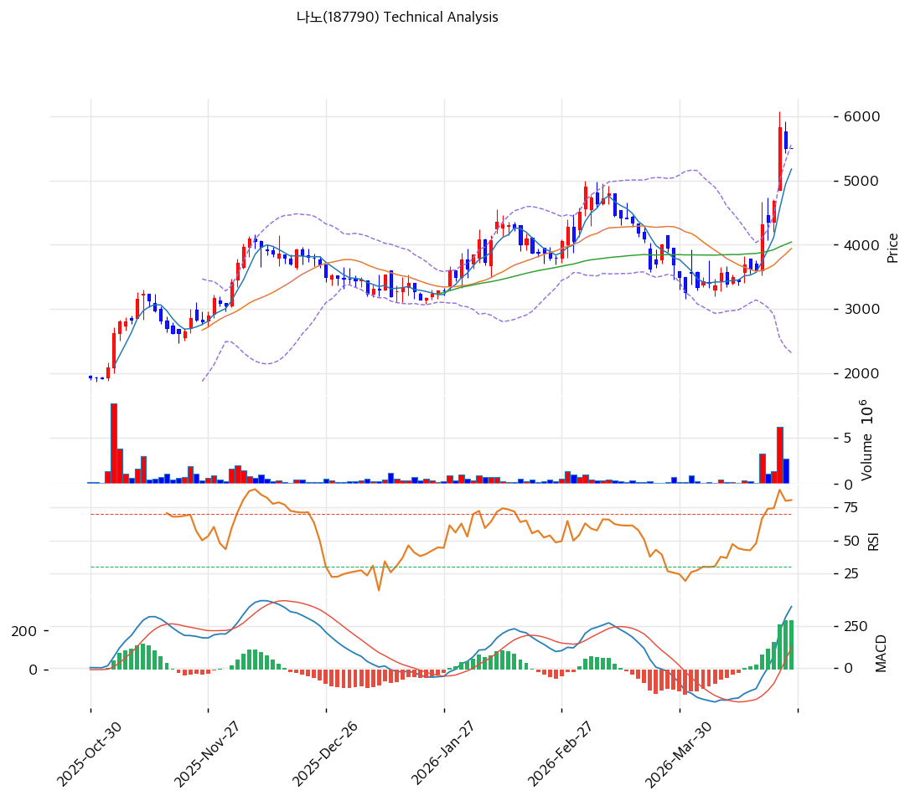

# 나노(187790) 기술적 분석

2026-04-24 | T2 Technical Analysis

---

## 차트

---

## 1. 가격 현황

| 항목 | 값 |
|------|-----|
| 현재가 | 5,510원 (+0.00%) |
| 52주 고가 | 5,830원 |
| 52주 저가 | 949원 |
| 52주 범위 위치 | 93.4% |
| 거래량 | 20일 평균 대비 데이터 미집계 (당일 휴장/미집계) |

---

## 2. 차트 패턴 분석

### 2.1 캔들스틱 패턴

| 패턴 | 위치 | 신뢰도 | 해석 |
|------|------|--------|------|
| 상승 랠리 이후 피크권 횡보 | 최근 5영업일 | 강 | 5,510~5,830원 구간에서 상단 저항 확인 중, 추가 돌파 에너지 축적 또는 단기 조정 분기점 |
| 도지/십자형 캔들 | 최근 2~3일 | 중 | 매수-매도 균형, 52주 고가 근처에서 방향성 결정 국면 시사 |
| 장대 양봉 연속 (3월~4월 초) | 3월~4월 초 | 강 | 949원 저점 대비 +480% 급등의 핵심 구간, 강한 추세 모멘텀 형성 |

※ 차트상 2025년 하반기~2026년 4월까지 뚜렷한 V자 반등 후 52주 고가 근처에서 단기 숨고르기 패턴

### 2.2 가격 구조 패턴

- **상승 추세 채널 형성** (신뢰도: 강)
  2025년 10월~2026년 4월 저점들이 우상향 추세선(지지선 현재 교차가 3,403원)을 형성하고 있으며, 저항선은 5,852원에서 추세 채널 상단을 형성 중이다. 현재가 5,510원은 채널 상단 근처에 위치하며, 채널 돌파 시 목표가는 이론적으로 6,500~7,000원 수준이나 단기 과열이 선행 조건이다.

- **V자 반등 후 저항 테스트 국면** (신뢰도: 중)
  949원(2025년 저점)에서 5,830원(52주 고가)까지 약 6개월간 +514% 급등 후 현재 52주 고가 5,830원을 저항으로 횡보 중이다. 52주 고가 돌파 시 심리적 저항 해소와 추세 가속이 가능하나, 돌파 실패 시 이중천정 패턴 형성 우려가 있다.

- **박스권 형성 가능성** (신뢰도: 중)
  현재가(5,510원)와 52주 고가(5,830원) 사이의 좁은 구간에서 거래가 집중되는 형태로, 단기 박스권(5,200~5,830원)이 형성되는 중이다. 박스권 하단 이탈 시 MA20(3,943원)까지 빠른 되돌림이 가능하다.

### 2.3 다이버전스

- **RSI 하락 다이버전스** (신뢰도: 중)
  4월 초 주가가 신고가에 근접하는 과정에서 RSI가 70.9로 고점을 형성 중이나, 이전 상승 랠리 구간 대비 RSI 상승폭이 제한적인 흐름이 관찰된다. 단기 추세 약화 및 조정 가능성을 시사하나, MACD 히스토그램이 확대 중이어서 추세 반전보다는 속도 조절 국면으로 판단된다.

- **스토캐스틱 데드크로스** (신뢰도: 중)
  스토캐스틱 K(83.9)가 D(87.0) 아래로 교차하며 과매수 영역에서 데드크로스 발생. 단기 2~3주 조정 가능성 시사. 다만 과매수 영역 내 데드크로스는 강한 상승 추세에서 횡보 조정 후 재상승하는 패턴도 빈번하므로 단독으로 매도 신호로 해석하기는 어렵다.

### 2.4 패턴 종합 판단

차트 패턴을 종합하면, 나노는 강한 상승 추세 채널 내에서 52주 고가(5,830원) 저항권에서 단기 숨고르기 중이다. MACD 히스토그램이 확대 중인 것은 중기 상승 추세의 지속을 지지하지만, RSI 70.9 과매수·스토캐스틱 데드크로스·볼린저 상단 밀착 등 단기 과열 신호가 상충한다. 52주 고가 돌파 여부가 향후 방향성을 결정할 핵심 분기점이며, 돌파 실패 시 MA20(3,943원) 또는 피보나치 0.382(3,890원) 구간까지 조정이 가능하다.

---

## 3. 이동평균선 — 비정배열 (단기 강세)

| MA | 값 | 현재가 괴리율 | 위치 |
|----|-----|--------------|------|
| MA5 | 5,179원 | +6.4% | 위 |
| MA20 | 3,943원 | +39.8% | 위 |
| MA60 | 4,042원 | +36.3% | 위 |
| MA120 | 3,637원 | +51.5% | 위 |
| MA200 | 2,901원 | +89.9% | 위 |

**해석**: 현재가는 모든 이동평균선 위에 위치해 강한 상승 추세를 확인한다. 그러나 MA5(5,179원)와 MA20(3,943원)의 이격이 39.8%에 달해 **단기적으로 비정상적인 과열 상태**다. 정배열(MA5>MA20>MA60>MA120>MA200)이 아닌 MA5가 MA20보다 낮은 비정배열은 급등 이후 단기 MA5의 되돌림을 의미한다. MA20(3,943원)이 강력한 중기 지지선 역할을 하며, 이 구간까지의 조정은 추세 훼손이 아닌 건강한 되돌림으로 해석된다.

---

## 4. 보조 지표

### RSI(14) — 70.9 (🔴 과매수)

RSI 70.9로 과매수 구간에 진입해 있으며, 70선을 상회하는 상태가 지속 중이다. 단기적으로 RSI가 70 이하로 하락 시 조정 시작 신호로 해석 가능하나, 강한 모멘텀 장세에서는 RSI 80 이상 지속도 가능하다. 다이버전스 해석은 2.3 참조.

### MACD(12,26,9)

| 항목 | 값 |
|------|-----|
| MACD | 369.0 |
| Signal | 113.0 |
| Histogram | +255.0 |
| 크로스 상태 | 매수 구간 (확대 중) |

**해석**: MACD가 시그널선 위에 위치하고 히스토그램이 +255로 확대 중이어서 중기 상승 추세가 지속됨을 지지한다. 이 신호는 단기 RSI·스토캐스틱 과매수와 상충하지만, 추세의 방향성(상승)은 유효함을 시사한다.

### 볼린저밴드(20, 2σ)

| 항목 | 값 |
|------|-----|
| 상단 | 5,571원 |
| 중단 (MA20) | 3,943원 |
| 하단 | 2,314원 |
| 밴드 폭 | 82.6% |
| 현재 위치 | 상단 근접 |

**해석**: 밴드 폭 82.6%로 매우 넓게 확장되어 있어 급격한 변동성 확대 이후의 구간임을 나타낸다. 현재가가 볼린저밴드 상단(5,571원)에 근접해 있어 단기 저항이 형성 중이며, 상단 이탈 후 재진입은 단기 조정 신호로 해석될 수 있다. 밴드 중단(MA20, 3,943원)이 핵심 지지 기준선이다.

### 스토캐스틱(14, 3, 3)

| 항목 | 값 |
|------|-----|
| Slow %K | 83.9 |
| Slow %D | 87.0 |
| 크로스 상태 | 데드크로스 |
| 판단 | 과매수 |

K(83.9)가 D(87.0) 아래로 교차하며 과매수 영역에서 데드크로스가 발생했다. 단기 2~3주 내 속도 조절 또는 조정 가능성을 높이는 신호다.

---

## 5. 지지/저항 — 추세선 · 피보나치 · PRZ 통합

### 5.1 피보나치 되돌림/확장

| 구분 | 비율 | 가격 | 현재가 대비 |
|------|------|------|-----------|
| Swing High | — | 4,900원 | — |
| 되돌림 | 0.236 | 3,651원 | -33.7% |
| 되돌림 | 0.382 | 3,890원 | -29.4% |
| 되돌림 | 0.5 | 4,082원 | -25.9% |
| 되돌림 | 0.618 | 4,275원 | -22.4% |
| 되돌림 | 0.786 | 4,550원 | -17.4% |
| Swing Low | — | 3,265원 | — |
| 확장 | 1.272 | 2,820원 | -48.8% |
| 확장 | 1.382 | 2,640원 | -52.1% |
| 확장 | 1.618 | 2,255원 | -59.1% |
| 확장 | 2.0 | 1,630원 | -70.4% |

※ 피보나치 기준: 하락 추세 (Swing High 4,900원 → Swing Low 3,265원 기준, 현재가는 이 레인지를 크게 상회)
※ 현재가 5,510원은 피보나치 되돌림 레인지(3,265~4,900원)를 모두 상향 돌파한 강한 추세 국면

### 5.2 추세선

| 추세선 | 방향 | 현재 교차가 | 포인트 수 | 해석 |
|--------|------|-----------|---------|------|
| 지지선 | 상승 | 3,403원 | 6개 | 중기 상승 추세의 핵심 지지, 이탈 시 추세 전환 경고 |
| 저항선 | 상승 | 5,852원 | 6개 | 현재가 5,510원 대비 +6.2% 위치, 52주 고가(5,830원)와 수렴 |

### 5.3 PRZ (Potential Reversal Zone)

| 방향 | 가격 범위 | 신뢰도 | 근거 |
|------|---------|--------|------|
| 지지 | 5,510~5,510원 | 강 | 피봇 R1, 피봇 R2, 피봇 S1, 피봇 S2 동시 수렴 |
| 지지 | 3,890~4,082원 | 강 | 피보나치 0.382 되돌림, MA20, MA60, 피보나치 0.5 되돌림 동시 수렴 |

※ PRZ = 추세선·피보나치·피봇·MA 등 복수 지표가 겹치는 가격 구간. 겹치는 소스가 많을수록 반전 확률 상승.

### 5.4 종합 지지/저항 테이블

| 구분 | 가격 | 근거 |
|------|------|------|
| 저항 | 5,852원 | 추세선 저항 (상승 채널 상단) |
| 저항 | 5,830원 | 52주 고가 — 심리적 저항 |
| **현재가** | **5,510원** | — |
| 지지 | 5,510원 | PRZ(강) — 피봇 R1/R2/S1/S2 수렴 |
| 지지 | 4,550원 | 피보나치 0.786 되돌림 |
| 지지 | 4,275원 | 피보나치 0.618 되돌림 |
| 지지 | 3,989원 | PRZ(강) — 피보나치 0.382, MA20, MA60 수렴 |
| 지지 | 3,651원 | 피보나치 0.236 되돌림 |
| 지지 | 3,403원 | 추세선 지지 (상승 채널 하단) |

---

## 6. 시그널 종합

| 지표 | 내용 | 시그널 |
|------|------|--------|
| **차트 패턴** | 상승 채널 내 52주 고가 저항 테스트 중, 단기 숨고르기 | ⚪ |
| 이동평균선 | 전 MA 위 (비정배열) — MA20 대비 +39.8% 과열 | 🔴 |
| RSI | 70.9 — 과매수 | 🔴 |
| MACD | 매수구간, 히스토그램 확대 중 | 🟢 |
| 볼린저밴드 | 상단(5,571원) 근접, 밴드폭 82.6% 확대 | ⚪ |
| 스토캐스틱 | 데드크로스, K=83.9 — 과매수 | 🔴 |
| 거래량 | 데이터 미집계 (당일 기준) | ⚪ |

**종합 판단**: 🟢 매수 1개 / 🔴 매도 3개 / ⚪ 중립 3개 → **매도우위 (단기 과열)**

중기 상승 추세(MACD 확대)는 유효하나 단기 과매수(RSI 70.9, 스토캐스틱 데드크로스, MA20 괴리 39.8%)로 인한 속도 조절 가능성이 높다. 52주 고가(5,830원) 돌파 성공 시 추세 가속, 실패 시 MA20(3,943원) 구간까지 정상화 조정이 예상된다. 중기 상승 추세 자체는 훼손되지 않은 구간이다.

---

## 7. 전략 제안

### 보유 중인 경우
- **비중축소 또는 홀드 (익절 검토)**
- 익절 라인: 5,947원 (추세선 저항 5,852원 돌파 후 +1σ 목표)
- 손절 라인: 5,510원 (피봇 지지 이탈 시 — 현재가와 동일, 장중 이탈 확인 필요)
- 리스크/리워드: 보유 기준 단기 1:1 미만으로 매력도 낮음, 비중 일부 축소 후 재진입 전략 유효

### 진입 대기인 경우
- **관망 후 조정 시 분할 진입**
- 1차 진입가: 5,510원 (피봇 지지대 확인 후 — 현재가에서 지지 재확인 시)
- 2차 진입가: 3,943원 (MA20 = 볼린저밴드 중단, PRZ 구간)
- 진입 조건: ① 52주 고가(5,830원) 거래량 동반 돌파 확인 후 추격 매수, 또는 ② RSI 50 이하로 하락 후 MA20 지지 확인 시 분할 매수. 현재 구간 신규 진입은 리스크/리워드 불리.
