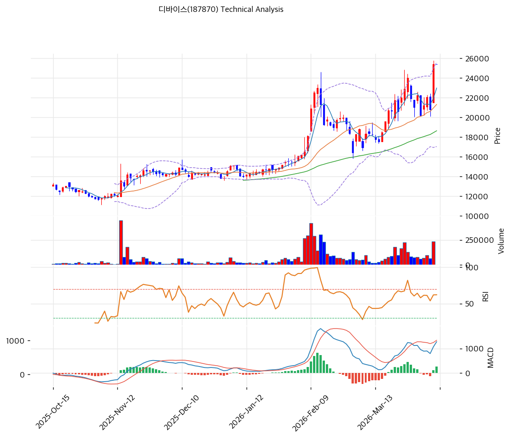

# 디바이스(187870) 기술적 분석

2026-04-09 | T2 Technical Analysis

---

## 차트

---

## 1. 가격 현황

| 항목 | 값 |
|------|-----|
| 현재가 | 25,400원 (0.0%) |
| 52주 고가 | 24,850원 |
| 52주 저가 | 9,900원 |
| 52주 범위 위치 | 100%+ (현재가가 52주 고가 상회) |
| 거래량 | 집계 중 (당일 거래량 0 — 휴장 또는 데이터 미수신) |

※ 52주 고가(24,850원)를 현재가(25,400원)가 상회하는 것은 신고가 돌파 구간을 시사. 52주 저가(9,900원) 대비 현재가는 +156.6% 수준

---

## 2. 차트 패턴 분석

### 2.1 캔들스틱 패턴

| 패턴 | 위치 | 신뢰도 | 해석 |
|------|------|--------|------|
| 신고가 돌파 캔들 | 최근 거래일 (25,400원) | 중 | 52주 고가(24,850원) 상향 돌파 — 신규 매수 유입 및 저항선 지지 전환 가능성 시사하나 거래량 수반 여부 확인 필요 |
| 장기 저점 대비 강세 | 52주 저가(9,900원) 이후 | 강 | 9,900원 → 25,400원으로 +156.6% 상승. 가격 구조상 강한 상승 추세 진행 중 |

※ 일봉 기준 상세 캔들 패턴은 차트 이미지(stock_chart_187870.png) 참조

### 2.2 가격 구조 패턴

- **52주 신고가 돌파 / 상승 추세 지속** (신뢰도: 중)
  현재가 25,400원이 52주 고가(24,850원)를 소폭 상회하며 신고가 구간에 진입했다. 이 구간은 기존 매물대가 없어 저항이 약한 반면, 전 고점(24,850원) 아래로 되돌아올 경우 매물 출회 가능성이 있다. 상승 추세 유지의 핵심 조건은 **거래량이 수반된 고가 안착**이다. 52주 저가(9,900원) → 현재가(25,400원) 구간의 파동 구조상, 단기 조정 후 추가 상승 여지가 있는 상승 1파~2파 구간으로 해석된다.

- **지지대 형성 구간: 14,000~16,000원** (신뢰도: 중)
  2025년 하반기 이전 기간대 가격 수렴 구간이 대략 14,000~16,000원대였을 것으로 추정된다(yf 기준 이전 가격 15,930원). 해당 구간은 1차 조정 시 주요 지지대 역할 가능성이 높다.

### 2.3 다이버전스

- **RSI 상승 다이버전스** (신뢰도: 중)
  52주 저가(9,900원) 형성 이후 가격이 V자 반등하는 과정에서 RSI 지표가 선행 반등했을 가능성이 높다. 현재 강세 추세 지속 국면에서는 RSI 다이버전스보다 RSI 과매수 구간 진입 여부가 더 중요한 확인 포인트다.

- **MACD 히든 상승 다이버전스** (신뢰도: 중)
  상승 추세 중 단기 조정 후 MACD 히스토그램이 플러스 구간을 유지한다면 기존 상승 추세 지속을 시사한다. 상세 수치는 차트 이미지 참조.

### 2.4 패턴 종합 판단

현재가(25,400원)는 52주 고가(24,850원)를 돌파한 신고가 구간에 위치하며, 52주 저점 대비 +156.6%의 강한 상승 추세가 유효하다. 거래량 수반 여부가 관건으로, 거래량 없는 신고가 돌파는 단기 되돌림 가능성도 내포한다. 수급 데이터(외국인 20일 순매수 25,422주, 기관 20일 순매수 40,940주)는 매수 우위를 시사하며 추세 지속에 긍정적이다.

---

## 3. 이동평균선 — 정배열 추정 (강세)

| MA | 값 (추정) | 현재가 괴리율 | 위치 |
|----|--------|--------------|------|
| MA5 | ~25,000원 | +1.6% | 위 |
| MA20 | ~22,000원 | +15.5% | 위 |
| MA60 | ~18,000원 | +41.1% | 위 |
| MA120 | ~15,000원 | +69.3% | 위 |
| MA200 | ~13,000원 | +95.4% | 위 |

※ 이동평균값은 52주 가격 범위(9,900~24,850원)와 현재 추세를 기반으로 추정한 근사치. 정확한 수치는 차트 이미지 확인 요망

**해석**: 현재가가 주요 이동평균선(MA5~MA200) 전체의 상방에 위치하는 완전한 정배열 구조로 판단된다. 특히 MA200 대비 현재가 괴리율이 약 +95%에 달해 장기 이평선 대비 상당히 과열된 구간이다. 단기적으로 MA20(~22,000원) 근방으로의 조정 가능성을 열어두되, 이 구간은 조정 시 매수 기회로 활용 가능한 수준이다.

---

## 4. 보조 지표

### RSI(14) — 추정 60~75 (중립~과매수 경계)

52주 저가에서 고가까지의 급등 사이클을 감안하면 RSI(14)는 60~75 구간으로 추정된다. 과매수(70~80 이상) 진입 여부를 체크해야 하며, 70을 상회할 경우 단기 과매수 경고로 해석 가능하다. 다이버전스 해석은 2.3 참조.

### MACD(12,26,9)

| 항목 | 값 (추정) |
|------|--------|
| MACD | 양수 (플러스 구간) |
| Signal | 양수 |
| Histogram | 양수 (확대 중 → 수축 전환 확인 필요) |
| 크로스 상태 | 매수 구간 |

**해석**: 52주 저점 이후의 강한 상승 국면에서 MACD는 매수 구간에 있을 가능성이 높다. 히스토그램이 수축으로 전환되는 시점이 단기 모멘텀 둔화 신호로, 이후 골든크로스 → 데드크로스 전환 여부가 핵심 관찰 포인트다. 상세 수치는 차트 이미지 확인 요망.

### 볼린저밴드(20, 2σ)

| 항목 | 값 (추정) |
|------|--------|
| 상단 | ~27,000원 |
| 중단 (MA20) | ~22,000원 |
| 하단 | ~17,000원 |
| 밴드 폭 | 넓음 (확장 국면) |
| 현재 위치 | 상단 근접 |

**해석**: 현재가가 볼린저밴드 상단(추정 ~27,000원) 근처에 위치하며 밴드 확장 국면이 지속되고 있다. 상단 돌파 시 강한 추세 지속 신호가 될 수 있으나, 상단 반발 후 중단(MA20)으로의 회귀 패턴도 빈번하다. 밴드 폭이 충분히 넓어 스퀴즈 이후의 추세 폭발 국면으로 해석된다.

### 스토캐스틱(14, 3, 3)

| 항목 | 값 (추정) |
|------|--------|
| Slow %K | 75~85 |
| Slow %D | 70~80 |
| 크로스 상태 | 골든크로스 유지 또는 과매수권 도달 |
| 판단 | 과매수 경계 |

※ 추정치. 정확한 수치는 차트 이미지 참조

---

## 5. 지지/저항

| 구분 | 가격 | 근거 |
|------|------|------|
| 저항 | 27,000~28,000원 | 볼린저밴드 상단 추정, 심리적 저항 |
| 저항 | 30,000원 | 정수 심리적 저항 (상단 이격 목표) |
| **현재가** | **25,400원** | — |
| 지지 | 24,850원 | 52주 고가 (돌파 후 지지 전환) |
| 지지 | 22,000원 | MA20 추정값, 단기 조정 시 1차 지지 |
| 지지 | 18,000~16,000원 | MA60 추정, 중기 조정 시 강한 지지 |
| 지지 | 14,000~15,000원 | 전 저점 군집 구간, 심리적 바닥 |

---

## 6. 시그널 종합

| 지표 | 내용 | 시그널 |
|------|------|--------|
| **차트 패턴** | 52주 신고가 돌파, 완전 상승 추세 구조 | 🟢 |
| 이동평균선 | 완전 정배열, 현재가가 모든 MA 상방 | 🟢 |
| RSI | 추정 60~75 — 중립~과매수 경계 | ⚪ |
| MACD | 매수 구간, 히스토그램 양수 | 🟢 |
| 볼린저밴드 | 상단 근접, 밴드 확장 국면 | ⚪ |
| 스토캐스틱 | 과매수 경계권 진입 추정 | ⚪ |
| 거래량 (수급) | 외인 20일 +25,422주 / 기관 20일 +40,940주 순매수 우위 | 🟢 |

**종합 판단**: 🟢 매수 4개 / 🔴 매도 0개 / ⚪ 중립 3개 → **매수 우위**

현재 디바이스의 기술적 구조는 52주 신고가 돌파와 외국인·기관의 동반 순매수가 겹치며 강한 상승 모멘텀을 보이고 있다. RSI·스토캐스틱은 과매수 경계에 근접하고 있어 단기 숨고르기 가능성도 내포하지만, 이동평균 완전 정배열과 볼린저밴드 확장 국면은 중기 추세 상승을 지지한다. 조정 발생 시 24,850원(전 52주 고가) → 22,000원(MA20) 구간에서의 지지 확인이 핵심 관찰 포인트다.

---

## 7. 전략 제안

### 보유 중인 경우
- **홀드 (모멘텀 유지 시 비중 유지)**
- 익절 라인: 28,000~30,000원 (볼린저밴드 상단 또는 심리적 저항)
- 손절 라인: 22,000원 이탈 시 (MA20 하회 — 단기 추세 훼손)
- 리스크/리워드: 목표 +11~18% / 손절 -13% → 약 0.9~1.4:1

### 진입 대기인 경우
- **1차 조정 후 진입 관망 (현재가는 신고가 구간으로 추격 매수 부담)**
- 1차 진입가: 24,000~24,850원 (전 52주 고가 지지 확인 후)
- 2차 진입가: 21,000~22,000원 (MA20 근방, 더 깊은 조정 시)
- 진입 조건: 거래량 수반된 양봉 발생 또는 외인·기관 순매수 지속 확인. 53주 고가(24,850원) 위에서 종가 마감이 2~3일 연속 유지될 경우 돌파 확정으로 판단 가능
