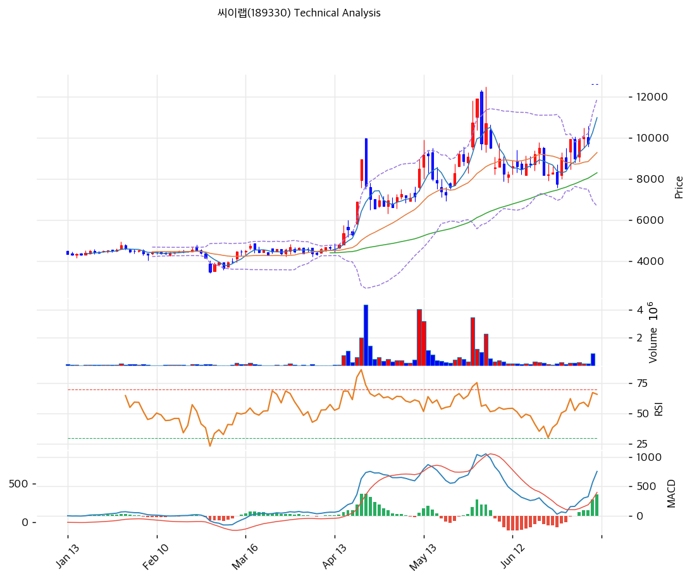

# 씨이랩(189330) 기술적 분석

2026-07-09 | T2 Technical Analysis

---

## 차트

---

## 1. 가격 현황

| 항목 | 값 |
|------|-----|
| 현재가 | 12,620원 (전일대비 데이터 미제공※) |
| 52주 고가 | 12,620원 (당일 경신) |
| 52주 저가 | 3,475원 |
| 52주 범위 위치 | 100.0% |
| 거래량 | 20일 평균 대비 배수 산출 불가(0.00x※) |

※ t2_data의 전일대비(0.00%)·거래량 배수(0.00x)는 KIS API 시세 스냅샷 필드 결측에 따른 표기상 공백으로 판단된다(t1.md에 기재된 52주 고/저 0원 버그와 동일 계열 이슈). 실제로는 저점 3,475원 대비 +263.2%(약 3.6배) 랠리로 52주 신고가를 경신 중이며, 2026-07-07 삼성SDS向 3,151.28억원 확정계약 공시(T1 참조) 이후 랠리가 재차 가속됐다. 차트상 최근 거래일 거래량 막대도 직전 2\~3주 대비 뚜렷이 높아진 모습이 관찰돼, 실제 거래 강도는 수치가 시사하는 것보다 훨씬 강하다.

---

## 2. 차트 패턴 분석

### 2.1 캔들스틱 패턴

| 패턴 | 위치 | 신뢰도 | 해석 |
|------|------|--------|------|
| 위꼬리 장대양봉(역망치형 성격) | 4월 중순 브레이크아웃 초입 (4,500원대→10,200원대 급등) | 중 | 1\~3월 박스권을 거래량 급증과 함께 이탈했으나 긴 위꼬리로 고점 매도압력도 동시 노출. 이후 조정 없이 상승 지속되며 결과적으로 진성 브레이크아웃으로 확인 |
| 망치형 | 6월 중순 저점 (MA120 부근, 7,900원대) | 강 | 긴 아래꼬리를 남기며 저가 매수세 유입 확인. RSI 저점(약 30)과 동시 형성되어 이후 2차 상승 랠리의 기점이 됨 |

※ 주요 캔들 패턴: 망치형, 역망치형, 장악형(상승/하락), 도지, 샛별/석별, 적삼병/흑삼병, 하라미, 유성형, 교수형 등

### 2.2 가격 구조 패턴

- **박스권 이탈 후 상승채널 진입** (신뢰도: 강)
  1\~3월 4,200\~4,800원 박스권에서 볼린저밴드 스퀴즈(밴드 폭 10%대)가 장기간 형성된 뒤, 4월 중순 거래량 급증을 동반하며 상단을 이탈했다. 이후 저점을 낮추지 않는 우상향 채널로 전환되며 랠리가 지속되고 있다.

- **상승 추세선 돌파 — 구 저항의 지지 전환 시도** (신뢰도: 중)
  4\~5월 고점을 연결한 6포인트 상승 저항추세선의 현재 연장값은 11,681원이다. 5월 중순 고점(11,900원) 형성 후 6월 조정을 거쳐, 금일 현재가(12,620원)가 이 추세선을 +8.0% 상회 돌파한 상태 — 추세선이 저항에서 지지로 역할을 전환할 수 있는지가 단기 눌림목의 핵심 관찰 포인트다.

- **5\~6월 조정 후 재상승(눌림목 패턴)** (신뢰도: 중)
  5월 중순 고점(11,900원)에서 6월 중순 저점(약 7,900원, MA120 근접)까지 약 -34% 눌림목 조정을 거친 뒤, 이번 신규 랠리로 전고점을 상회하는 신고가(12,620원)를 형성했다. 조정 구간이 저점을 이전 저점보다 높게 유지했다는 점에서 상승 추세의 건전성은 유지된 것으로 판단된다.

※ 주요 구조 패턴: 이중천정/바닥, 헤드앤숄더(정/역), 삼각수렴(대칭/상승/하락), 쐐기형(상승/하락), 깃발형, 페넌트, 컵앤핸들, 박스권 등

### 2.3 다이버전스

- **RSI 하락(bearish) 다이버전스** (신뢰도: 강)
  5월 중순 직전 고점(가격 11,900원) 당시 RSI는 차트상 약 78선까지, 4월 말 1차 스파이크 고점에서는 약 85선까지 형성됐던 것으로 관측된다. 금일 가격은 두 고점을 모두 상회하는 신고가(12,620원)를 기록했으나 RSI는 67.3에 그쳐 직전 두 스윙하이의 RSI 피크를 뚜렷이 하회한다 — 가격 상승 대비 모멘텀이 둔화되는 전형적 하락 다이버전스로 판독된다.

- **MACD — 다이버전스 없음(가격과 동행)** (신뢰도: 참고용)
  6월 중순 저점 이후 MACD가 재차 매수 크로스로 전환됐고 히스토그램(+368)이 지속 확대되며 가격 상승과 동행하고 있다. 뚜렷한 다이버전스는 관찰되지 않아 MACD 기준으로는 오히려 추세 신뢰도가 보강되는 모습이다.

※ RSI·MACD 기반 | 상승 다이버전스 = 가격↓ 지표↑ (반등 시사), 하락 다이버전스 = 가격↑ 지표↓ (하락 시사), 히든 다이버전스 = 기존 추세 지속 시사

### 2.4 패턴 종합 판단

박스권 이탈→상승채널→추세선 돌파로 이어지는 가격구조는 명확한 구조적 강세를 보이며, MACD 역시 다이버전스 없이 가격과 동행하며 모멘텀을 뒷받침한다. 다만 RSI는 직전 두 스윙하이(85, 78) 대비 낮은 수준(67.3)에서 신고가가 형성되는 하락 다이버전스를 보이고 있어, 저점 대비 3.6배 랠리 이후 신고가 경신 국면에서의 속도조절 가능성을 경계해야 한다. 캔들·구조·MACD는 강세 우위 신호, RSI 다이버전스는 단기 과열 경계 신호로 서로 상충한다.

---

## 3. 이동평균선 — 정배열 (강세)

| MA | 값 | 현재가 괴리율 | 위치 |
|----|-----|--------------|------|
| MA5 | 10,986원 | +14.9% | 위 |
| MA20 | 9,286원 | +35.9% | 위 |
| MA60 | 8,299원 | +52.1% | 위 |
| MA120 | 6,347원 | +98.8% | 위 |
| MA200 | 5,760원 | +119.1% | 위 |

**해석**: MA5>MA20>MA60>MA120>MA200 순으로 완전한 정배열을 이루며 구조적 강세 추세를 확인한다. 다만 MA200 대비 +119.1%, MA120 대비 +98.8% 괴리는 저점 대비 3.6배 랠리에 따른 극단적 이격으로, 평균회귀(조정) 압력이 누적된 상태로 해석해야 한다. 단기 1차 지지는 MA5(10,986원)이며, 이를 하회할 경우 MA20(9,286원)까지 조정 가능성이 열린다.

---

## 4. 보조 지표

### RSI(14) — 67.3 (중립)

과매수 임계선(70) 직전까지 근접한 중립 상단 구간이다. 3.6배 랠리와 신고가 경신에도 불구하고 아직 과매수 진입 전이라는 점은 표면적으로 추가 상승 여력을 시사하지만, 직전 스윙하이 대비 낮은 피크(2.3 참조)라는 점에서 모멘텀 자체는 이미 약화되고 있다는 신호로 함께 읽어야 한다.

### MACD(12,26,9)

| 항목 | 값 |
|------|-----|
| MACD | 755 |
| Signal | 387 |
| Histogram | +368 |
| 크로스 상태 | 매수 구간 (확대 중) |

**해석**: MACD(755)가 Signal(387)을 상회하는 매수 구간이 유지되고 있으며 히스토그램(+368)이 지속 확대되고 있어 단기 상승 모멘텀은 견조하다. 다이버전스 해석은 2.3 참조.

### 볼린저밴드(20, 2σ)

| 항목 | 값 |
|------|-----|
| 상단 | 11,904원 |
| 중단 (MA20) | 9,286원 |
| 하단 | 6,669원 |
| 밴드 폭 | 56.4% |
| 현재 위치 | 상단 상회(밴드 이탈) |

**해석**: 현재가(12,620원)는 상단 밴드(11,904원)를 6.0% 상회하는 밴드 이탈 상태로, 원시 데이터상 '상단 근접' 표기보다 실질적으로는 더 강한 과열 신호로 해석해야 한다. 밴드 폭 56.4%는 1\~3월 스퀴즈 구간(10%대) 대비 극단적으로 확대된 수준으로, 변동성이 매우 높은 국면이 이어지고 있다.

### 스토캐스틱(14, 3, 3)

| 항목 | 값 |
|------|-----|
| Slow %K | 90.3 |
| Slow %D | 86.3 |
| 크로스 상태 | 골든크로스 |
| 판단 | 과매수 |

---

## 5. 지지/저항 — 추세선 · 피보나치 · PRZ 통합

### 5.1 피보나치 되돌림/확장

| 구분 | 비율 | 가격 | 현재가 대비 |
|------|------|------|-----------|
| Swing High | — | 11,900원 | -5.7% |
| 되돌림 | 0.236 | 9,912원 | -21.5% |
| 되돌림 | 0.382 | 8,682원 | -31.2% |
| 되돌림 | 0.5 | 7,688원 | -39.1% |
| 되돌림 | 0.618 | 6,693원 | -47.0% |
| 되돌림 | 0.786 | 5,278원 | -58.2% |
| Swing Low | — | 3,475원 | -72.5% |
| 확장 | 1.272 | 14,192원 | +12.5% |
| 확장 | 1.382 | 15,118원 | +19.8% |
| 확장 | 1.618 | 17,107원 | +35.6% |
| 확장 | 2.0 | 20,325원 | +61.1% |

※ 피보나치 기준: 상승 추세 (Swing Low 3,475원 → Swing High 11,900원)
※ 되돌림 = 직전 상승폭에서 되돌아온 비율, 확장 = 상승 추세 지속 시 목표가

현재가(12,620원)는 Swing High(11,900원)를 +6.1% 상회하는 완전한 레인지 이탈 상태로, 위 되돌림 레벨은 표 전체가 하방 지지 후보로만 기능한다. 상방 목표가는 확장 구간에서 찾아야 하며, 1.272 확장(14,192원)이 가장 근접한 1차 목표, 1.382 확장(15,118원)이 2차 목표가 된다.

### 5.2 추세선

| 추세선 | 방향 | 현재 교차가 | 포인트 수 | 해석 |
|--------|------|-----------|---------|------|
| 지지선 | 하락 | 2,816원 | 6개 | 1\~3월 박스권 저점을 연결한 하락추세선의 현재 연장값. 현재가 대비 -77.7% 괴리로 사실상 유효성을 상실했으며 실질적 지지 기능은 없다 |
| 저항선 | 상승 | 11,681원 | 6개 | 4\~5월 고점을 연결한 상승추세선. 현재가가 이를 +8.0% 상회 돌파 — 저항에서 지지로의 역할 전환(role reversal) 여부가 단기 눌림목의 핵심 관찰 포인트 |

### 5.3 PRZ (Potential Reversal Zone)

| 방향 | 가격 범위 | 신뢰도 | 근거 |
|------|---------|--------|------|
| 지지 | 12,620원(단일가) | 참고용 | 피봇 R1·R2·S1·S2 — 원시 데이터상 전 피봇 값이 현재가와 동일하게 산출되는 계산 아티팩트로 판단(당일 고가=저가=종가 처리 오류 추정). 방향성 판단에는 활용 곤란 |
| 지지 | 11,681\~11,904원 | 강 | 상승추세선 돌파선(11,681원) + 볼린저 상단(11,904원) + 피보나치 Swing High(11,900원) — 3개 소스가 밀집하는 구간으로, 구 저항의 지지 전환 여부를 관찰해야 할 구간 |
| 지지 | 9,286\~9,912원 | 중 | MA20(9,286원) + 피보나치 0.236 되돌림(9,912원) 밀집 |

※ PRZ = 추세선 · 피보나치 · 피봇 · MA 등 복수 지표가 겹치는 가격 구간. 겹치는 소스가 많을수록 반전 확률 상승. 단, 최상단 PRZ(12,620원)는 피봇 계산 아티팩트이므로 실질 신뢰도는 하단 두 PRZ가 더 높다.

### 5.4 종합 지지/저항 테이블

| 구분 | 가격 | 근거 |
|------|------|------|
| 저항 | 15,118원 | 피보나치 1.382 확장 |
| 저항 | 14,192원 | 피보나치 1.272 확장 |
| **현재가** | **12,620원** | 52주 신고가 — 상방에는 역사적 저항 데이터 부재, 확장 레벨만 존재 |
| 지지 | 11,681\~11,904원 | PRZ(강) — 상승추세선 돌파선 + 볼린저 상단 + 피보나치 Swing High |
| 지지 | 10,986원 | MA5 |
| 지지 | 9,286원 | MA20 |

---

## 6. 시그널 종합

| 지표 | 내용 | 시그널 |
|------|------|--------|
| **차트 패턴** | 박스권 이탈·상승채널·추세선 돌파(강세) vs RSI 하락 다이버전스(경계) 상충 | ⚪ |
| 이동평균선 | 정배열, MA20 +35.9% | 🟢 (추세) / 🔴 (과열) |
| RSI | 67.3 — 중립(과매수 임박) | ⚪ |
| MACD | 매수구간, 히스토그램 확대 | 🟢 |
| 볼린저밴드 | 상단 이탈(실질), 밴드 폭 56.4% | ⚪ |
| 스토캐스틱 | 골든크로스, K=90.3 — 과매수 | 🔴 |
| 거래량 | 0.0x — 데이터 아티팩트(§1 참조) | ⚪ |

**종합 판단**: 🟢 매수 2개 / 🔴 매도 2개 / ⚪ 중립 4개 → **중립**

정량 지표는 매수·매도가 팽팽히 맞서는 중립으로 집계되나, 그 구성을 뜯어보면 이동평균선 정배열·MACD 매수전환이라는 추세 지속 신호와, 스토캐스틱 과매수·MA200 대비 극단적 이격(+119.1%)이라는 과열 경계 신호가 공존하는 결과다. 3.6배 랠리 이후 신고가를 경신 중인 국면에서 RSI 하락 다이버전스까지 겹쳐 있어, 중기 상승추세 자체는 유효하되 단기적으로는 눌림목·속도조절 가능성에 무게를 두는 것이 합리적이다.

---

## 7. 전략 제안

### 보유 중인 경우
- **홀드 (단기 일부 차익실현 권고)**
- 익절 라인: 14,192원 (근거: 피보나치 1.272 확장 — Swing High 상회 돌파 후 다음 상방 목표가. 데이터 원본 익절값 12,872원은 현재가 대비 +2.0%로 손익비가 낮아 실전 활용성이 떨어짐)
- 손절 라인: 11,681원 (근거: 상승추세선 돌파선 이탈 시 구조 훼손으로 판단. 데이터 원본 손절값 12,620원은 현재가와 동일하여 즉시 트리거되는 계산 아티팩트로 사용 불가)
- 리스크/리워드: 약 1.67:1 [(14,192-12,620)/(12,620-11,681)]

### 진입 대기인 경우
- **관망**
- 1차 진입가: 11,681\~11,904원 (근거: 추세선 돌파선 + 볼린저 상단 밀집 구간에서 지지 확인 시 분할 진입)
- 2차 진입가: 9,286원 (근거: MA20 — 눌림목이 심화될 경우의 2차 매수 구간)
- 진입 조건: RSI 하락 다이버전스 해소(모멘텀 재확인) 또는 위 지지구간에서 거래량 동반 반등 캔들 형성 확인 후 분할 진입. 52주 신고가·과매수 구간에서의 신규 추격매수는 자제 권고
