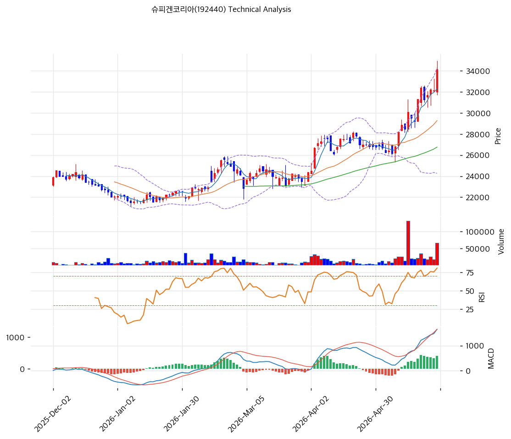

# 슈피겐코리아(192440) 기술적 분석 보고서

---

## 가격 위치

현재가 **34,150원** (+6.22%) — **52주 신고가** 갱신, 52주 위치 **100%**. 1년 +59% (21,500→34,150). **거래량 2.92배 급증** + 외국인 +40,912 + 기관 +15,078 동반 매수. 2025Q4\~2026Q1 마진 회복 + PBR 0.37x 가치주 재평가 기대가 돌파 동력.

## 이동평균선 / 모멘텀

MA5 32,290 / MA20 29,270 / MA60 26,759 / MA120 24,899 / MA200 24,357 — **MA5 < MA20 < MA60 < MA120 < MA200 완전 정배열 True**. MA200 대비 **+40.2%**, MA20 대비 +16.7% 강한 우상향. 모든 이평선 우상향, 신고가 돌파로 추세 강세.

**RSI 75.7 (과매수 🔴)** — 70 초과 과매수. MACD 1,659 / 시그널 1,252 / 히스토 407 = **매수 시그널 + 확장** = 강한 모멘텀. 스토캐 K=90.7 / D=89.3 골든크로스 **과매수 영역**. BB 상단 근접 (폭 34.2%). 거래량 2.92배 = 돌파 신뢰도 높으나 단기 과열.

## 시그널 종합 / S&R

매수 3 / 매도 2 / 중립 1 → **매수우위**. 신고가 돌파 + 거래량 급증으로 추세 강세.

- 저항: **34,150원(52주 고가)** / 35,500원(피봇 R1) / 38,744원(피보 1.272) / 40,279원(피보 1.382)
- 지지: **32,066원(PRZ 중: 피보 0.236·피봇 S1·MA5)** / 30,350원(피봇 S2) / 29,446원(PRZ 약: MA20) / 26,329원(PRZ 중: MA60)
- 깊은 조정 지지: 24,414원(PRZ 중: MA200·MA120)

전략: **HOLD(홀드) — TP 34,833원 / SL 30,350원**. WAIT(관망) e1=32,250원 / e2=29,270원. 신고가 돌파 + 거래량 급증으로 추세 양호하나 RSI 75.7 과매수 → **MA20 29,270원 ~ MA5 32,066원 눌림목 분할 매수** 권고. 52주 고가 34,150원 안착 시 38,744원 추가 모멘텀. 마진 회복 + 주주환원이 박스권 상향 돌파 트리거.
