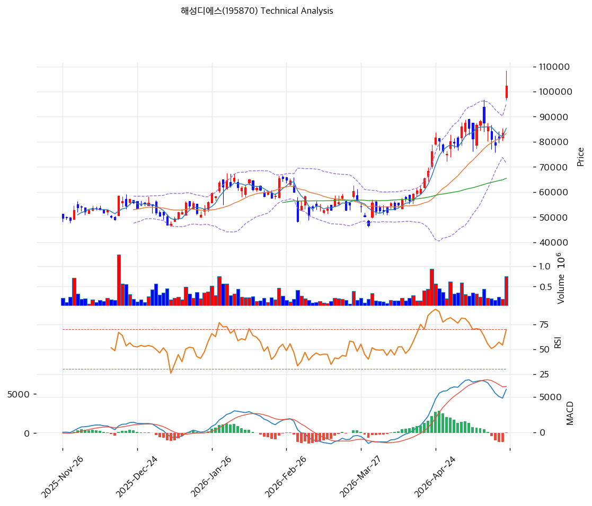

# 해성디에스(195870) 기술적 분석

2026-05-26 | T2 Technical Analysis

## 1. 가격 현황

현재가 **102,400원 (+22.63%)** | 52주 고/저 108,500/18,000 (위치 100%, 신고가) | 거래량 20일 평균 **2.01x** (강력) | **1년 수익률 +469%**.

## 2. 차트 패턴

- **장대양봉 + 갭상승 + 거래량 2.01x** (5/26): BB 상단 +7.5% 돌파, 강한 매수.
- **컵앤핸들 돌파** (강): 3\~4월 90\~100k 박스 + 5월 초 손잡이 조정 후 신고가. 목표 \~115,000원.
- **MACD 약세 다이버전스 잠재** (중): 4월말 히스토그램 피크 → 5월 음전, 가격은 신고가.
- **종합**: 추가 상승 여력 있으나 MA200 +103% / RSI 72.7 / BB 이탈 3중 과열 → 87\~83k 조정 후 재상승 R/R 우월.

## 3. 이동평균선 — 정배열 (극단 과열)

| MA | 값 | 괴리율 |
|----|-----|--------|
| MA5 | 85,360 | +20.0% |
| MA20 | 83,345 | +22.9% |
| MA60 | 65,476 | +56.4% |
| MA120 | 60,636 | +68.9% |
| MA200 | 50,430 | **+103.1%** |

완벽 정배열. MA200 +103%는 통계적 극단치. MA20(83,345) 1차 지지.

## 4. 보조 지표

- **RSI(14) 72.7 🔴 과매수** — 5/26 장대양봉으로 80 진입 가능.
- **MACD 6,073/5,950/+123** — 매수 크로스 유지, 히스토그램 4월 피크 대비 -96% 모멘텀 약화.
- **BB(20,2σ) 95,215/83,345/71,475 폭 28.5%** — 종가가 상단 +7.5% 이탈.
- **Stoch K=50, D=37.7 골든크로스** — 50선 중립.

## 5. 지지/저항

| 구분 | 가격 | 근거 |
|------|------|------|
| 저항 | 115,000 | 컵앤핸들 목표 |
| 저항 | 108,400 | 피봇 R1 |
| **현재가** | **102,400** | — |
| 지지 | 96,500 | 피봇 S1 |
| 지지 | 90,600 | 피봇 S2 / 손절 |
| 지지 | 87,107 | 피보 0.236 |
| 지지 | 83,345 | MA20 + PRZ (강) |
| 지지 | 65,476 | MA60 |

**PRZ 강 지지**: 83,000\~87,100 (MA20 + 피보 0.236 중첩). **피보 확장**: 1.272=125,317, 1.618=154,558.

## 6. 시그널 종합

| 지표 | 시그널 |
|------|--------|
| 패턴 (컵앤핸들 + 장대양봉) | 🟢 |
| MA (정배열, MA200 +103%) | 🟢 |
| RSI 72.7 과매수 | 🔴 |
| MACD 매수, 히스토그램 수축 | ⚪ |
| BB 상단 +7.5% 이탈 | 🔴 |
| Stoch 골든크로스 중립 | ⚪ |
| 거래량 2.01x | 🟢 |

**판단**: 🟢3 / 🔴2 / ⚪2 → **중립 (매수 우위, 과열 경고)**. AI 반도체 모멘텀 + 기관 20일 +572k 강매수가 추세 지지하나, 3중 과열로 87\~83k 조정 후 재상승 시나리오 우월.

## 7. 전략 제안

**보유 중**: 분할 익절 (홀드 + 부분 차익). 1차 108,400(+5.9%) / 2차 115,000(+12.3%) / 손절 90,600(-11.5%). R/R 1차 1:0.51, 2차 1:1.07.

**진입 대기**: 관망 (RSI 72.7 과매수). 1차 87,000(피보+PRZ, -15.0%) / 2차 83,345(MA20, -18.6%). 조건: RSI 50 복귀 + MA20 지지 + 거래량 회복.
