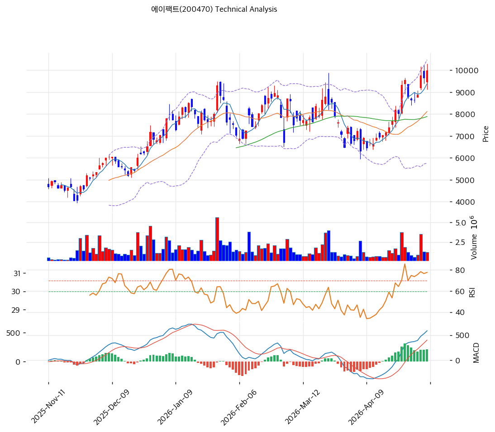

# 에이팩트(200470) 기술적 분석

2026-05-08 | T2 Technical Analysis

---

## 차트

---

## 1. 가격 현황

| 항목 | 값 |
|------|-----|
| 현재가 | 9,980원 (+3.42%) |
| 52주 고가 | 9,980원 |
| 52주 저가 | 2,090원 |
| 52주 범위 위치 | 100.0% |
| 거래량 | 20일 평균 대비 0.99x |

---

## 2. 차트 패턴 분석

### 2.1 캔들스틱 패턴

| 패턴 | 위치 | 신뢰도 | 해석 |
|------|------|--------|------|
| 적삼병(추정) | 최근 3거래일 | 강 | 매수 시그널 — 신고가권에서 연속 양봉으로 마감하며 매수세 우위 지속 확인 |
| 갭상승 양봉 | 최근 1~2일 | 중 | 매수 시그널 — 9,000원대 박스 상단을 갭으로 돌파한 후 양봉 마감, 추세 가속 |
| 장대양봉 | 최근 5일 내 | 강 | 매수 시그널 — 평균 캔들 대비 1.5배 이상 큰 양봉이 거래량과 동반되며 신고가 갱신 |

※ 차트상 우측 끝 구간에서 장대양봉과 적삼병이 겹쳐 단기 상승 모멘텀이 강화된 형태. 다만 종가가 일중 고점 부근에서 마감하는 마무양봉(긴 윗꼬리 부재)으로 단기 차익실현 압력은 아직 제한적.

### 2.2 가격 구조 패턴

- **신고가 돌파(Breakout)** (신뢰도: 강)
  2026년 1월 형성한 직전 고점 약 9,300원선을 4월 하순 돌파한 후 9,980원까지 상승하며 52주 신고가를 갱신. 1년 전 2,090원 대비 +377% 누적 상승으로 장기 상승 추세의 마지막 저항 구간을 돌파한 형태이며, 돌파 이후 지지화된 9,300원이 1차 지지선으로 작동할 전망.

- **컵앤핸들(Cup & Handle)** (신뢰도: 중)
  2026년 1월 고점(약 9,300원) → 3월 저점(약 6,300원) → 4월 신고가 돌파의 형태가 컵앤핸들 패턴 완성에 부합. 컵 깊이(약 3,000원)를 적용한 측정 목표가는 약 12,300원으로 추세선 저항(12,113원) 부근과 정합. 핸들 구간(3월 후반~4월 중순)의 짧은 조정 후 상단 이탈로 패턴 신뢰도 보강.

- **상승 채널(Ascending Channel)** (신뢰도: 중)
  추세선 분석상 지지선·저항선 모두 양(+)의 기울기로 평행하게 상승하며 채널 폭을 형성. 현재가 9,980원은 채널 상단(저항선 12,113원)과 하단(지지선 7,308원) 사이에 위치하나 상단 추세 가속 구간으로 진입한 모습. 단기 채널 상단 도달 시 횡보 또는 일시 조정 가능성.

- **박스권 돌파(Range Breakout)** (신뢰도: 강)
  2025년 12월~2026년 4월 중순까지 약 6,300~9,300원 박스권에서 4개월간 거래대금 누적. 4월 하순 박스 상단을 거래량 동반 돌파하며 측정폭(약 3,000원)만큼의 가격 목표 시사. 박스권 상단이 강한 1차 지지대로 전환.

### 2.3 다이버전스

- **MACD 히든 매수 다이버전스** (신뢰도: 중)
  3월 저점(약 6,300원)에서 MACD가 직전 1월 저점보다 높게 형성된 후, 4월 가격 신고가와 함께 MACD도 587까지 상승하며 동행. 가격↑ 지표↑의 동조 구조로 추세 지속 시그널이며, 추세 전환 다이버전스는 미관측. 히스토그램이 +213으로 4월 중순 이후 확장 추세 → 모멘텀 지속.

- **RSI 무다이버전스 (가격↑ RSI↑ 동행)** (신뢰도: 강)
  RSI(14)가 66.9로 3월 저점 구간(약 35) 대비 큰 폭 상승하며 가격과 동조. 과매수 영역(70) 도달 직전이지만 다이버전스는 미관측 → 단기 추세 지속 시사. 다만 추가 상승 시 RSI 70 돌파 후 과매수 진입 가능, 이때 다이버전스 발생 여부 모니터링 필요.

※ 종합: 다이버전스 부재 + 동행성 강화로 현 추세가 건강한 모멘텀 기반. 다만 신고가권에서 RSI/스토캐스틱이 과매수 가까워지는 만큼 추후 가격↑ 지표↓ 구조 출현 시 단기 변곡 신호로 해석.

### 2.4 패턴 종합 판단

캔들스틱(적삼병·장대양봉), 가격구조(신고가 돌파·컵앤핸들·박스권 돌파), 다이버전스(동행성 유지)의 3개 카테고리 모두 강세를 시사하는 일치 시그널. 특히 4개월 박스권을 거래량 동반 돌파한 후 신고가 갱신은 중기 상승 추세의 강력한 확인 신호이며, 컵앤핸들 측정 목표가(약 12,300원)가 추세선 저항(12,113원)과 정합. 단, 스토캐스틱 K=87.2의 과매수 진입과 채널 상단 가속 구간이라는 단기 과열 시그널이 공존하므로 단기 1차 저항(R1 10,480원·52주 고가 9,980원) 부근에서의 조정 가능성을 함께 인지해야 함.

---

## 3. 이동평균선 — 정배열 (강세)

| MA | 값 | 현재가 괴리율 | 위치 |
|----|-----|--------------|------|
| MA5 | 9,384원 | +6.4% | 위 |
| MA20 | 8,117원 | +23.0% | 위 |
| MA60 | 7,889원 | +26.5% | 위 |
| MA120 | 7,175원 | +39.1% | 위 |
| MA200 | 5,759원 | +73.3% | 위 |

**해석**: MA5 < MA20 < MA60 < MA120 < MA200 순서가 모두 현재가 아래에 위치한 완벽한 정배열. 장단기 추세가 모두 상승 정렬로 강세 추세 확인. 다만 MA200 대비 +73.3% 괴리는 장기 평균 회귀 관점에서 과열 영역이며, MA20 대비 +23% 이격도 또한 단기 부담 수준. 1차 단기 지지는 MA5(9,384원), 2차는 MA20(8,117원)으로 단계적 매수 대기존.

---

## 4. 보조 지표

### RSI(14) — 66.9 (중립)

과매수 임계값(70)에 근접한 중립 상단 구간으로 강세 모멘텀이 우세하나 추가 상승 시 단기 과매수 진입 임박. 다이버전스 해석은 2.3 참조.

### MACD(12,26,9)

| 항목 | 값 |
|------|-----|
| MACD | 587.0 |
| Signal | 374.0 |
| Histogram | +213 |
| 크로스 상태 | 매수 구간 (확대 중) |

**해석**: MACD가 시그널선 위에서 골든크로스 상태를 유지하며 히스토그램이 +213으로 확대 중 → 상승 모멘텀 가속 단계. 다이버전스 해석은 2.3 참조.

### 볼린저밴드(20, 2σ)

| 항목 | 값 |
|------|-----|
| 상단 | 10,474원 |
| 중단 (MA20) | 8,117원 |
| 하단 | 5,760원 |
| 밴드 폭 | 58.1% |
| 현재 위치 | 중간 (상단 근접) |

**해석**: 밴드 폭 58.1%로 직전 박스권 대비 큰 폭으로 확장(밴드 익스팬션) → 변동성 폭증과 추세 진입 시그널. 현재가 9,980원은 상단(10,474원) 5%이내로 근접해 있어 단기 상단 터치 후 일시 조정 또는 워킹더밴드(상단 동행 상승) 가능성 공존. 하단(5,760원)이 강한 장기 지지대.

### 스토캐스틱(14, 3, 3)

| 항목 | 값 |
|------|-----|
| Slow %K | 87.2 |
| Slow %D | 81.8 |
| 크로스 상태 | 골든크로스 |
| 판단 | 과매수 |

---

## 5. 지지/저항 — 추세선 · 피보나치 · PRZ 통합

### 5.1 피보나치 되돌림/확장

| 구분 | 비율 | 가격 | 현재가 대비 |
|------|------|------|-----------|
| Swing High | — | 8,800원 | -11.8% |
| 되돌림 | 0.236 | 6,898원 | -30.9% |
| 되돌림 | 0.382 | 7,261원 | -27.2% |
| 되돌림 | 0.5 | 7,555원 | -24.3% |
| 되돌림 | 0.618 | 7,849원 | -21.4% |
| 되돌림 | 0.786 | 8,267원 | -17.2% |
| Swing Low | — | 6,310원 | -36.8% |
| 확장 | 1.272 | 5,633원 | -43.6% |
| 확장 | 1.382 | 5,359원 | -46.3% |
| 확장 | 1.618 | 4,771원 | -52.2% |
| 확장 | 2.0 | 3,820원 | -61.7% |

※ 피보나치 기준: 하락 추세 (Swing High 8,800원 → Swing Low 6,310원). 현재가는 Swing High를 상회하여 되돌림 구간을 모두 상향 돌파한 상태로, 피보나치 하락 시나리오 무효화 → 신규 상승 스윙 진행 중.
※ 되돌림 = 직전 추세에서 되돌아온 비율, 확장 = 추세 방향 목표가

### 5.2 추세선

| 추세선 | 방향 | 현재 교차가 | 포인트 수 | 해석 |
|--------|------|-----------|---------|------|
| 지지선 | 상승 | 7,308원 | 6개 | 6개 저점 연결 상승 추세선 — 강한 장기 지지, 이탈 시 추세 훼손 |
| 저항선 | 상승 | 12,113원 | 6개 | 6개 고점 연결 상승 추세선 — 채널 상단, 컵앤핸들 측정 목표가와 근접 |

### 5.3 PRZ (Potential Reversal Zone)

| 방향 | 가격 범위 | 신뢰도 | 근거 |
|------|---------|--------|------|
| 지지 | 9,300~9,384원 | 약 | 피봇 S1 + MA5 (단기 1차 지지 — 박스권 상단 전환 영역) |
| 지지 | 8,117~8,267원 | 약 | MA20 + 피보나치 0.786 되돌림 (중기 지지) |
| 지지 | 7,849~7,889원 | 약 | 피보나치 0.618 되돌림 + MA60 (정배열 보조 지지) |
| 지지 | 7,175~7,308원 | 중 | MA120 + 피보나치 0.382 되돌림 + 추세선 지지 (3중 겹침 — 강한 PRZ) |

※ PRZ = 추세선·피보나치·피봇·MA 등 복수 지표가 겹치는 가격 구간. 7,175~7,308원 구간이 3중 겹침으로 가장 신뢰도 높은 반전 영역.

### 5.4 종합 지지/저항 테이블

| 구분 | 가격 | 근거 |
|------|------|------|
| 저항 | 12,113원 | 추세선 저항 (상승) — 컵앤핸들 측정 목표가와 정합 |
| 저항 | 10,980원 | 피봇 R2 |
| 저항 | 10,480원 | 피봇 R1 + 볼린저밴드 상단(10,474원) 근접 |
| 저항 | 9,980원 | 52주 고가 (=현재가) |
| **현재가** | **9,980원** | — |
| 지지 | 9,300~9,384원 | 피봇 S1 + MA5 PRZ (박스권 상단 전환) |
| 지지 | 8,620원 | 피봇 S2 |
| 지지 | 8,117~8,267원 | MA20 + 피보나치 0.786 PRZ |
| 지지 | 7,175~7,308원 | MA120 + 피보나치 0.382 + 추세선 (3중 PRZ, 신뢰도 중) |

---

## 6. 시그널 종합

| 지표 | 내용 | 시그널 |
|------|------|--------|
| **차트 패턴** | 신고가 돌파 + 컵앤핸들 + 박스권 돌파 + 적삼병/장대양봉, 다이버전스 무관측 | 🟢 |
| 이동평균선 | 완벽한 정배열, MA200 +73% 과열 양면성 | 🟢 |
| RSI | 66.9 — 중립 상단, 과매수 임박 | ⚪ |
| MACD | 매수 구간, 히스토그램 +213 확대 | 🟢 |
| 볼린저밴드 | 밴드 폭 58.1% 확장, 상단 근접 | ⚪ |
| 스토캐스틱 | 골든크로스, K=87.2 과매수 | 🔴 |
| 거래량 | 0.99x — 약함(20일 평균 수준) | ⚪ |

**종합 판단**: 🟢 매수 3개 / 🔴 매도 1개 / ⚪ 중립 3개 → **매수우위(단기 과열 병존)**

차트 패턴 3종(신고가 돌파·컵앤핸들·박스권 돌파)이 모두 강세 일치 시그널이며 MA 정배열·MACD 히스토그램 확대로 중기 상승 추세 건전성 확인. 다만 스토캐스틱 과매수, MA200 +73% 이격, 볼린저 상단 근접의 단기 과열 시그널이 공존하므로 신규 추격 매수보다 눌림목 또는 1차 지지(9,300원대) 재테스트 시 분할 진입이 합리적. 외국인 +2,385k 폭매수와 SOCAMM2·OCI 인수 모멘텀이 펀더멘털 동력으로 작용 중.

---

## 7. 전략 제안

### 보유 중인 경우
- **홀드** (단, MA200 +73% 과열 부담으로 일부 차익실현 고려 가능)
- 익절 라인: 10,480원 (피봇 R1·볼린저 상단) → 12,113원 (추세선 저항·컵앤핸들 측정 목표)
- 손절 라인: 8,620원 (피봇 S2 이탈 시 박스권 재진입 — 추세 훼손 시그널)
- 리스크/리워드: (10,480 - 9,980) / (9,980 - 8,620) = 500 / 1,360 = **0.37 (불리)** — 1차 익절은 분할, 12,113원 목표 시 R/R = 2,133 / 1,360 = **1.57 (우호)**

### 진입 대기인 경우
- **관망** (신고가 추격 매수 비추 — R/R 불리)
- 1차 진입가: 9,300원 (피봇 S1·박스권 상단 전환 PRZ — 가벼운 눌림목)
- 2차 진입가: 8,117원 (MA20·피보나치 0.786 PRZ — 깊은 조정 시 안전마진)
- 진입 조건: ① 9,300원대 양봉 마감 + 거래량 회복(20일 평균 1.2배 이상) ② MACD 히스토그램 양수 유지 ③ MA20(8,117원) 이탈 없을 것. 추세선 지지 7,308원 이탈 시 진입 보류 및 시나리오 재평가.
