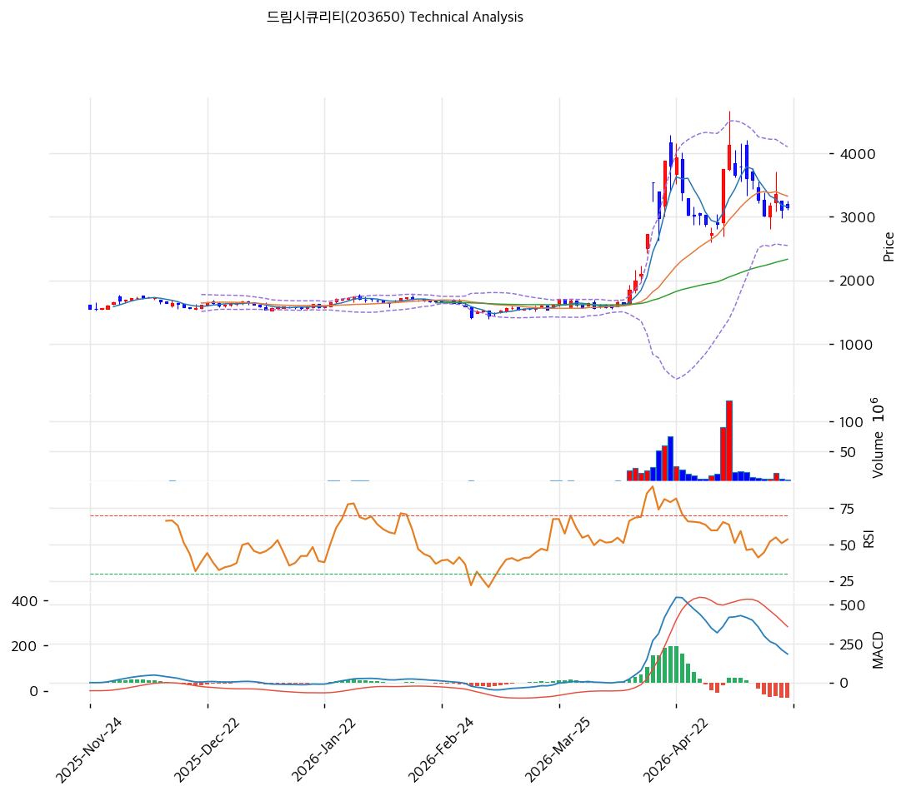

# 드림시큐리티(203650) 기술적 분석

2026-05-21 | T2 Technical Analysis

## 차트

## 1. 가격 현황

- 현재가 **3,145원** (52주 64% 위치, 정점 4,130원 대비 -24%)
- 52주: 4,130 / 1,422원
- 거래량: 4월 거래량 폭증 후 감소

## 2. 차트 패턴

- 2025-11~2026-03 박스권 (1,500원) → 2026-04 4,130원 정점 (+190%) → 2026-05 -24% 조정
- **정점 후 조정 + MACD 매도 + Stoch 28.8 과매도 임박**

## 3. 이동평균선

| MA | 값 | 괴리율 |
|---|--:|--:|
| MA5 | 3,159원 | -0.4% |
| MA20 | 3,326원 | **-5.4%** |
| MA60 | 2,333원 | +34.8% |
| MA200 | 1,879원 | **+67.4%** |

**해석**: 단기 MA20 아래, 장기 MA200 위. 단기 조정 + 장기 추세 유지.

## 4. 보조 지표

- RSI 51.3 (중립)
- MACD 매도 (히스토그램 -99)
- BB 중간 (BW 46.7%)
- Stoch K 28.8 (과매도 임박)

## 5. 지지/저항

| 구분 | 가격 |
|---|--:|
| 저항 | 4,130원 (52주 고) |
| 저항 | 3,326원 (MA20) |
| **현재가** | **3,145원** |
| 지지 | 2,333원 (MA60) |
| 지지 | 1,879원 (MA200) |

## 6. 시그널 종합

- 매수 0 / 매도 1 / 중립 5 → **매도우위**
- 정점 후 조정 + 단기 MA20 이탈 + 기관 대규모 이탈

## 7. 전략

- **보유 중**: MA20 (3,326원) 회복 대기, 손절 2,333원 (MA60)
- **진입 대기**: MA20 (3,326원) 또는 MA60 (2,333원) 영역 분할 매수
