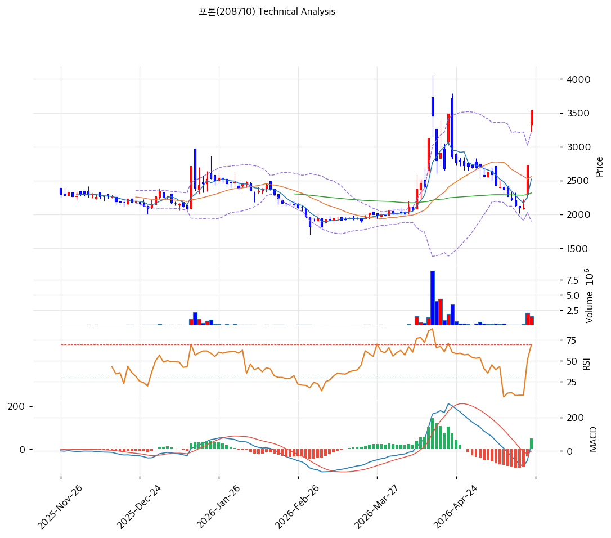

# 기술적분석

2026-05-26 | T2 Technical Analysis

## 1. 가격 현황

| 항목      | 값                          |
| ------- | -------------------------- |
| 현재가     | 3,545원 (+29.85%)           |
| 52주 고/저 | 3,545 / 1,820원 (위치 100.0%) |
| 거래량     | 20일 평균 대비 3.01x            |

## 2. 차트 패턴

| 패턴                            | 신뢰도 | 해석                          |
| ----------------------------- | --- | --------------------------- |
| 장대양봉 +29.85% (당일)             | 강   | 갭상승+거래량 3.01x — 단기 모멘텀 폭발   |
| 갭업 BB상단 돌파                    | 강   | 3,222→3,545 +10% 이탈, 신고가 진입 |
| 이중천정 가능성 (4월 4,000원 vs 3,545) | 약   | 1차 천정 미돌파, 더블탑 위험           |

**종합**: 장대양봉+갭업+거래량 3x = 단기 강세 명확하나 4,000원 직전 매물대 진입 — **돌파 vs 더블탑 분기점**, 추격 부담.

## 3. 이동평균선 — 비정배열 (단기 급등)

| MA           | 값              | 괴리율             |
| ------------ | -------------- | --------------- |
| MA5 / MA20   | 2,522 / 2,559원 | +40.6% / +38.5% |
| MA60 / MA200 | 2,317 / 2,352원 | +53.0% / +50.7% |

**정배열 False** (MA60\<MA120). MA20 +38.5%는 단기 과열 명확 신호, 평균회귀 압력 작동.

## 4. 보조 지표

| 지표        | 값                                        | 판단                       |
| --------- | ---------------------------------------- | ------------------------ |
| RSI(14)   | 70.9                                     | 🔴 과매수                   |
| MACD      | +40/-9, Hist +50 확대                      | 🟢 골든크로스 직후 (4월 대비 강도 약) |
| BB(20,2σ) | 상단 3,222 / 중단 2,559 / 하단 1,897 (폭 51.8%) | 🔴 상단 +10% 이탈, 밴드워크      |
| 스토캐스틱     | K=65.8 / D=36.3 골든크로스                    | ⚪ 중립                     |

## 5. 지지/저항

| 구분      | 가격         | 근거                   |
| ------- | ---------- | -------------------- |
| 저항      | 3,944원     | 피보 1.272 확장          |
| 저항      | 3,710원     | PRZ 중 (피봇 R1+추세선+R2) |
| 저항      | 3,652원     | 피봇 R1                |
| **현재가** | **3,545원** | 52주 신고가              |
| 지지      | 3,332원     | 피봇 S1                |
| 지지      | 3,118원     | 피봇 S2                |
| 지지      | 2,559원     | MA20 / 피보 0.382 인근   |

피보 Swing: 1,820 → 3,545 / 되돌림 0.236=3,096 / 0.382=2,852 / 0.5=2,655.

## 6. 시그널 종합

매수 3 (MA·MACD·거래량) / 매도 2 (RSI·BB) / 중립 2 (패턴·스토캐스틱) → **중립 (단기 강세 with 과열 경고)**

거래량 3x·MACD 확장은 단기 강세 명확하나 RSI 70.9·BB 상단 +10% 이탈·MA20 괴리 +38.5%는 과열. **T1 도출 CB 5회차 +135% 인-더-머니**(행사가 1,505원) 매물이 추가 상승 제약.

## 7. 전략 제안

**보유 중 — 부분 익절 (50%)**: 익절 3,652원 (피봇 R1) → 3,944원 (피보 1.272) / 손절 3,118원 (피봇 S2). R/R 1:0.94 비대칭 불리, CB 차익실현 매물 상존.

**진입 대기 — 관망**: 1차 3,332원 (피봇 S1, -6%) / 2차 2,559원 (MA20, -27.8%, 안전). 조건 ① BB 상단 안착+후속 양봉 ② RSI 60대 식음 ③ CB 5회차 전환 공시 확인.
