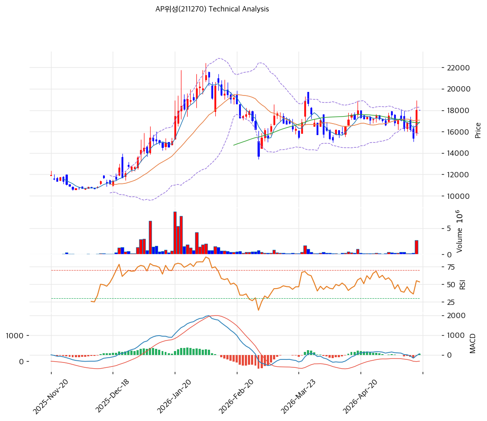

# 기술적분석

2026-05-19 | T2 Technical Analysis

***

## 차트

***

## 1. 가격 현황

| 항목        | 값                       |
| --------- | ----------------------- |
| 현재가       | 18,020원                 |
| 52주 고가    | 21,250원                 |
| 52주 저가    | 10,630원                 |
| 52주 범위 위치 | 70%                     |
| 거래량       | 데이터 결손 (차트상 1월 폭증 후 둔화) |

***

## 2. 차트 패턴 분석

### 2.1 캔들스틱 패턴

| 패턴            | 위치    | 신뢰도 | 해석                |
| ------------- | ----- | --- | ----------------- |
| **장대양봉 (당일)** | 당일    | 중   | 박스권 상단 시도         |
| 도지·하락반전봉      | 1월 정점 | 강   | 22,000원 정점 후 반전   |
| 적삼병           | 최근 5일 | 중   | 양봉 누적 후 박스권 상단 시도 |

### 2.2 가격 구조 패턴

* **1월 정점 + 박스권 형성** (신뢰도: 강) 2026-01 정점 22,000원 → 2026-02 조정 15,000원 → 2026-03~~05 박스권 (15,000~~19,000원). 4개월 박스권 형성 후 상단 시도.
* **현재 박스권 상단 근접** (신뢰도: 중) 19,000원 박스권 상단 돌파 시 21,250원 (52주 고) 재시도. 실패 시 박스권 중간 (17,000원) 복귀.

### 2.3 다이버전스

* **RSI 56.6 동행** (신뢰도: 강) RSI 56.6 중립. 1월 정점 RSI 75 대비 약화.
* **MACD 매수 진입** (신뢰도: 중) MACD 52 > Signal 3, 히스토그램 +49. 골든크로스 직후. 1월 정점 MACD 2,000 대비 약함.

### 2.4 패턴 종합 판단

박스권 (15,000~~19,000원) + 박스권 상단 시도. RSI 56·MACD 매수 진입 = 추가 상승 여지 있으나 1월 정점 모멘텀 대비 약함. \*\*단기 -5~~-10% 조정 후 박스권 상단 재시도\*\* 또는 박스권 상단 돌파 후 21,250원 시험.

***

## 3. 이동평균선 — 정배열 (약화)

| MA    | 값       | 현재가 괴리율 | 위치 |
| ----- | ------- | ------- | -- |
| MA5   | 16,898원 | +6.6%   | 위  |
| MA20  | 17,066원 | +5.6%   | 위  |
| MA60  | 16,826원 | +7.1%   | 위  |
| MA120 | (확인)    | 약 +10%  | 위  |
| MA200 | 14,334원 | +25.7%  | 위  |

**해석**: MA20·MA60 거의 동일 (17,000원대) = **가격 통합 단계 후 상승 시작**. MA200 +25.7%는 회복 추세. **MA20 (17,066원)을 1차 강력 지지로 인식**.

***

## 4. 보조 지표

### RSI(14) — 56.6 (중립)

70 임계 미돌파. 추가 상승 여지.

### MACD(12,26,9)

| 항목        | 값         |
| --------- | --------- |
| MACD      | 52        |
| Signal    | 3         |
| Histogram | +49       |
| 크로스 상태    | 매수 (확대 중) |

**해석**: 골든크로스 직후. 매수 모멘텀 초기.

### 볼린저밴드(20, 2σ)

| 항목        | 값           |
| --------- | ----------- |
| 상단        | 18,284원     |
| 중단 (MA20) | 17,066원     |
| 하단        | 15,848원     |
| 밴드 폭      | 14.3%       |
| 현재 위치     | 상단 -1.4% 근접 |

**해석**: 밴드 폭 14.3% 평균. 상단 근접 — 단기 조정 가능.

### 스토캐스틱(14, 3, 3)

| 항목      | 값     |
| ------- | ----- |
| Slow %K | 54.7  |
| Slow %D | 35.9  |
| 크로스 상태  | 골든크로스 |
| 판단      | 중립    |

***

## 5. 지지/저항

### 종합 지지/저항

| 구분      | 가격          | 근거                       |
| ------- | ----------- | ------------------------ |
| 저항      | 22,000원     | 1월 정점 (재시도 어려움)          |
| 저항      | 21,250원     | 52주 고가                   |
| 저항      | 19,000원     | 박스권 상단 (1차 저항)           |
| 저항      | 18,284원     | BB 상단                    |
| **현재가** | **18,020원** | —                        |
| 지지      | 17,066원     | **MA20 + BB 중단 (1차 강력)** |
| 지지      | 16,898원     | MA5                      |
| 지지      | 16,826원     | MA60                     |
| 지지      | 15,848원     | BB 하단                    |
| 지지      | 15,000원     | 박스권 하단 (1·2월 저점)         |
| 지지      | 14,334원     | MA200                    |
| 지지      | 10,630원     | 52주 저점                   |

***

## 6. 시그널 종합

| 지표                | 시그널 |
| ----------------- | --- |
| 차트 패턴 (박스권 상단 시도) | ⚪   |
| 이동평균선 (정배열)       | 🟢  |
| RSI 56.6 (중립)     | ⚪   |
| MACD 매수 진입        | 🟢  |
| 볼린저밴드 상단 근접       | ⚪   |
| 스토캐스틱 54.7        | ⚪   |
| 거래량 (둔화)          | ⚪   |

**종합 판단**: 🟢 매수 2 / 🔴 매도 0 / ⚪ 중립 5 → **매수우위 (건전)**

**박스권 상단 시도 단계** — 펀더멘털 (26E 흑전 컨센) 검증 시 추가 상승, 미실현 시 박스권 중간 복귀.

***

## 7. 전략 제안

### 보유 중

* **홀드 + 분할 익절**
* 1차 익절: 19,000원 (박스권 상단, +5%)
* 2차 익절: 21,250원 (52주 고가, +18%)
* 손절: 17,066원 (MA20 이탈, -5%)
* 리스크/리워드: 1차 익절 기준 1.0

### 진입 대기

* **진입 가능 영역**
* 1차 진입: 18,020원 (현재가, 직접 진입)
* 2차 진입: 17,066원 (MA20, -5%)
* 3차 진입: 15,848원 (BB 하단, -12%)
* 진입 조건: 박스권 상단 19,000원 거래량 동반 돌파 시 1차 진입. MA20 (17,066원) 도달 시 분할 매수
* **컨센 검증**: 26E 매출 +36%·OP 흑전 컨센 + 컨텍 통합 시너지 매출 가시화 시 +20%+ 업사이드
