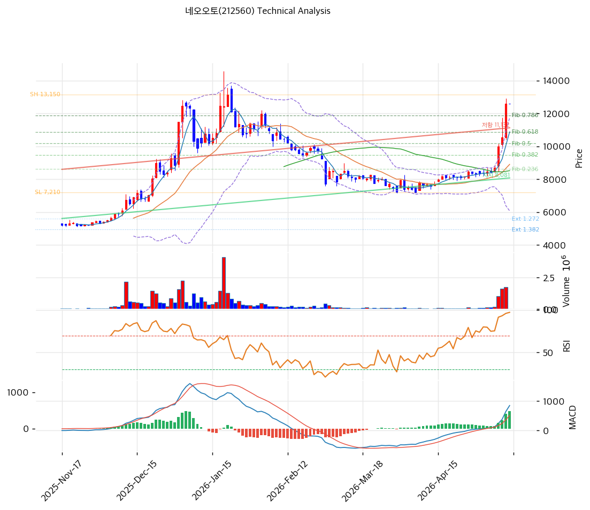

# 네오오토(212560) 기술적 분석

2026-05-14 | T2 Technical Analysis

---

## 차트

---

## 1. 가격 현황

| 항목 | 값 |
|------|---|
| 현재가 | 12,600원 (0.0%) |
| 52주 고가 | 13,150원 |
| 52주 저가 | 5,180원 (2.5배 상승) |
| 52주 범위 위치 | 93.1% |

---

## 2. 차트 패턴 분석

- **장기 박스 상향**: 5,180 → 13,150 +154% 6개월
- **RSI 88.8 🔴 극단 과매수**
- MA200 +69.6% 누적

### 종합 판단

박스 돌파 + 가속 모멘텀이나 **RSI 88.8 극단 과매수 + MA20 +41.5% 4중 과열**. 펀더멘털 (5년 흑자·순현금) 양호이나 단기 평균회귀 압력 매우 강함.

---

## 3. 이동평균선 — 정배열 (과열)

| MA | 괴리율 |
|---|---:|
| MA5 | +15.8% |
| MA20 | **+41.5%** |
| MA60 | +47.9% |
| MA120 | +45.8% |
| MA200 | +69.6% |

**평균회귀 1차 MA5 (-14%), 2차 MA20 (-29%)**.

---

## 4. 보조 지표

- **RSI 88.8** 🔴 극단 과매수 (80+ 임계 크게 초과)
- MA200 +69.6% 누적

---

## 5. 지지/저항

| 구분 | 가격 | 근거 |
|---|---:|---|
| **현재가** | **12,600** | 52주 신고가 직전 |
| 지지 | 10,879 | MA5 |
| 지지 | 8,906 | MA20 (1차 매수) |
| 지지 | 8,520 | MA60 |

---

## 6. 시그널 종합

**🟢 매수 1 / 🔴 매도 3 / ⚪ 중립 3 → 매도우위 (극단 과매수)**

펀더멘털 양호 + 단기 극단 RSI 88.8의 cross. 평균회귀 후 진입 권장.

---

## 7. 전략 제안

### 보유 중인 경우
- **비중축소 권장**
- 익절: 13,413원
- 손절: 12,600 직하

### 진입 대기인 경우
- 1차 진입: 12,600원 직하
- 2차 진입: 8,906원 (MA20, -29%)
- 펀더멘털 양호로 조정 시 매수 기회
