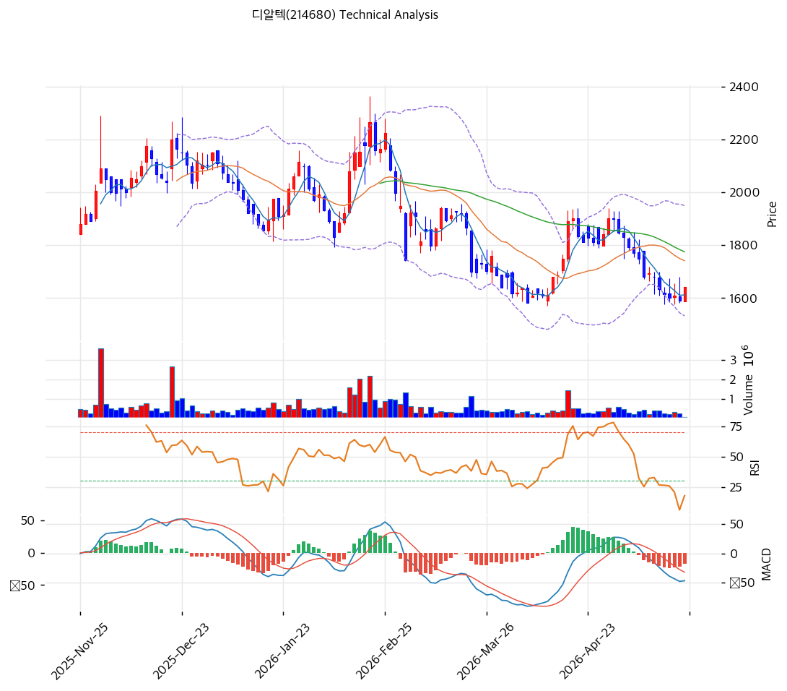

# 기술적분석

## 차트

## 가격 현황

| 항목      | 값                            |
| ------- | ---------------------------- |
| 현재가     | **1,641원** (+3.14%)          |
| 52주 고/저 | 2,275원 / 1,576원              |
| 52주 위치  | **9.3% 바닥권** 🔴              |
| RSI     | 40.7 🟡 중립                   |
| MACD    | -47/-30/-17 매도 시그널 (확장 X)    |
| Stoch   | K=10.9, D=8.9 골든크로스 (과매도 영역) |
| 거래량     | 평균 대비 0.2배 (관망)              |

## 이동평균선

| MA    |     가격 |  갭(%) | 위치 |
| ----- | -----: | ----: | -- |
| MA5   | 1,612원 |  +1.8 | 위  |
| MA20  | 1,741원 |  -5.8 | 아래 |
| MA60  | 1,775원 |  -7.6 | 아래 |
| MA120 | 1,905원 | -13.8 | 아래 |
| MA200 | 1,935원 | -15.2 | 아래 |

→ **MA5 외 전부 하단**, 정배열 X (역배열). 추세 하락 종속.

## 시그널 종합

| 구분     |             카운트 |
| ------ | --------------: |
| 매수     | 1 (Stoch 골든크로스) |
| 매도     |        1 (MACD) |
| 중립     |               4 |
| **결론** |     **중립 → 관망** |

## 지지·저항 (PRZ 강화 영역)

| 구분      | 가격대        | 근거                   |
| ------- | ---------- | -------------------- |
| 강 저항    | **1,760원** | MA20 + 피보 0.5 + MA60 |
| 약 저항    | 1,675원     | 피보 0.786 + 피봇 R1+R2  |
| 약 저항    | 1,659원     | 피봇 R1                |
| **현재가** | **1,641원** |                      |
| 약 지지    | **1,608원** | 피봇 S1 + MA5          |
| 지지      | 1,569원     | 피봇 S2                |
| 강 지지    | 1,533원     | 볼린저 하단               |
| 약 지지    | 901원       | BPS (이론 바닥)          |

## 전략

| 시나리오     | 액션                                           |
| -------- | -------------------------------------------- |
| 보유자      | **홀드** (TP 2,320 / SL 1,569) — 26Q2 흑전 신호 대기 |
| 신규 진입 1차 | **1,608원 도달** 30% 매수 (피봇 S1 + MA5)           |
| 신규 진입 2차 | **1,569원 도달** 30% 매수 (피봇 S2, SL 동일점)         |
| 신규 진입 3차 | **1,500\~1,533원** 30% 매수 (볼린저 하단)            |
| 매도 트리거   | 유증 발표 시 즉시 50% 손절 / 1,400원 이탈 시 전량           |
| 추세 전환    | **1,760원 (PRZ 강 저항)** 돌파 + 거래량 +100% → 매수 가속 |

## 핵심 판단

52주 9.3% 바닥권 + RSI 40.7 중립 + 거래량 0.2배 관망 = **추세 반전 미확인**. MACD 매도 시그널 살아 있어 -5\~-10% 추가 하방 가능. **Stoch 골든크로스(과매도)** 신호는 단기 반등 옵션이나, MA20/60 -5\~-7% 하단으로 강한 반등은 어려움. **유증 발표 임박**이 단기 최대 변수 → 발표 시 -15\~-25% 충격 우선 가정.
