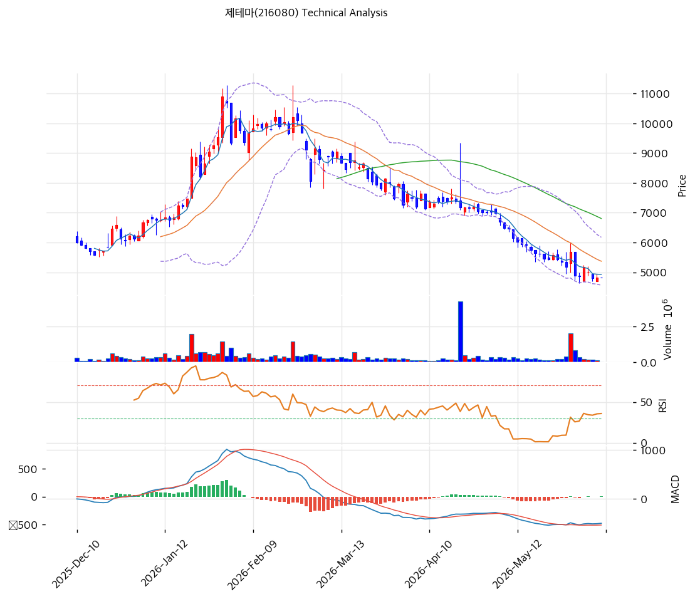

# 기술적분석

2026-06-10 | T2 Technical Analysis

***

## 차트

***

## 1. 가격 현황

| 항목        | 값                          |
| --------- | -------------------------- |
| 현재가       | 4,825원 (0.0%)              |
| 52주 고가    | 10,890원                    |
| 52주 저가    | 4,800원                     |
| 52주 범위 위치 | 0.4%                       |
| 거래량       | 20일 평균 대비 0.0x (장 시작 전 기준) |

***

## 2. 차트 패턴 분석

### 2.1 캔들스틱 패턴

| 패턴            | 위치                       | 신뢰도 | 해석                                                |
| ------------- | ------------------------ | --- | ------------------------------------------------- |
| 장기 하락 후 단봉·도지 | 최근 1\~2주 (4,800\~4,900원) | 중   | 중립\~반등 시사 — 52주 저점권에서 매도세 둔화, 투매 캔들 소멸            |
| 망치형 계열 아랫꼬리   | 5월 말\~6월 초               | 약   | 약한 매수 시사 — 4,800원 부근 저가 매수 유입 흔적                  |
| 흑삼병성 연속 음봉    | 2\~4월 하락 구간              | 강   | 매도 시그널(과거) — 1\~2월 고점(11,000원)에서 추세 전환 후 지속 하락 확인 |

※ 주요 캔들 패턴: 망치형, 역망치형, 장악형(상승/하락), 도지, 샛별/석별, 적삼병/흑삼병, 하라미, 유성형, 교수형 등

### 2.2 가격 구조 패턴

* **장기 하락 추세 (고점 → 52주 저점)** (신뢰도: 강) 2026년 1\~2월 11,000원 고점 형성 후 5개월간 단계적 하락해 현재 4,825원(52주 저점권). 고점 대비 -56%. 전형적인 분배형 천정(distribution top) 후 하락 추세이며, 모든 이동평균선이 현재가 위에 위치(완전 역배열).
* **저점권 횡보·바닥 다지기 시도** (신뢰도: 중) 최근 4,800원 부근에서 추가 하락이 멈추고 횡보 — 52주 저가(4,800원)가 심리적·기술적 지지로 작동 중. 거래량이 급감하며 매도 에너지 소진 양상. 바닥 확인까지는 추세선 저항 돌파 필요.

※ 주요 구조 패턴: 이중천정/바닥, 헤드앤숄더(정/역), 삼각수렴(대칭/상승/하락), 쐐기형(상승/하락), 깃발형, 페넌트, 컵앤핸들, 박스권 등

### 2.3 다이버전스

* **MACD 상승 다이버전스 초기** (신뢰도: 중) 가격은 저점을 낮췄으나 MACD 히스토그램이 음에서 양(+8)으로 전환되며 골든크로스 임박 — 하락 모멘텀 약화 신호. 추세 반전 확정은 아니나 단기 반등 가능성 시사.
* **RSI 저점 지지** (신뢰도: 약) RSI 31.4로 과매도 경계 부근에서 추가 하락 없이 바닥 형성 중 — 가격 저점 대비 RSI는 추가 저점을 만들지 않아 약한 긍정 신호.

※ RSI·MACD 기반 | 상승 다이버전스 = 가격↓ 지표↑ (반등 시사), 하락 다이버전스 = 가격↑ 지표↓ (하락 시사), 히든 다이버전스 = 기존 추세 지속 시사

### 2.4 패턴 종합 판단

장기 추세는 명백한 하락(역배열·고점 대비 -56%)이나, 52주 저점권(4,800원)에서 투매 소멸·MACD 골든크로스 임박·RSI 바닥 형성 등 **단기 반등의 초기 신호**가 동시에 나타난다. 하락 추세 종료를 단정하기엔 이르고, 4,800원 지지 유지 + 추세선 저항(약 4,950원) 돌파 여부가 바닥 전환의 1차 관문이다. 펀더멘털상 미국 L/O 등 이벤트가 거래량을 동반한 추세 반전의 방아쇠가 될 수 있다.

***

## 3. 이동평균선 — 역배열 (약세)

| MA    | 값      | 현재가 괴리율 | 위치 |
| ----- | ------ | ------- | -- |
| MA5   | 4,930원 | -2.1%   | 아래 |
| MA20  | 5,371원 | -10.2%  | 아래 |
| MA60  | 6,805원 | -29.1%  | 아래 |
| MA120 | 7,472원 | -35.4%  | 아래 |
| MA200 | 6,889원 | -30.0%  | 아래 |

**해석**: 현재가가 모든 이동평균선 아래에 위치한 완전 역배열로 전형적 약세 국면. 단기선(MA5 -2.1%)과의 괴리는 작아 단기 반등 시 MA5(4,930원)·MA20(5,371원)이 1차·2차 저항이 된다. 중장기선(MA60 이상)은 6,800\~7,500원으로 현재가와 30%+ 괴리 — 추세 회복까지 갈 길이 멀다.

***

## 4. 보조 지표

### RSI(14) — 31.4 (중립, 과매도 경계)

과매도(30) 바로 위에서 추가 하락 없이 바닥을 다지는 중. 반등 시 50 회복 여부가 모멘텀 전환의 분기점. 다이버전스 해석은 2.3 참조.

### MACD(12,26,9)

| 항목        | 값                |
| --------- | ---------------- |
| MACD      | -499.0           |
| Signal    | -507.0           |
| Histogram | +8.0             |
| 크로스 상태    | 매수 구간 (히스토그램 확대) |

**해석**: MACD가 Signal을 상향 돌파(골든크로스)하며 히스토그램이 양전(+8). 0선 아래 깊은 곳이지만 하락 모멘텀이 꺾이고 단기 반등 신호가 켜진 상태다.

### 볼린저밴드(20, 2σ)

| 항목        | 값         |
| --------- | --------- |
| 상단        | 6,177원    |
| 중단 (MA20) | 5,371원    |
| 하단        | 4,566원    |
| 밴드 폭      | 30.0%     |
| 현재 위치     | 중간(하단 근접) |

**해석**: 현재가 4,825원은 밴드 하단(4,566원)과 중단(5,371원) 사이 하부에 위치. 하락하며 벌어졌던 밴드 폭(30%)이 수축 조짐 — 변동성 축소 후 방향성 분출 대기 국면.

### 스토캐스틱(14, 3, 3)

| 항목      | 값     |
| ------- | ----- |
| Slow %K | 13.6  |
| Slow %D | 19.5  |
| 크로스 상태  | 데드크로스 |
| 판단      | 과매도   |

***

## 5. 지지/저항 — 추세선 · 피보나치 · PRZ 통합

### 5.1 피보나치 되돌림/확장

| 구분         | 비율    | 가격      | 현재가 대비  |
| ---------- | ----- | ------- | ------- |
| Swing High | —     | 10,200원 | +111.4% |
| 되돌림        | 0.236 | 8,573원  | +77.7%  |
| 되돌림        | 0.382 | 8,884원  | +84.1%  |
| 되돌림        | 0.5   | 9,135원  | +89.3%  |
| 되돌림        | 0.618 | 9,386원  | +94.5%  |
| 되돌림        | 0.786 | 9,744원  | +102.0% |
| Swing Low  | —     | 8,070원  | —       |
| 확장         | 1.272 | 7,491원  | +55.3%  |
| 확장         | 1.382 | 7,256원  | +50.4%  |
| 확장         | 1.618 | 6,754원  | +40.0%  |
| 확장         | 2.0   | 5,940원  | +23.1%  |

※ 피보나치 기준: 하락 추세 — 하락확장(downward extension)이 현재가 위 저항으로 작동. 2.0 확장(5,940원)이 1차 상단 목표 ※ 되돌림 = 직전 추세에서 되돌아온 비율, 확장 = 추세 방향 목표가

### 5.2 추세선

| 추세선 | 방향 | 현재 교차가  | 포인트 수 | 해석                          |
| --- | -- | ------- | ----- | --------------------------- |
| 지지선 | 하락 | 4,967원  | 6개    | 하락 채널 하단 — 현재가 바로 위로 단기 저항화 |
| 저항선 | 상승 | 10,955원 | 6개    | 고점 연결 — 현 시점 의미 제한적(과거 고점권) |

### 5.3 PRZ (Potential Reversal Zone)

| 방향 | 가격 범위         | 신뢰도 | 근거                          |
| -- | ------------- | --- | --------------------------- |
| 지지 | 4,800\~4,825원 | 강   | 피봇 + 52주 저가 + 볼린저 하단 인근 중첩  |
| 저항 | 4,930\~4,967원 | 약   | MA5 + 하락 추세선 지지(이탈 후 저항 전환) |

※ PRZ = 추세선 · 피보나치 · 피봇 · MA 등 복수 지표가 겹치는 가격 구간. 겹치는 소스가 많을수록 반전 확률 상승.

### 5.4 종합 지지/저항 테이블

| 구분      | 가격            | 근거               |
| ------- | ------------- | ---------------- |
| 저항      | 6,805원        | MA60 (중기 추세 회복선) |
| 저항      | 5,940원        | 피보나치 2.0 하락확장    |
| 저항      | 5,371원        | MA20 + 볼린저 중단    |
| 저항      | 4,930\~4,967원 | MA5 + 추세선(PRZ 약) |
| **현재가** | **4,825원**    | 52주 저점권          |
| 지지      | 4,800원        | 52주 저가 (핵심 방어선)  |
| 지지      | 4,566원        | 볼린저밴드 하단         |

***

## 6. 시그널 종합

| 지표        | 내용                          | 시그널 |
| --------- | --------------------------- | --- |
| **차트 패턴** | 장기 하락 + 저점권 투매 소멸·바닥 다지기 시도 | ⚪   |
| 이동평균선     | 완전 역배열, MA20 -10.2%         | ⚪   |
| RSI       | 31.4 — 과매도 경계               | ⚪   |
| MACD      | 매수구간, 골든크로스·히스토그램 확대        | 🟢  |
| 볼린저밴드     | 중간(하단 근접), 밴드 폭 30%         | ⚪   |
| 스토캐스틱     | 과매도, K=13.6                 | 🟢  |
| 거래량       | 0.0x — 약함                   | ⚪   |

**종합 판단**: 🟢 매수 2개 / 🔴 매도 0개 / ⚪ 중립 4개 → **매수우위 (기술적 반등 초기)**

장기 추세는 약세이나, 52주 저점권에서 MACD 골든크로스·스토캐스틱 과매도 등 단기 반등 시그널이 매도 시그널을 압도한다. 다만 거래량이 동반되지 않아 강도는 약하다. 4,800원 지지 유지가 전제이며, 추세 전환 확인은 MA20(5,371원) 회복이 필요하다. 이벤트(미국 L/O) 모멘텀이 더해지면 기술적 반등이 추세 전환으로 확장될 수 있는 위치다.

***

## 7. 전략 제안

### 보유 중인 경우

* **홀드 (손절 라인 엄수)**
* 익절 라인: 5,940원(피보 2.0 확장) 1차 / 6,805원(MA60) 2차
* 손절 라인: 4,790원 (52주 저가 4,800원 종가 이탈 시 — 신저점 = 추세 지속)
* 리스크/리워드: 약 1 : 3.2 (손실 -35원 vs 1차 익절 +1,115원)

### 진입 대기인 경우

* **분할 진입 가능 (저점권 매수)**
* 1차 진입가: 4,825원 (현 수준 — 52주 저점 PRZ 지지)
* 2차 진입가: 4,600원 (볼린저 하단 — 추가 하락 시 분할)
* 진입 조건: 4,800원 지지 확인 + MACD 골든크로스 유지. 거래량 동반 MA20(5,371원) 돌파 시 추세 추종 비중 확대 / 4,790원 이탈 시 진입 보류
