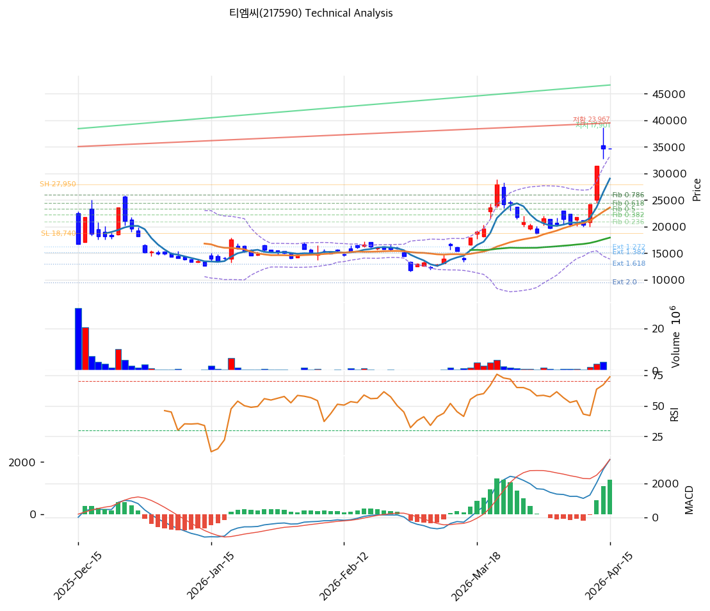

# 티엠씨(217590) 기술적 분석

2026-04-15 | T2 Technical Analysis

---

## 차트

---

## 1. 가격 현황

| 항목 | 값 |
|------|-----|
| 현재가 | 34,650원 (0.00%) |
| 52주 고가 | 34,650원 |
| 52주 저가 | 11,800원 |
| 52주 범위 위치 | 100.0% |
| 거래량 | 20일 평균 대비 0.0x |

---

## 2. 차트 패턴 분석

### 2.1 캔들스틱 패턴

| 패턴 | 위치 | 신뢰도 | 해석 |
|------|------|--------|------|
| 고점 도달 후 정체(Doji 계열) | 최근 1~2일 | 중 | 중립 시그널 — 52주 고가에서 거래량 소멸과 함께 상승 에너지 고갈. 추가 상승 동력 확인 필요 |
| 상승 추세 지속 패턴 | 최근 2~3주 | 강 | 매수 시그널 — 상장 이후 저점(11,800원) 대비 +193% 상승하며 강한 상승 추세 유지 중 |
| 유성형(Shooting Star) 가능성 | 52주 고가 구간 | 약 | 매도 시그널 — 고가 근처에서 상승 동력 약화. 거래량 동반 없으면 단기 되돌림 가능 |

※ 주요 캔들 패턴: 망치형, 역망치형, 장악형(상승/하락), 도지, 샛별/석별, 적삼병/흑삼병, 하라미, 유성형, 교수형 등

### 2.2 가격 구조 패턴

- **V자 반등 후 지속 상승(V-Bottom to Uptrend)** (신뢰도: 강)
  2025년 12월 KOSPI 상장 직후 저점(11,800원) 형성 후 거의 일방적인 상승 추세가 전개됨. 저점 대비 34,650원까지 약 193% 상승하며 신고가를 연속 갱신 중. MA5 > MA20 > MA60 완전 정배열이며, 모든 이동평균선이 상향 기울기를 유지 중. 전형적인 신규 상장 모멘텀 + 테마 수혜가 결합된 강한 상승 추세 구조.

- **52주 고가 밀착 및 저항(Resistance at All-Time High)** (신뢰도: 중)
  현재가(34,650원)가 52주 고가와 동일한 가격대. 신고가 돌파 시 차트상 저항이 없는 미지의 영역(Price Discovery Zone)이나, 동시에 피봇 포인트 계산 상 R1~R2 모두 동일 가격으로 산출되어 의미 있는 상단 기준을 제시하지 못하고 있다. 거래량 없이 고가 유지 중이어서 진정한 돌파 여부를 확인하기 어려운 상황.

- **피보나치 역추세 국면** (신뢰도: 중)
  피보나치 기준점은 Swing High 27,950원 → Swing Low 18,740원의 하락 구간으로 설정되어 있으나, 현재가(34,650원)는 이 기준 범위를 이미 상회하고 있다. 이는 단기 조정 후 피보나치 되돌림 구간(20,914~25,979원)이 중기 핵심 지지대로 기능함을 의미한다.

※ 주요 구조 패턴: 이중천정/바닥, 헤드앤숄더(정/역), 삼각수렴(대칭/상승/하락), 쐐기형(상승/하락), 깃발형, 페넌트, 컵앤핸들, 박스권 등

### 2.3 다이버전스

- **RSI 하락 다이버전스 발생 가능성** (신뢰도: 중)
  RSI 73.5로 과매수 구간에 진입한 상태에서 주가는 신고가를 유지 중이다. 향후 주가가 추가 상승하더라도 RSI가 더 이상 고점을 갱신하지 못하면 전형적인 하락 다이버전스로 발전할 수 있으며, 이는 단기 되돌림 또는 추세 전환 시그널이 된다. 현재는 확정이 아닌 경계 단계.

- **MACD 추세 동행 — 다이버전스 미발생** (신뢰도: 강)
  MACD 3,421, Signal 2,091로 히스토그램이 +1,329 확대 중이며, 가격 상승과 MACD가 동반 상승하고 있어 하락 다이버전스는 현재 미발생. 추세 강도가 유지되고 있음을 확인해주는 긍정적 신호다.

※ RSI·MACD 기반 | 상승 다이버전스 = 가격↓ 지표↑ (반등 시사), 하락 다이버전스 = 가격↑ 지표↓ (하락 시사), 히든 다이버전스 = 기존 추세 지속 시사

### 2.4 패턴 종합 판단

가격구조(V자 반등 후 강한 상승 추세)와 MACD 동행 상승은 중기 강세 추세를 지지한다. 그러나 RSI 73.5 과매수권 진입, 스토캐스틱 K=86.5 과매수, 볼린저밴드 상단 밀착(82.1% 밴드폭), 거래량 소멸(0.0x)이라는 4가지 과열 지표가 동시에 경고 신호를 보내고 있다. 현재가가 52주 고가와 동일한 극단적 위치(100%)에서 거래량 없이 고가를 유지하는 것은 단기적으로 조정 압력이 축적되고 있음을 시사한다. 상충 시그널 요약: 중기 추세는 강세, 단기 모멘텀은 과열 경계.

---

## 3. 이동평균선 — 정배열 (강세)

| MA | 값 | 현재가 괴리율 | 위치 |
|----|-----|--------------|------|
| MA5 | 29,060원 | +19.2% | 위 |
| MA20 | 23,604원 | +46.8% | 위 |
| MA60 | 17,944원 | +93.1% | 위 |
| MA120 | N/A | — | — |
| MA200 | N/A | — | — |

**해석**: MA5 > MA20 > MA60 정배열로 단기~중기 상승 추세가 뚜렷하다. 다만 MA20 대비 +46.8%, MA60 대비 +93.1%의 극단적인 괴리율은 신규 상장 주식 특유의 급등에 따른 이평선 미형성 영향이기도 하나, 과열 리스크를 나타낸다. MA120·MA200은 상장 역사가 짧아 미산출 상태다. 조정 시 1차 지지선은 MA5(29,060원), 본격 조정 시 MA20(23,604원)이 핵심 지지선이다.

---

## 4. 보조 지표

### RSI(14) — 73.5 (🔴과매수)

RSI 73.5로 과매수 구간(70 이상)에 진입한 상태. 추가 상승 시 다이버전스 형성 가능성에 유의해야 하며, 단기 되돌림 압력이 높다. 70선 하향 이탈 시 단기 조정 신호로 해석.

### MACD(12,26,9)

| 항목 | 값 |
|------|-----|
| MACD | 3,421 |
| Signal | 2,091 |
| Histogram | +1,329 |
| 크로스 상태 | 매수 구간 (확대 중) |

**해석**: MACD가 Signal선을 상회하며 히스토그램이 확대 중으로 상승 모멘텀이 유지되는 구간이다. 가격 상승과 MACD 동반 상승으로 하락 다이버전스 미발생 확인. 히스토그램 확대가 꺾이는 시점이 단기 추세 전환의 선행 지표가 될 것이다.

### 볼린저밴드(20, 2σ)

| 항목 | 값 |
|------|-----|
| 상단 | 33,289원 |
| 중단 (MA20) | 23,604원 |
| 하단 | 13,918원 |
| 밴드 폭 | 82.1% |
| 현재 위치 | 상단 근접 |

**해석**: 밴드 폭 82.1%로 매우 넓게 확장된 상태이며, 현재가(34,650원)가 볼린저 상단(33,289원)을 상회하는 밴드 이탈 구간이다. 밴드 상단 이탈은 강한 모멘텀의 증거이자 단기 과열의 신호로, 밴드 내 회귀 시 중단(MA20, 23,604원)까지 되돌림 가능하다.

### 스토캐스틱(14, 3, 3)

| 항목 | 값 |
|------|-----|
| Slow %K | 86.5 |
| Slow %D | 74.5 |
| 크로스 상태 | 골든크로스 |
| 판단 | 과매수 |

---

## 5. 지지/저항 — 추세선 · 피보나치 · PRZ 통합

### 5.1 피보나치 되돌림/확장

| 구분 | 비율 | 가격 | 현재가 대비 |
|------|------|------|-----------|
| Swing High | — | 27,950원 | -19.3% |
| 되돌림 | 0.236 | 20,914원 | -39.6% |
| 되돌림 | 0.382 | 22,258원 | -35.7% |
| 되돌림 | 0.5 | 23,345원 | -32.6% |
| 되돌림 | 0.618 | 24,432원 | -29.5% |
| 되돌림 | 0.786 | 25,979원 | -25.0% |
| Swing Low | — | 18,740원 | -45.9% |
| 확장 | 1.272 | 16,235원 | -53.1% |
| 확장 | 1.382 | 15,222원 | -56.0% |
| 확장 | 1.618 | 13,048원 | -62.3% |
| 확장 | 2.0 | 9,530원 | -72.5% |

※ 피보나치 기준: 하락 추세 (Swing High 27,950원 → Swing Low 18,740원)
※ 현재가(34,650원)는 Swing High를 상회하므로, 피보나치 되돌림 구간은 조정 시 중기 지지대로 기능. 되돌림 = 하락 추세의 반등 레벨, 피보나치 0.618(24,432원)~0.786(25,979원)이 핵심 지지 밀집 구간

### 5.2 추세선

| 추세선 | 방향 | 현재 교차가 | 포인트 수 | 해석 |
|--------|------|-----------|---------|------|
| 지지선 | 상승 | 17,901원 | 4개 | 상장 이후 저점을 연결하는 강한 상승 지지선. 현재가 대비 -48.3% 하방에 위치. 장기 추세 훼손 기준선 |
| 저항선 | 상승 | 23,967원 | 5개 | 직전 고점들을 연결하는 상승 저항선. 현재가 대비 -30.8%. 조정 후 반등 시 이 저항선 상회 여부가 중기 추세 재개 확인 조건 |

### 5.3 PRZ (Potential Reversal Zone)

| 방향 | 가격 범위 | 신뢰도 | 근거 |
|------|---------|--------|------|
| 지지 | 34,650원 | 강 | 피봇 R1, 피봇 R2, 피봇 S1, 피봇 S2 — 피봇 포인트 전체가 현재가와 동일 (신규 상장 가격 구조 특이점) |
| 지지 | 23,345~24,432원 | 중 | 피보나치 0.5(23,345원) + 0.618(24,432원) + 추세선 저항(23,967원) + MA20(23,604원) 4개 지표 중첩 |
| 지지 | 17,901~17,944원 | 중 | 추세선 지지(17,901원) + MA60(17,944원) 중첩 |

※ PRZ = 추세선·피보나치·피봇·MA 등 복수 지표가 겹치는 가격 구간. 겹치는 소스가 많을수록 반전 확률 상승.

### 5.4 종합 지지/저항 테이블

| 구분 | 가격 | 근거 |
|------|------|------|
| 저항 | 34,650원 | 52주 고가 / 피봇 R1·R2 (신규 상장 특이 구조) |
| **현재가** | **34,650원** | — |
| 지지 | 29,060원 | MA5 |
| 지지 | 25,979원 | 피보나치 0.786 되돌림 |
| 지지 | 23,345~24,432원 | PRZ (중) — 피보나치 0.5~0.618 + MA20 + 추세선 저항선 |
| 지지 | 20,914원 | 피보나치 0.236 되돌림 |
| 지지 | 17,901~17,944원 | 추세선 지지(상승) + MA60 중첩 |

---

## 6. 시그널 종합

| 지표 | 내용 | 시그널 |
|------|------|--------|
| **차트 패턴** | V자 반등 후 강한 상승 추세, MACD 동행, 52주 고가 밀착·과열 경계 | ⚪ |
| 이동평균선 | 정배열, MA20 +46.8%, MA60 +93.1% (극단적 과열) | 🟢 (추세) / 🔴 (과열) |
| RSI | 73.5 — 🔴 과매수 | 🔴 |
| MACD | 매수구간, 히스토그램 +1,329 확대 중 | 🟢 |
| 볼린저밴드 | 상단 이탈(34,650 > 33,289), 밴드폭 82.1% | 🔴 |
| 스토캐스틱 | 골든크로스, K=86.5 과매수 | 🔴 |
| 거래량 | 0.0x — 약함 (모멘텀 미확인) | ⚪ |

**종합 판단**: 🟢 매수 2개 / 🔴 매도 3개 / ⚪ 중립 2개 → **매도우위**

중기 상승 추세(정배열 + MACD 매수구간)는 유효하나, 단기 과열 지표가 압도적이다. RSI 73.5 과매수, 스토캐스틱 86.5 과매수, 볼린저밴드 상단 이탈이 동시에 발생하고 있으며, 거래량이 소멸된 상태에서 52주 고가에 머무르고 있다. 현재 수준의 신규 진입보다는 조정 후 PRZ 지지 구간(23,345~25,979원)에서의 재진입을 대기하는 것이 리스크/리워드 측면에서 유리하다.

---

## 7. 전략 제안

### 보유 중인 경우
- **비중축소**
- 익절 라인: 35,343원 (현재가 대비 +2.0% — 단기 돌파 모멘텀 확인 시 부분 익절)
- 손절 라인: 29,060원 (MA5 이탈 시 단기 추세 훼손 신호)
- 리스크/리워드: 0.69 (익절폭 693원 vs 손절폭 5,590원 — 고가권으로 비대칭)

### 진입 대기인 경우
- **관망**
- 1차 진입가: 23,604원 (MA20 + 피보나치 0.5 PRZ 구간 — 조정 후 중기 지지 확인 시)
- 2차 진입가: 17,944원 (MA60 + 추세선 지지 중첩 — 깊은 조정 시 핵심 지지)
- 진입 조건: 현 수준 신규 진입은 RSI 과매수·거래량 소멸로 비추천. 거래량 동반 신고가 갱신(34,650원 상향 돌파) 확인 시 추격 진입 가능하나 손절라인 엄수. 또는 MA20(23,604원) PRZ 구간까지 조정 후 반등 캔들 확인 시 분할 진입 권장.
