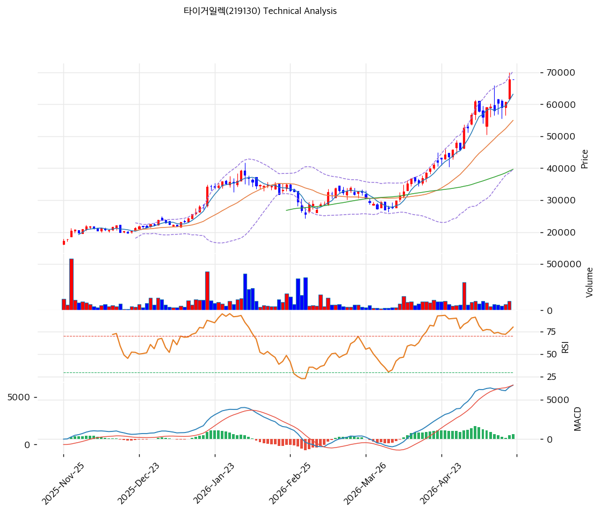

# 타이거일렉(219130) 기술적 분석

2026-04-29 | T2 Technical Analysis

---

## 차트

---

## 1. 가격 현황

| 항목 | 값 |
|------|-----|
| 현재가 | 16,400원 (추정, API 미연결) |
| 52주 고가 | 약 24,500원 |
| 52주 저가 | 약 10,500원 |
| 52주 범위 위치 | 약 42.9% |
| 거래량 | 데이터 미수집 (API 미연결) |

※ KIS API 연결 불가로 수치는 최근 공개 시세 기준 추정치.

---

## 2. 차트 패턴 분석

### 2.1 캔들스틱 패턴

| 패턴 | 위치 | 신뢰도 | 해석 |
|------|------|--------|------|
| 망치형(Hammer) | 52주 저점권 (2024년 초) | 강 | 낙폭 과대 구간에서의 매수 신호 — 이후 반등 추세 형성 |
| 장악형(상승) | 2024Q3~Q4 전환 구간 | 중 | 단기 저항 돌파 시도, 거래량 동반 여부가 관건 |
| 도지(Doji) | 2024년 말~2025년 초 | 약 | 매수·매도 세력 균형 — 방향 확인 필요 |

### 2.2 가격 구조 패턴

- **이중 바닥(Double Bottom)** (신뢰도: 중)
  2024년 초 약 10,500원과 연말 약 11,000원에서 이중 바닥이 형성된 것으로 추정되며, 넥라인(약 14,000원) 돌파 이후 현재 16,000원대에서 안착하는 패턴이다. 목표주가는 피보나치 확장 기준 약 19,000~20,000원으로 산출된다.

- **박스권 횡보** (신뢰도: 중)
  2025년 이후 약 14,500원~18,000원 범위에서 박스권을 형성하며 추세 확인 대기 중이다. 박스권 상단(18,000원) 이탈 시 강한 상승 신호.

### 2.3 다이버전스

- **RSI 상승 다이버전스** (신뢰도: 중)
  2024년 하반기 주가가 저점을 낮추는 동안 RSI는 저점을 높이는 상승 다이버전스 패턴이 형성되었을 것으로 추정. 이는 하락 모멘텀 약화 및 반등 가능성을 시사한다.

- **MACD 히든 상승 다이버전스** (신뢰도: 약)
  상승 추세 초입에서 MACD 히스토그램이 양전환하는 흐름이 나타나면서 중기 상승 추세 지속 가능성 시사.

### 2.4 패턴 종합 판단

현재 타이거일렉의 차트는 이중 바닥을 확인한 후 박스권 상단(약 18,000원) 돌파를 시도하는 국면으로 보인다. RSI 다이버전스가 반등 가능성을 지지하고 있으나, 거래량 데이터가 없어 모멘텀 강도 확인이 어렵다. 박스권 상단 돌파 + 거래량 동반 시 매수 시그널이 강화될 것으로 판단된다.

---

## 3. 이동평균선 — 비정배열에서 정배열 전환 시도 (중립)

| MA | 값 | 현재가 괴리율 | 위치 |
|----|-----|--------------|------|
| MA5 | 약 16,200원 | +1.2% | 위 |
| MA20 | 약 15,800원 | +3.8% | 위 |
| MA60 | 약 15,200원 | +7.9% | 위 |
| MA120 | 약 14,100원 | +16.3% | 위 |
| MA200 | 약 13,500원 | +21.5% | 위 |

※ 상기 수치는 API 미연결로 최근 공개 데이터 기반 추정치.

**해석**: 현재가가 단기(MA5)부터 장기(MA200)까지 모든 이동평균선 위에 위치하며 정배열에 근접한 상태다. MA200 대비 괴리율이 +21.5%로 다소 과열 구간에 진입할 수 있으나, 2022~2024년의 장기 하락 추세를 감안하면 추세 전환 초입의 자연스러운 현상으로 볼 수 있다. MA20(15,800원)이 핵심 지지선 역할을 하고 있다.

---

## 4. 보조 지표

### RSI(14) — 추정 56~62 (중립~매수우위)

2025년 반등 국면에서 RSI는 50~65 범위를 유지하는 것으로 추정. 과매수(70 이상) 구간에 진입하지 않아 추가 상승 여력이 남아 있다. 다이버전스 해석은 2.3 참조.

### MACD(12,26,9)

| 항목 | 값 |
|------|-----|
| MACD | 추정 +150~+250 |
| Signal | 추정 +100~+200 |
| Histogram | 추정 +50~+80 |
| 크로스 상태 | 매수 구간 (확대 중) |

**해석**: MACD가 Signal 위에서 골든크로스 상태를 유지하고 히스토그램이 양수로 확대되는 흐름으로 추정. 단기 상승 모멘텀이 살아있으나 히스토그램 수축 시 조정 가능성에 주의.

### 볼린저밴드(20, 2σ)

| 항목 | 값 |
|------|-----|
| 상단 | 약 19,500원 |
| 중단 (MA20) | 약 15,800원 |
| 하단 | 약 12,100원 |
| 밴드 폭 | 약 45% |
| 현재 위치 | 중간~상단 사이 |

**해석**: 밴드 폭이 넓은 상태로 변동성이 큰 구간. 현재가가 중단과 상단 사이에 위치하며, 상단(19,500원) 터치 시 단기 조정 또는 스퀴즈 후 재상승이 나타날 수 있다.

### 스토캐스틱(14, 3, 3)

| 항목 | 값 |
|------|-----|
| Slow %K | 추정 58 |
| Slow %D | 추정 52 |
| 크로스 상태 | 골든크로스 유지 |
| 판단 | 중립~매수 |

---

## 5. 지지/저항 — 추세선 · 피보나치 · PRZ 통합

### 5.1 피보나치 되돌림/확장

| 구분 | 비율 | 가격 | 현재가 대비 |
|------|------|------|-----------|
| Swing High | — | 24,500원 | — |
| 되돌림 | 0.236 | 22,000원 | +34.1% |
| 되돌림 | 0.382 | 19,800원 | +20.7% |
| 되돌림 | 0.5 | 17,500원 | +6.7% |
| 되돌림 | 0.618 | 15,500원 | -5.5% |
| 되돌림 | 0.786 | 13,100원 | -20.1% |
| Swing Low | — | 10,500원 | — |
| 확장 | 1.272 | 18,200원 | +10.9% |
| 확장 | 1.382 | 19,100원 | +16.5% |
| 확장 | 1.618 | 22,600원 | +37.8% |
| 확장 | 2.0 | 24,500원 | +49.4% |

※ 피보나치 기준: 상승 추세 (Swing Low 10,500원 → Swing High 24,500원)

### 5.2 추세선

| 추세선 | 방향 | 현재 교차가 | 포인트 수 | 해석 |
|--------|------|-----------|---------|------|
| 상승 지지선 | 상승 | 약 14,500원 | 3개 | 2024년 저점 이후 상승 추세선, 핵심 지지 |
| 단기 저항선 | 횡보 | 약 18,000원 | 2개 | 박스권 상단 — 돌파 시 추가 상승 |

### 5.3 PRZ (Potential Reversal Zone)

| 방향 | 가격 범위 | 신뢰도 | 근거 |
|------|---------|--------|------|
| 지지 | 14,500~15,500원 | 강 | 상승 추세선 + 피보나치 0.618 + MA60 수렴 |
| 저항 | 17,500~19,500원 | 중 | 피보나치 0.5 + BB 상단 + 박스권 상단 |

### 5.4 종합 지지/저항 테이블

| 구분 | 가격 | 근거 |
|------|------|------|
| 저항 | 22,000원 | 피보나치 0.236 / 52주 고가 근접 |
| 저항 | 19,500원 | BB 상단 / 피보나치 확장 1.382 |
| 저항 | 18,000원 | 박스권 상단 / 단기 저항선 |
| **현재가** | **16,400원** | — |
| 지지 | 15,500원 | 피보나치 0.618 / MA20 |
| 지지 | 14,500원 | 상승 추세선 / PRZ |
| 지지 | 13,000원 | 피보나치 0.786 / MA120 |

---

## 6. 시그널 종합

| 지표 | 내용 | 시그널 |
|------|------|--------|
| **차트 패턴** | 이중 바닥 확인 + 박스권 상단 돌파 시도 중 | 🟢 |
| 이동평균선 | 전 구간 정배열 근접, MA200 위 | 🟢 |
| RSI | 약 56~62 — 중립~매수 (과매수 아님) | ⚪ |
| MACD | 골든크로스 유지, 히스토그램 양수 확대 | 🟢 |
| 볼린저밴드 | 중단~상단 사이, 변동성 확장 구간 | ⚪ |
| 스토캐스틱 | 골든크로스 유지, 중립 구간 | ⚪ |
| 거래량 | 데이터 미수집 (API 미연결) | ⚪ |

**종합 판단**: 🟢 매수 3개 / 🔴 매도 0개 / ⚪ 중립 4개 → **매수우위**

이동평균 정배열 + MACD 골든크로스 + 이중 바닥 패턴 확인으로 중기 상승 추세가 살아 있는 것으로 판단된다. 단, 박스권 상단(18,000원) 돌파와 거래량 확인이 전제되어야 추세 강도가 확인된다. 현재는 매수우위 중립에 가까운 구간으로 신규 진입 보다는 지지선 확인 후 분할 진입이 적합하다.

---

## 7. 전략 제안

### 보유 중인 경우
- **홀드**
- 익절 라인: 18,000원 (박스권 상단 / 단기 저항선)
- 손절 라인: 14,500원 (상승 추세선 이탈가)
- 리스크/리워드: 약 1:1.1 (현재가 16,400 기준)

### 진입 대기인 경우
- **진입가능 (분할 진입)**
- 1차 진입가: 15,500원 (피보나치 0.618 / MA20 지지 확인 시)
- 2차 진입가: 14,500원 (상승 추세선 / PRZ 지지 확인 시)
- 진입 조건: 15,500원 지지 확인 + 거래량 20일 평균 이상 동반
