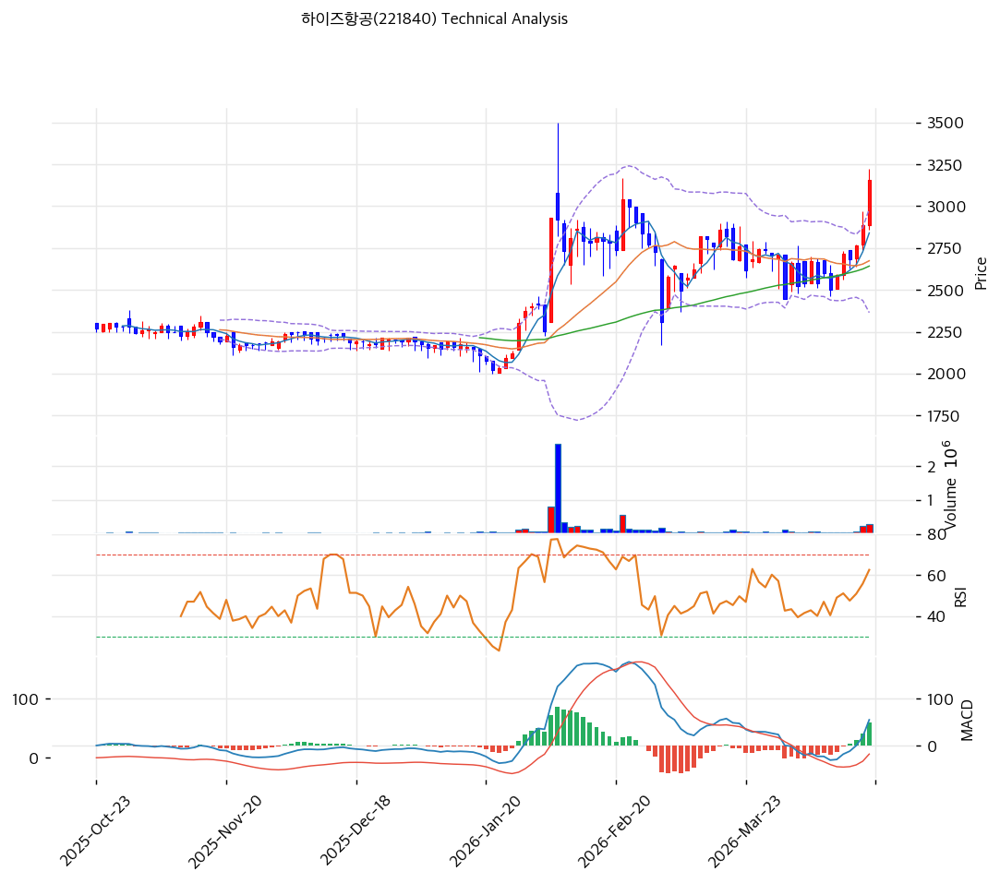

# 하이즈항공(221840) 기술적 분석

2026-04-18 | T2 Technical Analysis

---

## 차트

---

## 1. 가격 현황

| 항목 | 값 |
|------|-----|
| 현재가 | 3,155원 (+9.36%) |
| 52주 고가 | 3,220원 |
| 52주 저가 | 1,370원 |
| 52주 범위 위치 | 100.0% |
| 거래량 | 20일 평균 대비 4.88x |

---

## 2. 차트 패턴 분석

### 2.1 캔들스틱 패턴

| 패턴 | 위치 | 신뢰도 | 해석 |
|------|------|--------|------|
| 장대양봉 (Marubozu형) | 최근 1일 (4/18) | 강 | +9.36% 대량거래 동반 상승 — 매수 시그널, 단기 모멘텀 가속 |
| 상승 갭 (Gap-up) | 최근 1일 | 중 | 전일 종가 상단에서 갭 출발 후 유지 — 매수 심리 강세 확인 |
| 적삼병 유사 | 최근 3~4일 | 중 | 연속 양봉으로 2,800원대 저항 돌파 — 추세 전환 지속 시사 |

### 2.2 가격 구조 패턴

- **박스권 돌파 (Box Breakout)** (신뢰도: 강)
  2026년 2월 초 ~ 4월 초까지 약 2,550~2,850원 박스권에서 횡보했으나, 4/18 대량거래와 함께 상단을 돌파. 박스 폭(약 300원)을 적용한 계산상 목표가는 3,150~3,200원 구간으로, 현재가가 목표에 근접. 추가 돌파 시 1월 고점(약 3,500원) 재시험 가능.

- **컵앤핸들 유사 패턴** (신뢰도: 중)
  1월 하순 급등(2,200→3,500원) 후 2~3월 조정(핸들 형성, 2,550~2,900원)을 거쳐 4월 재차 상승. 1월 고점 돌파 여부가 패턴 완성의 관건이며, 돌파 시 측정 목표가 4,000원대 확장 가능.

- **상승 추세선 지지 유효** (신뢰도: 강)
  1월 저점 → 3월 저점을 잇는 상승 추세선이 약 2,600~2,700원대에서 지지 확인. 현재가는 추세선에서 충분히 이격되어 있어 단기 과열 우려는 있으나 중기 상승 추세는 건재.

### 2.3 다이버전스

- **MACD 재상승 크로스 (Bullish Confirmation)** (신뢰도: 중)
  2월 중순 MACD 고점(약 160) 이후 3월까지 히스토그램이 음전환되며 가격과 함께 하락했으나, 4월 들어 MACD(55)가 Signal(6)을 상향 돌파하며 히스토그램 +49로 확대. 이는 다이버전스라기보다는 **신규 매수 구간 진입**을 확인하는 시그널로 해석.

- **RSI 상승 추세 지속, 다이버전스 부재** (신뢰도: 중)
  3월 저점 대비 가격은 약 10%+ 상승했고 RSI도 40대→66으로 동반 상승. 가격-지표 간 괴리 없음 — 현 시점에서는 추세 지속을 시사.

### 2.4 패턴 종합 판단

장대양봉·갭업·적삼병 등 단기 캔들 시그널과 박스권 상단 돌파가 동시에 나타나 **강한 매수 우위**. 컵앤핸들 패턴 관점에서는 1월 고점(3,500원) 돌파 여부가 핵심이며, 돌파 실패 시 이중천정 리스크가 상존. 다이버전스는 없어 현재 추세는 건강하나, BB 상단 근접·스토캐스틱 과매수 등 단기 과열 신호는 경계 필요.

---

## 3. 이동평균선 — 정배열 (강세)

| MA | 값 | 현재가 괴리율 | 위치 |
|----|-----|--------------|------|
| MA5 | 2,840원 | +11.1% | 위 |
| MA20 | 2,674원 | +18.0% | 위 |
| MA60 | 2,642원 | +19.4% | 위 |
| MA120 | 2,428원 | +29.9% | 위 |
| MA200 | 2,350원 | +34.3% | 위 |

**해석**: MA5 > MA20 > MA60 > MA120 > MA200 완전 정배열로 중장기 상승 추세 확고. 다만 MA200 대비 +34.3% 이격은 단기 과열 신호로, 일시적 되돌림 시 MA20(2,674원)이 1차 지지선, MA60(2,642원)이 2차 강력 지지선 역할 예상.

---

## 4. 보조 지표

### RSI(14) — 66.0 (중립)

과매수 기준선 70에 근접한 강세 구간. 상승 추세 지속 시 70 돌파 가능성이 있으나, 70 이상에서는 단기 조정 리스크 증가.

### MACD(12,26,9)

| 항목 | 값 |
|------|-----|
| MACD | 55.0 |
| Signal | 6.0 |
| Histogram | +49 |
| 크로스 상태 | 매수 구간 (확대 중) |

**해석**: 3월 조정 후 4월 초 골든크로스 발생, 히스토그램 +49로 빠르게 확장 중. 가장 강력한 매수 시그널.

### 볼린저밴드(20, 2σ)

| 항목 | 값 |
|------|-----|
| 상단 | 2,983원 |
| 중단 (MA20) | 2,674원 |
| 하단 | 2,364원 |
| 밴드 폭 | 23.2% |
| 현재 위치 | 상단 돌파 (외곽) |

**해석**: 밴드 폭 23.2%로 확장 국면. 현재가(3,155원)는 상단(2,983원)을 돌파한 상태로, 볼린저 밴드 라이딩(추세 지속) 구간 진입 가능. 다만 상단 이탈 후에는 중단선(MA20 2,674원) 회귀 리스크도 상존.

### 스토캐스틱(14, 3, 3)

| 항목 | 값 |
|------|-----|
| Slow %K | 91.3 |
| Slow %D | 85.5 |
| 크로스 상태 | 골든크로스 |
| 판단 | 과매수 |

---

## 5. 지지/저항 — 추세선 · 피보나치 · PRZ 통합

### 5.1 피보나치 되돌림/확장

| 구분 | 비율 | 가격 | 현재가 대비 |
|------|------|------|-----------|
| Swing High | — | 3,500원 | +10.9% |
| 되돌림 | 0.236 | 2,988원 | -5.3% |
| 되돌림 | 0.382 | 2,671원 | -15.3% |
| 되돌림 | 0.5 | 2,415원 | -23.5% |
| 되돌림 | 0.618 | 2,159원 | -31.6% |
| 되돌림 | 0.786 | 1,794원 | -43.1% |
| Swing Low | — | 1,370원 | -56.6% |
| 확장 | 1.272 | 4,090원 | +29.6% |
| 확장 | 1.382 | — | — |
| 확장 | 1.618 | — | — |
| 확장 | 2.0 | — | — |

※ 피보나치 기준: 상승 추세 (Swing Low 1,370원 → Swing High 3,500원)
※ 0.236 되돌림선(2,988원)이 1차 지지, 0.382(2,671원)가 MA20과 겹치는 강지지.

### 5.2 추세선

| 추세선 | 방향 | 현재 교차가 | 포인트 수 | 해석 |
|--------|------|-----------|---------|------|
| 지지선 | 상승 | 2,268원 | 3+ | 1월 저점 기반 중기 상승 추세선, 현재가 대비 -28% 여유 |
| 저항선 | 상승 | 3,009원 | 2 | 2월 고점 기반 저항선은 현재 돌파 상태, 역지지선 전환 가능 |

### 5.3 PRZ (Potential Reversal Zone)

| 방향 | 가격 범위 | 신뢰도 | 근거 |
|------|---------|--------|------|
| 지지 | 2,970~2,990원 | 중 | 피봇 S1 + 피보나치 0.236 + 상승 추세선 저항(돌파 후 역지지) |
| 지지 | 2,670~2,680원 | 강 | MA20 + MA60 + 피보나치 0.382 3중 겹침 — 최강 지지 |
| 지지 | 2,415~2,425원 | 약 | 피보나치 0.5 + MA120 |
| 저항 | 3,500~3,550원 | 중 | 1월 장중 최고가 (미확인 고점) |
| 저항 | 4,090원 | 약 | 피보나치 1.272 확장 — 돌파 시 중기 목표 |

### 5.4 종합 지지/저항 테이블

| 구분 | 가격 | 근거 |
|------|------|------|
| 저항 | 4,090원 | 피보나치 1.272 확장 (중기 목표) |
| 저항 | 3,500원 | 1월 장중 고가 (미확인) |
| 저항 | 3,297원 | 피봇 R1 (1차 단기 저항) |
| 저항 | 3,220원 | 52주 고가 |
| **현재가** | **3,155원** | — |
| 지지 | 2,978원 | PRZ (중) — 피봇 S1 + 피보나치 0.236 + 추세선 |
| 지지 | 2,840원 | MA5 (단기 지지) |
| 지지 | 2,718원 | 피봇 S2 |
| 지지 | 2,676원 | PRZ (강) — MA20 + MA60 + 피보나치 0.382 |
| 지지 | 2,268원 | 중기 상승 추세선 |

---

## 6. 시그널 종합

| 지표 | 내용 | 시그널 |
|------|------|--------|
| **차트 패턴** | 박스권 상단 돌파 + 장대양봉 + 컵앤핸들 진행 | 🟢 |
| 이동평균선 | MA5~MA200 완전 정배열, 전 MA 상단 | 🟢 |
| RSI | 66.0 — 중립(강세 편향) | ⚪ |
| MACD | 55/6/+49 매수 구간 확장 | 🟢 |
| 볼린저밴드 | 상단(2,983원) 돌파, 밴드 라이딩 진입 | 🔴 |
| 스토캐스틱 | K=91.3 D=85.5 과매수 골든크로스 | ⚪ |
| 거래량 | 4.88x — 강력 | 🟢 |

**종합 판단**: 🟢 매수 4개 / 🔴 매도 1개 / ⚪ 중립 2개 → **매수우위**

박스권 돌파·대량거래·MACD 골든크로스 확대로 중기 상승 추세는 매우 강건. 다만 BB 상단 이탈과 스토캐스틱 91.3 과매수, MA200 대비 +34% 이격은 단기 숨고르기 가능성을 시사. 52주 고가(3,220원) 돌파 시 1월 전고점(3,500원)까지 모멘텀 지속이 유력하며, 실패 시 PRZ(2,670원)까지 되돌림 리스크 경계.

---

## 7. 전략 제안

### 보유 중인 경우
- **홀드 (일부 비중축소 고려)**
- 익절 라인: 3,218원 (52주 고가/피봇 R1 부근, 단기 저항 테스트 구간에서 1/3 분할익절)
- 손절 라인: 2,718원 (피봇 S2 이탈 시 박스권 재진입 — 추세 훼손 신호)
- 리스크/리워드: (3,218-3,155) : (3,155-2,718) = 63 : 437 ≈ **0.14 : 1** (단기 불리, 중기 목표 3,500원 적용 시 345:437 ≈ 0.79:1)

### 진입 대기인 경우
- **관망 (추격매수 비권장)**
- 1차 진입가: 2,937원 (피봇 S1 / PRZ 중강도 — 단기 눌림목)
- 2차 진입가: 2,674원 (MA20+MA60+피보나치 0.382 3중 PRZ — 강력 지지)
- 진입 조건: (1) 거래량 동반 조정 후 양봉 확인, (2) RSI 50 이상 유지, (3) MA20 위 지지 유지 — 1월 저점 상승 추세선 이탈 시 진입 전략 전면 재검토.
