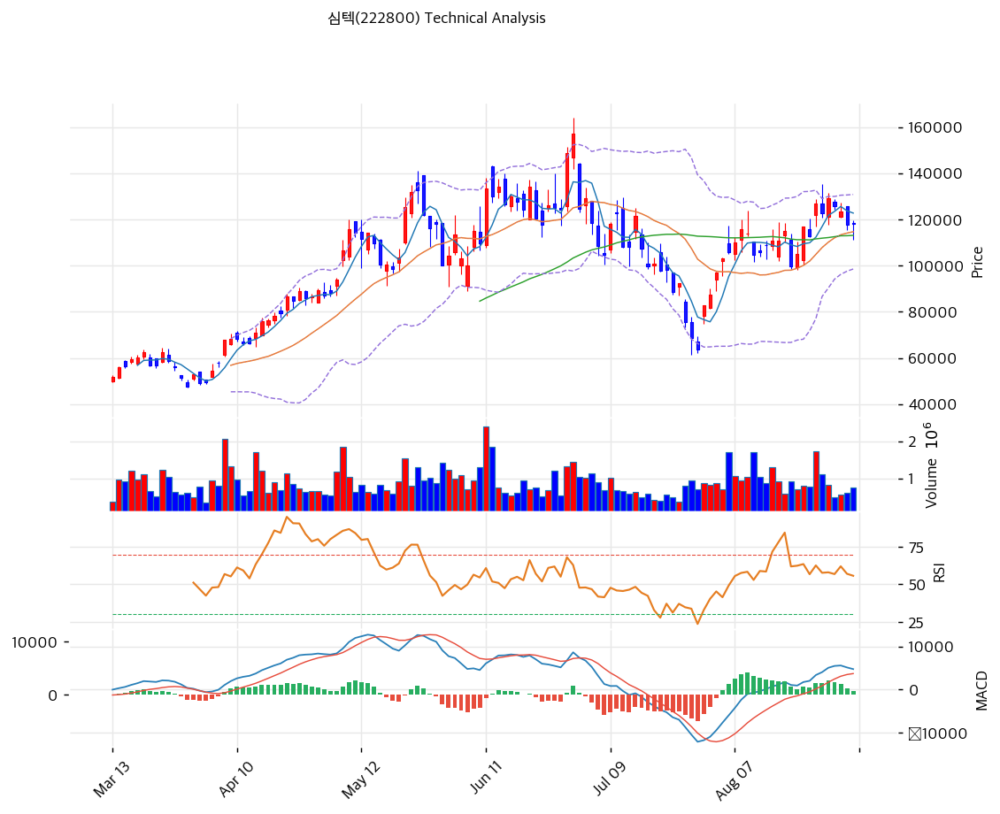

# 심텍(222800) 기술적 분석

2026-09-04 | T2 Technical Analysis

---

## 차트

---

## 1. 가격 현황

| 항목 | 값 |
|------|-----|
| 현재가 | 117,900원 (+0.34%) |
| 52주 고가 | 157,300원 |
| 52주 저가 | 24,250원 |
| 52주 범위 위치 | 70.4% |
| 거래량 | 20일 평균 대비 0.77x |

52주 저가 24,250원에서 고가 157,300원까지 6.5배가 오간 종목이다. 1년 범위로 보면 현재 위치는 70.4%지만, 최근 6개월 차트만 놓고 보면 6월 고점에서 58% 급락한 뒤 다시 80% 반등해 중간 지점에 서 있는 형태다.

---

## 2. 차트 패턴 분석

### 2.1 캔들스틱 패턴

| 패턴 | 위치 | 신뢰도 | 해석 |
|------|------|--------|------|
| 유성형(긴 윗꼬리) | 6월 하순, 157,300원 고점 | 강 | 매도 시그널. 장중 고점을 크게 벌린 뒤 되밀린 캔들로, 이후 7월 급락의 출발점이 됐다 |
| 장대 양봉 연속 | 8월 초, 65,000\~100,000원 구간 | 강 | 매수 시그널. 저점에서 대량 거래를 동반한 연속 상승으로 추세를 되돌렸다 |
| 소실체 도지형 | 최근 5거래일 | 중 | 중립. 상하 꼬리를 단 작은 실체가 이어지며 방향을 정하지 못하는 구간 |

### 2.2 가격 구조 패턴

- **V자 반등 후 박스권** (신뢰도: 강)
  7월 말 65,000원 부근에서 저점을 만들고 8월 첫 2주 만에 130,000원까지 되돌렸다. 반등 속도가 하락 속도만큼 빨랐다는 것은 매도 물량이 물량 부담이 아니라 밸류에이션 조정에서 나왔다는 뜻이다. 이후 3주째 110,000원과 132,000원 사이에서 횡보 중이며, 박스 폭은 약 20%다.

- **이중 천정 형성 시도** (신뢰도: 중)
  8월 중순과 8월 하순에 각각 130,000원 부근을 두 번 두드리고 밀렸다. 이 구간은 피보나치 0.618 되돌림 121,583원과 볼린저 상단 130,797원이 겹치는 자리다. 넥라인은 박스 하단인 110,000원대이며, 이탈 시 목표는 95,000원 부근이다. 다만 두 고점의 간격이 짧고 거래량이 줄어드는 형태라 아직 패턴이 확정되지는 않았다.

- **MA 수렴 지지대** (신뢰도: 강)
  MA20 114,665원과 MA60 113,085원이 1,580원 간격으로 붙어 있다. 두 선이 겹친 자리가 박스 하단과도 일치해 113,000원대가 이번 조정의 방어선 역할을 한다.

### 2.3 다이버전스

- **RSI 하락 다이버전스** (신뢰도: 강, 이미 실현)
  5월 중순 고점에서 RSI가 85 부근까지 올랐던 반면, 6월 하순 가격이 157,300원으로 신고가를 낼 때 RSI는 65 수준에 그쳤다. 가격은 올라갔는데 모멘텀은 따라오지 못한 전형적인 하락 다이버전스였고, 7월 급락으로 해소됐다.

- **현재 구간 다이버전스 부재** (신뢰도: 강)
  8월 중순 RSI 80에서 현재 53.2로 내려오는 동안 가격도 130,000원대에서 117,900원으로 함께 내려왔다. 지표와 가격이 같은 방향이므로 반전 신호로 읽을 근거는 없다. MACD 히스토그램도 8월 초 확대 이후 현재 +722까지 축소되며 가격 조정과 보조를 맞춘다.

### 2.4 패턴 종합 판단

중기 추세는 살아 있고 단기는 쉬어가는 국면이다. 8월 V자 반등으로 MA20·MA60·MA120·MA200을 모두 회복해 정배열이 복원됐고, 현재가는 MA5만 밑돌고 있다. 다만 130,000원 부근에서 두 번 저항을 확인했고 거래량이 20일 평균의 77%까지 줄어 상승 에너지가 빠진 상태다. 상충 신호를 정리하면, 이동평균 구조는 매수 우위인데 단기 모멘텀 지표(스토캐스틱 데드크로스, MACD 히스토그램 축소, 거래량 감소)는 조정 지속 쪽이다. 113,000원대 방어 여부가 다음 방향을 가른다.

---

## 3. 이동평균선: 정배열 (강세)

| MA | 값 | 현재가 괴리율 | 위치 |
|----|-----|--------------|------|
| MA5 | 122,740원 | -3.9% | 아래 |
| MA20 | 114,665원 | +2.8% | 위 |
| MA60 | 113,085원 | +4.3% | 위 |
| MA120 | 98,847원 | +19.3% | 위 |
| MA200 | 80,199원 | +47.0% | 위 |

**해석**: MA20 이하 모든 선의 위에 있고 배열도 MA20 > MA60 > MA120 > MA200 순으로 정렬돼 있다. MA5만 현재가 위에 있는데, 이는 최근 5일간 하락으로 단기선이 아직 내려오지 못한 상태다. MA200 대비 괴리가 +47.0%로 크지만 이는 1년 전 24,250원에서 시작한 상승 폭 때문이며, 단기 과열 지표로 읽기에는 부적절하다. 실질 판단은 MA20 괴리 +2.8%로, 과열도 침체도 아닌 중립 구간이다.

---

## 4. 보조 지표

### RSI(14): 53.2 (중립)

8월 중순 80 부근까지 올랐다가 3주에 걸쳐 53.2까지 내려왔다. 과매수 해소는 끝났고 아직 과매도권과는 거리가 있다. 50선을 지키고 있다는 점에서 추세 자체는 훼손되지 않았다.

### MACD(12,26,9)

| 항목 | 값 |
|------|-----|
| MACD | 4,745 |
| Signal | 4,024 |
| Histogram | +722 |
| 크로스 상태 | 매수 구간 (수축 중) |

**해석**: 8월 초 골든크로스 이후 매수 구간을 유지하고 있으나 히스토그램이 줄어들고 있다. MACD선과 시그널선 간격이 721로 좁혀진 상태라, 현 속도가 이어지면 2주 안에 데드크로스 가능성이 있다.

### 볼린저밴드(20, 2σ)

| 항목 | 값 |
|------|-----|
| 상단 | 130,797원 |
| 중단 (MA20) | 114,665원 |
| 하단 | 98,533원 |
| 밴드 폭 | 28.1% |
| 현재 위치 | 중간 |

**해석**: 밴드 폭 28.1%는 여전히 넓다. 7월 급락과 8월 급반등으로 변동성이 확대된 뒤 아직 수축이 끝나지 않았다. 현재가는 중단 114,665원보다 2.8% 위, 상단보다 9.9% 아래에 있어 밴드 중앙부에 위치한다. 밴드가 좁혀지는 국면에 들어가면 방향성 돌파가 나올 자리다.

### 스토캐스틱(14, 3, 3)

| 항목 | 값 |
|------|-----|
| Slow %K | 58.0 |
| Slow %D | 66.1 |
| 크로스 상태 | 데드크로스 |
| 판단 | 중립 |

%K가 %D를 아래로 뚫고 내려온 상태다. 두 값 모두 중립 구간(20\~80)에 있어 강한 반전 신호는 아니지만, 단기 방향은 아래를 가리킨다.

---

## 5. 지지/저항: 추세선 · 피보나치 · PRZ 통합

### 5.1 피보나치 되돌림/확장

| 구분 | 비율 | 가격 | 현재가 대비 |
|------|------|------|-----------|
| Swing High | — | 157,300원 | +33.4% |
| 되돌림 | 0.236 | 85,866원 | -27.2% |
| 되돌림 | 0.382 | 99,517원 | -15.6% |
| 되돌림 | 0.5 | 110,550원 | -6.2% |
| 되돌림 | 0.618 | 121,583원 | +3.1% |
| 되돌림 | 0.786 | 137,291원 | +16.4% |
| Swing Low | — | 63,800원 | -45.9% |
| 확장 | 1.272 | 38,368원 | -67.5% |
| 확장 | 1.382 | 28,083원 | -76.2% |
| 확장 | 1.618 | 6,017원 | -94.9% |
| 확장 | 2.0 | 데이터 없음 | 산출 불가 |

※ 피보나치 기준: 하락 추세 (Swing High 157,300원 → Swing Low 63,800원)
※ 하락 추세 기준이므로 확장 구간은 추가 하락 목표를 가리키며, 현재 국면에서는 참고 가치가 낮다. 실질 의미는 되돌림 구간에 있다.

현재가 117,900원은 0.5 되돌림 110,550원과 0.618 되돌림 121,583원 사이에 있다. 8월 반등이 0.618을 한 차례 건드렸다가 밀린 형태이므로, 121,583원을 종가로 넘기면 0.786 되돌림 137,291원이 다음 목표가 된다.

### 5.2 추세선

| 추세선 | 방향 | 현재 교차가 | 포인트 수 | 해석 |
|--------|------|-----------|---------|------|
| 지지선 | 상승 | 76,135원 | 6개 | 6개월 저점을 잇는 장기 상승 추세선. 현재가보다 35.4% 아래라 당장 유효한 지지로 기능하지 않는다 |
| 저항선 | 상승 | 170,870원 | 6개 | 고점을 잇는 상승 저항선. 52주 고가 157,300원보다 위에 있어 실질 저항은 아니다 |

두 추세선의 간격이 94,735원으로 지나치게 벌어져 있어 단기 매매 기준으로 쓰기 어렵다. 실전 지지·저항은 MA와 피봇 조합에서 찾는 편이 낫다.

### 5.3 PRZ (Potential Reversal Zone)

| 방향 | 가격 범위 | 신뢰도 | 근거 |
|------|---------|--------|------|
| 저항 | 121,167\~124,433원 | 강 | 피봇 R1, 피봇 R2, 피보나치 0.618 되돌림, MA5 |
| 지지 | 112,967\~114,665원 | 중 | 피봇 S1, MA20, MA60 |
| 지지 | 98,847\~99,517원 | 약 | MA120, 피보나치 0.382 되돌림 |

※ PRZ = 추세선 · 피보나치 · 피봇 · MA 등 복수 지표가 겹치는 가격 구간. 겹치는 소스가 많을수록 반전 확률 상승.

저항 PRZ가 4개 소스로 겹친 강한 구간이다. 현재가에서 2.8\~5.5% 위에 있어 단기 상단이 촘촘하게 막혀 있다.

### 5.4 종합 지지/저항 테이블

| 구분 | 가격 | 근거 |
|------|------|------|
| 저항 | 157,300원 | 52주 고가 |
| 저항 | 137,291원 | 피보나치 0.786 되돌림 |
| 저항 | 130,797원 | 볼린저 상단, 8월 이중 고점 |
| 저항 | 122,481원 | PRZ (강): 피봇 R1·R2, 피보나치 0.618, MA5 |
| **현재가** | **117,900원** | — |
| 지지 | 113,572원 | PRZ (중): 피봇 S1, MA20, MA60 |
| 지지 | 110,550원 | 피보나치 0.5 되돌림 |
| 지지 | 108,033원 | 피봇 S2 |
| 지지 | 99,182원 | PRZ (약): MA120, 피보나치 0.382 되돌림 |

---

## 6. 시그널 종합

| 지표 | 내용 | 시그널 |
|------|------|--------|
| **차트 패턴** | V자 반등 후 박스권, 이중 천정 시도, MA 수렴 지지대 형성 | ⚪ |
| 이동평균선 | 정배열, MA20 +2.8% | 🟢 |
| RSI | 53.2, 중립 | ⚪ |
| MACD | 매수 구간이나 히스토그램 축소 | ⚪ |
| 볼린저밴드 | 중간, 밴드 폭 28.1% | ⚪ |
| 스토캐스틱 | 데드크로스, K=58.0 | ⚪ |
| 거래량 | 0.77x, 약함 | ⚪ |

**종합 판단**: 🟢 매수 1개 / 🔴 매도 0개 / ⚪ 중립 5개 → **매수우위**

매도 신호가 하나도 없다는 점이 이 차트의 특징이다. 그런데 매수 신호도 이동평균 하나뿐이고 나머지 다섯은 모두 중립이다. 방향이 정해지지 않은 관망 국면이며, 이동평균 구조가 지지대 역할을 하는 동안 시간이 지나면서 변동성이 수축하는 그림이다. 중기적으로는 113,000원대 방어가 확인되면 122,000원 저항 재도전, 이탈하면 99,000원대 PRZ까지 열리는 양방향 구도다. 단기 방향은 거래량이 결정한다. 현재 20일 평균의 77%로는 어느 쪽 돌파도 신뢰하기 어렵다.

---

## 7. 전략 제안

### 보유 중인 경우
- **홀드**
- 익절 라인: 160,446원 (52주 고가 157,300원 상향 돌파 후 상승 확장 목표)
- 손절 라인: 108,033원 (피봇 S2. MA20·MA60 수렴 지지대 113,000원대 이탈이 확인되는 자리)
- 리스크/리워드: 상방 42,546원 대 하방 9,867원, 약 4.3 대 1

### 진입 대기인 경우
- **진입가능**
- 1차 진입가: 112,967원 (피봇 S1. MA60 113,085원과 인접한 PRZ 하단)
- 2차 진입가: 114,665원 (MA20. 눌림 후 반등 확인 시)
- 진입 조건: 113,000원대에서 거래량이 20일 평균 1.2배 이상 실린 반등 캔들이 나올 때 1차 진입. 122,481원 PRZ를 종가로 돌파하면 추격 진입도 유효하다. 반대로 108,000원을 종가 이탈하면 이중 천정 완성으로 보고 진입을 보류한다.
