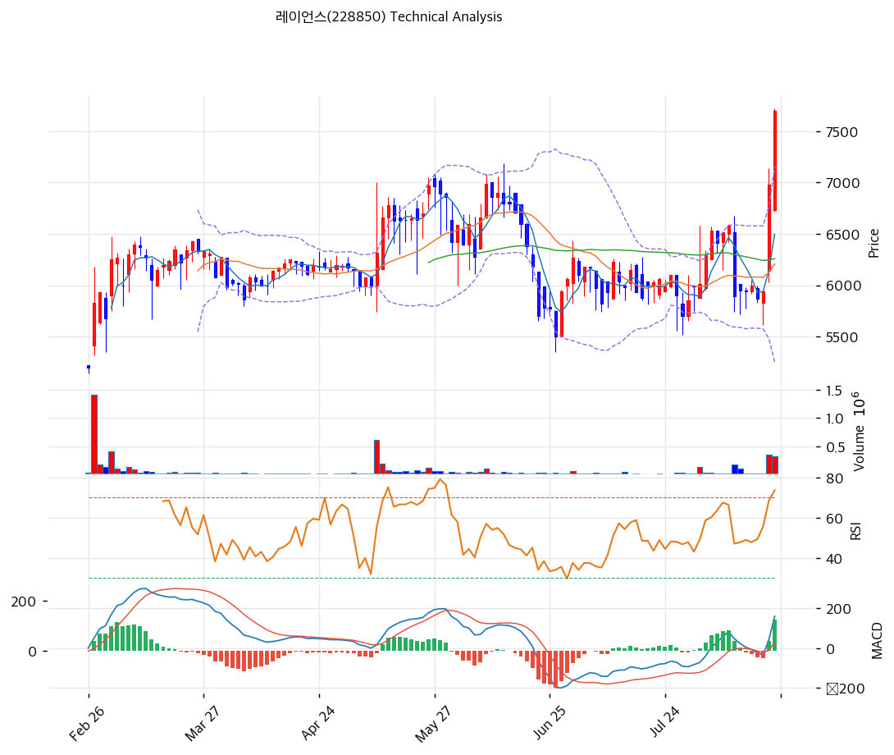

# 레이언스(228850) 기술적 분석

## 차트

## 가격 현황

| 항목 | 값 |
|---|---|
| 현재가 | **7,700원** (**+10.32%**) |
| 당일 시가 / 고가 / 저가 | 6,730 / **7,720** / 6,720원 |
| 52주 고 / 저 | **7,720원** (2026-08-21) / **4,835원** (2026-01-14) |
| 52주 위치 | **99.3%** |
| 고점 대비 | -0.3% |
| **2거래일 상승률** | **+29.6%** (8/19 5,940원 → 8/21 7,700원) |
| 1개월 / 3개월 / 6개월 | +27.7% / +14.9% / **+47.8%** |
| 1년 / 2년 | +27.7% / +1.4% |
| RSI(14) | **72.6** |
| MACD | 160 / 35 / **+125** (전 +39, 급확대) |
| Stochastic | K=73.1 D=52.5 |
| 볼린저(20) | 상단 7,159 / 중단 6,207 / 하단 5,255, 폭 30.7% |
| 거래량 | **317,725주** (20일 평균 대비 **4.90배**) |
| 회전율 | 2.02% (유통주식 15,736,440주 기준) |

⚠️ **종가 7,700원이 볼린저 상단 7,159원을 7.6% 넘어섰다.** 밴드 이탈 상태다.

## 이동평균선

| MA | 가격(원) | 갭 | 위치 |
|---|--:|--:|---|
| MA5 | 6,498 | +18.5% | 위 |
| MA20 | 6,207 | **+24.1%** | 위 |
| MA60 | 6,258 | +23.0% | 위 |
| MA120 | 6,240 | +23.4% | 위 |

→ **MA20·MA60·MA120이 6,207\~6,258원 좁은 구간에 붙어 있다.** 장기간 횡보하다가 이틀 만에 위로 뚫고 나온 형태다.

**이런 배열은 박스권 돌파의 전형**이다. 세 이동평균선이 수렴한 상태에서 대량 거래를 동반해 이탈했다.

## 상승 경로

| 일자 | 종가 | 등락 | 거래량 | 비고 |
|---|--:|--:|--:|---|
| 2026-01-14 | 4,835원(장중) | | | **52주 최저** |
| 2026-08-10 | 6,580원 | | 11,206 | |
| **2026-08-11** | **5,890원** | **-10.5%** | **168,891** | **Q2 잠정실적 공시일** |
| 2026-08-12 | 5,950원 | +1.0% | 94,223 | |
| **2026-08-13** | 5,940원 | -0.2% | 19,695 | **IR 개최 공시(LS증권)** |
| 2026-08-14 | 6,000원 | +1.0% | 12,379 | 반기보고서 제출 |
| 2026-08-18 | 5,870원 | -2.2% | 17,400 | |
| 2026-08-19 | 5,940원 | +1.2% | 13,063 | |
| **2026-08-20** | **6,980원** | **+17.5%** | **352,834** | **IR 개최 공시(DB투자증권, 여의도 1:1 NDR)** |
| **2026-08-21** | **7,700원** | **+10.32%** | **317,725** | **장중 7,720원 52주 신고가** |

**순서가 특이하다.**

8월 11일 Q2 잠정실적(매출 +25.7% YoY, 영업이익 흑자전환)이 공시된 날 주가는 **-10.5%** 떨어졌다. 전분기 대비로는 매출 -0.8%, 영업이익 -29.9%였기 때문으로 보인다.

그 뒤 8월 13일과 20일 두 차례 국내 기관 대상 NDR(1:1 대면미팅)이 공시됐고, **8월 20일 여의도 NDR 당일 +17.5%, 다음 날 +10.32%** 올랐다.

**공시된 숫자가 아니라 기관 미팅 이후 주가가 움직였다.** 거래량도 8월 20일 352,834주, 21일 317,725주로 직전 평균의 5\~20배였다.

## 수급

| 항목 | 수치 |
|---|--:|
| 8/21 거래량 | 317,725주 |
| 20일 평균 거래량 | 64,861주 |
| 비율 | **4.90배** |
| 유통주식수 | 15,736,440주 |
| **실질 유통물량** | **약 4,948,617주 (29.83%)** |
| 회전율 (실질 유통 기준) | **6.42%** |

최대주주 등 65.01%(10,787,823주)와 자기주식 5.15%(854,574주)를 제외하면 실질 유통물량은 약 495만주다. 8월 21일 거래량 317,725주는 그 **6.42%**에 해당한다.

**물량이 얇아 소량의 기관 매수로도 가격이 크게 움직이는 구조**다.

## 시그널 종합

| 구분 | 카운트 |
|---|--:|
| 매수 | 3 |
| 매도 | 0 |
| 과열 경고 | 3 |
| **결론** | **박스권 돌파, 단기 과열** |

- 🟢 **이동평균** 4개선 완전 정배열. MA20·60·120 수렴 구간을 대량 거래로 돌파
- 🟢 **MACD** 160 > 시그널 35. 히스토그램이 +39에서 **+125**로 3배 확대
- 🟢 **거래량** 20일 평균의 4.90배. 돌파에 물량이 실렸다
- 🔴 **볼린저 상단 이탈** 종가 7,700이 상단 7,159를 7.6% 초과
- 🔴 **RSI 72.6** 과매수 진입
- 🔴 **52주 위치 99.3%** 신고가

**매수 신호와 과열 신호가 동시에 최대치다.** 돌파 직후의 전형적 배치이며, 이런 구간에서는 추세 연장과 되돌림이 모두 가능하다.

## 지지·저항

| 구분 | 가격(원) | 근거 |
|---|--:|---|
| 저항 | 9,070 | 당일 상한가 |
| 저항 | 8,380 | 피봇 R2 |
| 저항 | 8,040 | 피봇 R1 |
| **강 저항** | **7,720** | **52주 최고 (당일 장중)** |
| **현재가** | **7,700** | |
| 지지 | 7,159 | 볼린저 상단 (이탈 후 지지 전환 여부) |
| 지지 | 7,040 | 피보나치 0.236 되돌림 / 피봇 S1 |
| 지지 | 6,980 | 8/20 종가 |
| 지지 | 6,618 | 피보나치 0.382 되돌림 |
| 지지 | 6,498 | MA5 |
| 지지 | 6,380 | 피봇 S2 |
| **강 지지** | **6,207\~6,278** | **MA20·MA60·MA120 밀집 + 피보 0.5 되돌림** |
| 지지 | 5,937 | 피보나치 0.618 되돌림 |
| 지지 | 5,940 | 8/19 종가(돌파 직전) |
| 지지 | 5,255 | 볼린저 하단 |
| 최종 지지 | 4,835 | 52주 최저 (2026-01-14) |

※ 피보나치는 상승 추세 기준(저점 4,835원 → 고점 7,720원)

⚠️ **6,207\~6,278원이 이 차트에서 가장 두꺼운 지지대다.** MA20(6,207), MA60(6,258), MA120(6,240), 피보나치 0.5 되돌림(6,278)이 70원 안에 겹친다. 돌파 이전 오랜 균형가격이기도 하다.

## 전략

| 시나리오 | 액션 |
|---|---|
| 보유자 | **홀드** (TP 1차 8,040원 피봇 R1 / SL 6,207원 MA20) |
| 신규 진입 | **분할.** 지금 절반, 조정 시 절반 |
| 조정 시 1차 | 6,980\~7,159원 (8/20 종가·볼린저 상단, -7\~9%) |
| 조정 시 2차 | **6,207\~6,618원** (MA20·MA60·MA120·피보 0.382, -14\~19%) |
| 추세 확장 확인 | **7,720원 거래량 동반 돌파 후 안착** |
| 손절 기준 | 6,207원(MA20·MA60·MA120 밀집) 이탈 |
| 이벤트 | **11월 중순 3분기 보고서** |

## 핵심 판단

차트는 **오랜 박스권을 실적으로 뚫은 형태**를 보여준다.

MA20·MA60·MA120이 6,207\~6,258원에 수렴해 있었다는 것은 6개월 가까이 그 자리에서 균형을 이뤘다는 뜻이다. 8월 20\~21일 이틀간 거래량 35만주·32만주(20일 평균의 5배)를 동반해 위로 이탈했다.

이번 시리즈 세 종목을 나란히 두면 성격 차이가 뚜렷하다.

| 항목 | **레이언스** | 금호전기 | 이퓨쳐 |
|---|---|---|---|
| 최근 상승 | **2거래일 +29.6%** | 12거래일 +128.6% | 3개월 +38.8% |
| 20일선 이격 | **+24.1%** | +60.1% | +8.0% |
| 60일선 이격 | **+23.0%** | +105.2% | +16.3% |
| 상한가 | 0회 | **7회** | 0회 |
| 거래량 배수 | 4.90x | 3.62x | 0.39x |
| **상승 직전 실적** | **1H 흑자전환, 매출 +30.2%** | 5년 연속 적자 | 영업 적자전환 |
| 상승 계기 | **기관 NDR (8/13, 8/20)** | 호남 반도체 테마 | 자사주 신탁 |
| PBR | **0.51배** | 3.88배 | 0.90배 |

**레이언스만 실적이 주가를 앞섰다.** 1H2026 영업이익이 -20.4억에서 +61.0억으로 돌아선 뒤, 두 차례 기관 NDR을 거쳐 주가가 움직였다.

기술적으로 읽을 수 있는 것은 세 가지다.

**① 돌파의 질이 좋다.** 이동평균선 수렴 구간을 대량 거래로 뚫었고 MACD 히스토그램이 3배 확대됐다. 물량 없는 급등이 아니다.

**② 단기 과열은 분명하다.** 볼린저 상단을 7.6% 넘었고 RSI 72.6, 52주 위치 99.3%다. 이틀 만에 29.6% 올랐다.

**③ 되돌림 목표가 명확하다.** 6,207\~6,278원(MA20·MA60·MA120·피보 0.5)이 두껍게 겹친다. 현재가 대비 -19% 지점이며, 이 자리는 PBR 약 0.43배에 해당한다.

**보유자는 홀드, 신규 진입은 분할이 맞다.** 지금 절반을 담고 6,207\~6,618원 구간에서 나머지를 채우는 것이 손익비에 맞는다. 7,720원을 거래량 동반해 넘으면 추세가 연장되고, 6,207원이 깨지면 돌파 실패로 봐야 한다.
