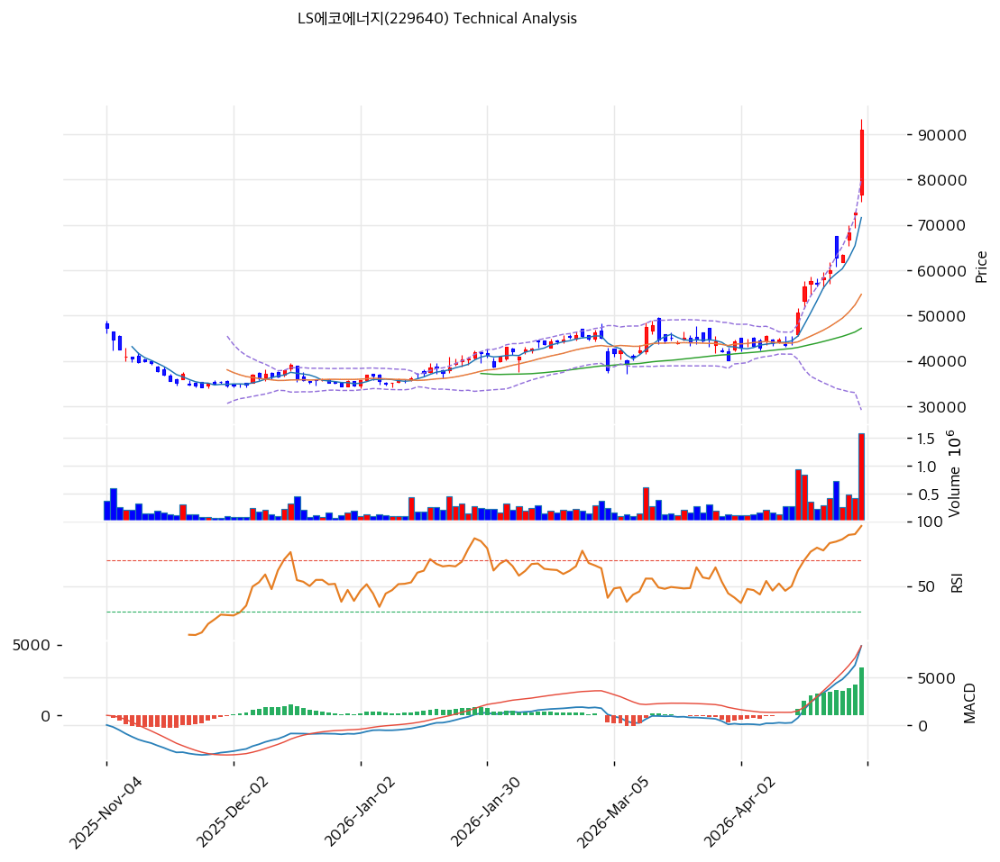

# LS에코에너지(229640) 기술적 분석

2026-04-29 | T2 Technical Analysis

---

## 차트

---

## 1. 가격 현황

| 항목 | 값 |
|------|-----|
| 현재가 | 90,900원 (+25.03%) |
| 52주 고가 | 90,900원 (pykrx 기준 — 오늘이 신고가) |
| 52주 저가 | 30,600원 (pykrx 기준) |
| 52주 범위 위치 | 100.0% (신고가 돌파) |
| 거래량 | 20일 평균 대비 4.76x |

---

## 2. 차트 패턴 분석

### 2.1 캔들스틱 패턴

| 패턴 | 위치 | 신뢰도 | 해석 |
|------|------|--------|------|
| 대형 양봉 (갭 상승) | 2026-04-29 (오늘) | 강 | 강력한 매수세 유입. 상한가(94,500원) 근접까지 단숨에 급등. 단기 과열 시그널 |
| 연속 양봉 | 최근 5일 | 강 | MA5(71,600원)→현재가(90,900원) 단기 급등. 추세 강도 강하나 과매수 진입 |

※ 오늘 +25%의 급등은 단일 캔들로서 전형적인 "모멘텀 갭업" 패턴. 이후 조정 시 갭 구간(72,000~82,000원 대)이 지지선으로 기능할 가능성 높음.

### 2.2 가격 구조 패턴

- **장기 상승 추세 채널** (신뢰도: 강)
  2024년 저점(약 30,600원)→2025년 상승→2026년 신고가(90,900원)로 이어지는 장기 상승 추세가 명확하다. 추세선 지지는 39,135원(하단)~50,412원(상단). 현재가는 채널 상단을 크게 이탈한 과열 구간에 위치.

- **박스권 돌파** (신뢰도: 강)
  52주 고가(KIS 93,300원) 인근에서 저항대가 형성돼 있었으나, 오늘 급등으로 사실상 신고가 경신. 박스권 상단 돌파 후 되돌림이 전형적 패턴.

### 2.3 다이버전스

- **RSI 과매수 — 상승 다이버전스 없음** (신뢰도: 강)
  RSI 90.5로 극단적 과매수. 가격 상승과 RSI가 함께 급등하므로 다이버전스가 아닌 모멘텀 일치 상태. 단, RSI 90 이상은 역사적으로 단기 고점 근방에서 빈번히 관찰됨.

- **MACD 히스토그램 확대** (신뢰도: 중)
  MACD 8,277 / Signal 4,905 / Histogram +3,371 (확대 중). 매수 모멘텀이 강하나, 히스토그램이 이미 큰 폭으로 확대된 상태. 향후 수축 전환 시 조정 시그널.

### 2.4 패턴 종합 판단

오늘 +25% 갭 상승으로 모든 기술적 과열 지표가 극단에 위치해 있다. 장기 상승 추세 자체는 유효하나, RSI 90.5, 스토캐스틱 96.0, MA20 괴리율 +66.3%는 단기 급락 리스크가 매우 높음을 시사한다. 상충 시그널: 장기 추세(매수) vs. 단기 과열(매도). 신규 진입은 위험하며, 보유자는 익절 구간 진입으로 판단.

---

## 3. 이동평균선 — 정배열 (강세)

| MA | 값 | 현재가 괴리율 | 위치 |
|----|-----|--------------|------|
| MA5 | 71,600원 | +27.0% | 위 |
| MA20 | 54,670원 | +66.3% | 위 |
| MA60 | 47,190원 | +92.6% | 위 |
| MA120 | 42,205원 | +115.4% | 위 |
| MA200 | 41,106원 | +121.1% | 위 |

**해석**: MA5~MA200 완전 정배열. 중장기 추세는 강한 상승 구도. 그러나 MA20 괴리율 +66.3%는 극단적 과열 수준으로 평균회귀(mean reversion) 압력이 매우 강하다. 통상 MA20 괴리 ±20% 이내가 건전한 범위. MA20(54,670원)으로 회귀 시 현재가 대비 △40% 조정.

---

## 4. 보조 지표

### RSI(14) — 90.5 (🔴과매수)

RSI 90.5는 통계적으로 상위 1% 이내의 극단적 과매수 영역. 단기 모멘텀이 강하나, 역사적으로 이 수준 이후 며칠~수주 내 조정 패턴이 빈번하다. 강한 추세에서도 RSI 70 이하로 식히는 과정이 필요.

### MACD(12,26,9)

| 항목 | 값 |
|------|-----|
| MACD | 8,277 |
| Signal | 4,905 |
| Histogram | +3,371 |
| 크로스 상태 | 매수 구간 (확대 중) |

**해석**: MACD 매수 크로스 이후 히스토그램이 지속 확대 중. 모멘텀은 강하나 히스토그램 +3,371은 이미 고점 구간. 향후 히스토그램 수축 전환 시 중기 조정 신호로 해석 가능.

### 볼린저밴드(20, 2σ)

| 항목 | 값 |
|------|-----|
| 상단 | 80,181원 |
| 중단 (MA20) | 54,670원 |
| 하단 | 29,159원 |
| 밴드 폭 | 93.3% |
| 현재 위치 | 상단 근접 (상단도 초과) |

**해석**: 현재가(90,900원)가 볼린저밴드 상단(80,181원)을 이탈. 밴드 폭 93.3%로 이미 매우 넓게 확장된 상태. 상단 이탈 후 중단(MA20, 54,670원)으로 되돌아오는 패턴이 빈번하며, 단기 고점 경고 신호.

### 스토캐스틱(14, 3, 3)

| 항목 | 값 |
|------|-----|
| Slow %K | 96.0 |
| Slow %D | 91.3 |
| 크로스 상태 | 골든크로스 |
| 판단 | 과매수 |

---

## 5. 지지/저항 — 추세선 · 피보나치 · PRZ 통합

### 5.1 피보나치 되돌림/확장

| 구분 | 비율 | 가격 | 현재가 대비 |
|------|------|------|-----------|
| Swing High | — | 90,900원 | — |
| 되돌림 | 0.236 | 78,432원 | △13.7% |
| 되돌림 | 0.382 | 69,234원 | △23.8% |
| 되돌림 | 0.5 | 61,800원 | △32.0% |
| 되돌림 | 0.618 | 54,366원 | △40.2% |
| 되돌림 | 0.786 | 43,782원 | △51.8% |
| Swing Low | — | 30,600원 | — |
| 확장 | 1.272 | 110,436원 | +21.5% |
| 확장 | 1.382 | 117,366원 | +29.1% |
| 확장 | 1.618 | — | — |
| 확장 | 2.0 | — | — |

※ 피보나치 기준: 상승 추세 (Swing Low 30,600원 → Swing High 90,900원)

### 5.2 추세선

| 추세선 | 방향 | 현재 교차가 | 포인트 수 | 해석 |
|--------|------|-----------|---------|------|
| 지지선 | 상승 | 39,135원 | 3개 | 장기 추세 하단 지지선. 현재가 대비 △57%. 장기 지지선 |
| 저항선 | 상승 | 50,412원 | 3개 | 중기 추세 상단. 이미 돌파. 이후 지지 역할 전환 |

### 5.3 PRZ (Potential Reversal Zone)

| 방향 | 가격 범위 | 신뢰도 | 근거 |
|------|---------|--------|------|
| 지지 | 78,432~79,500원 | 약 | 피보나치 0.236 되돌림 + 피봇 S1 |
| 지지 | 68,100~69,234원 | 약 | 피봇 S2 + 피보나치 0.382 되돌림 |

### 5.4 종합 지지/저항 테이블

| 구분 | 가격 | 근거 |
|------|------|------|
| 저항 | 94,500원 | 상한가 (일간 상한) |
| 저항 | 97,800원 | 피봇 R1 |
| **현재가** | **90,900원** | — |
| 지지 | 79,500원 | 피봇 S1 |
| 지지 | 78,432원 | 피보나치 0.236 되돌림 |
| 지지 | 68,100원 | 피봇 S2 |
| 지지 | 54,670원 | MA20 |
| 지지 | 47,190원 | MA60 |

---

## 6. 시그널 종합

| 지표 | 내용 | 시그널 |
|------|------|--------|
| **차트 패턴** | 장기 상승 추세 + 오늘 신고가 갭 상승. 과열 구간 | ⚪ |
| 이동평균선 | 완전 정배열. MA20 괴리 +66.3% 극단 과열 | 🔴 |
| RSI | 90.5 — 🔴과매수 극단 | 🔴 |
| MACD | 매수 크로스, 히스토그램 확대 중 | 🟢 |
| 볼린저밴드 | 상단 이탈. 밴드 폭 93.3% 확장 | 🔴 |
| 스토캐스틱 | K=96.0, D=91.3 — 과매수 극단 | 🔴 |
| 거래량 | 4.76x — 강력한 거래량 동반 | 🟢 |

**종합 판단**: 🟢 매수 2개 / 🔴 매도 4개 / ⚪ 중립 1개 → **매도우위 (강한 과열 경고)**

장기 추세는 상승이나 단기 모든 과열 지표가 극단에 있다. RSI 90.5, MA20 괴리 +66.3%, 스토캐스틱 96.0은 역사적으로 단기 고점 신호다. 오늘의 +25% 급등은 강한 모멘텀이지만, 갭 구간(72,000~82,000원)으로 되돌림 후 지지 확인 과정이 필요하다. 단기적으로는 매도 우위이나 중기 추세는 유효.

---

## 7. 전략 제안

### 보유 중인 경우
- **익절 (비중 축소 검토)**
- 익절 라인: 92,718원 (피봇 R1 근방, 기술적 목표가)
- 손절 라인: 68,100원 (피봇 S2 이탈 시)
- 리스크/리워드: 1:1 미만 — 비중 축소 후 재진입 전략 유효

### 진입 대기인 경우
- **관망**
- 1차 진입가: 79,500원 (피봇 S1, 피보나치 0.236 수렴 구간)
- 2차 진입가: 54,670원 (MA20, 피보나치 0.618 수렴)
- 진입 조건: 거래량 감소 동반 조정 + RSI 60 이하 회복 확인 후 재진입
