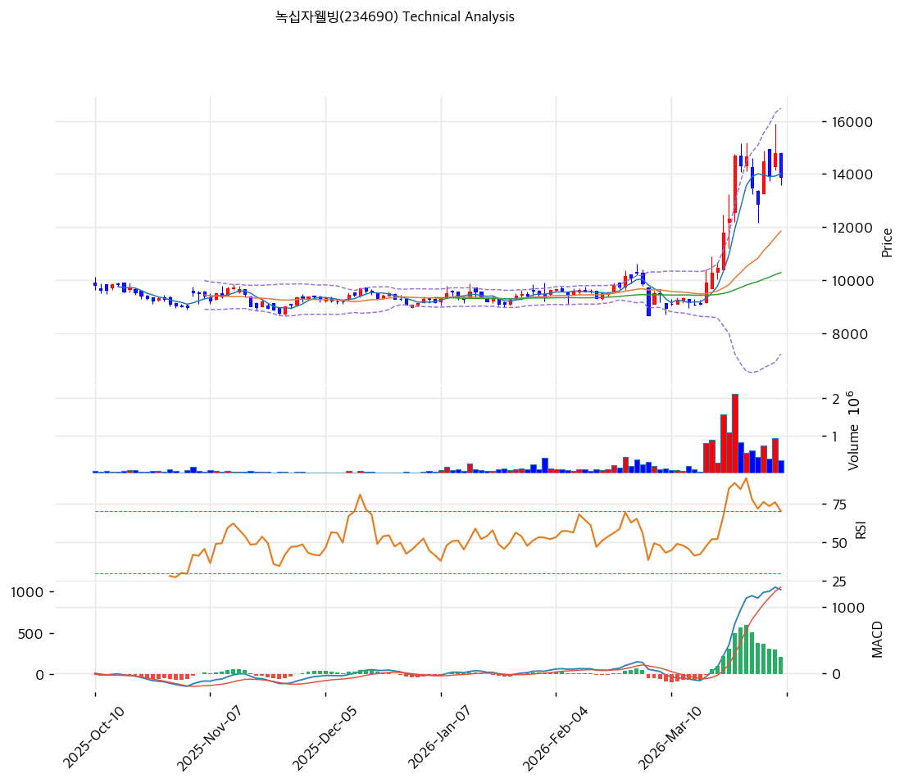

# 녹십자웰빙(234690) 기술적 분석

2026-04-06 | T2 Technical Analysis

---

## 차트

---

## 1. 가격 현황

| 항목 | 값 |
|------|-----|
| 현재가 | 13,890원 (-6.15%) |
| 52주 고가 | 14,800원 |
| 52주 저가 | 7,250원 |
| 52주 범위 위치 | 87.9% |
| 거래량 | 20일 평균 대비 0.58x |

---

## 2. 차트 패턴 분석

### 2.1 캔들스틱 패턴

| 패턴 | 위치 | 신뢰도 | 해석 |
|------|------|--------|------|
| 상승 후 조정 음봉 | 최근 1~2거래일 | 중 | 단기 급등 이후 매물 소화 구간 |
| 5일선 이탈 | 최근 | 중 | 단기 탄력은 둔화됐지만 중기 추세는 유지 |

### 2.2 가격 구조 패턴

- **중기 상승 추세 유지** (신뢰도: 강)
  MA20·MA60·MA120이 모두 우상향하고 있어 구조적 상승 추세는 살아 있습니다.

- **고점 부근 조정** (신뢰도: 중)
  52주 고점 부근에서 저항을 확인하는 과정입니다. 급락 전환보다는 눌림 소화에 가깝습니다.

### 2.3 다이버전스

- **RSI 중립** (신뢰도: 중)
  RSI 61.6으로 과열은 아닙니다. 추세 재개 여력이 남아 있습니다.

- **스토캐스틱 데드크로스** (신뢰도: 약)
  단기 속도는 둔화됐음을 의미합니다. 단기 매매자는 조정 폭을 주의해야 합니다.

### 2.4 패턴 종합 판단

녹십자웰빙은 **상승 추세 속 눌림목** 구간입니다. 공격적 돌파 매수 자리보다는 조정 후 확인 매수가 더 적절합니다.

---

## 3. 이동평균선 — 정배열 (강세)

| MA | 값 | 현재가 괴리율 | 위치 |
|----|-----|--------------|------|
| MA5 | 14,002원 | -0.8% | 아래 |
| MA20 | 11,845원 | +17.3% | 위 |
| MA60 | 10,279원 | +35.1% | 위 |
| MA120 | 9,808원 | +41.6% | 위 |
| MA200 | 9,717원 | +42.9% | 위 |

**해석**: 단기 5일선만 이탈했고, 나머지 중장기 이평선은 모두 상방입니다. 추세 훼손보다는 단기 조정으로 해석됩니다.

---

## 4. 보조 지표

### RSI(14) — 61.6 (중립)

과열권은 아닙니다. 추세 종목으로서 아직 한 번 더 움직일 여지가 있습니다.

### MACD(12,26,9)

| 항목 | 값 |
|------|-----|
| MACD | 1,256.0 |
| Signal | 1,050.0 |
| Histogram | +207.0 |
| 크로스 상태 | 매수 구간 |

**해석**: MACD는 여전히 매수 우위를 유지합니다. 다만 모멘텀 가속은 둔화되는 모습입니다.

### 볼린저밴드(20, 2σ)

| 항목 | 값 |
|------|-----|
| 상단 | 16,479원 |
| 중단 (MA20) | 11,845원 |
| 하단 | 7,211원 |
| 밴드 폭 | 78.2% |
| 현재 위치 | 중간 |

**해석**: 상단 과열은 아니며, 중간 영역에서 눌림을 소화 중입니다.

### 스토캐스틱(14, 3, 3)

| 항목 | 값 |
|------|-----|
| Slow %K | 78.1 |
| Slow %D | 79.8 |
| 크로스 상태 | 데드크로스 |
| 판단 | 중립 |

---

## 5. 지지/저항

| 구분 | 가격 | 근거 |
|------|------|------|
| 저항 | 14,603원 | 피봇 R1 |
| 저항 | 14,800원 | 52주 고가 |
| **현재가** | **13,890원** | — |
| 지지 | 13,383원 | 피봇 S1 |
| 지지 | 12,877원 | 피봇 S2 |
| 지지 | 11,845원 | MA20 |

---

## 6. 시그널 종합

| 지표 | 내용 | 시그널 |
|------|------|--------|
| **차트 패턴** | 상승 추세 내 조정 | ⚪ |
| 이동평균선 | 정배열, MA20 +17.3% | 🟢 |
| RSI | 61.6 — 중립 | ⚪ |
| MACD | 매수구간 유지 | ⚪ |
| 볼린저밴드 | 중간 영역 | ⚪ |
| 스토캐스틱 | 데드크로스, 단기 둔화 | ⚪ |
| 거래량 | 0.58x — 약함 | ⚪ |

**종합 판단**: 🟢 매수 1개 / 🔴 매도 0개 / ⚪ 중립 6개 → **매수우위**

중기 추세는 살아 있지만, 지금은 강한 추격보다는 눌림을 기다리는 쪽이 유리합니다.

---

## 7. 전략 제안

### 보유 중인 경우
- **홀드**
- 익절 라인: 15,096원
- 손절 라인: 12,877원
- 리스크/리워드: 무난

### 진입 대기인 경우
- **관망**
- 1차 진입가: 13,383원 (피봇 S1)
- 2차 진입가: 11,845원 (MA20)
- 진입 조건: 조정 후 5일선 회복 또는 지지선 반등 확인
