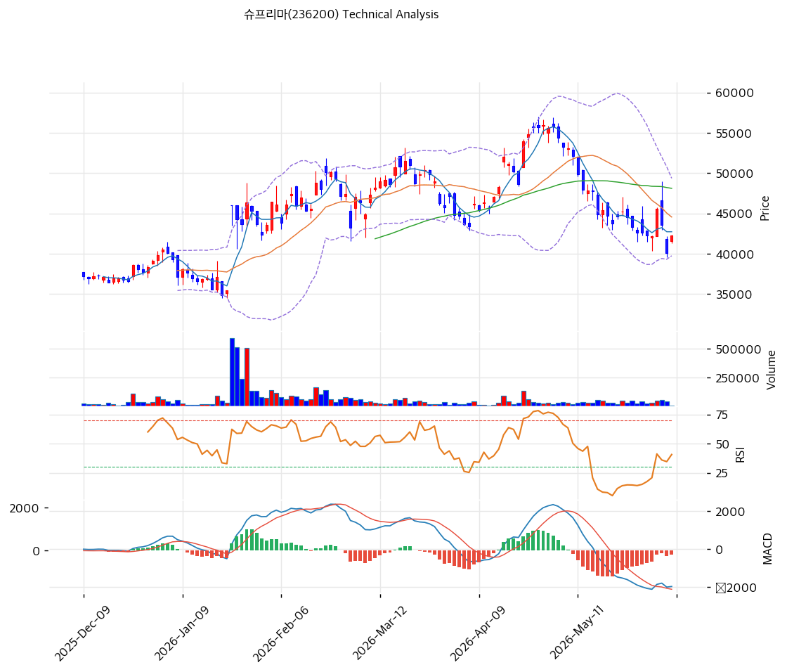

# 슈프리마(236200) 기술적 분석 보고서

---

## 가격 위치

현재가 **42,250원** (+5.36%) — 1년 위치 45.4%(고점 56,000원 대비 -25%, 저점 30,800원). 고점 후 조정·박스권에서 당일 +5.36% 반등. RSI 40.5 중립, 거래량비 0.2x(위축). MA200(40,254원) 부근 지지 테스트. 저평가(PER 9.4x) + 주주환원 트리거가 저점 매수 논거.

## 이동평균선

| 이평선 | 값 | 이격도 | 위치 |
|------|---:|----:|:---:|
| MA5 | 42,740원 | -1.1% | 아래 |
| MA20 | 44,568원 | -5.2% | 아래 |
| MA60 | 48,125원 | -12.2% | 아래 |
| MA120 | 44,997원 | -6.1% | 아래 |
| MA200 | 40,254원 | +5.0% | 위 |

**단기 약세·중기 지지(aligned False)** — MA5·MA20·MA60 아래이나 **MA200(40,254원) 위**로, 장기 지지선 부근에서 조정 중. MA200이 강한 지지, MA20(44,568원)이 1차 저항.

## 모멘텀 지표

- **RSI 40.5 (중립)** — 침체~중립. 추가 하락 압력 제한적
- **MACD -1,962 / 시그널 -1,788 / 히스토 -174** — 매도이나 하락 둔화(히스토 축소)
- **스토캐스틱 K=23.9 / D=33.2** — 데드크로스, 과매도 근접
- **볼린저밴드** — 상단 49,373 / 중심 44,568 / 하단 39,762, 폭 21.6%, **중간**. 변동성 축소
- **거래량비 0.2x** — 거래 위축(바닥 다지기)

## 피보나치 되돌림 (52주 스윙 30,800 / 56,000)

| 레벨 | 가격 | 성격 |
|------|---:|------|
| 0.236 | 50,053원 | 반등 시 저항 |
| 0.382 | 46,374원 | 2차 저항 |
| 0.5 | 43,400원 | 현재가 위 저항 |
| 0.618 | 40,426원 | 지지 (MA200 근접) |
| 0.786 | 36,193원 | 깊은 조정 |

## 지지/저항 (S&R)

- **저항**: 42,740원(MA5) / 43,400원(피보 0.5) / 44,568원(MA20·BB 중심) / 48,125원(MA60)
- **지지**: **40,426원(피보 0.618)·40,254원(MA200)** / 39,762원(BB 하단) / 36,193원(피보 0.786)

## 종합 시그널 & 전략

**시그널: 매수 0 / 매도 1 / 중립 5 → 매도우위** (박스권 조정, 모멘텀 약화)

- **전략**: 분할 매수 관점. 단기 약세이나 **MA200(40,254원) 지지 + PER 9.4x 저평가 + 주주환원 트리거**로 저점 분할 매수 구간. 당일 +5.36% 반등
- **눌림목 매수**: **MA200·피보 0.618 40,250\~40,500원 분할 매수**, 손절 BB 하단 39,762원 이탈 / 깊은 조정 시 피보 0.786 36,193원
- **상방**: MA20 44,568원 회복 시 피보 0.382 46,374원 → 0.236 50,053원. 주주환원 발표·AI 보안 모멘텀이 추세 반전 동력
- **하방**: MA200 40,254원·BB 하단 39,762원 이탈 시 36,193원. 단 우량 재무·저PBR(1.09x)로 하방 방어
- **변곡점**: 2026 주주환원 실행 + AI 보안 플랫폼 매출이 재평가 핵심. 박스권 바닥 다지기 + 저평가로 risk/reward 양호
