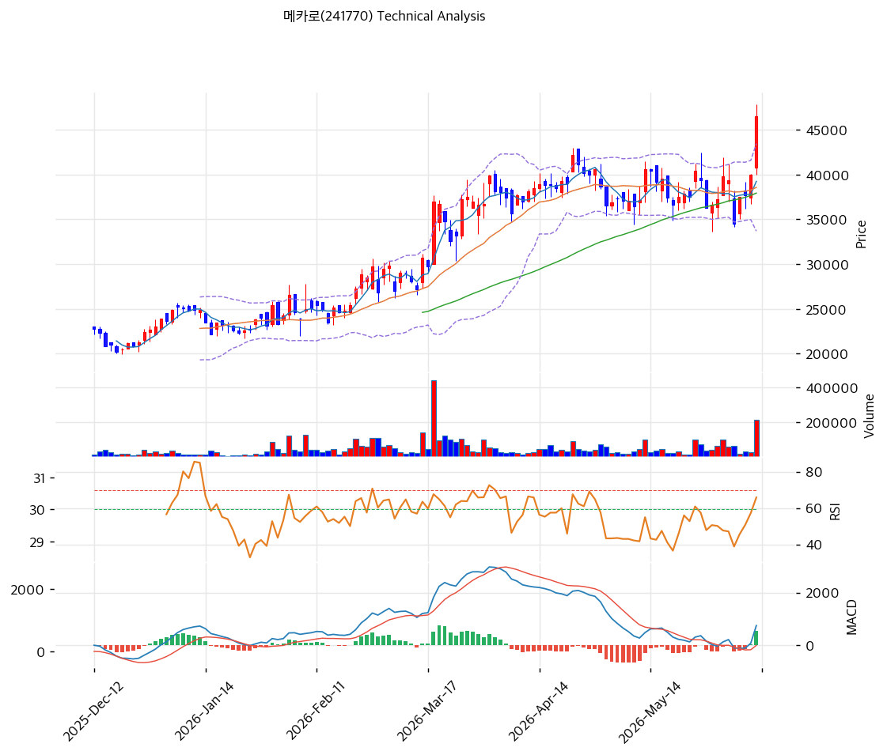

# 기술적분석

2026-06-12 | T2 Technical Analysis

***

## 차트

***

## 1. 가격 현황

| 항목        | 값                        |
| --------- | ------------------------ |
| 현재가       | 46,550원 (+16.52%)        |
| 52주 고가    | 47,800원                  |
| 52주 저가    | 39,950원 (KIS 단기 레인지)     |
| 52주 범위 위치 | 100.0% (신고가권)            |
| 거래량       | 20일 평균 대비 4.47x (폭발적 동반) |

***

## 2. 차트 패턴 분석

### 2.1 캔들스틱 패턴

| 패턴            | 위치                      | 신뢰도 | 해석                       |
| ------------- | ----------------------- | --- | ------------------------ |
| 장대양봉 + 거래량 폭증 | 당일 (+16.52%, 거래량 4.47x) | 강   | 매수 — 박스권 돌파 분출, 강한 매수 유입 |
| 적삼병 계열        | 최근                      | 중   | 매수 우위 — 상승 가속            |
| 신고가 갱신        | 당일                      | 중   | 단기 과열 경계                 |

※ 주요 캔들 패턴: 망치형, 역망치형, 장악형, 도지, 샛별/석별, 적삼병/흑삼병, 하라미, 유성형, 교수형 등

### 2.2 가격 구조 패턴

* **박스권 상향 돌파 (장기 38,000원 부근 → 46,550원)** (신뢰도: 강) MA5·20·60이 38,000\~39,000원에 수렴한 박스권을 당일 +16.52% 장대양봉으로 거래량 4.47배 동반 돌파. HBM/반도체 capex·히터블록 모멘텀이 분출. 돌파 후 38,500원(MA20) 지지 전환 여부가 관건.
* **장기 상승 추세** (신뢰도: 강) MA200(26,712원) 대비 +74.3%의 큰 괴리로 1년 강세 추세 유지. 단기 급등으로 과열이나 추세 자체는 견조.

※ 주요 구조 패턴: 이중천정/바닥, 헤드앤숄더, 삼각수렴, 쐐기형, 깃발형, 페넌트, 컵앤핸들, 박스권 등

### 2.3 다이버전스

* **뚜렷한 다이버전스 없음 — 추세 추종** (신뢰도: 중) 가격 신고가와 함께 MACD 매수·RSI 66.5 상승으로 가격·지표 동행. 하락 다이버전스 없음. 단 RSI 과매수(70) 근접으로 단기 과열 경계.

※ RSI·MACD 기반 | 상승 다이버전스 = 가격↓ 지표↑, 하락 다이버전스 = 가격↑ 지표↓, 히든 다이버전스 = 추세 지속

### 2.4 패턴 종합 판단

박스권 상단을 거래량 4.47배 동반 장대양봉으로 돌파한 **강력한 상승 분출** 국면이다. 정배열·MACD 매수로 추세가 강하나, MA200 대비 +74%·당일 +16.5% 급등의 단기 과열이 동반된다. 히터블록 독점·실적 폭발(2025 영업이익 +273%)이 추세를 받치나, 거래량 폭증 급등 직후는 변동성이 크다. 추격보다 38,500\~41,700원(MA20·피봇 S1) 눌림목 확인이 안전하다.

***

## 3. 이동평균선 — 정배열 (강세)

| MA    | 값       | 현재가 괴리율 | 위치 |
| ----- | ------- | ------- | -- |
| MA5   | 39,240원 | +18.6%  | 위  |
| MA20  | 38,570원 | +20.7%  | 위  |
| MA60  | 37,934원 | +22.7%  | 위  |
| MA120 | 31,276원 | +48.8%  | 위  |
| MA200 | 26,712원 | +74.3%  | 위  |

**해석**: 현재가 > 모든 MA의 완전 정배열 강세. 단기선(MA5·20·60)이 38,000\~39,000원에 수렴해 있다가 당일 급등으로 +18\~23% 괴리가 벌어졌다 — 강한 분출이나 단기 과열. MA200 대비 +74.3%로 장기 추세는 견조. 조정 시 MA5\~MA20(38,500\~39,200원)이 1차 지지대다.

***

## 4. 보조 지표

### RSI(14) — 66.5 (중립, 과매수 근접)

당일 급등으로 과매수(70) 직전. 강한 모멘텀이나 단기 과열 신호. 다이버전스 해석은 2.3 참조.

### MACD(12,26,9)

| 항목     | 값     |
| ------ | ----- |
| 크로스 상태 | 매수 구간 |

**해석**: MACD 매수 구간으로 상승 모멘텀 유효. 당일 급등으로 히스토그램 확대 전망.

### 볼린저밴드(20, 2σ)

당일 +16.5% 급등으로 밴드 상단을 크게 돌파한 것으로 추정 — 강한 상승 압력이나 단기 과열. 되돌림 시 중단(MA20 38,570원)이 지지.

### 스토캐스틱(14, 3, 3)

급등으로 과매수권 진입 가능 — 단기 조정 시그널 주의.

***

## 5. 지지/저항 — 추세선 · 피보나치 · PRZ 통합

### 5.1 주요 레벨

| 구분      | 가격          | 근거         |
| ------- | ----------- | ---------- |
| 저항      | 49,583원     | 피봇 R1      |
| **현재가** | **46,550원** | 신고가        |
| 지지      | 41,733원     | 피봇 S1      |
| 지지      | 38,570원     | MA20       |
| 지지      | 37,934원     | MA60       |
| 지지      | 36,917원     | 피봇 S2      |
| 강 지지    | 34,536원     | 추세선 지지(상승) |

### 5.2 종합 지지/저항 테이블

| 구분      | 가격              | 근거                   |
| ------- | --------------- | -------------------- |
| 저항      | 49,583원         | 피봇 R1                |
| **현재가** | **46,550원**     | 신고가권                 |
| 지지      | 41,733원         | 피봇 S1                |
| 지지      | 38,570\~37,934원 | MA20·MA60 (박스 상단 전환) |
| 강 지지    | 34,536원         | 상승 추세선               |

***

## 6. 시그널 종합

| 지표        | 내용                       | 시그널 |
| --------- | ------------------------ | --- |
| **차트 패턴** | 박스권 거래량 동반 돌파, 단기 과열     | 🟢  |
| 이동평균선     | 완전 정배열, MA20 +20.7% (과열) | ⚪   |
| RSI       | 66.5 — 과매수 근접            | ⚪   |
| MACD      | 매수 구간                    | 🟢  |
| 볼린저밴드     | 상단 돌파(추정)                | ⚪   |
| 스토캐스틱     | 과매수권                     | ⚪   |
| 거래량       | 4.47x — 폭발적 동반           | 🟢  |

**종합 판단**: 🟢 매수 3개 / 🔴 매도 1개 / ⚪ 중립 3개 → **매수우위 (강한 분출 + 단기 과열)**

박스권을 거래량 4.47배 동반 장대양봉으로 돌파한 강세 분출 국면이다. 정배열·MACD 매수로 추세가 강하나 MA200 +74%·RSI 66.5의 단기 과열이 공존한다. 히터블록 독점·실적 폭발이 펀더멘털을 받친다. 추격보다 눌림목(MA20 38,570원·피봇 S1 41,733원) 대응이 정석이다.

***

## 7. 전략 제안

### 보유 중인 경우

* **홀드 (분할 익절 병행)**
* 익절 라인: 49,583원(피봇 R1) 1차 / 추가 신고가 시 추세 추종
* 손절 라인: 37,900원 (MA60 종가 이탈 — 박스 복귀)
* 리스크/리워드: 당일 급등으로 신규 손익비 불리

### 진입 대기인 경우

* **추격 자제, 눌림목 대기**
* 1차 진입가: 41,733원 (피봇 S1)
* 2차 진입가: 38,570원 (MA20·박스 상단 전환)
* 진입 조건: 당일 거래량 4.47배 급등은 추격 위험. 조정 시 MA20·MA60(38,000\~39,000원) 지지 전환 확인 후 분할 진입. 실적 폭발(2025 영업이익 +273%)·히터블록 독점이 하방 지지
