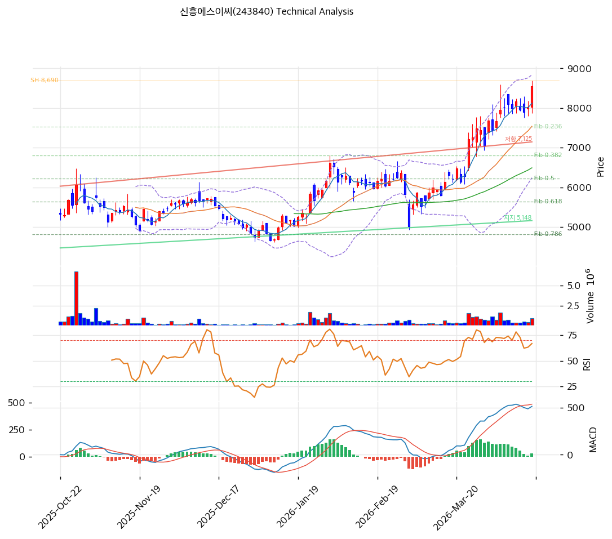

# 신흥에스이씨(243840) 기술적 분석

2026-04-17 | T2 Technical Analysis

---

## 차트

---

## 1. 가격 현황

| 항목 | 값 |
|------|-----|
| 현재가 | 8,550원 (+6.61%) |
| 52주 고가 | 8,690원 |
| 52주 저가 | 3,800원 |
| 52주 범위 위치 | 100.0% |
| 거래량 | 20일 평균 대비 1.31x |

---

## 2. 차트 패턴 분석

### 2.1 캔들스틱 패턴

| 패턴 | 위치 | 신뢰도 | 해석 |
|------|------|--------|------|
| 장대 양봉 | 최근 1일 (2026-04-17) | 강 | +6.61% 급등 양봉으로 52주 신고가 근접, 강한 매수세 유입 시그널 |
| 상승 추세 지속 | 최근 5거래일 | 중 | MA5(8,120원) 위 유지, 단기 상승 모멘텀 유효 |

※ 주요 캔들 패턴: 당일 장대 양봉이 가장 지배적 시그널

### 2.2 가격 구조 패턴

- **장기 바닥 이후 V자 반등** (신뢰도: 강)
  2025년 저점 3,800원권에서 8,550원까지 약 125% 상승. 2차전지 업황 반등 기대와 동반된 강한 V자 회복 패턴. 현재 52주 고가(8,690원)를 목전에 둔 상단 돌파 시도 구간이다.

- **상승 채널 형성** (신뢰도: 중)
  하단 추세선 기울기 +5.8pt/일(교차가 5,148원), 상단 저항선 기울기 +9.39pt/일(교차가 7,125원)로 채널 폭이 확대되는 상승 추세 유지 중. 현재가 8,550원은 저항선 교차가(7,125원)를 상향 돌파한 상태로 강세 돌파 확인.

### 2.3 다이버전스

- **MACD 상승 다이버전스 없음** — 현재 MACD 514, Signal 485, 히스토그램 +29로 확대 중. 다이버전스 없이 추세 자체가 강세 구간.

- **RSI 70 경계** — RSI 70.0으로 과매수 경계에 위치. 가격이 오르고 RSI도 함께 오르는 정방향 추세로 히든 다이버전스(추세 지속) 시사. 단, 70 초과 시 단기 숨고르기 가능.

### 2.4 패턴 종합 판단

세 카테고리를 종합하면 현재 차트는 강한 상승 추세를 유지 중이다. 장기 바닥에서 V자 반등 후 상승 채널을 형성하고 있으며, 당일 +6.61% 장대 양봉은 52주 고가(8,690원) 돌파를 시도 중임을 시사한다. RSI 70에서의 단기 조정 가능성이 유일한 상충 시그널이나, MACD·스토캐스틱의 매수 구간 유지로 중단기 상승 모멘텀이 우세하다.

---

## 3. 이동평균선 — 완전 정배열 (강세)

| MA | 값 | 현재가 괴리율 | 위치 |
|----|-----|--------------|------|
| MA5 | 8,120원 | +5.3% | 위 |
| MA20 | 7,539원 | +13.4% | 위 |
| MA60 | 6,492원 | +31.7% | 위 |
| MA120 | 5,914원 | +44.6% | 위 |
| MA200 | 5,354원 | +59.7% | 위 |

**해석**: MA5→MA20→MA60→MA120→MA200 완전 정배열 달성. 현재가가 모든 이동평균 위에 위치하며, MA200 대비 +59.7%의 과열 신호가 있으나 추세 전환 없이 강세 구조를 유지한다. MA20(7,539원)이 핵심 지지선으로 기능하며, 이 수준의 이탈 여부가 단기 추세 판단의 관건이다.

---

## 4. 보조 지표

### RSI(14) — 70.0 (중립, 과매수 경계)

RSI 70.0으로 과매수 경계에 위치하나, 데이터상 "중립" 분류. 강세 추세에서 RSI 70은 조정 신호보다 추세 지속 구간으로 해석되며, 70을 유지하는 한 상승 모멘텀이 유효하다.

### MACD(12,26,9)

| 항목 | 값 |
|------|-----|
| MACD | 514 |
| Signal | 485 |
| Histogram | +29 |
| 크로스 상태 | 매수 구간 (확대 중) |

**해석**: MACD가 Signal 위에서 히스토그램이 +29로 확대 중. 매수 모멘텀이 강화되고 있음을 의미하며 중단기 상승 추세를 지지한다.

### 볼린저밴드(20, 2σ)

| 항목 | 값 |
|------|-----|
| 상단 | 8,837원 |
| 중단 (MA20) | 7,539원 |
| 하단 | 6,241원 |
| 밴드 폭 | 34.4% |
| 현재 위치 | 중간 (상단 근접) |

**해석**: 밴드 폭 34.4%로 넓게 확장 중. 현재가 8,550원은 중단(7,539원)과 상단(8,837원) 사이에 위치하며 상단에 근접. 상단(8,837원) 돌파 시 추가 상승 가속 가능. 밴드 확장 중이므로 스퀴즈 역전 시그널 없음.

### 스토캐스틱(14, 3, 3)

| 항목 | 값 |
|------|-----|
| Slow %K | 74.0 |
| Slow %D | 70.9 |
| 크로스 상태 | 골든크로스 |
| 판단 | 중립 (과매수 경계) |

---

## 5. 지지/저항 — 추세선 · 피보나치 · PRZ 통합

### 5.1 피보나치 되돌림/확장

| 구분 | 비율 | 가격 | 현재가 대비 |
|------|------|------|-----------|
| Swing High | — | 8,690원 | — |
| 되돌림 | 0.236 | 7,525원 | -12.0% |
| 되돌림 | 0.382 | 6,805원 | -20.4% |
| 되돌림 | 0.5 | 6,222원 | -27.2% |
| 되돌림 | 0.618 | 5,640원 | -34.0% |
| 되돌림 | 0.786 | 4,811원 | -43.7% |
| Swing Low | — | 3,755원 | — |
| 확장 | 1.272 | 10,032원 | +17.3% |
| 확장 | 1.382 | 10,575원 | +23.7% |
| 확장 | 1.618 | 11,740원 | +37.3% |
| 확장 | 2.0 | 13,625원 | +59.4% |

※ 피보나치 기준: 상승 추세 (Swing Low 3,755원 → Swing High 8,690원)
※ 되돌림 = 조정 시 지지 예상 구간, 확장 = 돌파 후 상승 목표가

### 5.2 추세선

| 추세선 | 방향 | 현재 교차가 | 포인트 수 | 해석 |
|--------|------|-----------|---------|------|
| 지지선 | 상승 | 5,148원 | 6개 | 장기 바닥 상승 지지선, 현재가 대비 -39.8%의 강한 지지 구조 |
| 저항선 | 상승 | 7,125원 | 6개 | 이미 상향 돌파 완료, 이전 저항이 지지로 전환 |

### 5.3 PRZ (Potential Reversal Zone)

| 방향 | 가격 범위 | 신뢰도 | 근거 |
|------|---------|--------|------|
| 지지 | 8,050~8,120원 | 약 | 피봇 S1(8,050원), MA5(8,120원) |
| 지지 | 7,525~7,550원 | 중 | 피보나치 0.236(7,525원), MA20(7,539원), 피봇 S2(7,550원) |

※ PRZ = 복수 지표가 겹치는 가격 구간. 7,525~7,550원 PRZ가 가장 신뢰도 높은 하방 지지 구간.

### 5.4 종합 지지/저항 테이블

| 구분 | 가격 | 근거 |
|------|------|------|
| 저항 | 8,690원 | 52주 고가, Swing High |
| 저항 | 8,837원 | 볼린저밴드 상단 |
| 저항 | 10,032원 | 피보나치 1.272 확장 |
| **현재가** | **8,550원** | — |
| 지지 | 8,050~8,120원 | PRZ (약) — 피봇 S1, MA5 |
| 지지 | 7,525~7,550원 | PRZ (중) — 피보나치 0.236, MA20, 피봇 S2 |
| 지지 | 7,125원 | 상승 저항선 돌파 → 지지 전환 |
| 지지 | 6,492원 | MA60 |

---

## 6. 시그널 종합

| 지표 | 내용 | 시그널 |
|------|------|--------|
| **차트 패턴** | V자 반등 완성, 상승 채널 유지, 52주 고가 돌파 시도 | 🟢 |
| 이동평균선 | 완전 정배열, MA200 대비 +59.7% | 🟢 |
| RSI | 70.0 — 중립 (과매수 경계) | ⚪ |
| MACD | 매수구간, 히스토그램 +29 확대 중 | 🟢 |
| 볼린저밴드 | 상단(8,837원) 근접, 밴드 확장 | ⚪ |
| 스토캐스틱 | 골든크로스, K=74.0 | ⚪ |
| 거래량 | 1.31x — 약함 | ⚪ |

**종합 판단**: 🟢 매수 3개 / 🔴 매도 0개 / ⚪ 중립 4개 → **매수우위**

완전 정배열과 MACD 매수 구간 지속으로 중단기 상승 모멘텀이 유효하다. 현재 52주 신고가(8,690원)를 목전에 두고 있으며, 돌파 시 피보나치 확장 1.272(10,032원)까지 기술적 목표가 열린다. 다만 RSI 70 경계와 볼린저밴드 상단 근접으로 단기 숨고르기 가능성을 병기한다. 거래량이 1.31x로 강하지 않아 52주 고가 돌파의 지속성은 거래량 동반 여부로 재확인이 필요하다.

---

## 7. 전략 제안

### 보유 중인 경우
- **홀드**
- 익절 라인: 8,690원 (52주 고가 / Swing High) 또는 10,032원 (피보나치 1.272 확장)
- 손절 라인: 7,550원 (PRZ 중 하단 — MA20, 피봇 S2, 피보나치 0.236 수렴 구간)
- 리스크/리워드: 8,690원 목표 시 1:0.2 (단기), 10,032원 목표 시 1:1.5 (중기)

### 진입 대기인 경우
- **관망 또는 분할 진입**
- 1차 진입가: 8,050원 (PRZ 약 — 피봇 S1, MA5 근접)
- 2차 진입가: 7,539원 (PRZ 중 — MA20, 피봇 S2, 피보나치 0.236 수렴)
- 진입 조건: 조정 후 해당 PRZ에서 양봉 + 거래량 동반 반등 확인 시 진입. 52주 고가(8,690원) 돌파 + 거래량 2x 이상 시 추격 매수 가능.
