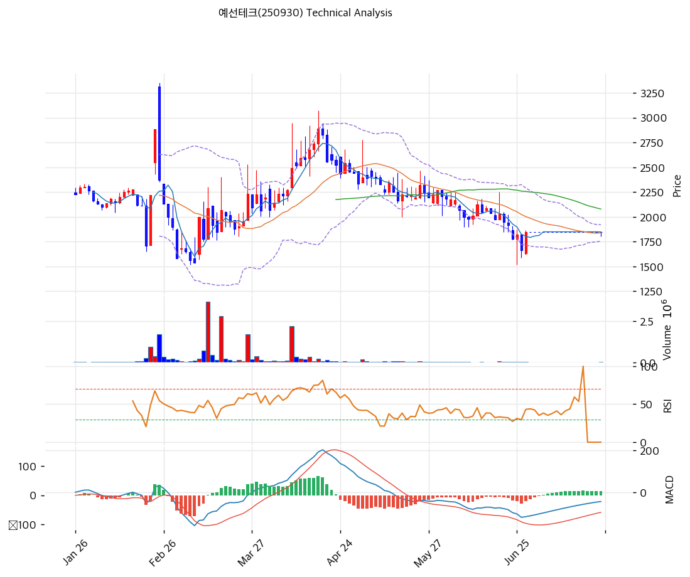

# 예선테크(250930) 기술적 분석

2026-07-23 | T2 Technical Analysis

---

## 차트

---

## 1. 가격 현황

| 항목 | 값 |
|------|-----|
| 현재가 | 1,846원 (-0.22%) |
| 52주 고가 | 3,465원 |
| 52주 저가 | 1,540원 |
| 52주 범위 위치 | 15.9% (저점권) |
| 거래량 | 20일 평균 대비 2.36x (단, 절대 거래대금 \~3천만원의 극소 유동성) |

---

## 2. 차트 패턴 분석

### 2.1 캔들스틱 패턴

| 패턴 | 위치 | 신뢰도 | 해석 |
|------|------|--------|------|
| 소실체 캔들 군집 (도지성) | 최근 3주, 1,750\~1,850원 | 중 | 매수·매도 모두 소멸한 무관심 구간 — 방향성 부재의 바닥 다지기 |
| 망치형 (6월 말) | 1,540원 저점 | 약 | 저점 반등 시도 후 추세 전환으로는 미연결 |

### 2.2 가격 구조 패턴

- **장기 하락 채널** (신뢰도: 강)
  2월 고점(3,465원) 이후 5개월째 고점·저점 동반 하향. 하락 추세선 저항은 현재 약 3,170원으로 멀고, 반등 때마다 이평선(MA60~MA200)에 막혀왔다.

- **볼린저밴드 초강력 스퀴즈** (신뢰도: 중)
  밴드 폭 9.0% — 연중 최저 수준의 변동성 응축. 1,756\~1,922원의 좁은 박스에 3주째 갇혀 있어, 이탈 방향으로 변동성이 분출될 조건이 쌓이는 중.

- **1,540\~1,850원 바닥권 횡보** (신뢰도: 중)
  6월 저점(1,540원) 이후 저점을 높인 횡보 — 8월 반기 실적(턴어라운드 확인)이 방향 트리거가 될 수 있는 자리.

### 2.3 다이버전스

- **MACD 상승 다이버전스 (완성형)** (신뢰도: 중)
  6월 가격 저점 경신 구간에서 MACD 저점은 5월보다 높아졌고, 7월 들어 시그널 상향 돌파(매수 전환) — 하락 모멘텀 소진 시사.

- **RSI 다이버전스 판단 보류** (신뢰도: —)
  7월 거래 희박으로 RSI 계산값 왜곡(차트 말단 아티팩트) — 유의미한 해석 불가.

### 2.4 패턴 종합 판단

하락 채널(강)이라는 큰 틀 안에서, 바닥권 횡보 + 볼린저 스퀴즈 + MACD 매수 전환이라는 반전 준비 신호가 겹치고 있다. 다만 거래대금이 하루 3천만원 수준까지 말라 있어 '패턴'보다 '수급 부재' 자체가 지배 변수 — 방향 분출에는 실적 이벤트(8월 반기보고서) 같은 외부 촉매와 거래량 복귀가 선행돼야 한다.

---

## 3. 이동평균선 — 비정배열 (약세, 단기 바닥 수렴)

| MA | 값 | 현재가 괴리율 | 위치 |
|----|-----|--------------|------|
| MA5 | 1,849원 | -0.2% | 아래 (밀착) |
| MA20 | 1,839원 | +0.4% | 위 (밀착) |
| MA60 | 2,080원 | -11.2% | 아래 |
| MA120 | 2,128원 | -13.2% | 아래 |
| MA200 | 2,275원 | -18.9% | 아래 |

**해석**: 단기 이평(MA5·MA20)과 현재가가 1,840원대에 완전히 수렴 — 횡보의 전형이다. 중장기 이평은 모두 머리 위(-11~-19%)에서 하향 중이라 추세 회복까지는 거리가 있다. 1차 관문은 MA60(2,080원), 그 위 MA120(2,128원)이 피보나치 0.382(2,133원)와 겹쳐 강한 저항대를 형성한다.

---

## 4. 보조 지표

### RSI(14) — 40.5 (중립)

중립 하단 — 7월 거래 희박으로 신뢰도 낮음. 추세 판단은 MACD·가격 구조 우선.

### MACD(12,26,9)

| 항목 | 값 |
|------|-----|
| MACD | -44.0 |
| Signal | -58.0 |
| Histogram | +14.0 |
| 크로스 상태 | 매수 구간 (전환 직후) |

**해석**: 7월 초 골든크로스로 매수 구간 진입 — 음수 영역에서의 전환이라 '하락 멈춤' 신호이지 상승 확정은 아니다.

### 볼린저밴드(20, 2σ)

| 항목 | 값 |
|------|-----|
| 상단 | 1,922원 |
| 중단 (MA20) | 1,839원 |
| 하단 | 1,756원 |
| 밴드 폭 | 9.0% |
| 현재 위치 | 중간 |

**해석**: 폭 9.0%의 극단적 스퀴즈 — 2월 급등 직전과 유사한 변동성 응축. 1,922원 상향 이탈 시 단기 분출, 1,756원 하향 이탈 시 저점(1,540원) 재시험.

### 스토캐스틱(14, 3, 3)

| 항목 | 값 |
|------|-----|
| Slow %K | 산출 불가 (거래 희박) |
| Slow %D | 산출 불가 |
| 크로스 상태 | 데드크로스 (참고치) |
| 판단 | 판단 보류 |

---

## 5. 지지/저항 — 추세선 · 피보나치 · PRZ 통합

### 5.1 피보나치 되돌림/확장

| 구분 | 비율 | 가격 | 현재가 대비 |
|------|------|------|-----------|
| Swing High | — | 2,890원 | +56.6% |
| 되돌림 | 0.236 | 1,954원 | +5.9% |
| 되돌림 | 0.382 | 2,133원 | +15.5% |
| 되돌림 | 0.5 | 2,278원 | +23.4% |
| 되돌림 | 0.618 | 2,422원 | +31.2% |
| 되돌림 | 0.786 | 2,628원 | +42.4% |
| Swing Low | — | 1,665원 | -9.8% |
| 확장 | 1.272 | 1,332원 | -27.8% |

※ 피보나치 기준: 하락 추세 (Swing High 2,890원 → Swing Low 1,665원) — 되돌림 레벨이 전부 상방 저항
※ 확장 레벨(1.272 이하)은 저점 이탈 시 하방 목표치로만 참고

### 5.2 추세선

| 추세선 | 방향 | 현재 교차가 | 포인트 수 | 해석 |
|--------|------|-----------|---------|------|
| 지지선 | 하락 | 1,366원 | 6개 | 저점 연결 하락 지지선 — 1,540원 이탈 시 다음 계산 구간 |
| 저항선 | 하락 | 3,170원 | 6개 | 2월 고점발 — 중기 추세 전환의 최종 관문 (원거리) |

### 5.3 PRZ (Potential Reversal Zone)

| 방향 | 가격 범위 | 신뢰도 | 근거 |
|------|---------|--------|------|
| 지지 | 1,783\~1,881원 | 강 | 피봇 S2·S1·R1·R2 + MA5 + MA20 총집결 — 현재가 포함 밀집 구간 |
| 저항 | 2,128\~2,133원 | 약 | MA120 + 피보나치 0.382 |
| 저항 | 2,275\~2,278원 | 약 | MA200 + 피보나치 0.5 |
| 지지 | 1,332\~1,366원 | 약 | 피보나치 1.272 확장 + 추세선 지지 |

※ PRZ = 추세선 · 피보나치 · 피봇 · MA 등 복수 지표가 겹치는 가격 구간. 겹치는 소스가 많을수록 반전 확률 상승.

### 5.4 종합 지지/저항 테이블

| 구분 | 가격 | 근거 |
|------|------|------|
| 저항 | 2,275\~2,278원 | PRZ(약) — MA200 + 피보나치 0.5 |
| 저항 | 2,128\~2,133원 | PRZ(약) — MA120 + 피보나치 0.382 |
| 저항 | 2,080원 | MA60 |
| 저항 | 1,954원 | 피보나치 0.236 |
| 저항 | 1,922원 | 볼린저 상단 (스퀴즈 이탈선) |
| **현재가** | **1,846원** | PRZ(강) 1,783\~1,881원 내부 |
| 지지 | 1,756원 | 볼린저 하단 |
| 지지 | 1,540원 | 52주 저가 |
| 지지 | 1,332\~1,366원 | PRZ(약) — 피보나치 1.272 확장 + 추세선 |

---

## 6. 시그널 종합

| 지표 | 내용 | 시그널 |
|------|------|--------|
| **차트 패턴** | 하락 채널 속 바닥 횡보 + 볼린저 스퀴즈 | ⚪ |
| 이동평균선 | 비정배열, 단기 이평 수렴 (MA20 +0.4%) | ⚪ |
| RSI | 40.5 — 중립 (신뢰도 낮음) | ⚪ |
| MACD | 매수 전환 (음수 영역) | ⚪ |
| 볼린저밴드 | 중간, 폭 9.0% 스퀴즈 | ⚪ |
| 스토캐스틱 | 산출 불가 | ⚪ |
| 거래량 | 2.36x — 상대 증가 (절대 규모는 극소) | 🟢 |

**종합 판단**: 🟢 매수 1개 / 🔴 매도 0개 / ⚪ 중립 5개 → **매수우위 (바닥권 응축 — 촉매 대기)**

'매수우위' 판정의 실체는 방향 신호가 아니라 변동성 응축이다. 하락 에너지는 소진됐고(MACD 전환·저점 높임) 밴드는 조여졌으나, 거래가 사라진 시장이라 방향은 외부 촉매 — 8월 중순 반기 실적(3분기 연속 흑자의 연장 확인)이 유력한 트리거다. 실적 확인 시 1,922원(밴드 상단) → 1,954원(피보나치 0.236) → 2,080원(MA60) 순의 저항 소화가 목표 경로, 실망 시 1,540원 저점 재시험이다.

---

## 7. 전략 제안

### 보유 중인 경우
- **홀드 (실적 이벤트 확인)**
- 익절 라인: 2,080\~2,130원 (MA60 + MA120·피보나치 0.382 저항대)
- 손절 라인: 1,740원 (볼린저 하단·PRZ 하단 이탈 = 저점 재시험 개시)
- 리스크/리워드: 약 2.5 (1,846원 기준 +260 / -106)

### 진입 대기인 경우
- **소액 분할만 (유동성 제약 유의)**
- 1차 진입가: 1,780\~1,820원 (PRZ 강 지지 하단)
- 2차 진입가: 1,560\~1,600원 (52주 저가 부근 — 실적 실망 급락 시)
- 진입 조건: 8월 반기 실적에서 분기 영업흑자 지속 확인 + 거래량 동반 1,922원(밴드 상단) 돌파. **일 거래대금 3천만원 시장이므로 포지션 규모 자체를 유동성에 맞춰 제한할 것** — CB 전환 물량(342만주) 출회 시 호가 공백 급락 위험 상존
