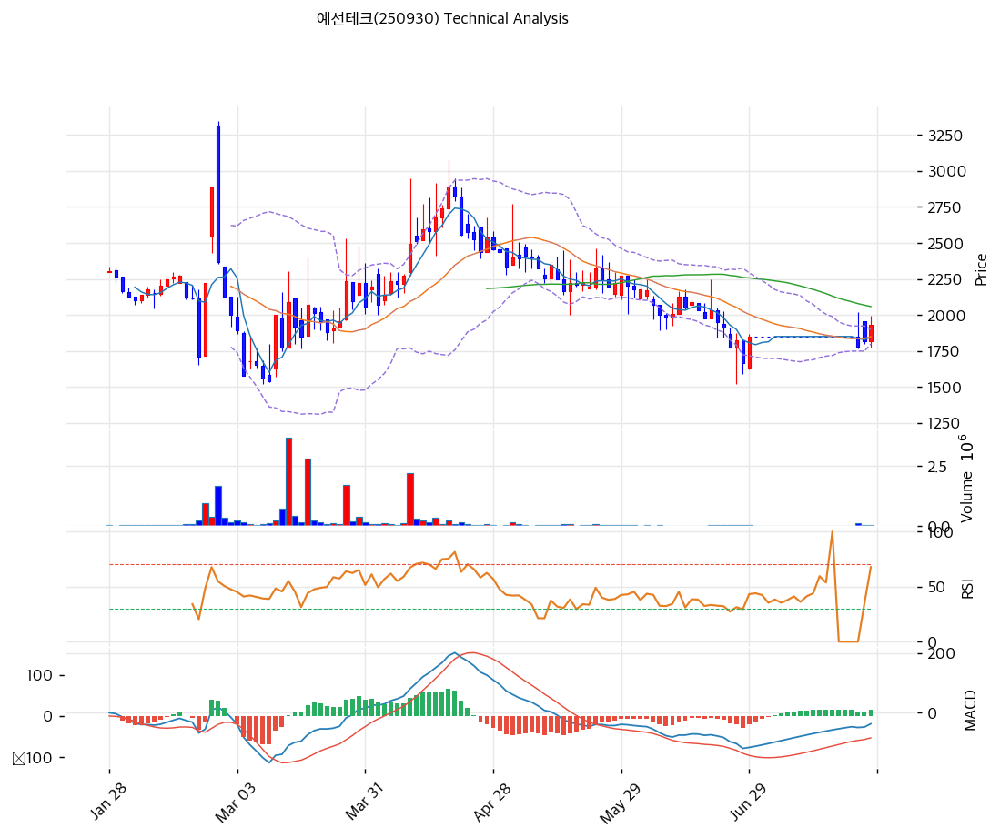

# 예선테크(250930) 기술적 분석

2026-07-27 | T2 Technical Analysis

---

## 차트

---

## 1. 가격 현황

| 항목 | 값 |
|------|-----|
| 현재가 | 1,929원 (**+6.22%**) |
| 52주 고가 | 3,465원 |
| 52주 저가 | 1,540원 |
| 52주 범위 위치 | 20.2% |
| 거래량 | 20일 평균 대비 **2.91x** — 소외 구간 대비 급증 |

---

## 2. 차트 패턴 분석

### 2.1 캔들스틱 패턴

| 패턴 | 위치 | 신뢰도 | 해석 |
|------|------|--------|------|
| 장대양봉 (볼린저 상단 돌파) | 금일 | 강 | +6.22%에 거래량 2.91배 — 3주 박스를 위로 이탈한 결정적 캔들 |
| 도지성 소실체 군집 | 최근 3주, 1,800\~1,900원 | 중 | 극단적 변동성 응축 후 방향 결정 — 금일 상방으로 해소 |

### 2.2 가격 구조 패턴

- **볼린저 스퀴즈 후 상방 분출** (신뢰도: 강)
  밴드 폭이 **5.6%**까지 조여진 상태(7/23 9.0% → 추가 수축)에서 금일 상단(1,900원)을 돌파. 스퀴즈가 극단적일수록 분출 폭이 커지는 것이 통상 패턴으로, 방향이 위로 잡혔다는 점이 이번 주 가장 중요한 기술적 변화다.

- **바닥권 박스 상단 이탈** (신뢰도: 중)
  6월 저점(1,540원) 이후 1,750\~1,900원에서 형성된 4주 박스를 상향 돌파. 넥라인(1,900원) 위 안착 시 다음 저항은 MA60(2,058원) 구간.

- **장기 하락 채널은 유효** (신뢰도: 강)
  2월 고점(3,465원)부터의 하락 추세는 아직 살아 있다 — MA60·120·200이 모두 위에 있어 이번 반등은 '추세 전환'이 아니라 '바닥권 반등'으로 분류하는 것이 정확하다.

### 2.3 다이버전스

- **MACD 상승 다이버전스 완성 → 매수 전환** (신뢰도: 중)
  MACD -37 vs 시그널 -53으로 매수 구간 진입, 히스토그램 +16으로 **확대 중**(7/23 대비 개선). 음수 영역에서의 전환이라 '하락 종료' 신호이며, 0선 회복이 다음 확인점.

- **RSI 54.0 — 중립 회복** (신뢰도: 중)
  7/23 40.5에서 54.0으로 상승하며 중립선을 넘었다 — 매수 우위로의 전환을 뒷받침.

### 2.4 패턴 종합 판단

**7/23 대비 가장 큰 변화는 거래량(0.17배 → 2.91배)과 방향성이다.** 극단적으로 조여졌던 볼린저 밴드(5.6%)가 상방으로 뚫렸고, MACD는 매수로 전환했으며, RSI는 중립선을 회복했다. 다만 중장기 이평(MA60 2,058원·MA120 2,120원·MA200 2,270원)이 여전히 머리 위에 있어 **바닥권 반등의 1단계**로 보는 것이 맞다. 8월 반기 실적(4분기 연속 흑자 여부)이 이 반등을 추세로 승격시킬 펀더멘털 재료다.

---

## 3. 이동평균선 — 단기 회복, 중장기 저항 (비정배열)

| MA | 값 | 현재가 괴리율 | 위치 |
|----|-----|--------------|------|
| MA5 | 1,845원 | +4.6% | 위 |
| MA20 | 1,849원 | +4.3% | 위 |
| MA60 | 2,058원 | -6.3% | 아래 |
| MA120 | 2,120원 | -9.0% | 아래 |
| MA200 | 2,270원 | -15.0% | 아래 |

**해석**: 7/23에는 MA5·MA20과 현재가가 1,840원대에 수렴한 완전 횡보였는데, 금일 급등으로 단기 이평 위로 +4%대 올라섰다. 중장기 이평과의 괴리는 -6.3~-15.0%로 여전히 크지만 7/23(-11.2~-18.9%) 대비 좁혀졌다 — **회복의 방향성은 맞으나 거리가 남았다.** 1차 관문은 MA60(2,058원)이며, 피봇 R1(2,026원)과 겹쳐 저항대를 형성한다.

---

## 4. 보조 지표

### RSI(14) — 54.0 (중립 회복)

7/23 40.5 → 54.0. 중립선(50) 상향 돌파는 매수 우위 전환의 표준 신호이며, 과매수(70)까지 여유가 있어 추가 상승 여력이 남았다.

### MACD(12,26,9)

| 항목 | 값 |
|------|-----|
| MACD | -37.0 |
| Signal | -53.0 |
| Histogram | **+16.0** (확대 중) |
| 크로스 상태 | 매수 구간 |

**해석**: 음수 영역이지만 매수 구간을 유지하며 히스토그램이 확대 중 — 하락 모멘텀이 소진되고 상승 모멘텀이 쌓이는 국면. MACD의 0선 회복이 추세 전환의 확증이 된다.

### 볼린저밴드(20, 2σ)

| 항목 | 값 |
|------|-----|
| 상단 | 1,900원 |
| 중단 (MA20) | 1,849원 |
| 하단 | 1,797원 |
| 밴드 폭 | **5.6%** (극단 스퀴즈) |
| 현재 위치 | **상단 돌파** |

**해석**: 밴드 폭 5.6%는 연중 최저 수준의 변동성 응축이었고, 금일 현재가(1,929원)가 상단(1,900원)을 돌파했다 — **스퀴즈 해소의 방향이 위로 잡혔다는 뜻**이다. 통상 스퀴즈 이탈 후에는 밴드가 확장되며 추세가 며칠 이어지는 패턴이 나타난다.

### 스토캐스틱(14, 3, 3)

| 항목 | 값 |
|------|-----|
| Slow %K | 29.8 |
| Slow %D | 산출 불가 |
| 크로스 상태 | 데드크로스 (참고치) |
| 판단 | 저유동성으로 신뢰도 낮음 |

---

## 5. 지지/저항 — 추세선 · 피보나치 · PRZ 통합

### 5.1 피보나치 되돌림

| 구분 | 비율 | 가격 | 현재가 대비 |
|------|------|------|-----------|
| Swing High | — | 2,890원 | +49.8% |
| 되돌림 | 0.786 | 2,628원 | +36.2% |
| 되돌림 | 0.618 | 2,422원 | +25.6% |
| 되돌림 | 0.5 | 2,278원 | +18.1% |
| 되돌림 | 0.382 | 2,133원 | +10.6% |
| 되돌림 | 0.236 | 1,954원 | **+1.3%** |
| Swing Low | — | 1,665원 | -13.7% |

※ 피보나치 기준: 하락 추세(2,890 → 1,665원)의 되돌림 — **현재가가 0.236(1,954원) 바로 아래**로, 이 레벨 돌파가 첫 관문

### 5.2 추세선

| 추세선 | 방향 | 현재 교차가 | 포인트 수 | 해석 |
|--------|------|-----------|---------|------|
| 지지선 | 하락 | 1,366원 | 6개 | 저점 연결선 — 하방 여유 확보 |
| 저항선 | 하락 | 3,170원 | 6개 | 2월 고점발 — 중기 추세 전환의 최종 관문 (원거리) |

### 5.3 PRZ (Potential Reversal Zone)

| 방향 | 가격 범위 | 신뢰도 | 근거 |
|------|---------|--------|------|
| 지지 | 1,845\~1,849원 | 약 | MA5 + MA20 (돌파한 박스 상단의 지지 전환 여부) |
| 저항 | 2,026\~2,058원 | 약 | 피봇 R1 + MA60 — **1차 관문** |
| 저항 | 2,120\~2,133원 | 중 | MA120 + 피봇 R2 + 피보나치 0.382 |
| 저항 | 2,270\~2,278원 | 중 | MA200 + 피보나치 0.5 |

※ PRZ = 추세선 · 피보나치 · 피봇 · MA 등 복수 지표가 겹치는 가격 구간

### 5.4 종합 지지/저항 테이블

| 구분 | 가격 | 근거 |
|------|------|------|
| 저항 | 2,270\~2,278원 | PRZ(중) — MA200 + 피보나치 0.5 |
| 저항 | 2,120\~2,133원 | PRZ(중) — MA120 + 피봇 R2 + 피보나치 0.382 |
| 저항 | 2,026\~2,058원 | PRZ(약) — 피봇 R1 + MA60 (1차 관문) |
| 저항 | 1,954원 | 피보나치 0.236 |
| **현재가** | **1,929원** | 볼린저 상단(1,900원) 돌파 직후 |
| 지지 | 1,845\~1,849원 | MA5 + MA20 (박스 상단의 지지 전환 시험) |
| 지지 | 1,801원 | 피봇 S1 |
| 지지 | 1,674원 | 피봇 S2 |
| 지지 | 1,540원 | 52주 저가 |

---

## 6. 시그널 종합

| 지표 | 내용 | 시그널 |
|------|------|--------|
| **차트 패턴** | 볼린저 스퀴즈(5.6%) 상방 분출 + 박스 돌파 | 🟢 |
| 이동평균선 | 비정배열, MA5·20 상회 / MA60·120·200 아래 | ⚪ |
| RSI | 54.0 — 중립선 회복 | ⚪ |
| MACD | 매수 구간, 히스토그램 확대 | ⚪ |
| 볼린저밴드 | **상단 돌파**, 폭 5.6% | ⚪ |
| 스토캐스틱 | 데드크로스 (신뢰도 낮음) | ⚪ |
| 거래량 | **2.91x** — 강력 동반 | 🟢 |

**종합 판단**: 🟢 매수 2개 / 🔴 매도 0개 / ⚪ 중립 4개 → **매수우위 (스퀴즈 상방 분출 — 바닥권 반등 1단계)**

7/23의 '방향 없는 응축'에서 '상방 분출'로 국면이 바뀌었다 — 거래량 2.91배가 붙은 볼린저 상단 돌파는 신뢰할 만한 반등 신호다. 다만 중장기 이평(2,058\~2,270원)이 층층이 대기 중이라 **추세 전환이 아니라 반등의 시작**으로 다뤄야 하며, CB 342만주(전환가 731원)가 이 반등 구간마다 매물로 나올 수 있다는 점이 상단을 제약한다. 1차 목표는 2,026\~2,058원(MA60·피봇 R1), 실패 시 1,845원(MA20) 지지 확인이 관건이다.

---

## 7. 전략 제안

### 보유 중인 경우
- **홀드 (반등 추종)**
- 익절 라인: 2,026\~2,058원 1차 (MA60 + 피봇 R1 — 분할 익절), 돌파 시 2,120\~2,133원(MA120·피보나치 0.382)
- 손절 라인: 1,840원 (MA20·박스 상단 재이탈 = 돌파 무효화)
- 리스크/리워드: 약 1.3 (+120 / -89) — 1차 목표 기준. CB 매물 감안해 목표를 짧게 잡는 것이 안전

### 진입 대기인 경우
- **눌림 대기 우선 (급등 추격 자제)**
- 1차 진입가: 1,845\~1,860원 (MA5·MA20 지지 전환 확인 — 돌파 후 되돌림 매수)
- 2차 진입가: 1,800원 (피봇 S1 — 박스 중단 회귀 시)
- 진입 조건: 볼린저 상단 돌파는 유효하나 **CB 전환청구 공시가 나오면 즉시 재평가**해야 한다(342만주 = 일 거래량 100일치). 8월 반기 실적에서 4분기 연속 흑자가 확인되면 2,058원(MA60) 돌파 추종도 유효하며, **일 거래대금이 6,600만원 수준으로 여전히 얇으니 포지션 규모를 유동성에 맞춰 제한할 것**
