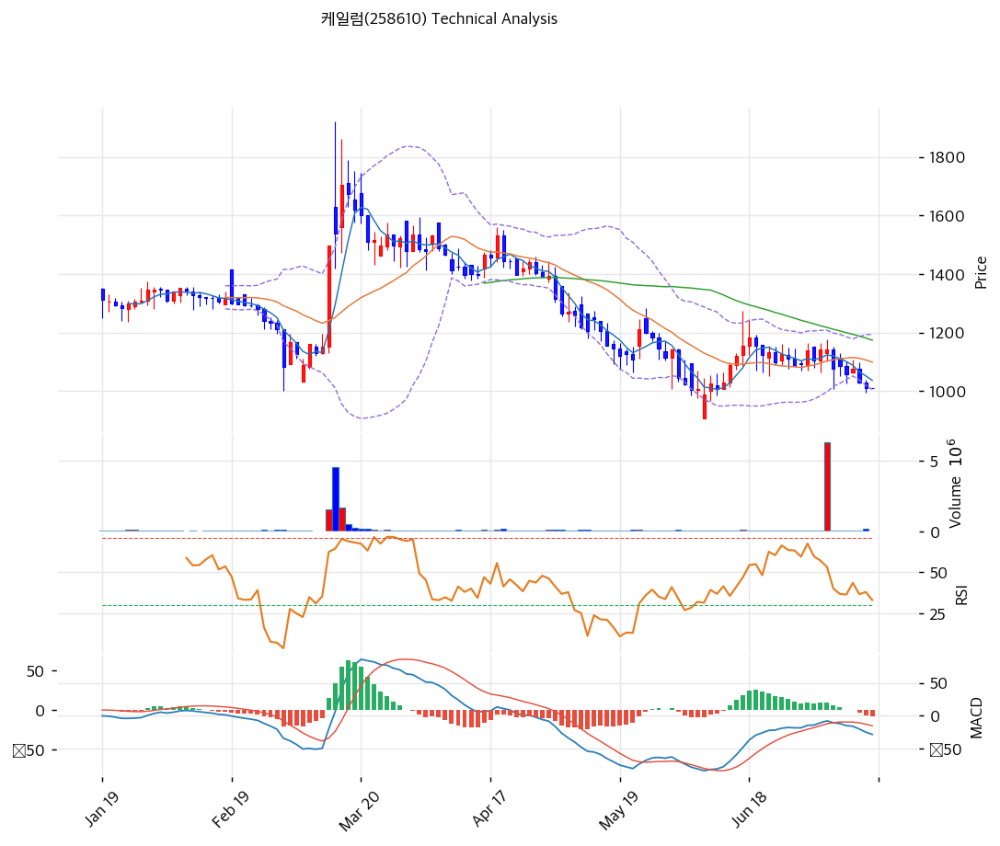

# 케일럼(258610) 기술적 분석

2026-07-15 | T2 Technical Analysis

---

## 차트

---

## 1. 가격 현황

| 항목 | 값 |
|------|-----|
| 현재가 | 1,009원 (0.00%) |
| 52주 고가 | 2,345원 |
| 52주 저가 | 988원 |
| 52주 범위 위치 | 1.5% (저점 바로 위) |
| 거래량 | 20일 평균 대비 0.00x (장 시작 전 집계) |

---

## 2. 차트 패턴 분석

### 2.1 캔들스틱 패턴

| 패턴 | 위치 | 신뢰도 | 해석 |
|------|------|--------|------|
| 소폭 음봉 연속 (하락 지속) | 최근 2주 | 중 | 낙폭은 줄었으나 반전 캔들(망치형·장악형) 미출현 — 매도 압력 잔존 |
| 도지성 캔들 군집 | 1,000\~1,050원 구간 | 약 | 저점권 매수·매도 균형 — 바닥 다지기 초기 신호 가능성 |

### 2.2 가격 구조 패턴

- **계단식 하락 추세** (신뢰도: 강)
  2월 고점(1,900원대) 이후 반등 때마다 고점을 낮추는 계단식 하락 5개월째. 하락 추세선 저항은 현재 약 1,222원.

- **52주 저점(988원) 지지 테스트** (신뢰도: 중)
  현재가 1,009원은 저점 988원과 2% 거리 — 이탈 시 세자릿수 진입으로 심리적·수급적 악화, 지지 시 이중바닥 시도의 왼쪽 바닥 후보.

- **볼린저밴드 스퀴즈** (신뢰도: 중)
  밴드 폭 17.1%로 수축 — 2월(급등 전)과 유사한 에너지 응축 구간. 방향 결정 시 변동성 확대가 따라온다.

- **6월 말 초대형 거래량 스파이크** (신뢰도: 중)
  6월 말 단일 거래일 650만주(평소의 수십 배) 거래 후 가격은 되밀림 — 세력성 매집/처분 여부는 미확정이나, 저점권에서 손바뀜이 대량으로 일어난 것 자체가 관찰 포인트.

### 2.3 다이버전스

- **RSI 상승 다이버전스 (형성 중)** (신뢰도: 약)
  5월 저점(RSI 20대) 대비 7월 저점 접근 구간에서 RSI가 37선을 유지 — 가격은 저점을 다시 시험하는데 RSI 저점은 높아지는 초기 다이버전스. 저점 지지 확인 전까지는 미완성.

- **MACD 다이버전스 없음** (신뢰도: —)
  매도 구간(-28)에서 히스토그램 확대 중 — 단기 하락 모멘텀은 오히려 진행형.

### 2.4 패턴 종합 판단

5개월 하락 추세(강)의 끝자락에서 52주 저점 지지를 시험하는 국면. 볼린저 스퀴즈 + 스토캐스틱 과매도 + RSI 다이버전스 조짐은 낙폭과대 반등의 재료지만, MACD 히스토그램 확대와 반전 캔들 부재가 말하듯 아직 하락이 끝났다는 증거는 없다. 988원 지지 여부가 모든 판단의 전제다.

---

## 3. 이동평균선 — 역배열 (약세)

| MA | 값 | 현재가 괴리율 | 위치 |
|----|-----|--------------|------|
| MA5 | 1,036원 | -2.6% | 아래 |
| MA20 | 1,099원 | -8.2% | 아래 |
| MA60 | 1,174원 | -14.0% | 아래 |
| MA120 | 1,271원 | -20.6% | 아래 |
| MA200 | 1,408원 | -28.4% | 아래 |

**해석**: 5개 이평선 전부 아래의 완전 역배열 — 단기 반등이 나와도 1,100(MA20)\~1,270원(MA120) 구간마다 저항이 층층이 대기한다. MA200 괴리 -28.4%는 낙폭과대 영역이나, 역배열에서의 평균 회귀는 시간이 걸린다.

---

## 4. 보조 지표

### RSI(14) — 37.6 (중립 하단)

침체권(30) 직전까지 하락 — 과매도 진입 임박. 추가 하락 시 반등 탄력 구간.

### MACD(12,26,9)

| 항목 | 값 |
|------|-----|
| MACD | -28.0 |
| Signal | -20.0 |
| Histogram | -8.0 |
| 크로스 상태 | 매도 구간 (확대 중) |

**해석**: 6월 반등 실패 후 데드크로스 재진입, 히스토그램 확대 중 — 단기 모멘텀은 여전히 아래쪽.

### 볼린저밴드(20, 2σ)

| 항목 | 값 |
|------|-----|
| 상단 | 1,193원 |
| 중단 (MA20) | 1,099원 |
| 하단 | 1,005원 |
| 밴드 폭 | 17.1% |
| 현재 위치 | 하단 근접 (밀착) |

**해석**: 하단(1,005원)에 밀착 + 밴드 폭 17.1%로 수축 — 스퀴즈 후 방향 분출을 앞둔 형태. 하단 지지 시 중단(1,099원) 복귀 시도, 하단 이탈 시 밴드 워킹(연속 하락) 리스크.

### 스토캐스틱(14, 3, 3)

| 항목 | 값 |
|------|-----|
| Slow %K | 9.7 |
| Slow %D | 19.7 |
| 크로스 상태 | 데드크로스 |
| 판단 | 과매도 |

---

## 5. 지지/저항 — 추세선 · 피보나치 · PRZ 통합

### 5.1 피보나치 되돌림/확장

| 구분 | 비율 | 가격 | 현재가 대비 |
|------|------|------|-----------|
| Swing High | — | 2,460원 | +143.8% |
| 되돌림 | 0.236 | 1,274원 | +26.3% |
| 되돌림 | 0.382 | 1,500원 | +48.7% |
| 되돌림 | 0.5 | 1,684원 | +66.9% |
| 되돌림 | 0.618 | 1,867원 | +85.0% |
| 되돌림 | 0.786 | 2,128원 | +110.9% |
| Swing Low | — | 907원 | -10.1% |

※ 피보나치 기준: 하락 추세 (Swing High 2,460원 → Swing Low 907원) — 되돌림 레벨이 전부 상방 저항
※ 하락 추세 기준이므로 확장 레벨(1.272 이하 485원 등)은 저점 이탈 시 참고치로만 활용

### 5.2 추세선

| 추세선 | 방향 | 현재 교차가 | 포인트 수 | 해석 |
|--------|------|-----------|---------|------|
| 지지선 | 하락 | 691원 | 6개 | 저점 연결 하락 지지선 — 988원 이탈 시 다음 계산 구간 |
| 저항선 | 하락 | 1,222원 | 6개 | 2월 고점발 하락 추세선 — 1차 추세 전환 관문 |

### 5.3 PRZ (Potential Reversal Zone)

| 방향 | 가격 범위 | 신뢰도 | 근거 |
|------|---------|--------|------|
| 지지 | 1,005\~1,009원 | 강 | 볼린저 하단 + 피봇 중첩 + 52주 저점(988원) 인접 |
| 저항 | 1,271\~1,274원 | 약 | MA120 + 피보나치 0.236 되돌림 |

※ PRZ = 추세선 · 피보나치 · 피봇 · MA 등 복수 지표가 겹치는 가격 구간. 겹치는 소스가 많을수록 반전 확률 상승.

### 5.4 종합 지지/저항 테이블

| 구분 | 가격 | 근거 |
|------|------|------|
| 저항 | 1,500원 | 피보나치 0.382 되돌림 |
| 저항 | 1,271\~1,274원 | PRZ(약) — MA120 + 피보나치 0.236 |
| 저항 | 1,222원 | 하락 추세선 |
| 저항 | 1,099원 | MA20 (볼린저 중단) |
| **현재가** | **1,009원** | — |
| 지지 | 1,005원 | 볼린저 하단 (PRZ 강) |
| 지지 | 988원 | 52주 저가 |
| 지지 | 907원 | 전저점 (피보나치 Swing Low) |

---

## 6. 시그널 종합

| 지표 | 내용 | 시그널 |
|------|------|--------|
| **차트 패턴** | 하락 추세 + 52주 저점 테스트, 볼린저 스퀴즈 | 🔴 (추세) / ⚪ (저점권) |
| 이동평균선 | 완전 역배열, MA20 -8.2% | ⚪ |
| RSI | 37.6 — 중립 하단 | ⚪ |
| MACD | 매도 구간, 히스토그램 확대 | 🔴 |
| 볼린저밴드 | 하단 밀착 (낙폭과대) | 🟢 |
| 스토캐스틱 | 데드크로스, K=9.7 과매도 | 🟢 |
| 거래량 | 0.0x — 장전 집계 | ⚪ |

**종합 판단**: 🟢 매수 2개 / 🔴 매도 1개 / ⚪ 중립 3개 → **매수우위 (낙폭과대 반등 관점 — 단, 추세는 하락)**

지표상 '매수우위'는 과매도 반등 신호(볼린저 하단·스토캐스틱)에서 나온 것이지 추세 전환 신호가 아니다. 역배열 + MACD 확대라는 추세의 무게와, 52주 저점·볼린저 스퀴즈라는 반등의 조건이 팽팽한 자리 — 988원이 깨지면 매수 신호는 무효, 지지가 확인되고 거래량이 붙으면 1,100(MA20)\~1,220원(추세선)까지의 기술적 반등 여지. 8월 반기 실적(합병 후 첫 온전한 분기)이 방향의 트리거가 될 수 있다.

---

## 7. 전략 제안

### 보유 중인 경우
- **홀드 (저점 이탈 시 기계적 손절)**
- 익절 라인: 1,222원 (하락 추세선 — 1차), 초과 시 1,274원 (PRZ 저항)
- 손절 라인: 980원 (52주 저점 988원 종가 이탈)
- 리스크/리워드: 약 7.3 (1,009원 기준 +213 / -29) — 손절선이 가까워 손익비는 우수

### 진입 대기인 경우
- **분할 진입 가능 (저점 확인 조건부)**
- 1차 진입가: 1,000\~1,010원 (볼린저 하단·피봇 PRZ — 988원 지지 확인 후)
- 2차 진입가: 910\~950원 (전저점 907원 부근 — 이탈 후 회복 시)
- 진입 조건: 거래량 동반 양봉으로 988원 지지 확인 + MACD 히스토그램 축소 전환. 1,099원(MA20) 회복 시 추세 반전 1단계 완료로 비중 확대 가능
