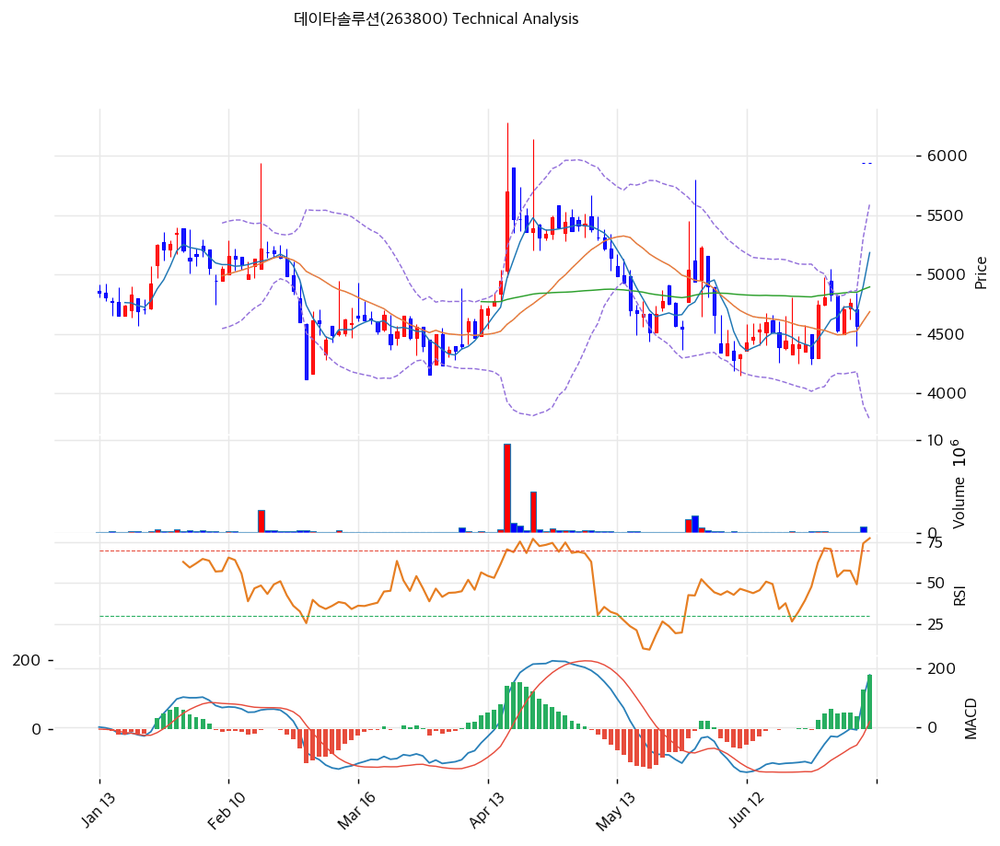

# 기술적분석

2026-07-09 | T2 Technical Analysis

***

## 차트

***

## 1. 가격 현황

| 항목        | 값               |
| --------- | --------------- |
| 현재가       | 5,940원 (0.00%)  |
| 52주 고가    | 5,940원          |
| 52주 저가    | 4,115원          |
| 52주 범위 위치 | 100.0%          |
| 거래량       | 20일 평균 대비 0.00x |

※ 현재가는 52주 신고가와 동일(52주 범위 위치 100.0%). 전일대비 0.00%·거래량 0.00x로 산출되어 있으나, T1에 따르면 직전 거래일(2026-07-08)은 삼성SDS向 4,381억원 공급계약 공시로 상한가(+29.98%)를 기록했다 — 데이터 수집 시점(장 시작 전)의 종가 갱신 지연에 따른 표기상 공백으로 판단되며, 실제 모멘텀은 수치가 시사하는 것보다 훨씬 강했다는 점에 유의해야 한다.

***

## 2. 차트 패턴 분석

### 2.1 캔들스틱 패턴

| 패턴              | 위치                                | 신뢰도 | 해석                                                                               |
| --------------- | --------------------------------- | --- | -------------------------------------------------------------------------------- |
| 장대양봉(갭 동반 상한가)  | 최근 1거래일 (2026-07-08)              | 강   | MA5\~MA200 전 이평선과 볼린저 상단을 동시에 돌파하는 대형 양봉 출현. 뉴스 모멘텀(삼성SDS 계약)과 결합된 강한 매수세 유입 시그널 |
| 위꼬리 장대양봉(별형 유사) | 4월 중순 고점 (4,700원대→6,000원 터치 후 반락) | 중   | 급등 후 상단에서 매도압력 노출, 이후 5\~6월 두 달간 조정 국면의 시발점이 됨                                   |

※ 주요 캔들 패턴: 망치형, 역망치형, 장악형(상승/하락), 도지, 샛별/석별, 적삼병/흑삼병, 하라미, 유성형, 교수형 등

### 2.2 가격 구조 패턴

* **이중바닥(더블바텀) 유사 구조** (신뢰도: 중) 2월 중순 급락 저점(4,100원대)과 6월 중순 저점(4,300\~4,400원대, 피보나치 swing\_low 4,280원과 정합)이 유사한 레벨에서 지지되며 higher-low를 형성했다. 두 저점 사이 넥라인 역할을 했던 4,700\~5,200원대 구간을 7/8 갭상승으로 단숨에 돌파해 구조가 확인됐다.
* **하락 채널(쐐기형) 돌파** (신뢰도: 강) 4월 고점(swing\_high 5,230원) 이후 5\~6월 동안 고점과 저점이 함께 낮아지는 하락 채널이 형성됐다(추세선 데이터: 지지선 기울기 -6.4, 저항선 기울기 -3.18, 둘 다 하락). 저항추세선의 현재 연장값(5,776원)을 현재가(5,940원)가 +2.8% 상회하며 채널 상단을 돌파, 구조적 저항선이 지지선으로 역할 전환될 가능성이 열렸다.
* **볼린저밴드 스퀴즈 후 확장** (신뢰도: 중) 5\~6월 밴드 폭이 축소(스퀴즈)된 이후 이번 급등과 함께 밴드 폭이 38.8%로 재확대됐다. 스퀴즈 이후 확장은 통상 변동성 국면 전환(추세 시작)을 시사하는 패턴이다.

※ 주요 구조 패턴: 이중천정/바닥, 헤드앤숄더(정/역), 삼각수렴(대칭/상승/하락), 쐐기형(상승/하락), 깃발형, 페넌트, 컵앤핸들, 박스권 등

### 2.3 다이버전스

* **RSI 약세(bearish) 모멘텀 다이버전스** (신뢰도: 약) 4월 급등 고점 당시 RSI는 차트상 과매수 임계선(70) 상단까지 치솟았던 것으로 관측된다. 이번에 가격은 그 고점(5,230원, 이후 위꼬리 6,000원 터치)을 명확히 상회하는 신고가(5,940원)를 형성했으나, 현재 RSI(71.3)는 4월 피크 수준을 뚜렷이 넘어서지 못하는 것으로 판독된다 — 가격은 신고가를 경신했지만 모멘텀 지표가 이를 확실히 확인해주지 못하는 다이버전스 여지가 있다. 다만 이는 차트 육안 판독에 근거해 신뢰도는 약하게 부여한다.
* **MACD 다이버전스 부재** MACD 히스토그램(+157)은 가격 상승과 함께 뚜렷이 확대되고 있어 다이버전스 없이 추세와 동행하는 모습이다.

※ RSI·MACD 기반 | 상승 다이버전스 = 가격↓ 지표↑ (반등 시사), 하락 다이버전스 = 가격↑ 지표↓ (하락 시사), 히든 다이버전스 = 기존 추세 지속 시사

### 2.4 패턴 종합 판단

하락 채널과 저항추세선을 대형 양봉 하나로 돌파하고 이중바닥형 넥라인까지 넘어선 것은 구조적으로 명확한 추세 전환 시그널이다. 다만 RSI 71.3의 과매수권 진입, 4월 고점 대비 상대적으로 약한 RSI 피크(약한 모멘텀 다이버전스 가능성), MA 배열이 아직 완전한 정배열로 정비되지 않은 점은 단기 과열에 따른 속도조절·눌림목 가능성을 동시에 시사한다. 캔들·구조 신호는 강한 매수 우위, 다이버전스 신호는 경계 신호로 서로 상충한다.

***

## 3. 이동평균선 — 비정배열 (단기 강세)

| MA    | 값      | 현재가 괴리율 | 위치 |
| ----- | ------ | ------- | -- |
| MA5   | 5,185원 | +14.6%  | 위  |
| MA20  | 4,688원 | +26.7%  | 위  |
| MA60  | 4,896원 | +21.3%  | 위  |
| MA120 | 4,834원 | +22.9%  | 위  |
| MA200 | 5,039원 | +17.9%  | 위  |

**해석**: 현재가는 전 이동평균선 위에 위치하지만, MA20(4,688원)이 MA60·MA120보다 낮아 단기>중기>장기 순의 완전한 정배열은 아니다. 이는 5\~6월 조정 국면의 저가가 MA20에 강하게 반영된 반면 MA60\~200에는 4월 고점대 가격이 아직 남아있는 과도기적 배열 때문이다. 이번 급등으로 향후 며칠 내 MA5>MA20 재정렬이 진행될 전망이며, MA20 이격(+26.7%)은 단기 과열 신호로 병행 해석해야 한다.

***

## 4. 보조 지표

### RSI(14) — 71.3 (🔴과매수)

70 임계선을 소폭 상회하는 과매수권에 진입했으며, 급격한 상승 직후 형성된 수치라는 점에서 단기 되돌림 경계 구간으로 볼 수 있다. 다이버전스 해석은 2.3 참조.

### MACD(12,26,9)

| 항목        | 값            |
| --------- | ------------ |
| MACD      | 179.0        |
| Signal    | 22.0         |
| Histogram | +157.0       |
| 크로스 상태    | 매수 구간 (확대 중) |

**해석**: MACD가 Signal 선을 상회하는 매수 구간에서 히스토그램이 빠르게 확대되고 있어 상승 모멘텀이 강하게 살아있음을 확인. 다이버전스 없이 가격과 동행 중이라는 점은 2.3 참조.

### 볼린저밴드(20, 2σ)

| 항목        | 값            |
| --------- | ------------ |
| 상단        | 5,597원       |
| 중단 (MA20) | 4,688원       |
| 하단        | 3,778원       |
| 밴드 폭      | 38.8%        |
| 현재 위치     | 상단 상회(밴드 이탈) |

**해석**: 현재가(5,940원)는 상단 밴드(5,597원)를 6.0% 상회하는 밴드 이탈 상태로, 원시 데이터의 "상단 근접" 표기보다 강한 과열 신호다(같은 t2\_data 내 수치로 검증). 스퀴즈 이후 밴드 폭이 38.8%까지 재확대돼 변동성 확장 국면에 진입했음을 시사한다.

### 스토캐스틱(14, 3, 3)

| 항목      | 값     |
| ------- | ----- |
| Slow %K | 80.1  |
| Slow %D | 67.6  |
| 크로스 상태  | 골든크로스 |
| 판단      | 과매수   |

***

## 5. 지지/저항 — 추세선 · 피보나치 · PRZ 통합

### 5.1 피보나치 되돌림/확장

| 구분         | 비율    | 가격     | 현재가 대비 |
| ---------- | ----- | ------ | ------ |
| Swing High | —     | 5,230원 | -12.0% |
| 되돌림        | 0.236 | 4,504원 | -24.2% |
| 되돌림        | 0.382 | 4,643원 | -21.8% |
| 되돌림        | 0.5   | 4,755원 | -19.9% |
| 되돌림        | 0.618 | 4,867원 | -18.1% |
| 되돌림        | 0.786 | 5,027원 | -15.4% |
| Swing Low  | —     | 4,280원 | -27.9% |
| 확장         | 1.272 | 4,022원 | -32.3% |
| 확장         | 1.382 | 3,917원 | -34.1% |
| 확장         | 1.618 | 3,693원 | -37.8% |
| 확장         | 2.0   | 3,330원 | -43.9% |

※ 피보나치 기준: 하락 추세 (Swing High 5,230원 → Swing Low 4,280원의 하락폭을 기준으로, 현재는 그 하락폭에 대한 반등 국면을 측정) ※ 되돌림 = 직전 하락폭에서 되돌아온 비율, 확장 = 하락 추세가 지속될 경우의 하방 목표가

현재가(5,940원)는 Swing Low 대비 회복률이 174.7%(=(5,940-4,280)/(5,230-4,280))에 달해, 단순 되돌림 구간을 넘어 Swing High(5,230원) 자체를 이미 12.0% 상회하는 완전한 레인지 이탈 상태다. 위 확장 레벨(3,330\~4,022원)은 하락추세 지속을 전제로 한 하방 목표가로, 이번 상방 돌파로 실현 가능성은 사실상 낮아졌다고 판단된다. 결과적으로 표의 모든 피보나치 레벨은 현재가 하단의 지지 후보로만 기능한다.

### 5.2 추세선

| 추세선 | 방향 | 현재 교차가 | 포인트 수 | 해석                                                                                          |
| --- | -- | ------ | ----- | ------------------------------------------------------------------------------------------- |
| 지지선 | 하락 | 3,814원 | 6개    | 현재가 대비 -35.8% 하방의 원거리 최후 방어선. 즉각적 지지력은 낮음                                                   |
| 저항선 | 하락 | 5,776원 | 6개    | 5\~6월 내내 유효했던 하락저항선을 현재가가 +2.8% 상회 돌파 — 저항에서 지지로 역할 전환(role reversal) 여부가 향후 눌림목의 핵심 관찰 포인트 |

### 5.3 PRZ (Potential Reversal Zone)

| 방향 | 가격 범위         | 신뢰도 | 근거                                                                                                    |
| -- | ------------- | --- | ----------------------------------------------------------------------------------------------------- |
| 지지 | 5,940원(단일가)   | 강   | 피봇 R1·R2·S1·S2 — 전일(7/8) 상한가 록업으로 고가=저가=종가가 동일값(5,940원)이 되며 산출된 아티팩트. 사실상 현재가와 동일해 방향성 판단에는 참고용으로만 활용 |
| 지지 | 5,027\~5,039원 | 약   | 피보나치 0.786 되돌림 + MA200                                                                                |
| 지지 | 4,643\~4,896원 | 강   | 피보나치 0.382/0.5/0.618 되돌림 + MA20/MA60/MA120 (6개 소스 밀집)                                                 |

※ PRZ = 추세선 · 피보나치 · 피봇 · MA 등 복수 지표가 겹치는 가격 구간. 겹치는 소스가 많을수록 반전 확률 상승. 단, 상단 PRZ(5,940원)는 전일 상한가로 인한 피봇 계산 아티팩트이므로 실질 지지 신뢰도는 하단 두 PRZ가 더 높다.

### 5.4 종합 지지/저항 테이블

| 구분      | 가격         | 근거                                                                       |
| ------- | ---------- | ------------------------------------------------------------------------ |
| 저항      | 6,059원     | 52주 고가(5,940원)+2% — 전략 데이터상 익절 목표가. 52주 신고가 경신 직후로 이보다 명확한 상방 저항 데이터는 부재 |
| 저항      | —          | 데이터 부재(신고가 경신 구간)                                                        |
| **현재가** | **5,940원** | —                                                                        |
| 지지      | 5,033원     | PRZ(약) — 피보나치 0.786 되돌림 + MA200                                          |
| 지지      | 4,780원     | PRZ(강) — 피보나치 0.382/0.5/0.618 되돌림 + MA20/MA60/MA120 밀집구간                 |
| 지지      | 3,814원     | 하락추세선 지지(6포인트) — 최후 방어선                                                  |

***

## 6. 시그널 종합

| 지표        | 내용                                                   | 시그널               |
| --------- | ---------------------------------------------------- | ----------------- |
| **차트 패턴** | 하락채널·저항추세선·이중바닥 넥라인 동시 돌파 + 대형 양봉, RSI 모멘텀 다이버전스와 상충 | 🟢                |
| 이동평균선     | 비정배열, MA20 +26.7%                                    | 🟢 (추세) / 🔴 (과열) |
| RSI       | 71.3 — 과매수 🔴                                        | 🔴                |
| MACD      | 매수구간, 히스토그램 확대                                       | 🟢                |
| 볼린저밴드     | 상단 밀착(실질 이탈), 밴드 폭 38.8%                             | ⚪                 |
| 스토캐스틱     | 골든크로스, K=80.1                                        | 🔴                |
| 거래량       | 0.0x — 약함(데이터 아티팩트 가능성, §1 참조)                       | ⚪                 |

**종합 판단**: 🟢 매수 1개 / 🔴 매도 3개 / ⚪ 중립 3개 → **매도우위**

정량 지표 합산은 매도우위로 집계되나, 이는 MA20 이격 과열·RSI 과매수·스토캐스틱 과매수 등 "속도가 너무 빠르다"는 경계 신호가 집중된 결과이지 추세 자체가 꺾였다는 의미는 아니다. 차트 패턴(하락채널·저항추세선 돌파)과 MACD는 뚜렷한 매수 우위를 가리키고 있어, 중기 추세 전환은 유효하되 단기적으로는 과열 해소를 위한 눌림목 가능성에 무게를 두는 것이 합리적이다.

***

## 7. 전략 제안

### 보유 중인 경우

* **비중축소**
* 익절 라인: 6,059원 (근거: 52주 고가 5,940원+2% — 전략 데이터 목표가)
* 손절 라인: 5,940원 (근거: 데이터상 피봇 S2 값이나, 전일 상한가 록업으로 고가=저가=종가가 동일값이 되며 현재가와 일치하는 계산 아티팩트 — 즉시 손절 트리거와 다름없어 실전 활용성은 낮음. 실질적 리스크 관리는 §5.4의 5,033원 또는 4,780원 지지선 활용을 권고)
* 리스크/리워드: 데이터상 산출 불가(분모 0). 참고로 4,780원(PRZ 강)을 대체 손절선으로 적용 시 (6,059-5,940)/(5,940-4,780)=119/1,160 ≈ 0.10:1로 현재가 추격 진입/보유 확대의 손익비는 매우 불리

### 진입 대기인 경우

* **관망**
* 1차 진입가: 5,940원 (데이터상 피봇 S1이나 현재가와 동일값인 계산 아티팩트 — 과매수권 추격 매수는 비권장)
* 2차 진입가: 4,688원 (근거: MA20, §5.4 PRZ 강 구간 4,780원과 인접)
* 진입 조건: RSI 70 하회 등 과매수 해소 + PRZ 강 지지대(4,643\~4,896원) 부근까지 조정 후 거래량 동반 반등 확인 시 분할 진입 검토
