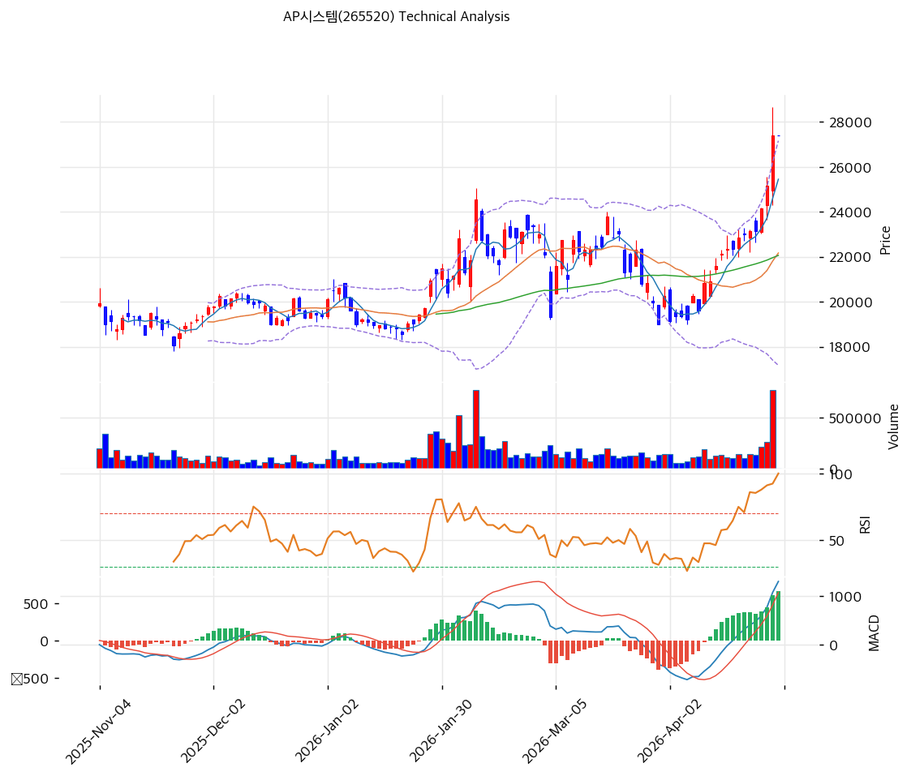

# AP시스템(265520) 기술적 분석

2026-04-29 | T2 Technical Analysis

---

## 차트

---

## 1. 가격 현황

| 항목 | 값 |
|------|-----|
| 현재가 | 27,400원 (0.00%) |
| 52주 고가 | 27,400원 |
| 52주 저가 | 16,100원 |
| 52주 범위 위치 | 100.0% |
| 거래량 | 20일 평균 대비 0.0x (장 마감 시간 기준) |

---

## 2. 차트 패턴 분석

### 2.1 캔들스틱 패턴

| 패턴 | 위치 | 신뢰도 | 해석 |
|------|------|--------|------|
| 52주 신고가 돌파 | 최근 | 강 | 강력한 상승 모멘텀 확인. 신고가 경신은 추세 지속 시그널이나 단기 과열 위험 동반 |
| 상승 장대양봉 연속 | 최근 2주 | 강 | 저점(16,100원)에서 70% 상승 후 신고가 돌파. 매수세 집중 구간 |
| 상단 저항 없는 구간 | 현재가 | 중 | 52주 고가 = 현재가로 상단 저항선 부재. 추세 지속 vs 기술적 과매수 양방향 가능 |

※ 현재가가 52주 신고가와 일치하여 전통적 캔들스틱 패턴보다 추세 강도 분석이 더 유의미

### 2.2 가격 구조 패턴

- **N자형 상승 추세 (신뢰도: 강)**
  16,100원 저점에서 출발해 중간 조정 없이 연속 상승하며 27,400원 신고가 돌파. 피보나치 되돌림 기준점(스윙 하이 23,800원, 스윙 로우 19,010원)이 최근 조정 구간을 나타내며, 그 이후 강한 반등으로 신고가를 경신했다. 목표가는 직전 박스권 상단 돌파 이후 확장 구간으로 설정이 어려우나, 추세선 저항(24,753원)을 이미 상향 돌파한 상태.

- **박스권 상단 돌파 후 신고가 진입 (신뢰도: 중)**
  직전 저항선(약 24,000~25,000원 구간)을 강하게 돌파하며 신고가 진입. 박스권 상단이 지지대로 전환될 경우 24,000~25,000원이 1차 지지 구간이 된다.

### 2.3 다이버전스

- **RSI 상승 다이버전스 없음 / 과매수 구간** (신뢰도: 강)
  RSI 77.7로 과매수 영역 진입. 현재 가격이 52주 신고가이므로 단기 하락 다이버전스가 형성될 가능성이 높다. MACD 히스토그램이 확대 중이므로 단기 추세는 유지되나, RSI 과매수는 단기 조정 위험 신호.

- **스토캐스틱 데드크로스** (신뢰도: 중)
  K=88.5, D=91.6로 과매수 구간에서 데드크로스 형성. 단기 모멘텀 약화 시사. 추세 전환보다는 횡보·소폭 조정 가능성.

### 2.4 패턴 종합 판단

현재 차트는 **단기 강세이나 과열 상태**다. 52주 신고가 돌파로 상승 추세가 유효하고, MACD 히스토그램 확대로 모멘텀이 살아있다. 그러나 RSI 77.7, 스토캐스틱 과매수+데드크로스, MA20 괴리율 +23.6%는 단기 조정 위험을 경고한다. 상충 시그널: 추세 지속(MACD 매수) vs 과열 조정(RSI, 스토캐스틱, MA괴리율).

---

## 3. 이동평균선 — 정배열 (강세)

| MA | 값 | 현재가 괴리율 | 위치 |
|----|-----|--------------|------|
| MA5 | 25,450원 | +7.7% | 위 |
| MA20 | 22,166원 | +23.6% | 위 |
| MA60 | 22,061원 | +24.2% | 위 |
| MA120 | 20,755원 | +32.0% | 위 |
| MA200 | 19,908원 | +37.6% | 위 |

**해석**: MA5~MA200 완전 정배열로 중장기 상승 추세가 확립됐다. 다만 MA20 괴리율 +23.6%, MA200 괴리율 +37.6%는 단기 과열 영역이다. 통상 MA20 괴리율 20% 초과는 평균회귀 압력 구간으로, 단기 조정 또는 횡보로 마진콜 소화 가능성이 높다. 현재 MA20(22,166원)이 1차 지지선, MA60(22,061원)이 2차 지지선.

---

## 4. 보조 지표

### RSI(14) — 77.7 (🔴과매수)

RSI 77.7로 과매수 구간(70 초과)에 진입했으며, 신고가 달성 구간에서 단기적 모멘텀은 강하나 평균회귀 위험이 공존한다.

### MACD(12,26,9)

| 항목 | 값 |
|------|-----|
| MACD | 1,308 |
| Signal | 644 |
| Histogram | +664 |
| 크로스 상태 | 매수 구간 (확대 중) |

**해석**: MACD가 시그널 라인 위에서 히스토그램이 확대되고 있어 상승 모멘텀이 지속 중이다. 히스토그램 확대 추세가 꺾이는 시점이 단기 고점 형성 신호가 될 수 있다.

### 볼린저밴드(20, 2σ)

| 항목 | 값 |
|------|-----|
| 상단 | 27,163원 |
| 중단 (MA20) | 22,166원 |
| 하단 | 17,170원 |
| 밴드 폭 | 45.1% |
| 현재 위치 | 상단 근접 (상단 초과) |

**해석**: 현재가(27,400원)가 볼린저밴드 상단(27,163원)을 상향 돌파한 상태다. 밴드 폭 45.1%로 이미 크게 확장됐고, 상단 이탈은 강한 추세 지속 또는 단기 과열 후 되돌림 신호로 해석된다. 되돌림 시 밴드 중단(22,166원)이 1차 지지 목표.

### 스토캐스틱(14, 3, 3)

| 항목 | 값 |
|------|-----|
| Slow %K | 88.5 |
| Slow %D | 91.6 |
| 크로스 상태 | 데드크로스 |
| 판단 | 과매수 |

---

## 5. 지지/저항 — 추세선 · 피보나치 · PRZ 통합

### 5.1 피보나치 되돌림/확장

| 구분 | 비율 | 가격 | 현재가 대비 |
|------|------|------|-----------|
| Swing High | — | 23,800원 | — |
| 되돌림 | 0.236 | 20,140원 | -26.5% |
| 되돌림 | 0.382 | 20,840원 | -24.0% |
| 되돌림 | 0.5 | 21,405원 | -21.9% |
| 되돌림 | 0.618 | 21,970원 | -19.8% |
| 되돌림 | 0.786 | 22,775원 | -16.9% |
| Swing Low | — | 19,010원 | — |
| 확장 | 1.272 | 17,707원 | -35.4% |
| 확장 | 1.382 | 17,180원 | -37.3% |
| 확장 | 1.618 | 16,050원 | -41.4% |
| 확장 | 2.0 | 14,220원 | -48.1% |

※ 피보나치 기준: 하락 추세 되돌림 (Swing Low 19,010원 → Swing High 23,800원). 현재가는 Swing High를 이미 초과하여 피보나치 확장보다 신규 구조 형성 중

### 5.2 추세선

| 추세선 | 방향 | 현재 교차가 | 포인트 수 | 해석 |
|--------|------|-----------|---------|------|
| 지지선 | 상승 | 19,456원 | 6개 | 저점 연결 상승 추세선. 주요 하방 방어선 |
| 저항선 | 상승 | 24,753원 | 6개 | 이미 상향 돌파. 이후 지지선으로 전환 가능 |

### 5.3 PRZ (Potential Reversal Zone)

| 방향 | 가격 범위 | 신뢰도 | 근거 |
|------|---------|--------|------|
| 지지 | 27,400원 (현재가) | 강 | 피봇 R1·R2·S1·S2 집중 |
| 지지 | 21,970~22,166원 | 중 | 피보나치 0.618 되돌림 + MA60 + MA20 |
| 지지 | 20,755~20,840원 | 약 | MA120 + 피보나치 0.382 되돌림 |
| 지지 | 19,456~20,140원 | 중 | 추세선 지지 + MA200 + 피보나치 0.236 |

### 5.4 종합 지지/저항 테이블

| 구분 | 가격 | 근거 |
|------|------|------|
| 저항 | 27,400원 | 52주 고가 = 현재가 (신고가 돌파 중) |
| 저항 | 24,753원 | 추세선 저항 (이미 상향 돌파, 지지 전환 가능) |
| **현재가** | **27,400원** | — |
| 지지 | 24,753원 | 상향 돌파한 추세선 저항 → 지지 전환 |
| 지지 | 22,066원 | PRZ 중 — 피보나치 0.618 + MA60 + MA20 |
| 지지 | 20,798원 | PRZ 약 — MA120 + 피보나치 0.382 |
| 지지 | 19,835원 | PRZ 중 — 추세선 지지 + MA200 + 피보나치 0.236 |

---

## 6. 시그널 종합

| 지표 | 내용 | 시그널 |
|------|------|--------|
| **차트 패턴** | 52주 신고가 돌파, 정배열, MACD 확대 vs RSI+스토캐스틱 과매수 | ⚪ |
| 이동평균선 | 완전 정배열, MA20 +23.6% 과열 | 🟢 |
| RSI | 77.7 — 과매수 🔴 | 🔴 |
| MACD | 매수 구간, 히스토그램 확대 중 | 🟢 |
| 볼린저밴드 | 상단 초과, 밴드 폭 45.1% 확장 | ⚪ |
| 스토캐스틱 | 데드크로스, K=88.5 과매수 | 🔴 |
| 거래량 | 0.0x — 데이터 미수신 | ⚪ |

**종합 판단**: 🟢 매수 2개 / 🔴 매도 2개 / ⚪ 중립 3개 → **중립 (과열 경고)**

추세 방향은 상승이나 RSI 77.7, 스토캐스틱 데드크로스, MA20 괴리율 23.6% 등 단기 과열 지표가 복수 확인된다. 신고가 돌파 후 거래량 동반 여부와 재료(HBM 수주 등)가 주가 방향성을 결정할 것이다. 단기 조정 시 24,753원(구 저항→지지 전환) → 22,066원(PRZ 중) 순서로 지지를 확인하는 전략이 적절하다.

---

## 7. 전략 제안

### 보유 중인 경우
- **비중축소** (단기 과열)
- 익절 라인: 신고가 돌파 지속 시 목표가 없음 (추세 추종) / 보수적 익절: 27,400원 부근
- 손절 라인: 24,753원 하향 이탈 시 (상향 돌파한 추세선 저항 하회)
- 리스크/리워드: 상단 저항 없는 신고가 구간으로 단기 리워드 제한적, 조정 시 -10~-20% 리스크

### 진입 대기인 경우
- **관망** (과열 조정 대기)
- 1차 진입가: 24,500~24,800원 (구 추세선 저항 지지 전환 확인 후)
- 2차 진입가: 22,000~22,200원 (PRZ 중 — MA20·MA60·피보나치 0.618 집중)
- 진입 조건: 조정 후 거래량 감소 확인 + 지지 구간에서 반등 캔들 확인
