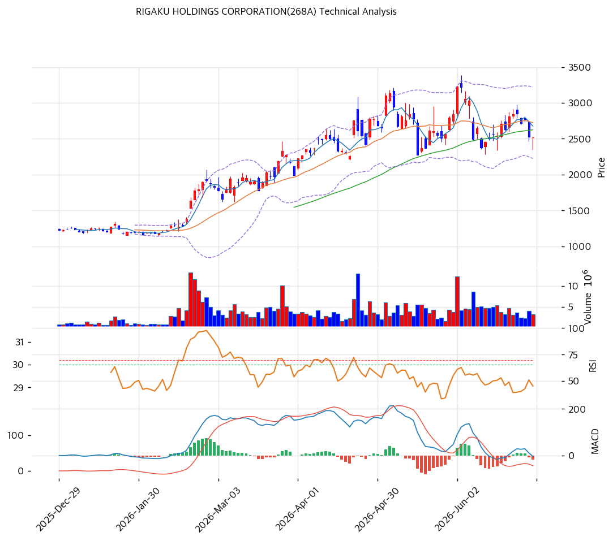

# RIGAKU HOLDINGS(268A) 기술적 분석

## 차트

## 가격 현황

| 항목 | 값 |
|---|---|
| 현재가 | **¥2,522** (-0.18%) |
| 52주 고/저 | ¥3,227 / ¥698 |
| 52주 위치 | 72.1% |
| RSI | 45.1 (중립) |
| MACD | -3 / 15 / -18 (매도) |
| Stochastic | K=46.6 D=54.0 데드크로스 (중립) |
| 볼린저 | 폭 36.7%, 중간 (중단 ¥2,725 아래) |
| 거래량 | 20일 평균 대비 0.68x |

## 이동평균선

| MA | 가격(¥) | 갭(%) | 위치 |
|---|--:|--:|---|
| MA5 | 2,677 | -5.8% | 아래 |
| MA20 | 2,725 | -7.4% | 아래 |
| MA60 | 2,625 | -3.9% | 아래 |
| MA120 | 2,085 | +21.0% | 위 |
| MA200 | 1,639 | +53.9% | 위 |

→ **비정배열 (단기 약세 · 장기 강세 혼조)**. 현재가가 단기선(MA5·20·60) 아래, 장기선(MA120·200) 위. IPO(2024.10) 후 ¥3,400까지 급등한 뒤 조정 중 — 단기 추세는 꺾였으나 장기 상승 구조는 유지. MA120(¥2,085)이 핵심 하방 지지.

## 시그널 종합

| 구분 | 카운트 |
|---|--:|
| 매수 | 0 |
| 매도 | 1 (MACD) |
| 중립 | 5 (이평·RSI·볼린저·스토캐스틱·거래량) |
| **결론** | **매도우위 (단기 조정)** |

## 지지·저항

| 구분 | 가격(¥) | 근거 |
|---|--:|---|
| 강 저항 | 3,227 | 52주 고가 |
| 저항 | 2,581\~2,725 | **PRZ(강)** — 피보 0.236/0.382, 피봇 R1/R2, MA5/20/60, 추세선 (8개 중첩 매물벽) |
| **현재가** | **¥2,522** | — |
| 지지 | 2,402 | 피봇 S1 |
| 지지 | 2,282 | 피봇 S2 |
| 강 지지 | 2,058\~2,085 | MA120 + 피보 1.382 확장 (PRZ 약) |

## 전략

| 시나리오 | 액션 |
|---|---|
| 보유자 | 비중축소 (TP ¥3,292 / SL ¥2,282) — 저항벽 돌파 전 보수적 |
| 신규 진입 1차 | ¥2,402 (피봇 S1 되돌림) |
| 신규 진입 2차 | ¥2,725 (MA20·PRZ 돌파 확인 후 추격) |
| 매도 트리거 | MA120(¥2,085) 종가 이탈 (장기 추세 훼손) |

## 핵심 판단

268A는 2024년 10월 IPO 후 ¥1,230 → ¥3,400까지 급등했다가 **¥2,400\~2,600 박스로 조정 중**이다. 현재가 ¥2,522는 단기 이평선(MA5·20·60 ¥2,625\~2,725) 아래에 있고 MACD가 매도 구간이라 **단기 모멘텀은 약세**다. 특히 바로 위 **¥2,581\~2,725 구간에 피보·피봇·MA·추세선 8개가 중첩된 강한 저항벽(PRZ 강)** 이 있어 반등이 번번이 막히는 구조 — 이를 거래량 동반 돌파해야 추세 재개가 가능하다. 다만 장기선(MA120 ¥2,085, MA200 ¥1,639) 위에 있어 큰 그림의 상승 구조는 유지되며, MA120이 무너지지 않는 한 조정 국면으로 본다. **Carlyle 셀다운 수급 부담이 단기 약세의 배경**일 수 있어 거래량·블록딜 공시를 함께 봐야 한다.
