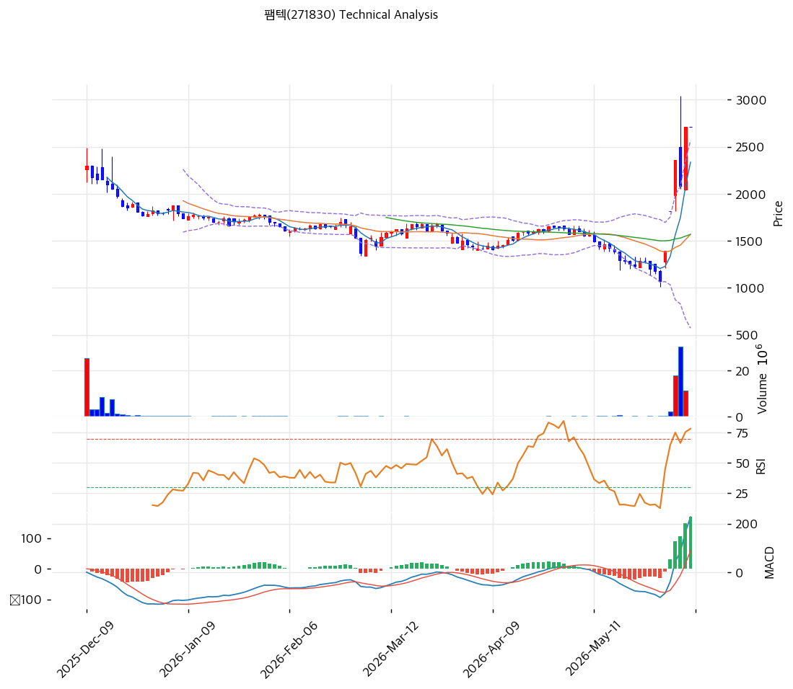

# 팸텍(271830) 기술적 분석 보고서

---

## 가격 위치

현재가 **2,710원** (보합) — 52주 위치 90.8% (고가 2,875원 / 저가 1,075원). 1년 **+152%** (1,075→2,710). **최근 수직 급등** — MA20(1,569원) 대비 +72.7%로 단기 폭등(반도체 자동화 전환 기대). RSI 75.5 과매수, BB 폭 127.2% 극단. 외국인 -71.3만주 매도. 펀더멘털(적자·매출 붕괴) 대비 급등.

## 이동평균선

| 이평선 | 값 | 이격도 | 위치 |
|------|---:|----:|:---:|
| MA5 | 2,336원 | +16.0% | 위 |
| MA20 | 1,569원 | +72.7% | 위 |
| MA60 | 1,568원 | +72.8% | 위 |
| MA120 | 1,659원 | +63.4% | 위 |
| MA200 | 1,802원 | +50.4% | 위 |

**역배열 해소 직후 수직 급등(aligned False)** — MA20·MA60·MA120·MA200이 1,570\~1,800원에 밀집한 가운데 현재가가 +50\~73% 위로 수직 이탈. **최근 단기 급등이 극단적**으로, 이격이 매우 커 조정 위험이 높음.

## 모멘텀 지표

- **RSI 75.5 (과매수 🔴)** — 70 초과 과매수. 단기 조정 압력 큼
- **MACD 228 / 시그널 59 / 히스토 +169** — 매수 + 강한 확장(급등 모멘텀)
- **스토캐스틱 K=73.3 / D=78.8** — 데드크로스, 과매수 경계
- **볼린저밴드** — 상단 2,567 / 중심 1,569 / 하단 571, 폭 **127.2% 극단**, 상단 돌파. 변동성 폭발
- **거래량비** — 당일 데이터 공백(보합)

## 피보나치 되돌림 (스윙 1,075 / 2,875)

| 레벨 | 가격 | 성격 |
|------|---:|------|
| 0.236 | 2,450원 | 1차 지지 (MA5 근접) |
| 0.382 | 2,187원 | 2차 지지 |
| 0.5 | 1,975원 | 중기 지지 |
| 0.618 | 1,763원 | 깊은 조정 (MA200 근접) |
| 0.786 | 1,460원 | 추가 조정 |

## 지지/저항 (S&R)

- **저항**: 2,875원(52주 고가) / 2,932원(전략 TP) |
- **지지**: 2,450원(피보 0.236) / **2,336원(MA5)** / 2,187원(피보 0.382) / 1,975원(피보 0.5) / **1,569원(MA20·MA60)**

## 종합 시그널 & 전략

**시그널: 매수 1 / 매도 2 / 중립 4 → 매도우위** (수직 급등 + 과매수)

- **전략**: HOLD(비중축소) — **TP 2,932원 / SL 2,710원**. WAIT(관망) e1 2,710원 / e2 1,569원
- **눌림목 매수**: 1년 +152% + MA20 대비 +72.7% 수직 급등 + RSI 75.5 + BB 127% 극단으로 **추격 강력 비추**. 펀더멘털(적자·매출 붕괴) 대비 과열. 급등 소화 후 **피보 0.236 2,450원 ~ 0.382 2,187원 분할(투기적)**, 깊은 조정 시 MA20 1,569원
- **상방**: 52주 고가 2,875원 돌파 시 2,932원. 반도체 자동화 수주 모멘텀이 유일 동력
- **하방**: MA5 2,336원 이탈 시 2,187원(피보 0.382) → 1,975원(0.5). 단기 급등 되돌림 위험 큼
- **변곡점**: 반도체 자동화(EFEM/Sorter) 양산 수주 가시화가 추세 핵심. 수직 급등·과매수로 단기 조정 가능성 높아 비중·손절 엄격, 투기적 접근
