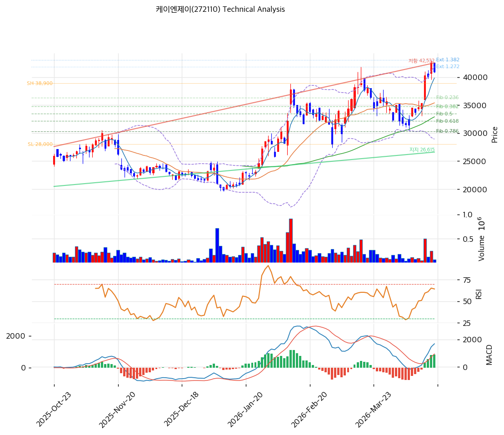

# 케이엔제이(272110) 기술적 분석

2026-04-17 | T2 Technical Analysis

---

## 차트

---

## 1. 가격 현황

| 항목 | 값 |
|------|-----|
| 현재가 | 40,950원 (-3.76%) |
| 52주 고가 | 42,550원 |
| 52주 저가 | 14,470원 |
| 52주 범위 위치 | 94.3% |
| 거래량 | 20일 평균 대비 0.51x |

---

## 2. 차트 패턴 분석

### 2.1 캔들스틱 패턴

| 패턴 | 위치 | 신뢰도 | 해석 |
|------|------|--------|------|
| 음봉 (대음봉) | 당일 (2026-04-17) | 중 | -3.76% 하락 마감으로 단기 차익 실현 압력 출현, 52주 고가 근접 구간에서 매도세 우위 |
| 상승 추세 지속 | 최근 3개월 | 강 | 저점과 고점을 모두 높이는 상승 추세 유지 중, 단기 조정은 추세 훼손 아님 |

※ 주요 캔들 패턴: 망치형, 역망치형, 장악형(상승/하락), 도지, 샛별/석별, 적삼병/흑삼병, 하라미, 유성형, 교수형 등

### 2.2 가격 구조 패턴

- **상승 추세 채널** (신뢰도: 강)
  지지선(기울기 +51.5원/일, 현재 26,615원)과 저항선(기울기 +125.5원/일, 현재 42,532원)이 각 6개 포인트로 형성된 중기 상승 채널. 현재가 40,950원은 채널 상단(42,532원) 근처에 위치해 있어 단기 저항 압력이 존재한다. 채널 하단 재접촉 시 매수 기회 구간이 될 수 있다.

- **52주 고가 저항권** (신뢰도: 강)
  42,550원(52주 고가) 직전에 위치한 구조로, 신고가 돌파를 위한 에너지 축적이 필요하다. 현재가 기준 94.3% 위치는 과열 가능성을 내포하나, 거래량이 0.51x로 낮아 공격적 매도보다는 관망 분위기에 가깝다.

※ 주요 구조 패턴: 이중천정/바닥, 헤드앤숄더(정/역), 삼각수렴(대칭/상승/하락), 쐐기형(상승/하락), 깃발형, 페넌트, 컵앤핸들, 박스권 등

### 2.3 다이버전스

- **MACD 히든 상승 다이버전스** (신뢰도: 중)
  가격은 직전 고점과 유사한 수준이나 MACD 히스토그램이 823으로 확대 중 — 상승 추세 지속을 시사하는 히든 다이버전스 구조. 모멘텀이 약화되지 않고 있음을 지지한다.

- **스토캐스틱 과매수 경고** (신뢰도: 중)
  Slow %K 89.7, %D 88.4로 골든크로스 상태이나 과매수 구간(80 이상)에 진입. 단기 조정 가능성 시사. 하락 다이버전스 형성 여부를 추가 확인 필요.

※ RSI·MACD 기반 | 상승 다이버전스 = 가격↓ 지표↑ (반등 시사), 하락 다이버전스 = 가격↑ 지표↓ (하락 시사), 히든 다이버전스 = 기존 추세 지속 시사

### 2.4 패턴 종합 판단

중기 상승 추세 채널이 유효하게 작동 중이며 MACD 히스토그램 확대가 추세 지속을 지지한다. 그러나 스토캐스틱 과매수(K=89.7)와 52주 고가 근접(94.3%)이 상충 신호로 작용하여 단기적으로는 저항 구간 진입 상태다. 거래량이 0.51x로 낮아 현재 상승이 강한 매수세보다는 매도 부재 속 유지 중임을 시사한다.

---

## 3. 이동평균선 — 정배열 (강세)

| MA | 값 | 현재가 괴리율 | 위치 |
|----|-----|--------------|------|
| MA5 | 39,840원 | +2.8% | 위 |
| MA20 | 35,395원 | +15.7% | 위 |
| MA60 | 32,901원 | +24.5% | 위 |
| MA120 | 28,514원 | +43.6% | 위 |
| MA200 | 25,182원 | +62.6% | 위 |

**해석**: MA5→MA20→MA60→MA120→MA200 완전 정배열로 강세 추세가 확인된다. 현재가는 MA200 대비 +62.6%의 거리로 단기 과열 수준에 근접하나, 중·장기 추세는 여전히 상향을 유지한다. MA20(35,395원)이 첫 번째 주요 지지선으로, 이를 하회하지 않는 한 중기 상승 추세는 유효하다.

---

## 4. 보조 지표

### RSI(14) — 63.1 (중립)

RSI 63.1은 과매수(70) 근방이나 아직 진입하지 않은 중립-강세 전환 구간으로, 추가 상승 여력이 남아 있음을 시사하되 70 돌파 시 단기 경계가 필요하다.

### MACD(12,26,9)

| 항목 | 값 |
|------|-----|
| MACD | 1,687 |
| Signal | 863 |
| Histogram | +823 |
| 크로스 상태 | 매수 구간 (확대 중) |

**해석**: MACD가 Signal을 상향 돌파한 매수 구간에서 히스토그램이 +823으로 확대 중 — 상승 모멘텀이 가속되고 있음을 나타낸다.

### 볼린저밴드(20, 2σ)

| 항목 | 값 |
|------|-----|
| 상단 | 41,869원 |
| 중단 (MA20) | 35,395원 |
| 하단 | 28,921원 |
| 밴드 폭 | 36.6% |
| 현재 위치 | 상단 근접 |

**해석**: 밴드 폭 36.6%로 확장 국면이며 현재가가 상단(41,869원)에 근접. 상단 이탈 시 단기 과열 신호이나, 강한 추세에서는 상단을 타고 오르는 패턴도 가능하다. 밴드 중단(35,395원) 재접촉 시 매수 기회 구간이다.

### 스토캐스틱(14, 3, 3)

| 항목 | 값 |
|------|-----|
| Slow %K | 89.7 |
| Slow %D | 88.4 |
| 크로스 상태 | 골든크로스 |
| 판단 | 과매수 |

---

## 5. 지지/저항 — 추세선 · 피보나치 · PRZ 통합

### 5.1 피보나치 되돌림/확장

| 구분 | 비율 | 가격 | 현재가 대비 |
|------|------|------|-----------|
| Swing High | — | 38,900원 | — |
| 되돌림 | 0.236 | 36,328원 | -11.3% |
| 되돌림 | 0.382 | 34,736원 | -15.2% |
| 되돌림 | 0.5 | 33,450원 | -18.3% |
| 되돌림 | 0.618 | 32,164원 | -21.5% |
| 되돌림 | 0.786 | 30,333원 | -25.9% |
| Swing Low | — | 28,000원 | — |
| 확장 | 1.272 | 41,865원 | +2.2% |
| 확장 | 1.382 | 43,064원 | +5.2% |
| 확장 | 1.618 | 45,636원 | +11.4% |
| 확장 | 2.0 | 49,800원 | +21.6% |

※ 피보나치 기준: 상승 추세 (Swing Low 28,000원 → Swing High 38,900원)
※ 되돌림 = 직전 추세에서 되돌아온 비율, 확장 = 추세 방향 목표가

### 5.2 추세선

| 추세선 | 방향 | 현재 교차가 | 포인트 수 | 해석 |
|--------|------|-----------|---------|------|
| 지지선 | 상승 | 26,615원 | 6개 | 장기 우상향 지지선. 현재가보다 크게 낮아 급락 시 최종 지지 구간 |
| 저항선 | 상승 | 42,532원 | 6개 | 현재가 바로 위의 채널 상단 저항. 돌파 시 추세 가속 기대 |

### 5.3 PRZ (Potential Reversal Zone)

| 방향 | 가격 범위 | 신뢰도 | 근거 |
|------|---------|--------|------|
| 지지 | 39,617~40,283원 | 중 | 피봇 S2 + MA5 + 피봇 S1 |
| 저항 | 41,865~43,217원 | 강 | 피보나치 1.272 확장 + 피봇 R1 + 추세선 저항 + 피보나치 1.382 확장 + 피봇 R2 |
| 지지 | 34,736~35,395원 | 약 | 피보나치 0.382 되돌림 + MA20 |
| 지지 | 32,164~33,450원 | 중 | 피보나치 0.618 되돌림 + MA60 + 피보나치 0.5 되돌림 |

※ PRZ = 추세선 · 피보나치 · 피봇 · MA 등 복수 지표가 겹치는 가격 구간. 겹치는 소스가 많을수록 반전 확률 상승.

### 5.4 종합 지지/저항 테이블

| 구분 | 가격 | 근거 |
|------|------|------|
| 저항 | 43,217원 | 피봇 R2 / 피보나치 1.382 확장 |
| 저항 | 42,550원 | 52주 고가 |
| 저항 | 41,865~43,217원 | PRZ (강) — 피보나치 1.272·1.382 확장 + 피봇 R1·R2 + 추세선 저항 |
| **현재가** | **40,950원** | — |
| 지지 | 39,617~40,283원 | PRZ (중) — 피봇 S1·S2 + MA5 |
| 지지 | 35,395원 | MA20 / PRZ (약) 피보나치 0.382 |
| 지지 | 32,164~33,450원 | PRZ (중) — 피보나치 0.5·0.618 + MA60 |
| 지지 | 26,615원 | 장기 상승 추세선 |

---

## 6. 시그널 종합

| 지표 | 내용 | 시그널 |
|------|------|--------|
| **차트 패턴** | 상승 채널 유지, 52주 고가 근접 저항 | ⚪ |
| 이동평균선 | 완전 정배열, MA20 +15.7% | 🟢 |
| RSI | 63.1 — 중립 (과매수 근접) | ⚪ |
| MACD | 매수구간, 히스토그램 +823 확대 | 🟢 |
| 볼린저밴드 | 상단 근접(41,869원), 밴드폭 36.6% | ⚪ |
| 스토캐스틱 | 골든크로스, K=89.7 과매수 | 🔴 |
| 거래량 | 0.51x — 약함 | ⚪ |

**종합 판단**: 🟢 매수 2개 / 🔴 매도 1개 / ⚪ 중립 4개 → **매수우위 (약)**

중기 추세는 명확히 상향이나 단기적으로는 52주 고가(42,550원)와 저항 PRZ(41,865~43,217원) 앞에서 숨 고르기 국면에 진입했다. MACD 모멘텀은 긍정적이지만 스토캐스틱 과매수와 거래량 부진이 단기 추가 상승의 동력을 제한한다. 조정 후 39,617~40,283원 PRZ 지지 확인 시 재진입 기회를 제공할 것으로 판단된다.

---

## 7. 전략 제안

### 보유 중인 경우
- **홀드**
- 익절 라인: 43,401원 (피보나치 1.382 확장 43,064원 + 여유, 저항 PRZ 상단 기준)
- 손절 라인: 39,617원 (PRZ 중 하단, 피봇 S2 이탈 시)
- 리스크/리워드: 약 1:1.5

### 진입 대기인 경우
- **관망 후 조정 시 진입**
- 1차 진입가: 40,283원 (피봇 S1, PRZ 중 상단)
- 2차 진입가: 35,395원 (MA20, PRZ 약 구간)
- 진입 조건: 1차 진입 시 거래량 동반 양봉 확인 필수; 단순 가격 도달만으로 진입 자제
