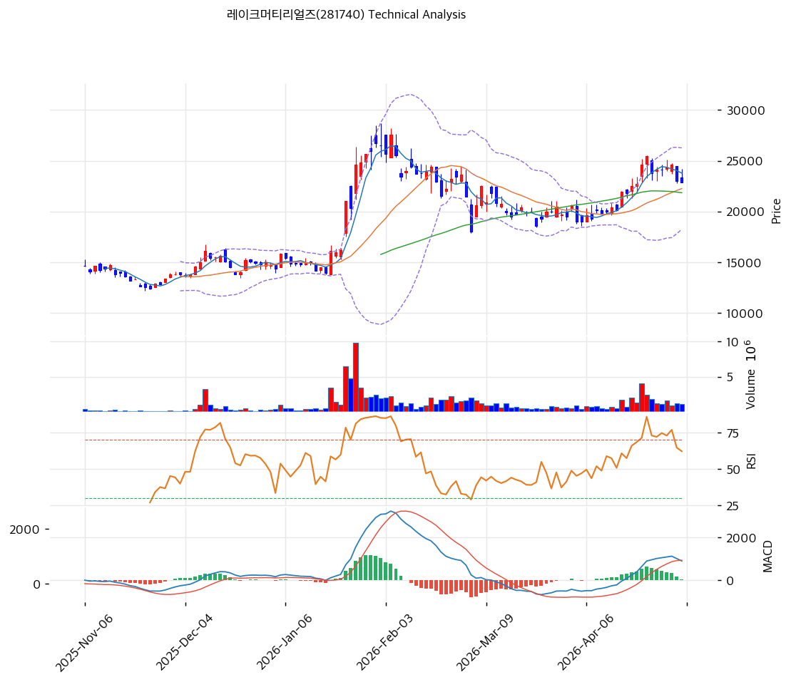

# 레이크머티리얼즈(281740) 기술적 분석

2026-05-05 | T2 Technical Analysis

---

## 차트

---

## 1. 가격 현황

| 항목 | 값 |
|------|-----|
| 현재가 | 22,850원 (-0.65%) |
| 52주 고가 | 27,550원 |
| 52주 저가 | 11,220원 |
| 52주 범위 위치 | 71.2% |
| 거래량 | 20일 평균 대비 0.90x |

---

## 2. 차트 패턴 분석

### 2.1 캔들스틱 패턴

| 패턴 | 위치 | 신뢰도 | 해석 |
|------|------|--------|------|
| 흑삼병(Three Black Crows) 유사 | 최근 3~4일 (4월 말) | 중 | MA5(23,780원) 아래로 음봉 연속 출현 — 단기 매도 우위 시그널 |
| 유성형(Shooting Star) | 4월 중순 25,500원 부근 | 중 | 우측 어깨 고점 직후 윗꼬리 음봉 — 단기 저항 확인 후 조정 진입 매도 시그널 |
| 장악형 음봉(Bearish Engulfing) 유사 | 직전 2거래일 | 약 | 전일 양봉 몸통을 음봉이 덮음 — 단기 모멘텀 둔화, 매도 우위로 전환 |

※ 2월 초 30,000원 급등 시 갭 상승 + 장대양봉이 출현했으나 후속 거래량이 따라오지 못하며 빠르게 소진된 점이 현재 추세 약화의 원인으로 작용.

### 2.2 가격 구조 패턴

- **헤드앤숄더(Head & Shoulders) 형성 진행** (신뢰도: 중)
  좌측 어깨(1월 중순 ~25,500원) → 헤드(2월 초 ~30,000원/52주 고가 27,550원 근접 영역) → 우측 어깨(4월 중하순 ~25,500원)의 3봉 구조가 관찰됨. 넥라인은 약 21,500~22,000원 영역(2월 말~3월 중순 저점 연결선). 넥라인 이탈 시 측정 목표가는 약 13,500~14,000원(헤드 고점 - 넥라인 폭). 단, 거래량 패턴(헤드 고점에서 최대 → 우측 어깨에서 감소)이 정통 패턴과 일치하여 신뢰도는 중간 수준.

- **상승 추세선 위 박스권 조정** (신뢰도: 중)
  장기 상승 추세선(저점 기울기 +32.15원/일, 6개 포인트 확인)은 여전히 살아 있고 현재가는 추세선(약 17,230원) 대비 +32.6% 위에 위치. 단기적으로는 22,000~24,000원 박스권 조정 양상. 박스 상단 24,000원(피봇 R2 근처) 돌파 시 추세 재개, 박스 하단 22,000원 이탈 시 헤드앤숄더 넥라인 이탈로 연결되어 추세 전환 위험.

- **2월 갭 상승 미메움(Unfilled Gap)** (신뢰도: 약)
  1월 말 ~17,000원대에서 2월 초 ~22,000원대로 점프한 갭 영역(약 17,500~21,500원)은 미메움 상태로 잠재적 자석 역할. 헤드앤숄더 넥라인 이탈 시 이 갭이 1차 메움 타깃이 될 수 있음.

### 2.3 다이버전스

- **RSI 약한 하락 다이버전스** (신뢰도: 약)
  2월 초 헤드 고점(가격 ~30,000원)에서 RSI는 80 부근까지 급등. 이후 4월 우측 어깨 고점(가격 ~25,500원, 헤드 대비 낮음)에서 RSI는 60대 후반에 머물며 동반 하락. 가격이 헤드 고점을 넘지 못한 상태에서 RSI가 낮아진 점은 정통 하락 다이버전스의 변형된 형태로, 상승 모멘텀 약화를 시사.

- **MACD 히든 약세 신호** (신뢰도: 중)
  2월 초 MACD 히스토그램 +1,500 부근에서 정점 형성 후, 3월 음수 영역 깊은 하락(-1,000 부근)을 거쳐 4월 다시 +44 수준의 약한 양전환 회복. 현재 매수구간이지만 히스토그램이 확대되지 못하고 수축(expand=False) 중이며 히스토그램 절대값은 직전 고점의 1/30 수준으로, 모멘텀 회복 강도가 제한적.

※ 정통적 의미의 "가격 신고가 + 지표 미신고가" 형태의 강한 하락 다이버전스는 부재하나, 헤드앤숄더 형성 과정에서 모멘텀 지표가 같이 약화되는 흐름이 확인됨.

### 2.4 패턴 종합 판단

캔들스틱(흑삼병/유성형 — 단기 매도)과 가격구조(헤드앤숄더 우측 어깨 형성 — 중기 약세 가능성), 그리고 모멘텀 다이버전스(RSI/MACD 회복 강도 제한)가 모두 **단기 조정 지속**을 시사한다. 다만 장기 상승 추세선이 여전히 유효하고 MA20/60/120/200 정배열이 유지되므로, 헤드앤숄더 넥라인(약 22,000원)을 거래량 동반 이탈하기 전까지는 **중기 정배열 안에서의 단기 약세** 국면으로 해석. 22,000원 지지가 깨지면 추세 전환 시그널로 격상.

---

## 3. 이동평균선 — 정배열 (강세)

| MA | 값 | 현재가 괴리율 | 위치 |
|----|-----|--------------|------|
| MA5 | 23,780원 | -3.9% | 아래 |
| MA20 | 22,258원 | +2.7% | 위 |
| MA60 | 21,846원 | +4.6% | 위 |
| MA120 | 18,806원 | +21.5% | 위 |
| MA200 | 16,468원 | +38.8% | 위 |

**해석**: MA20 < MA60 < MA120 < MA200 순서가 깨진 부분은 MA5만이며, MA20 이하 장기 이평은 모두 정배열을 유지(중기 강세). 단기적으로는 MA5 아래로 하락하여 단기 모멘텀 둔화가 확인되지만, MA20(22,258원)이 1차 지지로 살아 있고 MA60(21,846원)이 2차 지지로 받쳐주는 다층 구조. MA200 대비 +38.8% 괴리는 장기적 과열 구간 진입 신호로 일정 부분 평균회귀(조정) 압력이 존재.

---

## 4. 보조 지표

### RSI(14) — 53.1 (중립)

50선 위에서 횡보 중인 중립 구간. 2월 초 80 부근 과매수 → 3월 30대 과매도 → 4월 60대 회복 → 현재 50대 중반 하락 진행으로, 단기 모멘텀이 식고 있는 흐름. 다이버전스 해석은 2.3 참조.

### MACD(12,26,9)

| 항목 | 값 |
|------|-----|
| MACD | 897.0 |
| Signal | 852.0 |
| Histogram | +44 |
| 크로스 상태 | 매수 구간 (수축 중) |

**해석**: 4월 양전환된 매수구간이지만 히스토그램(+44)은 매우 얇고 확대되지 않는 상태로, 추세 가속이 아닌 약한 회복. 시그널선과의 격차가 좁아 단기 데드크로스 재발 위험 존재.

### 볼린저밴드(20, 2σ)

| 항목 | 값 |
|------|-----|
| 상단 | 26,270원 |
| 중단 (MA20) | 22,258원 |
| 하단 | 18,245원 |
| 밴드 폭 | 36.1% |
| 현재 위치 | 중간 |

**해석**: 밴드 폭 36.1%는 2월 변동성 폭발의 잔여 영향으로 여전히 넓은 상태(스퀴즈 부재). 현재가 22,850원은 중단(22,258원) 바로 위에 위치하여 추세 중립 구간. 중단(MA20) 이탈 시 하단(18,245원, 갭 영역과 일치)까지의 공간이 크다는 점에 주의.

### 스토캐스틱(14, 3, 3)

| 항목 | 값 |
|------|-----|
| Slow %K | 64.4 |
| Slow %D | 72.9 |
| 크로스 상태 | 데드크로스 |
| 판단 | 중립 (고점권 하향) |

%D(72.9) > %K(64.4) 데드크로스 발생, 80 과매수권에서 빠져 내려오는 단계로 단기 추가 하락 시그널.

---

## 5. 지지/저항 — 추세선 · 피보나치 · PRZ 통합

### 5.1 피보나치 되돌림/확장

| 구분 | 비율 | 가격 | 현재가 대비 |
|------|------|------|-----------|
| Swing High | — | 27,550원 | +20.6% |
| 되돌림 | 0.236 | 20,254원 | -11.4% |
| 되돌림 | 0.382 | 21,648원 | -5.3% |
| 되돌림 | 0.5 | 22,775원 | -0.3% |
| 되돌림 | 0.618 | 23,902원 | +4.6% |
| 되돌림 | 0.786 | 25,506원 | +11.6% |
| Swing Low | — | 18,000원 | -21.2% |
| 확장 | 1.272 | 15,402원 | -32.6% |
| 확장 | 1.382 | 14,352원 | -37.2% |
| 확장 | 1.618 | 12,098원 | -47.1% |
| 확장 | 2.0 | 8,450원 | -63.0% |

※ 피보나치 기준: 하락 추세 (Swing High 27,550원 → Swing Low 18,000원 기준의 되돌림). 현재가 22,850원은 0.5 되돌림 직전 위치.
※ 되돌림 = 직전 고점에서 되돌아온 비율, 확장 = 추세 방향(하락) 목표가.

### 5.2 추세선

| 추세선 | 방향 | 현재 교차가 | 포인트 수 | 해석 |
|--------|------|-----------|---------|------|
| 지지선 | 상승 | 17,230원 | 6개 | 장기 상승 추세선, 현재가 대비 -24.6% — 강력한 장기 지지 |
| 저항선 | 상승 | 27,081원 | 6개 | 상승 채널 상단, 52주 고가(27,550원)와 거의 일치 — 강력 저항 |

### 5.3 PRZ (Potential Reversal Zone)

| 방향 | 가격 범위 | 신뢰도 | 근거 |
|------|---------|--------|------|
| 지지 | 21,648~22,775원 (중간 22,146원) | 강 | 피보나치 0.382·0.5 되돌림, MA20, MA60, 피봇 S1·S2 — 6개 소스 중첩 |
| 저항 | 23,750~23,902원 (중간 23,811원) | 중 | 피봇 R1, MA5, 피보나치 0.618 되돌림 — 3개 소스 중첩 |

※ PRZ = 추세선 · 피보나치 · 피봇 · MA 등 복수 지표가 겹치는 가격 구간. 21,648~22,775원 강력 지지대는 헤드앤숄더 넥라인(22,000원)과도 사실상 일치하여 핵심 방어선.

### 5.4 종합 지지/저항 테이블

| 구분 | 가격 | 근거 |
|------|------|------|
| 저항 | 27,550원 | 52주 고가 / 헤드앤숄더 헤드 영역 |
| 저항 | 27,081원 | 상승 추세선 저항 |
| 저항 | 25,506원 | 피보나치 0.786 되돌림 |
| 저항 | 23,902원 | 피보나치 0.618 되돌림 / 우측 어깨 |
| 저항 | 23,811원 | PRZ (중) — 피봇 R1·MA5·피보나치 0.618 |
| 저항 | 23,750원 | 피봇 R1 |
| **현재가** | **22,850원** | — |
| 지지 | 22,775원 | 피보나치 0.5 되돌림 |
| 지지 | 22,400원 | 피봇 S1 |
| 지지 | 22,258원 | MA20 (1차 핵심 지지) |
| 지지 | 22,146원 | PRZ (강) — 6개 소스 중첩 |
| 지지 | 21,950원 | 피봇 S2 / 헤드앤숄더 넥라인 |
| 지지 | 21,846원 | MA60 (2차 핵심 지지) |
| 지지 | 21,648원 | 피보나치 0.382 되돌림 |
| 지지 | 20,254원 | 피보나치 0.236 되돌림 |
| 지지 | 18,806원 | MA120 |
| 지지 | 18,245원 | 볼린저밴드 하단 / 2월 갭 영역 상단 |
| 지지 | 17,230원 | 장기 상승 추세선 (최후 방어선) |

---

## 6. 시그널 종합

| 지표 | 내용 | 시그널 |
|------|------|--------|
| **차트 패턴** | 헤드앤숄더 우측 어깨 형성 + 흑삼병/유성형 출현, 다이버전스 동반 | 🔴 |
| 이동평균선 | 정배열 유지(MA20~MA200), MA20 +2.7%, MA200 +38.8% (장기 과열) | 🟢 |
| RSI | 53.1 — 중립, 50선 하향 진행 | ⚪ |
| MACD | 매수구간이나 히스토그램 +44로 매우 얇고 수축 중 | ⚪ |
| 볼린저밴드 | 중단(MA20) 근접, 밴드 폭 36.1%로 변동성 잔존 | ⚪ |
| 스토캐스틱 | 데드크로스, K=64.4 < D=72.9 (고점권 하향) | ⚪ |
| 거래량 | 0.9x — 약함 (조정 시 거래량 위축 = 매도 압력은 강하지 않음) | ⚪ |

**종합 판단**: 🟢 매수 1개 / 🔴 매도 1개 / ⚪ 중립 5개 → **중립 (단기 약세 vs 중기 정배열 상충)**

장기 이평 정배열과 1년 +103% 상승 추세 구조는 살아 있으나, 차트 패턴(헤드앤숄더 우측 어깨)과 단기 캔들·스토캐스틱·MACD 모멘텀이 약화 시그널을 동반 발신 중. 22,000원(MA20·MA60·PRZ강·헤드앤숄더 넥라인 4중 지지) 방어 여부가 단기 추세의 분수령이며, 이 영역이 거래량 동반 이탈되면 18,000~18,800원(MA120·볼린저 하단·2월 갭) 구간까지 약 -18% 추가 조정 위험.

---

## 7. 전략 제안

### 보유 중인 경우
- **부분 비중축소(25~30%) 후 홀드** — 헤드앤숄더 우측 어깨 형성 단계에서 일부 차익실현, 잔여 포지션은 22,000원 지지 방어 시 홀드.
- 익절 라인: 28,101원 (시스템 권장 TP / 52주 고가 27,550원 돌파 후 추세선 저항 27,081원 위 안착 시)
- 손절 라인: 21,950원 (피봇 S2 + 헤드앤숄더 넥라인 — 거래량 동반 종가 이탈 시 무조건 손절)
- 리스크/리워드: (28,101 - 22,850) / (22,850 - 21,950) = 5,251 / 900 ≈ **5.83 : 1** (수치상 양호하나, 헤드앤숄더 패턴 형성 중이므로 실질 도달확률은 보수적으로 봐야 함)

### 진입 대기인 경우
- **관망 우위, 분할 진입 가능** — 패턴 완성 전이므로 추격매수보다 지지 확인 후 진입 권장.
- 1차 진입가: 22,400원 (피봇 S1, 시스템 entry_1) — 약 -2% 하락 시 30% 비중
- 2차 진입가: 22,258원 (MA20 / 시스템 entry_2) — 약 -2.6% 하락 시 30% 비중
- 3차 진입가(보강): 21,846원 (MA60 / PRZ 강력대) — 약 -4.4% 하락 시 40% 비중
- 진입 조건: 
  1. 22,000원 지지 영역에서 거래량 동반 양봉 반전(망치형/장악형 양봉) 확인
  2. RSI 50선 재돌파 + MACD 히스토그램 재확대
  3. 21,950원(넥라인) **종가 이탈 시 모든 진입 보류**, 18,000~18,800원 영역까지 추세 재정립 대기
