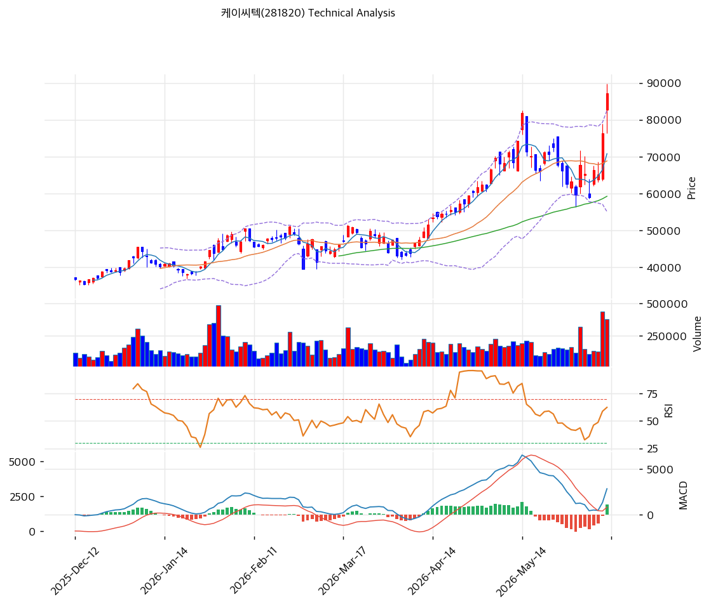

# 케이씨텍(281820) 기술적 분석

2026-06-12 | T2 Technical Analysis

---

## 차트

---

## 1. 가격 현황

| 항목 | 값 |
|------|-----|
| 현재가 | 87,100원 (+14.01%) |
| 52주 고가 | 87,100원 |
| 52주 저가 | 25,100원 |
| 52주 범위 위치 | 100.0% (신고가) |
| 거래량 | 20일 평균 대비 2.25x (강력 동반) |

---

## 2. 차트 패턴 분석

### 2.1 캔들스틱 패턴

| 패턴 | 위치 | 신뢰도 | 해석 |
|------|------|--------|------|
| 장대양봉 + 거래량 폭증 | 당일 (+14.01%, 거래량 2.25x) | 강 | 매수 — 신고가 돌파 분출, 강한 매수 유입 |
| 적삼병 계열 | 최근 | 중 | 매수 우위 — 상승 가속 |
| 신고가 갱신 | 당일 | 중 | 단기 과열 경계 |

※ 주요 캔들 패턴: 망치형, 역망치형, 장악형, 도지, 샛별/석별, 적삼병/흑삼병, 하라미, 유성형, 교수형 등

### 2.2 가격 구조 패턴

- **신고가 돌파 (피보 swing 42,900→81,800원 상회)** (신뢰도: 강)
  직전 swing high 81,800원을 당일 +14% 장대양봉으로 거래량 2.25배 동반 돌파, 87,100원 52주 신고가 경신. HBM·CMP capex·2026Q1 실적 폭발(매출 +101%) 모멘텀이 분출. 피보나치 1.272 확장(92,381원)이 다음 목표.

- **장기 상승 추세** (신뢰도: 강)
  MA200(45,740원) 대비 +90.4%의 큰 괴리로 1년 3.5배(25,100→87,100원) 강세 추세 유지. 단기 급등으로 과열이나 추세 견조.

※ 주요 구조 패턴: 이중천정/바닥, 헤드앤숄더, 삼각수렴, 쐐기형, 깃발형, 페넌트, 컵앤핸들, 박스권 등

### 2.3 다이버전스

- **뚜렷한 다이버전스 없음 — 추세 추종** (신뢰도: 중)
  가격 신고가와 함께 MACD 매수·히스토그램 확대, RSI 67.3 상승으로 가격·지표 동행. 하락 다이버전스 없음. RSI 과매수(70) 근접으로 단기 과열 경계.

※ RSI·MACD 기반 | 상승 다이버전스 = 가격↓ 지표↑, 하락 다이버전스 = 가격↑ 지표↓, 히든 다이버전스 = 추세 지속

### 2.4 패턴 종합 판단

직전 고점을 거래량 2.25배 동반 장대양봉으로 돌파한 **강한 상승 분출** 국면이다. 완전 정배열·MACD 매수·히스토그램 확대로 추세가 강하나, MA200 대비 +90%·RSI 67.3의 단기 과열이 동반된다. 2026Q1 실적 폭발(매출 +101%·OPM 22%)·CMP 국산화가 펀더멘털을 받친다. 추격보다 79,100\~82,500원(피봇 S1·볼린저 상단) 눌림목 확인이 안전하다.

---

## 3. 이동평균선 — 정배열 (강세)

| MA | 값 | 현재가 괴리율 | 위치 |
|----|-----|--------------|------|
| MA5 | 70,780원 | +23.1% | 위 |
| MA20 | 68,815원 | +26.6% | 위 |
| MA60 | 59,234원 | +47.0% | 위 |
| MA120 | 51,132원 | +70.3% | 위 |
| MA200 | 45,740원 | +90.4% | 위 |

**해석**: 현재가 > 모든 MA의 완전 정배열 강세. 단기선(MA5·20)이 68,000\~71,000원인데 당일 급등으로 +23\~27% 괴리가 벌어졌다 — 강한 분출이나 단기 과열 극심. MA200 대비 +90.4%로 장기 추세는 견조하나, 평균 회귀 압력이 크다. 조정 시 MA20(68,815원)·피봇 S1(79,100원)이 지지대다.

---

## 4. 보조 지표

### RSI(14) — 67.3 (중립, 과매수 근접)

당일 급등으로 과매수(70) 직전. 강한 모멘텀이나 단기 과열 신호. 다이버전스 해석은 2.3 참조.

### MACD(12,26,9)

| 항목 | 값 |
|------|-----|
| MACD | 2,835.0 |
| Signal | 1,714.0 |
| Histogram | +1,121.0 |
| 크로스 상태 | 매수 구간 (히스토그램 확대) |

**해석**: MACD가 Signal 위에서 히스토그램을 크게 확대하는 강한 상승 모멘텀. 0선 위 강세 신호.

### 볼린저밴드(20, 2σ)

| 항목 | 값 |
|------|-----|
| 상단 | 82,566원 |
| 중단 (MA20) | 68,815원 |
| 하단 | 55,064원 |
| 밴드 폭 | 40.0% |
| 현재 위치 | 상단 돌파 |

**해석**: 현재가 87,100원이 밴드 상단(82,566원)을 상회 — 강한 상승 압력이나 단기 과열. 밴드 폭(40%) 확대 중. 되돌림 시 중단(MA20 68,815원)까지 조정 여지.

### 스토캐스틱(14, 3, 3)

| 항목 | 값 |
|------|-----|
| Slow %K | 75.6 |
| Slow %D | 58.5 |
| 크로스 상태 | 골든크로스 |
| 판단 | 과매수권 진입 |

---

## 5. 지지/저항 — 추세선 · 피보나치 · PRZ 통합

### 5.1 피보나치 되돌림/확장

| 구분 | 비율 | 가격 | 현재가 대비 |
|------|------|------|-----------|
| Swing High | — | 81,800원 | -6.1% |
| 되돌림 | 0.236 | 72,620원 | -16.6% |
| 되돌림 | 0.382 | 66,940원 | -23.1% |
| 되돌림 | 0.5 | 62,350원 | -28.4% |
| 되돌림 | 0.618 | 57,760원 | -33.7% |
| Swing Low | — | 42,900원 | — |
| 확장 | 1.272 | 92,381원 | +6.1% |
| 확장 | 1.382 | 96,660원 | +11.0% |
| 확장 | 1.618 | 105,840원 | +21.5% |
| 확장 | 2.0 | 120,700원 | +38.6% |

※ 피보나치 기준: 상승 추세 (Swing Low 42,900원 → Swing High 81,800원). 신고가로 확장 구간 진입

### 5.2 종합 지지/저항 테이블

| 구분 | 가격 | 근거 |
|------|------|------|
| 저항 | 96,660원 | 피보나치 1.382 확장 |
| 저항 | 92,400원 | 피봇 R1·피보 1.272 확장(PRZ) |
| **현재가** | **87,100원** | 신고가·볼린저 상단 돌파 |
| 지지 | 82,566원 | 볼린저 상단 |
| 지지 | 79,100원 | 피봇 S1 |
| 지지 | 71,100\~71,500원 | 피봇 S2·MA5(PRZ 중) |
| 지지 | 68,815원 | MA20 |

---

## 6. 시그널 종합

| 지표 | 내용 | 시그널 |
|------|------|--------|
| **차트 패턴** | 신고가 돌파·거래량 동반, 단기 과열 | 🟢 |
| 이동평균선 | 완전 정배열, MA20 +26.6% (과열) | ⚪ |
| RSI | 67.3 — 과매수 근접 | ⚪ |
| MACD | 매수구간, 히스토그램 확대 | 🟢 |
| 볼린저밴드 | 상단 돌파, 밴드 폭 40% | ⚪ |
| 스토캐스틱 | 골든크로스, K=75.6 | ⚪ |
| 거래량 | 2.25x — 강력 동반 | 🟢 |

**종합 판단**: 🟢 매수 3개 / 🔴 매도 1개 / ⚪ 중립 3개 → **매수우위 (강한 분출 + 단기 과열)**

신고가를 거래량 2.25배 동반 장대양봉으로 돌파한 강세 분출 국면이다. 완전 정배열·MACD 매수 확대로 추세가 강하나 MA200 +90%·RSI 67.3의 단기 과열이 공존한다. 2026Q1 실적 폭발·CMP 국산화가 펀더멘털을 받친다. 추격보다 눌림목(피봇 S1 79,100원·MA20 68,815원) 대응이 정석이다.

---

## 7. 전략 제안

### 보유 중인 경우
- **홀드 (분할 익절 병행)**
- 익절 라인: 92,400원(피봇 R1·피보 1.272) 1차 / 96,660원(피보 1.382) 2차
- 손절 라인: 71,000원 (피봇 S2·MA5 하단 이탈)
- 리스크/리워드: 당일 급등으로 신규 손익비 불리

### 진입 대기인 경우
- **추격 자제, 눌림목 대기**
- 1차 진입가: 79,100원 (피봇 S1)
- 2차 진입가: 68,815원 (MA20)
- 진입 조건: 당일 거래량 2.25배 급등은 추격 위험. 조정 시 피봇 S1·MA20(68,800\~79,100원) 지지 확인 후 분할 진입. 2026Q1 실적 폭발(매출 +101%·OPM 22%)·CMP 국산화가 하방 지지
