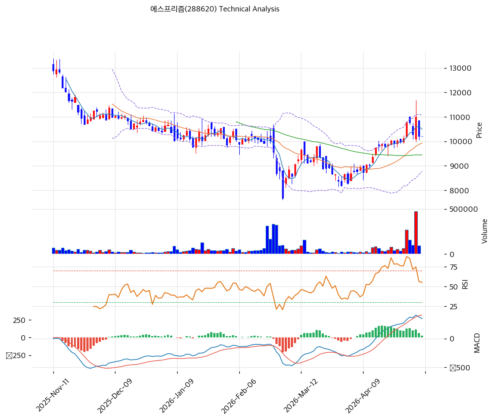

# 기술적분석

2026-05-08 | T2 Technical Analysis

***

## 차트

***

## 1. 가격 현황

| 항목        | 값                           |
| --------- | --------------------------- |
| 현재가       | 10,210원 (+0.00%)            |
| 52주 고가    | 14,070원                     |
| 52주 저가    | 7,670원                      |
| 52주 범위 위치 | 39.7%                       |
| 거래량       | 20일 평균 대비 0.00x (당일 휴장 데이터) |

***

## 2. 차트 패턴 분석

### 2.1 캔들스틱 패턴

| 패턴                 | 위치                                           | 신뢰도 | 해석                                                                 |
| ------------------ | -------------------------------------------- | --- | ------------------------------------------------------------------ |
| 유성형(Shooting Star) | 직전 1\~2거래일 (11,800원대 고점 시도 후 종가 10,200원대 마감) | 강   | 매도 시그널 — 단기 급등 후 윗꼬리 길게 남기며 음봉 마감, 11,500\~11,800원대에서 매도 압력 확인     |
| 장대 음봉 거래량 폭증       | 직전 거래일 (대형 레드 볼륨바 동반)                        | 강   | 매도 시그널 — 5월 초 상승 랠리의 정점에서 분배(distribution) 패턴, 외국인 매수에도 차익실현 매물 출회 |
| 적삼병 후 반전           | 4월 중순 \~ 5월 초 (8,500원 → 11,800원 단기 상승)       | 중   | 중립 — 강한 상승 추세 후 반전 캔들 출현으로 단기 조정 가능성                               |

### 2.2 가격 구조 패턴

* **이중바닥(Double Bottom)** (신뢰도: 중) 2026년 2월 말~~3월 중순 7,670~~8,000원 구간에서 두 차례 저점을 형성한 후 반등. 넥라인은 약 9,500~~9,700원 구간이며, 이미 돌파하여 11,800원까지 상승한 상태. 패턴 측정치 목표가 11,300~~11,500원은 이미 도달, 추가 상승 여력은 제한적.
* **하락 추세선 저항 시도** (신뢰도: 강) 2025년 11월 13,200원대 고점에서 시작된 하락 추세선이 현재 약 11,500\~11,800원 부근을 지나며, 직전 거래일 이 라인에서 정확히 윗꼬리를 남기고 반락. 추세선 돌파 실패는 박스권 회귀 또는 재차 하락 가능성을 시사.
* **단기 상승 박스권** (신뢰도: 약) 4월 초 9,000원 → 5월 초 11,800원 구간의 가파른 상승 후, 9,800\~11,000원 박스권 형성 가능성. MA20(9,933) 지지 여부가 박스 하단 유효성의 키.

### 2.3 다이버전스

* **RSI 하락 다이버전스** (신뢰도: 중) 4월 중순 RSI 75 부근 고점 형성 후, 5월 초 가격은 11,800원 신고가를 시도했음에도 RSI는 75를 하회 → 54.8까지 둔화. 가격↑ 지표↓ 전형적 약세 다이버전스로 단기 조정 시사.
* **MACD 히스토그램 축소 조짐** (신뢰도: 약) MACD 348 / Signal 318 매수구간 유지 중이나 히스토그램 +30으로 직전 대비 폭이 축소(hist\_expanding=False). 강세 모멘텀 둔화 신호. 시그널 라인 데드크로스까지는 거리가 있으나 추세 약화 단서.

### 2.4 패턴 종합 판단

차트는 **단기 강세 → 저항 부딪힘 → 조정 진입** 흐름을 보여준다. 하락 추세선(11,500~~11,800원)과 유성형 캔들·거래량 분배 패턴이 명확한 매도 시그널을 동반하며, RSI 하락 다이버전스가 이를 보강한다. 다만 이중바닥 돌파 후 MA20·MA60·MA120이 모두 현재가 아래에서 정배열에 가까운 지지선을 형성하고 있어, 9,500~~10,000원 구간까지의 조정은 건강한 되돌림 범위. **단기는 매도 우위, 중기는 박스권 하단 지지 시 재차 시도 가능**이라는 상충 시그널.

***

## 3. 이동평균선 — 비정배열 (혼조)

| MA    | 값       | 현재가 괴리율 | 위치 |
| ----- | ------- | ------- | -- |
| MA5   | 10,494원 | -2.7%   | 아래 |
| MA20  | 9,933원  | +2.8%   | 위  |
| MA60  | 9,448원  | +8.1%   | 위  |
| MA120 | 10,126원 | +0.8%   | 위  |
| MA200 | 10,757원 | -5.1%   | 아래 |

**해석**: 단기(MA5) 아래·중장기(MA20·60·120) 위·장기(MA200) 아래로 비정배열이지만, 중기 골든크로스(MA20>MA60>MA120 일부 정렬) 형성 중. 현재가는 MA120(10,126)과 거의 일치하는 0.8% 괴리로 핵심 지지선에 안착. MA200(10,757)이 단기 1차 저항으로 작동. 중기 정배열 정착 여부가 추세 전환의 관건.

***

## 4. 보조 지표

### RSI(14) — 54.8 (중립)

중립 구간(50\~70 미만)에 위치. 4월 중순 75 과매수 진입 후 54.8까지 빠르게 둔화 — 모멘텀 약화 진행 중이나 과매도 영역과는 거리가 멀어 추가 하락 여지 존재.

### MACD(12,26,9)

| 항목        | 값            |
| --------- | ------------ |
| MACD      | 348          |
| Signal    | 318          |
| Histogram | +30          |
| 크로스 상태    | 매수 구간 (수축 중) |

**해석**: MACD가 Signal 위에 있어 매수 구간을 유지하나, 히스토그램이 직전 대비 축소되어 강세 모멘텀이 둔화. 추가 축소 후 0선 하향 시 데드크로스 임박 신호.

### 볼린저밴드(20, 2σ)

| 항목        | 값       |
| --------- | ------- |
| 상단        | 11,088원 |
| 중단 (MA20) | 9,933원  |
| 하단        | 8,778원  |
| 밴드 폭      | 23.3%   |
| 현재 위치     | 중간      |

**해석**: 밴드 폭 23.3%로 4월 초 스퀴즈 후 강하게 확장 → 직전 거래일 상단(11,088) 터치 후 반락. 변동성 확대 국면이며, 중단(9,933) 지지 여부가 박스권 유지의 분기점. 하단(8,778)은 5월 단기 손절 라인의 의미.

### 스토캐스틱(14, 3, 3)

| 항목      | 값     |
| ------- | ----- |
| Slow %K | 47.1  |
| Slow %D | 58.3  |
| 크로스 상태  | 데드크로스 |
| 판단      | 중립    |

***

## 5. 지지/저항 — 추세선 · 피보나치 · PRZ 통합

### 5.1 피보나치 되돌림/확장

| 구분         | 비율    | 가격      | 현재가 대비 |
| ---------- | ----- | ------- | ------ |
| Swing High | —     | 16,260원 | +59.3% |
| 되돌림        | 0.236 | 9,644원  | -5.5%  |
| 되돌림        | 0.382 | 10,908원 | +6.8%  |
| 되돌림        | 0.5   | 11,930원 | +16.8% |
| 되돌림        | 0.618 | 12,952원 | +26.9% |
| 되돌림        | 0.786 | 14,407원 | +41.1% |
| Swing Low  | —     | 7,600원  | -25.6% |
| 확장         | 1.272 | 5,244원  | -48.6% |
| 확장         | 1.382 | 4,292원  | -58.0% |
| 확장         | 1.618 | 2,248원  | -78.0% |
| 확장         | 2.0   | -1,060원 | —      |

※ 피보나치 기준: 하락 추세 (Swing High 16,260원 → Swing Low 7,600원) ※ 되돌림 = 직전 하락에서 되돌아온 비율, 확장 = 추가 하락 시 목표가

### 5.2 추세선

| 추세선 | 방향 | 현재 교차가  | 포인트 수 | 해석                                                    |
| --- | -- | ------- | ----- | ----------------------------------------------------- |
| 지지선 | 하락 | 7,007원  | 6개    | 1년간 형성된 하락 지지선 — 7,000원대 깨질 경우 펀더멘털(자본잠식·CB만기) 충격 가시화 |
| 저항선 | 하락 | 11,575원 | 6개    | 11,500\~11,800원 부근 직전 거래일 윗꼬리 형성 라인과 일치, 강한 1차 저항     |

### 5.3 PRZ (Potential Reversal Zone)

| 방향 | 가격 범위           | 신뢰도 | 근거                                  |
| -- | --------------- | --- | ----------------------------------- |
| 지지 | 9,933\~10,210원  | 강   | MA20 + MA120 + 피봇 R1/R2/S1/S2 다중 겹침 |
| 저항 | 10,757\~10,908원 | 약   | MA200 + 피보나치 0.382 되돌림              |
| 지지 | 9,448\~9,644원   | 약   | MA60 + 피보나치 0.236 되돌림               |

※ PRZ = 추세선 · 피보나치 · 피봇 · MA 등 복수 지표가 겹치는 가격 구간. 겹치는 소스가 많을수록 반전 확률 상승.

### 5.4 종합 지지/저항 테이블

| 구분      | 가격          | 근거                           |
| ------- | ----------- | ---------------------------- |
| 저항      | 14,070원     | 52주 고가                       |
| 저항      | 12,952원     | 피보나치 0.618 되돌림               |
| 저항      | 11,930원     | 피보나치 0.5 되돌림                 |
| 저항      | 11,575원     | 추세선 저항 (하락) — 직전 거래일 윗꼬리 형성  |
| 저항      | 10,832원     | PRZ (약) — MA200 + 피보나치 0.382 |
| **현재가** | **10,210원** | —                            |
| 지지      | 10,150원     | PRZ (강) — MA20 + MA120 + 피봇  |
| 지지      | 9,933원      | MA20 (BB 중단)                 |
| 지지      | 9,546원      | PRZ (약) — MA60 + 피보나치 0.236  |
| 지지      | 8,778원      | 볼린저밴드 하단                     |
| 지지      | 7,670원      | 52주 저가 (이중바닥)                |
| 지지      | 7,007원      | 추세선 지지 (하락) — 최후 방어선         |

***

## 6. 시그널 종합

| 지표        | 내용                                        | 시그널 |
| --------- | ----------------------------------------- | --- |
| **차트 패턴** | 유성형 캔들 + 하락 추세선 저항 + RSI 하락 다이버전스 → 단기 조정 | 🔴  |
| 이동평균선     | 비정배열, MA20 +2.8% / MA200 -5.1% — 혼조       | ⚪   |
| RSI       | 54.8 — 중립, 모멘텀 둔화 진행                      | ⚪   |
| MACD      | 매수구간 유지, 히스토그램 축소 중                       | ⚪   |
| 볼린저밴드     | 중간, 밴드 폭 23.3% (확장 후 되돌림)                 | ⚪   |
| 스토캐스틱     | 데드크로스, K=47.1                             | 🔴  |
| 거래량       | 0.0x — 당일 데이터 부재, 직전 거래일 분배 폭증            | ⚪   |

**종합 판단**: 🟢 매수 0개 / 🔴 매도 2개 / ⚪ 중립 5개 → **단기 매도 우위 (중기 중립)**

차트 패턴은 명백한 단기 매도(유성형 + 추세선 저항 + 다이버전스)를 가리키며, 스토캐스틱 데드크로스가 이를 보강한다. 다만 이동평균선 중기 골든크로스 진행, MACD 매수구간 유지, BB 중간 위치는 박스권 유지 가능성을 시사. **단기 11,500**~~**11,800원 저항 돌파 실패 → 9,500**~~**10,000원 박스 하단 재테스트 시나리오**가 가장 유력. T1에서 도출된 자본잠식·CB만기·감사 한정 트리플 리스크는 7,007원 추세선 지지선 이탈 시 하방 충격 트리거로 작용 가능.

***

## 7. 전략 제안

### 보유 중인 경우

* **비중축소 (1/3 분할 익절 권고)**
* 익절 라인: 11,500\~11,800원 (근거: 하락 추세선 저항 + 직전 윗꼬리 형성 가격대 — 도달 시 분할 매도)
* 손절 라인: 9,448원 (근거: MA60 이탈 = 중기 정배열 붕괴, PRZ 약 지지선 하단)
* 리스크/리워드: 현재가 10,210 기준, TP 11,650 (+14.1%) / SL 9,448 (-7.5%) → R/R 약 1.9 (양호)

### 진입 대기인 경우

* **관망 권고 (단기 매도 시그널 우위)**
* 1차 진입가: 9,933원 (근거: MA20 + BB 중단 + PRZ 강 지지 — 1차 되돌림 후 반등 시도 구간)
* 2차 진입가: 9,448원 (근거: MA60 + PRZ 약 지지 — 추가 조정 시 분할 매수 구간)
* 진입 조건: ① 9,933\~10,150원 PRZ 지지 확인 후 양봉 + 거래량 동반 반등, ② 11,575원 하락 추세선 돌파 시 추세 전환 신호로 추격 매수 가능 (단, 펀더멘털 트리플 리스크로 비중 1% 이내 권고)
