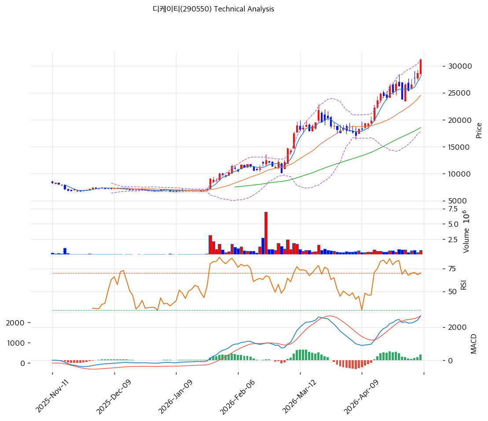

# 디케이티(290550) 기술적 분석

2026-04-16 | T2 Technical Analysis

---

## 차트

---

## 1. 가격 현황

| 항목 | 값 |
|------|-----|
| 현재가 | 22,250원 (0.00%) |
| 52주 고가 | 22,850원 |
| 52주 저가 | 6,280원 |
| 52주 범위 위치 | 100.0% |
| 거래량 | 20일 평균 대비 0.0x (데이터 없음) |

---

## 2. 차트 패턴 분석

### 2.1 캔들스틱 패턴

| 패턴 | 위치 | 신뢰도 | 해석 |
|------|------|--------|------|
| 상단 도달/갭 | 52주 최고가 22,250원 | 강 | 52주 고점 전고가(22,850원) 재도전 수준 — 추가 상승 시 돌파 여부가 단기 방향성 결정 |
| 과매수 캔들 | 최근 5일 (MA5 20,594원 대비 +8.0%) | 중 | 단기 급등 후 조정 가능성 내포, 다음 지지선 확인 필요 |

※ 주요 캔들 패턴: 현재 가격이 52주 고가권에 위치하며 단기 과열 신호 포착

### 2.2 가격 구조 패턴

- **상승 추세 (신뢰도: 강)**
  지지 추세선(기울기 107.5, 현재 교차가 14,802원)과 저항 추세선(기울기 140.26, 현재 교차가 20,811원) 모두 우상향으로 6개 포인트 이상 접촉, 강한 상승 채널 형성 중. 현재가는 저항 추세선(20,811원)을 상향 돌파한 상태로 추세 강도가 확인된다.

- **52주 고점 돌파 시도 (신뢰도: 중)**
  현재가 22,250원이 52주 고가(22,850원) 직하에 위치. 전고점 22,850원 돌파 여부가 중기 추세 방향성을 결정하는 핵심 변곡점이다. 피보나치 확장 1.272 타깃(27,436원)이 돌파 성공 시 1차 목표가로 작동한다.

### 2.3 다이버전스

- **RSI 하락 다이버전스 가능성** (신뢰도: 중)
  RSI 70.7로 과매수 구간 진입. 가격이 52주 고점권에서 RSI가 전고점을 하회할 경우 하락 다이버전스 형성 — 단기 조정 또는 추세 약화 시사. 현 시점에서 확정은 아니나 모니터링 필요.

- **MACD 상승 다이버전스 유지** (신뢰도: 강)
  MACD 1,336 > Signal 1,181, 히스토그램 +156으로 확대 중. 매수 구간 유지하며 상승 모멘텀 지속. 히스토그램 수축 전환 시 단기 조정 시그널로 해석.

### 2.4 패턴 종합 판단

상승 추세선 6포인트 구조와 MACD 히스토그램 확대가 중기 상승 기조를 지지하고 있다. 그러나 현재가가 52주 고가(22,850원) 직하이면서 RSI 70.7 과매수 구간에 진입, 볼린저밴드 상단(22,221원)에 밀착된 상태는 단기 부담이다. 전고점(22,850원) 돌파 성공 시 강한 추가 상승이 예상되나, 돌파 실패 시 20,594원(MA5) → 19,200원(MA20) 구간으로의 조정이 유력하다.

---

## 3. 이동평균선 — 정배열 (강세)

| MA | 값 | 현재가 괴리율 | 위치 |
|----|-----|--------------|------|
| MA5 | 20,594원 | +8.0% | 위 |
| MA20 | 19,200원 | +15.9% | 위 |
| MA60 | 14,475원 | +53.7% | 위 |
| MA120 | 10,904원 | +104.0% | 위 |
| MA200 | 9,579원 | +132.3% | 위 |

**해석**: MA5~MA200 완전 정배열, 현재가가 모든 이동평균선 위에 위치하는 강한 상승 구조다. 특히 MA200 대비 괴리율 +132.3%는 중장기 추세 전환 이후 강한 상승을 반영한다. 단기적으로 MA20(19,200원)이 핵심 지지선으로 작동할 전망이며, 이 구간이 이탈되면 상승 추세 약화로 해석해야 한다.

---

## 4. 보조 지표

### RSI(14) — 70.7 (🔴 과매수)

RSI 14일 기준 70.7로 과매수 기준선(70)을 돌파한 상태. 추가 상승 시 RSI가 더 높아질 수 있으나, 전형적으로 과매수 진입 이후 단기 조정 또는 횡보 국면이 수반된다. 다이버전스 형성 여부 지속 모니터링 필요.

### MACD(12,26,9)

| 항목 | 값 |
|------|-----|
| MACD | 1,336 |
| Signal | 1,181 |
| Histogram | +156 |
| 크로스 상태 | 매수 구간 (확대 중) |

**해석**: MACD가 Signal선 위에서 히스토그램 확대 중으로 상승 모멘텀 강화 국면. 히스토그램이 수축으로 전환되는 시점이 단기 매도 시그널로 작동할 가능성이 높다.

### 볼린저밴드(20, 2σ)

| 항목 | 값 |
|------|-----|
| 상단 | 22,221원 |
| 중단 (MA20) | 19,200원 |
| 하단 | 16,180원 |
| 밴드 폭 | 31.5% |
| 현재 위치 | 상단 근접 |

**해석**: 현재가 22,250원이 볼린저밴드 상단(22,221원)을 소폭 상향 이탈한 상태. 밴드 폭 31.5%는 변동성이 충분히 확장된 국면으로 스퀴즈 이후 상승 이탈에 해당한다. 상단 이탈 지속 시 추가 상승 여력이 있으나, 재진입 시 중단(19,200원)까지 되돌림 가능성.

### 스토캐스틱(14, 3, 3)

| 항목 | 값 |
|------|-----|
| Slow %K | 87.9 |
| Slow %D | 75.3 |
| 크로스 상태 | 골든크로스 |
| 판단 | 과매수 |

---

## 5. 지지/저항 — 추세선 · 피보나치 · PRZ 통합

### 5.1 피보나치 되돌림/확장

| 구분 | 비율 | 가격 | 현재가 대비 |
|------|------|------|-----------|
| Swing High | — | 22,850원 | — |
| 되돌림 | 0.236 | 18,871원 | -15.2% |
| 되돌림 | 0.382 | 16,409원 | -26.3% |
| 되돌림 | 0.5 | 14,420원 | -35.2% |
| 되돌림 | 0.618 | 12,431원 | -44.1% |
| 되돌림 | 0.786 | 9,598원 | -56.9% |
| Swing Low | — | 5,990원 | — |
| 확장 | 1.272 | 27,436원 | +23.3% |
| 확장 | 1.382 | 29,291원 | +31.6% |
| 확장 | 1.618 | 33,269원 | +49.5% |
| 확장 | 2.0 | 39,710원 | +78.5% |

※ 피보나치 기준: 상승 추세 (Swing Low 5,990원 → Swing High 22,850원)
※ 되돌림 = 직전 추세에서 되돌아온 비율, 확장 = 추세 방향 목표가

### 5.2 추세선

| 추세선 | 방향 | 현재 교차가 | 포인트 수 | 해석 |
|--------|------|-----------|---------|------|
| 지지선 | 상승 | 14,802원 | 6개 | 중장기 상승 채널 하단 지지, 이탈 시 추세 약화 |
| 저항선 | 상승 | 20,811원 | 6개 | 현재가 이미 상향 돌파 — 지지 전환 가능성 |

### 5.3 PRZ (Potential Reversal Zone)

| 방향 | 가격 범위 | 신뢰도 | 근거 |
|------|---------|--------|------|
| 지지 | 22,250원 | 강 | 피봇 R1, 피봇 R2, 피봇 S1, 피봇 S2 집중 |
| 지지 | 20,594~20,811원 | 약 | MA5 + 추세선 저항(지지 전환) |
| 지지 | 18,871~19,200원 | 약 | 피보나치 0.236 되돌림 + MA20 |

※ PRZ = 추세선 · 피보나치 · 피봇 · MA 등 복수 지표가 겹치는 가격 구간

### 5.4 종합 지지/저항 테이블

| 구분 | 가격 | 근거 |
|------|------|------|
| 저항 | 27,436원 | 피보나치 1.272 확장 (1차 목표가) |
| 저항 | 22,850원 | 52주 고가 (전고점) |
| **현재가** | **22,250원** | — |
| 지지 | 20,702원 | PRZ (약) — MA5 + 추세선 저항 지지 전환 |
| 지지 | 19,200원 | MA20 + PRZ (약) — 피보나치 0.236 |
| 지지 | 14,802원 | 추세선 지지 (상승, 6포인트) |

---

## 6. 시그널 종합

| 지표 | 내용 | 시그널 |
|------|------|--------|
| **차트 패턴** | 상승 추세 유지, 52주 고점 돌파 시도 중, MACD 확대 | 🟢 |
| 이동평균선 | 완전 정배열, MA20 +15.9% | 🟢 |
| RSI | 70.7 — 과매수 | 🔴 |
| MACD | 매수구간, 히스토그램 확대 중 | 🟢 |
| 볼린저밴드 | 상단 밀착, 밴드 폭 31.5% | ⚪ |
| 스토캐스틱 | 골든크로스, K=87.9 과매수 | 🔴 |
| 거래량 | 0.0x — 데이터 부재 | ⚪ |

**종합 판단**: 🟢 매수 3개 / 🔴 매도 2개 / ⚪ 중립 2개 → **매수우위 (단기 과열 경계)**

이동평균선 완전 정배열과 MACD 히스토그램 확대는 중기 상승 추세의 건전성을 지지한다. 그러나 RSI 70.7 과매수와 스토캐스틱 87.9 과열 상태, 볼린저밴드 상단 밀착은 단기 조정 또는 횡보 가능성을 높인다. 52주 전고점(22,850원)을 거래량 동반하여 돌파하면 피보나치 확장 1.272인 27,436원까지 단기 목표 설정이 가능하고, 돌파 실패 시 19,200원(MA20) 구간으로의 되돌림을 예상한다.

---

## 7. 전략 제안

### 보유 중인 경우
- **홀드**
- 익절 라인: 27,436원 (피보나치 1.272 확장, 전고점 돌파 후 1차 목표)
- 손절 라인: 19,200원 (MA20 이탈 시 추세 약화 신호)
- 리스크/리워드: 약 1:2.0 (현재가 22,250원 기준)

### 진입 대기인 경우
- **관망 후 조정 시 진입**
- 1차 진입가: 20,702원 (MA5+추세선 수렴 PRZ, 단기 조정 시)
- 2차 진입가: 19,200원 (MA20+피보나치 0.236 PRZ, 깊은 조정 시)
- 진입 조건: 현 고점에서 과매수 해소 후 거래량 동반 반등 확인, 또는 22,850원 전고점 거래량 돌파 시 즉시 편입
