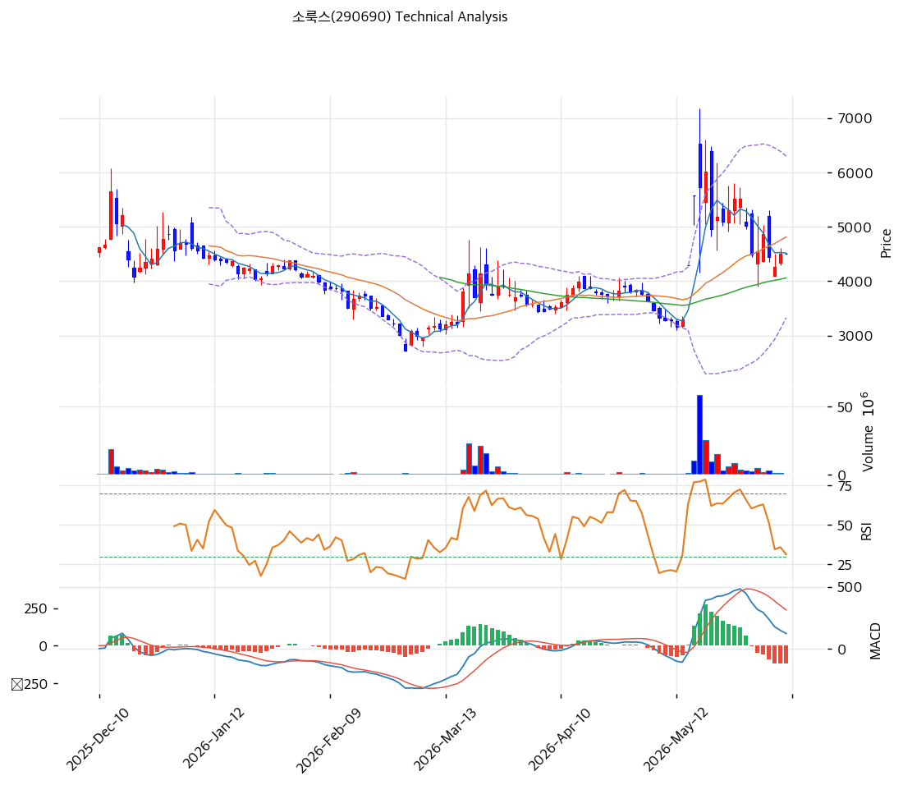

# 기술적분석

2026-06-10 | T2 Technical Analysis

***

## 차트

***

## 1. 가격 현황

| 항목        | 값                          |
| --------- | -------------------------- |
| 현재가       | 4,510원 (0.0%)              |
| 52주 고가    | 6,020원                     |
| 52주 저가    | 2,720원                     |
| 52주 범위 위치 | 54.2%                      |
| 거래량       | 20일 평균 대비 0.0x (장 시작 전 기준) |

***

## 2. 차트 패턴 분석

### 2.1 캔들스틱 패턴

| 패턴                  | 위치                     | 신뢰도 | 해석                                                 |
| ------------------- | ---------------------- | --- | -------------------------------------------------- |
| 유성형(슈팅스타) 계열 윗꼬리 음봉 | 5월 중순 고점권 (장중 7,000원대) | 중   | 매도 시그널 — 급등 후 고점권 윗꼬리로 단기 천정 형성, 이후 하락 전환 확인됨      |
| 연속 음봉 (흑삼병성)        | 5월 말\~6월 초             | 중   | 매도 우위 — 갭 상승분 되돌림 진행, 다만 거래량 감소 동반으로 투매보다는 차익실현 성격 |
| 단봉·도지성 캔들           | 최근 2\~3일 (4,500원 부근)   | 약   | 중립 — 피보나치 0.5 되돌림(4,590원) 부근에서 매도세 둔화 조짐           |

※ 주요 캔들 패턴: 망치형, 역망치형, 장악형(상승/하락), 도지, 샛별/석별, 적삼병/흑삼병, 하라미, 유성형, 교수형 등

### 2.2 가격 구조 패턴

* **V자 급등 후 되돌림 (이벤트 스파이크)** (신뢰도: 강) 2월 저점 2,720원에서 횡보하던 주가가 5월 14\~15일 푸싱제약 7조원 판권계약 보도에 대량 거래를 동반하며 장중 7,000원대까지 수직 급등(상한가 포함), 이후 6,000원 안착에 실패하고 4,500원대까지 되돌림. 전형적인 뉴스 스파이크-소화 국면으로, 갭 구간 하단(4,000\~4,300원)이 1차 방어선.
* **하락 추세선 저항 + 중기 상승 구조** (신뢰도: 중) 2025년 12월 고점부터 이어지는 하락 추세선 저항이 6,029원에 위치. 반면 2월 저점 이후 저점을 높이는 중기 상승 구조(MA60·120 위)는 유지 — 4,050\~4,300원 지지 확인 시 상승 구조 유효, 이탈 시 3,772원(피보 0.786)까지 열림.

※ 주요 구조 패턴: 이중천정/바닥, 헤드앤숄더(정/역), 삼각수렴(대칭/상승/하락), 쐐기형(상승/하락), 깃발형, 페넌트, 컵앤핸들, 박스권 등

### 2.3 다이버전스

* **뚜렷한 다이버전스 없음 — 모멘텀 소진형 조정** (신뢰도: 중) 5월 고점에서 RSI 75 이상 과매수 후 가격과 함께 급락(현재 49.8)해 가격-지표 괴리는 크지 않음. MACD 히스토그램이 양→음 전환되며 상승 모멘텀 소진을 확인. 추세 전환 시그널이 아닌 과열 해소 국면으로 판단.

※ RSI·MACD 기반 | 상승 다이버전스 = 가격↓ 지표↑ (반등 시사), 하락 다이버전스 = 가격↑ 지표↓ (하락 시사), 히든 다이버전스 = 기존 추세 지속 시사

### 2.4 패턴 종합 판단

캔들(고점권 유성형 + 연속 음봉)과 MACD 데드크로스는 단기 하락 압력을, 중기 상승 구조와 스토캐스틱 과매도권 골든크로스는 지지 부근 반등 가능성을 가리켜 시그널이 상충한다. 종합하면 5월 급등의 되돌림이 피보나치 0.5(4,590원)\~0.618(4,253원) 구간에서 마무리되는지 확인하는 국면이며, 방향성은 차트보다 7월 초 합병 주총·매수청구 결과라는 이벤트가 결정할 가능성이 높다.

***

## 3. 이동평균선 — 비정배열 (혼조)

| MA    | 값      | 현재가 괴리율 | 위치 |
| ----- | ------ | ------- | -- |
| MA5   | 4,517원 | -0.2%   | 아래 |
| MA20  | 4,814원 | -6.3%   | 아래 |
| MA60  | 4,059원 | +11.1%  | 위  |
| MA120 | 4,064원 | +11.0%  | 위  |
| MA200 | 4,319원 | +4.4%   | 위  |

**해석**: 단기선(MA5·20) 아래 / 중장기선(MA60·120·200) 위의 혼조 배열. 5월 급등으로 벌어졌던 MA20 괴리가 -6.3%까지 축소됐고, MA60·120이 수렴한 4,060원대가 중기 추세의 마지노선이다. MA200(4,319원)이 1차 지지로 작동 중.

***

## 4. 보조 지표

### RSI(14) — 49.8 (중립)

과매수(75+)에서 중립권까지 수직 하강해 과열은 해소됐고, 추가 하락 여력과 반등 여력이 균형인 지점이다. 다이버전스 해석은 2.3 참조.

### MACD(12,26,9)

| 항목        | 값            |
| --------- | ------------ |
| MACD      | 121.0        |
| Signal    | 238.0        |
| Histogram | -117.0       |
| 크로스 상태    | 매도 구간 (수축 중) |

**해석**: 데드크로스 후 히스토그램 음수 폭이 유지되는 매도 구간이나, MACD가 아직 0선 위라 중기 상승 추세 자체는 훼손 전이다.

### 볼린저밴드(20, 2σ)

| 항목        | 값      |
| --------- | ------ |
| 상단        | 6,299원 |
| 중단 (MA20) | 4,814원 |
| 하단        | 3,329원 |
| 밴드 폭      | 61.7%  |
| 현재 위치     | 중간     |

**해석**: 급등으로 확장된 밴드(폭 61.7%)가 수축 시작 단계. 가격이 중단 아래 중간 영역에 위치해 밴드 하단(3,329원)까지는 여유가 있으나, 변동성 수축 과정의 등락 반복 가능성이 크다.

### 스토캐스틱(14, 3, 3)

| 항목      | 값     |
| ------- | ----- |
| Slow %K | 18.9  |
| Slow %D | 18.1  |
| 크로스 상태  | 골든크로스 |
| 판단      | 과매도   |

***

## 5. 지지/저항 — 추세선 · 피보나치 · PRZ 통합

### 5.1 피보나치 되돌림/확장

| 구분         | 비율    | 가격     | 현재가 대비 |
| ---------- | ----- | ------ | ------ |
| Swing High | —     | 6,020원 | +33.5% |
| 되돌림        | 0.236 | 5,345원 | +18.5% |
| 되돌림        | 0.382 | 4,927원 | +9.2%  |
| 되돌림        | 0.5   | 4,590원 | +1.8%  |
| 되돌림        | 0.618 | 4,253원 | -5.7%  |
| 되돌림        | 0.786 | 3,772원 | -16.4% |
| Swing Low  | —     | 3,160원 | -29.9% |
| 확장         | 1.272 | 6,798원 | +50.7% |
| 확장         | 1.382 | 7,113원 | +57.7% |
| 확장         | 1.618 | 7,787원 | +72.7% |
| 확장         | 2.0   | 8,880원 | +96.9% |

※ 피보나치 기준: 상승 추세 (Swing Low 3,160원 → Swing High 6,020원) ※ 되돌림 = 직전 추세에서 되돌아온 비율, 확장 = 추세 방향 목표가

### 5.2 추세선

| 추세선 | 방향 | 현재 교차가 | 포인트 수 | 해석                                          |
| --- | -- | ------ | ----- | ------------------------------------------- |
| 지지선 | 하락 | 2,851원 | 6개    | 장기 저점 연결선 — 최후 방어선, 현재가와 거리 큼               |
| 저항선 | 하락 | 6,029원 | 6개    | 12월 고점발 하락 추세선 — 52주 고가(6,020원)와 중첩되는 핵심 저항 |

### 5.3 PRZ (Potential Reversal Zone)

| 방향 | 가격 범위         | 신뢰도 | 근거                             |
| -- | ------------- | --- | ------------------------------ |
| 저항 | 4,510\~4,590원 | 강   | 피봇 R1·R2, MA5, 피보나치 0.5 되돌림 중첩 |
| 지지 | 4,253\~4,319원 | 약   | 피보나치 0.618 되돌림 + MA200         |
| 지지 | 4,059\~4,064원 | 약   | MA60 + MA120 수렴                |

※ PRZ = 추세선 · 피보나치 · 피봇 · MA 등 복수 지표가 겹치는 가격 구간. 겹치는 소스가 많을수록 반전 확률 상승.

### 5.4 종합 지지/저항 테이블

| 구분      | 가격            | 근거                               |
| ------- | ------------- | -------------------------------- |
| 저항      | 6,020\~6,029원 | 52주 고가 + 하락 추세선 저항               |
| 저항      | 5,345원        | 피보나치 0.236 되돌림                   |
| 저항      | 4,814\~4,927원 | MA20 + 피보나치 0.382 되돌림            |
| **현재가** | **4,510원**    | 피보 0.5(4,590원) 직하단 — 저항대 하단 공방 중 |
| 지지      | 4,253\~4,319원 | PRZ — 피보나치 0.618 + MA200         |
| 지지      | 4,059\~4,064원 | PRZ — MA60 + MA120 수렴            |
| 지지      | 3,772원        | 피보나치 0.786 되돌림                   |

***

## 6. 시그널 종합

| 지표        | 내용                                         | 시그널 |
| --------- | ------------------------------------------ | --- |
| **차트 패턴** | 고점권 유성형 + 연속 음봉 vs 피보 0.5 지지 공방 — 단기 약세 우위 | 🔴  |
| 이동평균선     | 비정배열, MA20 -6.3% / 중장기선 위                  | ⚪   |
| RSI       | 49.8 — 중립                                  | ⚪   |
| MACD      | 매도구간 (0선 위)                                | 🔴  |
| 볼린저밴드     | 중간, 밴드 폭 61.7%                             | ⚪   |
| 스토캐스틱     | 골든크로스, K=18.9 과매도                          | 🟢  |
| 거래량       | 0.0x — 약함 (급등 후 거래 위축)                     | ⚪   |

**종합 판단**: 🟢 매수 1개 / 🔴 매도 2개 / ⚪ 중립 4개 → **중립 (단기 약세 우위)**

5월 이벤트 급등의 되돌림 국면으로, 4,250\~4,320원 PRZ 지지 확인 전까지는 기술적 우위가 없다. 다만 스토캐스틱 과매도 골든크로스와 중장기선 상방 배열이 살아 있어, 지지 확인 시 6,000원대 저항 재도전 구조는 유효하다. 7월 합병 주총 전후 이벤트 변동성 확대에 대비가 필요하다.

***

## 7. 전략 제안

### 보유 중인 경우

* **홀드 (비중 확대 금지)**
* 익절 라인: 6,140원 (52주 고가·하락 추세선 저항 6,020\~6,029원 돌파 시 연장, 미돌파 시 분할 익절)
* 손절 라인: 4,250원 (피보나치 0.618·MA200 PRZ 하단 종가 이탈)
* 리스크/리워드: 약 1 : 6.3 (손실 -260원 vs 이익 +1,630원)

### 진입 대기인 경우

* **관망 우선, 조건부 진입**
* 1차 진입가: 4,510원 (현 수준 — PRZ 지지 4,253\~4,319원 유지 확인 후)
* 2차 진입가: 4,286원 (PRZ 지지 중단 — 피보 0.618 + MA200)
* 진입 조건: 거래량 동반 MA20(4,814원) 회복 시 추세 추종 진입 / 합병 주총(7/7)·매수청구 결과 확인 전에는 비중 최소화 — 차트가 아닌 이벤트가 갭을 만드는 구간
