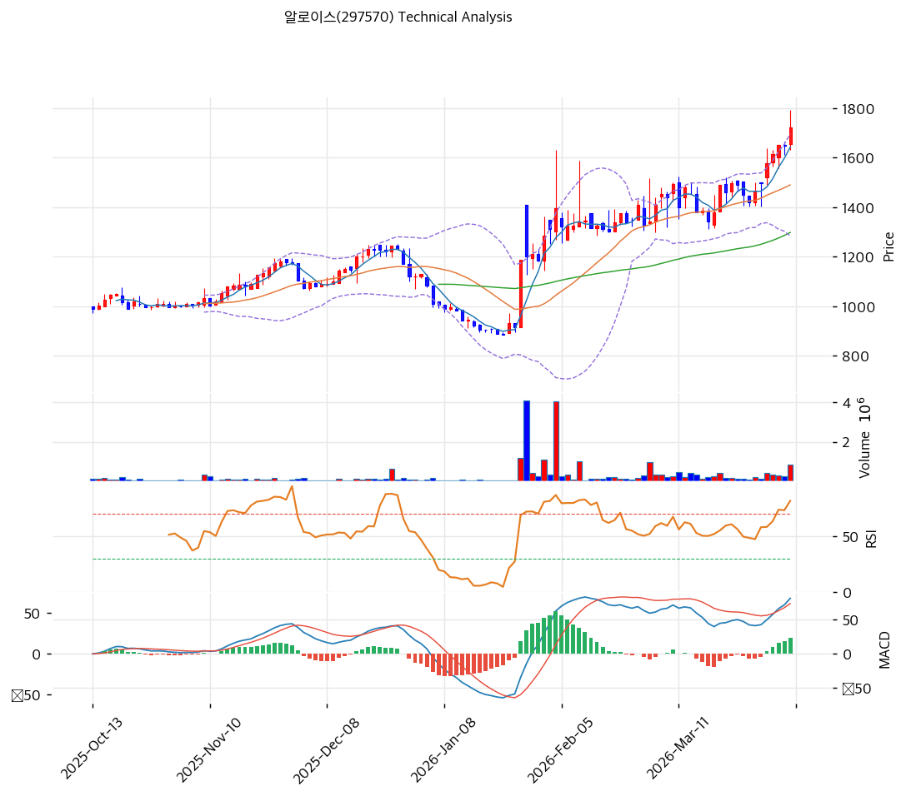

# 알로이스(297570) 기술적 분석

2026-04-07 | T2 Technical Analysis

---

## 차트

---

## 1. 가격 현황

| 항목 | 값 |
|------|-----|
| 현재가 | 1,721원 (+4.37%) |
| 52주 고가 | 1,721원 |
| 52주 저가 | 635원 |
| 52주 범위 위치 | 100.0% |
| 거래량 | 20일 평균 대비 3.41x |

---

## 2. 차트 패턴 분석

### 2.1 캔들스틱 패턴

| 패턴 | 위치 | 신뢰도 | 해석 |
|------|------|--------|------|
| 강세 장악형(Bullish Engulfing) | 최근 1~2일 | 중 | 전일 음봉을 완전히 감싸는 양봉 출현. 단기 매도세 흡수 후 매수 전환 시그널이나, 52주 고가 돌파 직후라는 점에서 추가 확인 필요 |
| 장대양봉(White Marubozu 계열) | 당일 (2026-04-07) | 강 | 종가가 52주 신고가(1,721원)와 일치하며 +4.37% 상승 마감. 강한 매수 모멘텀 확인. 거래량 3.41배 동반으로 신뢰도 높음 |

※ 주요 캔들 패턴: 망치형, 역망치형, 장악형(상승/하락), 도지, 샛별/석별, 적삼병/흑삼병, 하라미, 유성형, 교수형 등

### 2.2 가격 구조 패턴

- **52주 신고가 돌파 (신뢰도: 강)**
  현재가 1,721원은 52주 고가(1,721원)와 일치하며 사상 신고가 수준에서 거래 중이다. 52주 저점 635원 대비 2.7배 상승한 위치로, 장기 상승 추세의 연장선에 있다. 상단 저항이 부재한 가운데 피봇 R1(1,799원), R2(1,876원)가 다음 목표 구간이다.

- **박스권 돌파 후 추세 상승 (신뢰도: 중)**
  MA20(1,490원) 대비 +15.5%, MA60(1,298원) 대비 +32.6%의 이격으로 가파른 상승 채널이 형성된 상태다. 단기 이격 과대 시 되돌림 가능성이 존재하나, MA5(1,643원)와의 괴리(+4.8%)는 상대적으로 작아 단기 지지력을 갖추고 있다.

※ 주요 구조 패턴: 이중천정/바닥, 헤드앤숄더(정/역), 삼각수렴(대칭/상승/하락), 쐐기형(상승/하락), 깃발형, 페넌트, 컵앤핸들, 박스권 등

### 2.3 다이버전스

- **RSI 히든 상승 다이버전스 없음 — 과매수 경계 (신뢰도: 중)**
  RSI(14)가 72.3으로 과매수 구간에 진입했으며, 가격이 신고가를 경신하는 상황에서 RSI도 함께 상승 중이다. 현재 명확한 하락 다이버전스는 포착되지 않으나, RSI 70 이상에서의 고점 피크아웃 가능성은 상시 모니터링이 필요하다.

- **MACD 상승 다이버전스 진행 중 (신뢰도: 강)**
  MACD(81)이 시그널(61)을 상회하며 골든크로스 상태를 유지하고, 히스토그램(+20)이 확대 중이다. 가격 상승과 MACD 모멘텀이 동행하고 있어 추세 지속을 지지하는 신호다.

※ RSI·MACD 기반 | 상승 다이버전스 = 가격↓ 지표↑ (반등 시사), 하락 다이버전스 = 가격↑ 지표↓ (하락 시사), 히든 다이버전스 = 기존 추세 지속 시사

### 2.4 패턴 종합 판단

현재 차트는 52주 신고가 돌파, 강한 거래량(3.41배), MACD 골든크로스 유지라는 세 가지 강세 요소가 동시에 충족되어 단기 추세 상승 모멘텀이 강력하다. 다만 RSI 72.3과 스토캐스틱 K/D 93.5/93.6의 과매수권 진입, 볼린저 상단 밀착(상단 1,697원 돌파)은 단기 되돌림 가능성을 시사하는 상충 신호다. 신고가 구간에서 거래량 동반 양봉이 지속될 경우 추세 연장이 가능하나, 거래량 감소를 동반한 양봉 출현 시 경계가 필요하다.

---

## 3. 이동평균선 — 정배열 (강세)

| MA | 값 | 현재가 괴리율 | 위치 |
|----|-----|--------------|------|
| MA5 | 1,643원 | +4.8% | 위 |
| MA20 | 1,490원 | +15.5% | 위 |
| MA60 | 1,298원 | +32.6% | 위 |
| MA120 | 1,194원 | +44.2% | 위 |
| MA200 | 1,064원 | +61.8% | 위 |

**해석**: MA5→MA20→MA60→MA120→MA200 순의 완전한 정배열 구도가 형성되어 있으며, 현재가는 모든 이동평균선 위에 위치한다. MA200 대비 +61.8%의 큰 이격은 중장기 강세 추세가 매우 강함을 나타내나, 동시에 단기 평균회귀(mean reversion) 압력이 상존함을 의미한다. MA5(1,643원)와 MA20(1,490원)이 핵심 단기 지지 구간으로 작동 중이다.

---

## 4. 보조 지표

### RSI(14) — 72.3 (과매수 🔴)

RSI 72.3은 과매수 경계선(70)을 소폭 상회한 상태로, 단기 모멘텀이 강하나 추가 상승 시 피로도 누적에 따른 조정 가능성이 높아진다.

### MACD(12,26,9)

| 항목 | 값 |
|------|-----|
| MACD | 81.0 |
| Signal | 61.0 |
| Histogram | +20.0 |
| 크로스 상태 | 매수 구간 (확대 중) |

**해석**: MACD(81)이 시그널(61)을 상회하는 골든크로스 상태를 유지하며 히스토그램이 +20으로 확대 중이다. 매수 모멘텀이 강화되고 있음을 나타내며, 히스토그램 수축 전환이 추세 약화의 첫 신호가 될 것이다.

### 볼린저밴드(20, 2σ)

| 항목 | 값 |
|------|-----|
| 상단 | 1,697원 |
| 중단 (MA20) | 1,490원 |
| 하단 | 1,284원 |
| 밴드 폭 | 27.7% |
| 현재 위치 | 상단 근접 (상단 돌파) |

**해석**: 현재가 1,721원이 볼린저 상단(1,697원)을 상향 돌파한 상태다. 밴드 폭 27.7%는 변동성이 충분히 확장된 국면임을 나타낸다. 상단 돌파 후 단기 과열에 따른 중단(MA20, 1,490원)으로의 되돌림 가능성이 있으나, 추세 강도가 강할 경우 상단 밀착 구간에서 추가 상승도 가능하다.

### 스토캐스틱(14, 3, 3)

| 항목 | 값 |
|------|-----|
| Slow %K | 93.5 |
| Slow %D | 93.6 |
| 크로스 상태 | 데드크로스 |
| 판단 | 과매수 |

---

## 5. 지지/저항

| 구분 | 가격 | 근거 |
|------|------|------|
| 저항 | 1,876원 | 피봇 R2 |
| 저항 | 1,799원 | 피봇 R1 |
| **현재가** | **1,721원** | — |
| 지지 | 1,637원 | 피봇 S1 |
| 지지 | 1,552원 | 피봇 S2 |
| 지지 | 1,490원 | MA20 |
| 지지 | 1,298원 | MA60 |

---

## 6. 시그널 종합

| 지표 | 내용 | 시그널 |
|------|------|--------|
| **차트 패턴** | 52주 신고가 돌파, 장대양봉 + 거래량 동반, MACD 히스토그램 확대 중 | 🟢 |
| 이동평균선 | 완전 정배열, MA20 대비 +15.5%, 모든 MA 위에 위치 | 🟢 |
| RSI | 72.3 — 과매수 구간 진입 | 🔴 |
| MACD | 매수 구간, 히스토그램 +20 확대 중 | 🟢 |
| 볼린저밴드 | 상단(1,697원) 상향 돌파, 밴드폭 27.7% | ⚪ |
| 스토캐스틱 | 데드크로스, K=93.5 과매수 | 🔴 |
| 거래량 | 3.41x — 강력 동반 | 🟢 |

**종합 판단**: 🟢 매수 4개 / 🔴 매도 2개 / ⚪ 중립 1개 → **매수우위**

현재 알로이스는 52주 신고가 돌파와 함께 정배열·MACD 골든크로스·강력한 거래량이 동시에 충족되는 강세 국면이다. 단기적으로는 RSI 과매수(72.3)와 스토캐스틱 데드크로스(K 93.5)가 경고 신호를 발산하고 있어 즉각적인 추격 매수보다는 단기 눌림 시 분할 매수 전략이 유효하다. 중기적으로는 MA20(1,490원)~피봇 S1(1,637원) 구간이 핵심 지지대 역할을 하며, 이 구간을 이탈하지 않는 한 상승 추세는 유효하다.

---

## 7. 전략 제안

### 보유 중인 경우
- **홀드**
- 익절 라인: 1,799원 (피봇 R1 — 단기 1차 목표가)
- 손절 라인: 1,552원 (피봇 S2 — 추세 이탈 기준)
- 리스크/리워드: 약 1:1.3 (상방 78원 vs 하방 169원)

### 진입 대기인 경우
- **관망 후 눌림 진입**
- 1차 진입가: 1,637원 (피봇 S1 지지 확인 시)
- 2차 진입가: 1,490원 (MA20 지지 확인 시)
- 진입 조건: RSI 70 하향 이탈 + 거래량 정상화 + 피봇 S1(1,637원) 지지 확인 후 양봉 출현 시 진입. 현재 52주 고가 돌파 직후 과매수권에서의 직접 진입은 리스크 대비 보상 비율이 불리함
