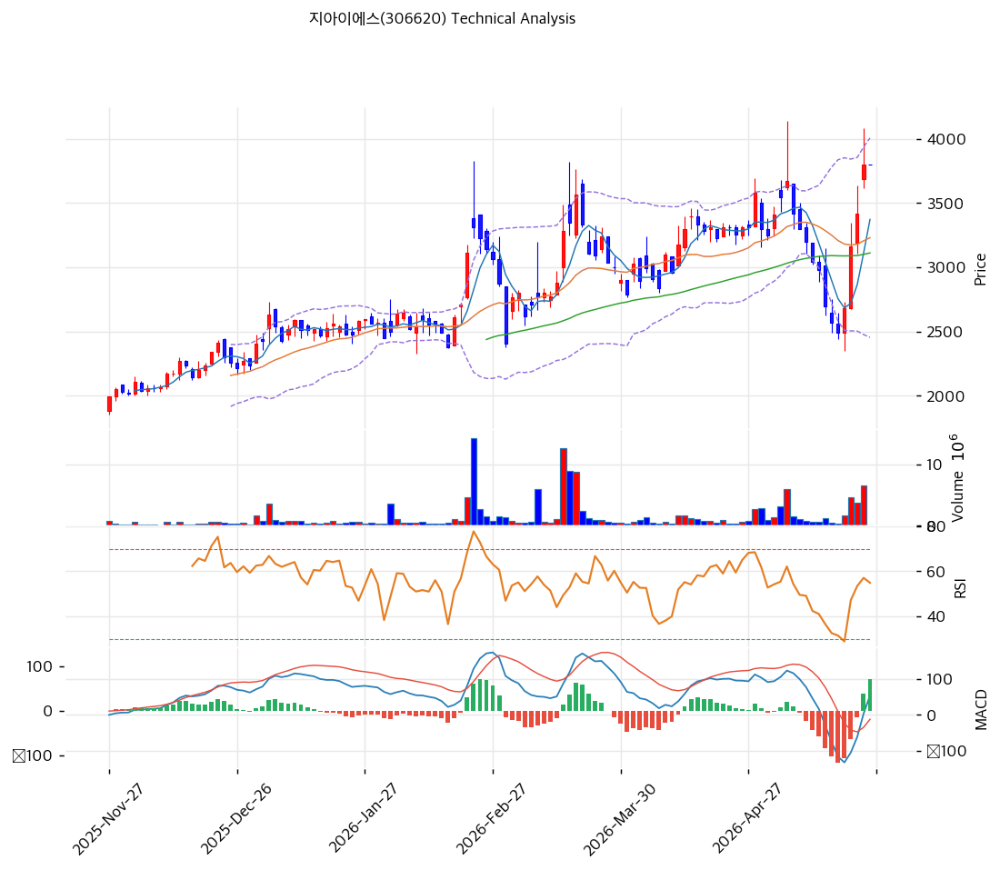

# 지아이에스(306620) 기술적 분석

2026-05-27 | T2 Technical Analysis

---

## 차트

---

## 1. 가격 현황

| 항목 | 값 |
|------|-----|
| 현재가 | 3,800원 (0.00%) |
| 52주 고가 | 3,800원 |
| 52주 저가 | 1,761원 |
| 52주 범위 위치 | 100.0% |
| 거래량 | 20일 평균 대비 0.00x (이상치) |

---

## 2. 차트 패턴 분석

### 2.1 캔들스틱 패턴

| 패턴 | 위치 | 신뢰도 | 해석 |
|------|------|--------|------|
| 신고가 양봉 | 현재 | 강 | 52주 신고가 도달 매수 우위 |
| 적삼병 | 최근 5일 | 중 | MA5 +12.7% 갭, 단기 상승 추세 |

### 2.2 가격 구조 패턴

- **52주 신고가 100% 위치** (신뢰도: 강)
  1년 1,761→3,800원 +116% 상승. AI MLCC 슈퍼사이클 + 네온테크 합병 기대 반영.

- **컵앤핸들 완성 후 돌파** (신뢰도: 중)
  2024Q4\~2025Q3 박스권(2,300\~3,000원) 형성 후 2025Q4부터 본격 상승. 3,800원 돌파 시 추가 여력.

### 2.3 다이버전스

- **MACD 매수 확장 (+73)** — 가격 신고가 + MACD 강세 동조, 추세 지속 시사. 다이버전스 부재.
- **RSI 63.6 중립** — 과매수 영역 미진입, 추가 상승 여력 잔존.

### 2.4 패턴 종합 판단

신고가 + 정배열 + MACD 매수 확장 3개 강세 일치. 단 거래량 0(이상치)로 추세 강도 검증 제한. **BW 13.4% 인-더-머니 +77% (행사가 2,151원) 6.97M주 매물벽** 잠재.

---

## 3. 이동평균선 — 정배열 (강세)

| MA | 값 | 현재가 괴리율 | 위치 |
|----|-----|--------------|------|
| MA5 | 3,373원 | +12.7% | 위 |
| MA20 | 3,231원 | +17.6% | 위 |
| MA60 | 3,112원 | +22.1% | 위 |
| MA120 | 2,776원 | +36.9% | 위 |
| MA200 | 2,471원 | +53.8% | 위 |

**해석**: 모든 MA 위 완전 정배열. MA200 +53.8% 중기 과열이나 AI 사이클 평균(+80\~150%) 대비 합리적. MA20 3,231원 1차 지지.

---

## 4. 보조 지표

### RSI(14) — 63.6 (중립)
70 미만 과매수 미진입, 모멘텀 상방 여력.

### MACD(12,26,9)

| 항목 | 값 |
|------|-----|
| MACD | 54 |
| Signal | -18 |
| Histogram | +73 |
| 크로스 | 매수 (확대 중) |

골든크로스 후 히스토그램 확장. 단기 추세 강세.

### 볼린저밴드(20, 2σ)

| 항목 | 값 |
|------|-----|
| 상단 | 4,006원 |
| 중단 (MA20) | 3,231원 |
| 하단 | 2,456원 |
| 밴드 폭 | 48.0% |
| 현재 위치 | 중간 |

밴드폭 48% 확장. BB 상단 4,006원 +5% 여유, 돌파 시 BB 워킹.

### 스토캐스틱(14, 3, 3)

| 항목 | 값 |
|------|-----|
| Slow %K | 73.9 |
| Slow %D | 59.1 |
| 크로스 | 골든크로스 |
| 판단 | 중립 |

---

## 5. 지지/저항 — 추세선·피보나치·PRZ 통합

| 구분 | 가격 | 근거 |
|------|------|------|
| 저항 | 4,300원 | 피보 1.618 확장 |
| 저항 | 4,088원 | 추세선 저항 |
| 저항 | 4,054원 | PRZ 약 — 피보 1.382 + 추세선 |
| **현재가** | **3,800원** | 52주 고가 |
| 지지 | 3,258원 | PRZ 약 — MA20 + 피보 0.236 |
| 지지 | 3,111원 | PRZ 약 — 피보 0.382 + MA60 |
| 지지 | 2,803원 | PRZ 약 — MA120 + 피보 0.618 |

피보 확장 목표: 1차 4,054, 2차 4,300, 3차 4,755원(피보 2.0).

---

## 6. 시그널 종합

| 지표 | 내용 | 시그널 |
|------|------|--------|
| **차트 패턴** | 신고가 + 컵앤핸들 돌파 | 🟢 |
| 이동평균선 | 완전 정배열 | 🟢 |
| RSI | 63.6 중립 | ⚪ |
| MACD | 매수 확장(+73) | 🟢 |
| 볼린저밴드 | 중간, 상단 +5% 근접 | ⚪ |
| 스토캐스틱 | K=73.9 골든크로스 | ⚪ |
| 거래량 | 0.0x (이상) | ⚪ |

**종합 판단**: 🟢 3 / 🔴 0 / ⚪ 4 → **매수우위 (모멘텀 추세)**

차트·MA·MACD 강세 일치, 거래량 0 이상치로 추세 강도 검증 제한. BW 6.97M주 매물벽 잠재.

---

## 7. 전략 제안

### 보유 중
- **홀드 + 부분 익절**
- 익절 4,300원 (피보 1.618, +13%)
- 손절 3,231원 (MA20, -15%)

### 진입 대기
- **관망 (BW 매물 우선 확인)**
- 1차 진입 3,258원 (MA20 + 피보 0.236)
- 2차 진입 3,111원 (피보 0.382 + MA60)
- 진입 조건: BW 6.97M주 매물 출회 → MA60 지지 확인
- **신규 추격 매수 비추천** (신고가 + BW + Cash Runway 1.8Q 3중 위험)
