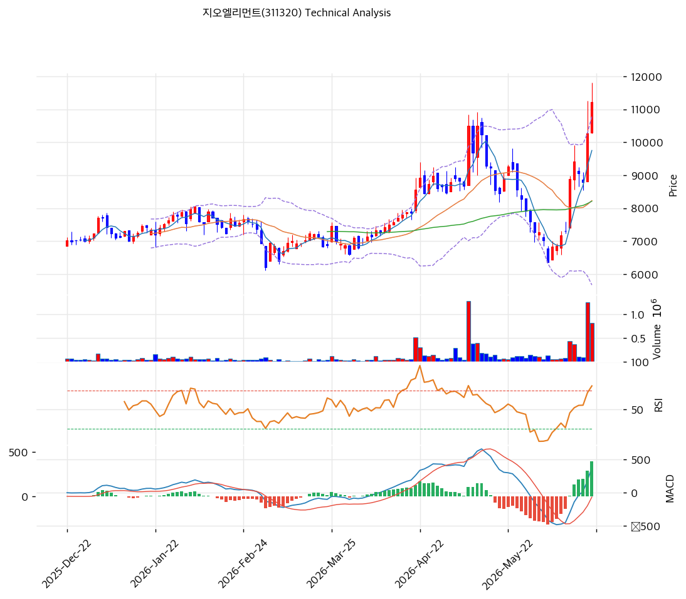

# 지오엘리먼트(311320) 기술적 분석

2026-06-22 | T2 Technical Analysis

---

## 차트

---

## 1. 가격 현황

| 항목 | 값 |
|------|-----|
| 현재가 | 11,220원 (+9.25%) |
| 52주 고가 | 11,800원 |
| 52주 저가 | 6,130원 |
| 52주 범위 위치 | 100% (신고가권) |
| 거래량비 | 4.51x (급증) |
| RSI | 69.8 (중립, 과매수 직전) |

> 저점(6,130원)에서 약 1.8배 상승, 신고가권(11,220원). 모든 이평선 위 완전 정배열(MA200 대비 +51.8%). RSI 69.8 과매수 직전·중립으로 **서산(95.8) 같은 극단 과열은 아님**. 거래량 4.51x 급증(오늘 +9.25%). 펀더(Big Deposition Cycle)+수급 동반 상승.

---

## 2. 차트 패턴 분석

### 2.1 구조·캔들

| 패턴 | 위치 | 신뢰도 | 해석 |
|------|------|--------|------|
| 정배열·신고가권 | 11,220원 | 중상 | 추세 강건 |
| 거래량 급증 | 4.51x | 중 | 매수 유입 |
| MA200 +52% 이격 | 큰 폭 | 중 | 단기 과열 누적 |

- **강세 정배열·신고가 도전** (신뢰도: 중상): 1.8배 상승, 정배열 유지. MACD 매수·확산.
- **단기 과열** (신뢰도: 중): RSI 69.8·스토캐 79. 볼린저 상단 근접, 밴드폭 62% 변동성.

### 2.2 다이버전스

- **상승 모멘텀 지속** (신뢰도: 중상): MACD 매수 전환(히스토그램 +392 급확대)·스토캐 골든크로스. RSI 69.8 중립으로 추가 여력. 거래량 동반.

---

## 3. 이동평균선 — 정배열·중기 과열

| MA | 값 | 괴리율 | 위치 |
|----|-----|--------|------|
| MA5 | 9,750 | +15.1% | 위 |
| MA20 | 8,227 | +36.4% | 위 |
| MA60 | 8,212 | +36.6% | 위 |
| MA120 | 7,750 | +44.8% | 위 |
| MA200 | 7,389 | +51.8% | 위 |

**해석**: 완전 정배열(aligned True). MA200 대비 +51.8%로 중기 과열이나 추세 강건. MA20·MA60(\~8,200원)이 1차 지지대, 단기 조정 시 시험. 이격이 크나 서산(+302%) 같은 극단은 아님.

---

## 4. 보조 지표

### RSI(14) — 69.8 (중립, 과매수 직전)
70 직전. 추가 상승 시 과매수 진입, 여력 잔존.

### MACD(12,26,9)
| MACD | Signal | Hist | 크로스 |
|---|---|---|---|
| 384 | -8 | +392 | 매수(확산) |

영선 상향 돌파·히스토그램 급확대 → 강한 상승 모멘텀 전환.

### 볼린저밴드(20,2σ)
| 상단 | 중단 | 하단 | 밴드폭 |
|---|---|---|---|
| 10,785 | 8,227 | 5,669 | 62.2% |

현재가 11,220은 상단(10,785) 돌파. 밴드폭 62% 고변동. 상단 돌파 후 안착 시 추가 상승이나 과열.

### 스토캐스틱
| %K | %D | 판단 |
|---|---|---|
| 79.3 | 77.1 | 골든크로스(중립 상단) |

80 직전, 골든크로스로 상승 모멘텀.

---

## 5. 지지/저항

| 구분 | 가격 | 근거 |
|------|------|------|
| 저항 | 12,904 | 피보 1.618 확장 |
| 저항 | 11,986 | 피보 1.382 확장 |
| 저항 | 11,923 | 피봇 R1 |
| 저항 | 11,800 | 52주 고가 |
| **현재가** | **11,220** | 신고가권 |
| 지지 | 10,785 | 볼린저 상단 |
| 지지 | 10,410 | PRZ·피봇 S1 |
| 지지 | 9,633 | PRZ(중)·피보 0.236·MA5 |
| 지지 | 9,014 | 피보 0.382 |
| 지지 | 8,227 | MA20·볼린저 중단 |
| 지지 | 8,178 | PRZ(중)·MA20·MA60·피보 0.618 |
| 지지 | 7,389 | MA200 |

---

## 6. 시그널 종합

| 지표 | 내용 | 시그널 |
|------|------|--------|
| 차트 패턴 | 정배열·신고가권 | 🟢 |
| 이동평균선 | 완전 정배열 | 🟢 |
| RSI | 69.8 — 중립 | ⚪ |
| MACD | 매수(확산) | 🟢 |
| 볼린저밴드 | 상단 돌파 | 🔴 |
| 스토캐스틱 | 골든크로스 79 | ⚪ |
| 거래량 | 4.51x 급증 | ⚪ |

**종합 판단**: 🟢 매수 3개 / 🔴 매도 1개 / ⚪ 중립 3개 → **매수 우위 (강세·중기 과열)**

1.8배 상승 후 신고가권에서 강한 정배열을 유지. MACD 매수·확산·거래량 4.51x로 모멘텀이 살아 있고, RSI 69.8로 서산 같은 극단 과열은 아니다(과매수 직전). 볼린저 상단 돌파로 단기 과열은 있으나 추세는 건강하다. MA20/MA60(\~8,200원) 지지가 단기 분수령. 펀더(소모품화)+수급(외국인·기관 매수)이 받쳐 추격보다 **눌림목 분할**이 합리적.

---

## 7. 전략 제안

### 보유 중인 경우
- **홀드 (신고가 트레일링)**
- 익절: 11,800(52주 고가)·11,923(피봇 R1)·피보 확장(12,904) 분할
- 손절: 9,567(피봇 S2)·MA20(8,227) 이탈
- 변동성 큼(밴드폭 62%), 분할 익절

### 진입 대기인 경우
- **눌림목 분할 (추격 자제)**
- 1차 진입가: 9,633\~10,410 (PRZ·피봇 S1·MA5)
- 2차 진입가: 8,178\~8,227 (MA20·MA60·피보 0.618 PRZ)
- 진입 조건: 펀더 견조하나 단기 과열·52주 고가. MA20 눌림 또는 분기 실적(소모품화 매출) 가시화 확인 후 분할. 추격은 자제.
