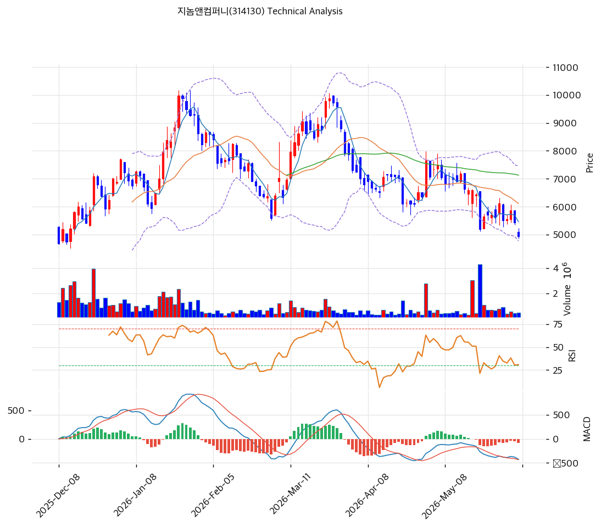

# 지놈앤컴퍼니(314130) 기술적 분석 보고서

---

## 가격 위치

현재가 **4,940원** (-8.86%) — 1년 위치 33%(고점 9,970원 대비 **-50%**, 저점 2,465원 대비 +100%). 당일 -8.86% 급락. 유상증자·CB 희석 우려 + 기관 대량 매도(20일 -136만주)로 **하락 추세**. RSI 35.4·스토캐 18로 과매도권이나 추세 미반전. 바이오 적자주 특성상 변동성 큼.

## 이동평균선

| 이평선 | 값 | 이격도 | 위치 |
|------|---:|----:|:---:|
| MA5 | 5,456원 | -9.5% | 아래 |
| MA20 | 6,111원 | -19.2% | 아래 |
| MA60 | 7,126원 | -30.7% | 아래 |
| MA120 | 7,127원 | -30.7% | 아래 |
| MA200 | 5,443원 | -9.2% | 아래 |

**완전 역배열(하락추세)** — 현재가가 모든 이평선 아래. MA20·MA60(6,100\~7,100원)이 위에서 강한 저항. 반등 시 1차 저항 MA5 5,456원, MA200 5,443원.

## 모멘텀 지표

- **RSI 35.4 (중립)** — 30 과매도 위, 침체권. 추가 하락 압력 제한적이나 반전 미약
- **MACD -425 / 시그널 -361 / 히스토 -64** — 매도 + 하락 확장. 하락 모멘텀 지속
- **스토캐스틱 K=18.0 / D=20.9** — 데드크로스 **과매도(18 극단)**. 단기 기술적 반등 가능 구간
- **볼린저밴드** — 상단 7,452 / 중심 6,111 / 하단 4,770, 폭 43.9%, **하단 근접/이탈**. 과매도
- **거래량비 0.57x** — 거래 위축

## 피보나치 되돌림 (직전 상승 스윙 2,465 / 9,970)

| 레벨 | 가격 | 성격 |
|------|---:|------|
| 0.618 | 5,332원 | 반등 시 저항 (MA5·MA200 근접) |
| 0.786 | 4,071원 | 현재가 아래 지지 |
| 저점 | 2,465원 | 52주 저가 |

※ 하락 추세로 되돌림 상단은 저항. 현재가는 0.618(5,332)\~0.786(4,071) 사이.

## 지지/저항 (S&R)

- **저항**: 5,443원(MA200) / 5,456원(MA5) / 6,111원(MA20·BB 중심) / 7,126원(MA60)
- **지지**: **4,770원(BB 하단)** / 4,071원(피보 0.786) / 2,465원(52주 저가)

## 종합 시그널 & 전략

**시그널: 매수 1 / 매도 1 / 중립 4 → 중립** (과매도 vs 하락추세·희석)

- **전략**: 관망 우위. 역배열 하락추세 + 유상증자·CB 희석 진행으로 **신규 진입 비추천**. 보유 시 반등(MA5 5,456원) 시 비중 조절
- **기술적 반등**: 스토캐 18·RSI 35·BB 하단으로 **단기 과매도 반등 가능**하나, 추세 반전 신호(MA20 6,111원 회복) 전까지는 반등 매도 관점. 투기적 단기 반등 외 추세 매수는 희석·적자 확인 후
- **상방**: 반등 시 MA5·MA200 5,440원 → MA20 6,111원. 파이프라인 L/O·증자 종료가 트리거
- **하방**: BB 하단 4,770원 이탈 시 피보 0.786 4,071원 → 52주 저가 2,465원. 증자 가격·희석에 따라 추가 하락 위험
- **변곡점**: 유상증자 규모·일정 + 파이프라인 모멘텀이 추세 핵심. 적자·희석 바이오로 비중·손절 엄격, 단기 반등은 투기적 접근
