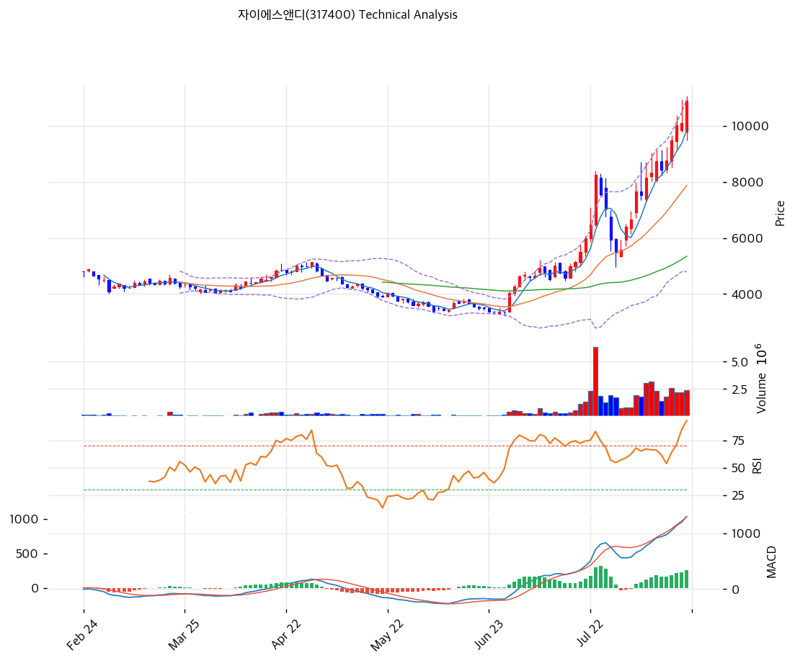

# 자이에스앤디(317400) 기술적 분석

## 차트

## 가격 현황

| 항목 | 값 |
|---|---|
| 현재가 | **10,900원** (**+7.92%**) |
| 당일 시가 / 고가 / 저가 | 9,790 / **11,080** / 9,480원 |
| 52주 고 / 저 | **11,080원** (2026-08-19) / **3,050원** (2025-11-04) |
| 52주 위치 | **97.8%** |
| 고점 대비 | -1.6% |
| **15거래일 상승률** | **+95.7%** (7/30 5,570원 → 8/19 10,900원) |
| 52주 저점 대비 | **+257.4%** |
| 3개월 / 6개월 / 1년 수익률 | +179.1% / +125.9% / **+215.9%** |
| RSI(14) | **78.6 (과매수)** |
| MACD | 1,297 / 1,037 / **+260** (히스토그램 확대) |
| Stochastic | K=92.0 D=92.2 (과매수) |
| 볼린저(20) | 상단 10,953 / 중단 7,876 / 하단 4,799, 폭 78.1% |
| 거래량 | 2,423,050주 (20일 평균 대비 **1.13배**) |

오늘 장중 11,080원으로 52주 신고가를 새로 썼고 종가는 고점 대비 1.6% 아래다. 볼린저 상단 10,953원을 종가로 살짝 밑돌았다.

## 이동평균선

| MA | 가격(원) | 갭 | 위치 |
|---|--:|--:|---|
| MA5 | 9,858 | +10.6% | 위 |
| MA20 | 7,876 | **+38.4%** | 위 |
| MA60 | 5,349 | **+103.8%** | 위 |
| MA120 | 4,888 | **+123.0%** | 위 |
| MA200 | 4,558 | **+139.2%** | 위 |

→ **완전 정배열이며 이격이 크다.** 200일선 대비 +139.2%, 60일선 대비 +103.8%다. 다만 20일선 대비 +38.4%는 혜인(003010)의 +100.4%와 비교하면 훨씬 완만하다. **급등이 3주 이상에 걸쳐 계단식으로 진행됐기 때문이다.**

MA60(5,349), MA120(4,888), MA200(4,558)이 4,500\~5,300원 구간에 몰려 있다. 2025년 대부분을 그 자리에서 보냈다는 뜻이다.

## 상승 경로

| 일자 | 종가 | 등락 | 거래량 | 비고 |
|---|--:|--:|--:|---|
| 2025-11-04 | 3,050원(장중) | | | **52주 최저** |
| 2026-07-29 | 5,090원 | | | 상승 시작 직전 |
| 2026-07-30 | 5,570원 | +9.4% | 753,548 | |
| 2026-07-31 | 6,400원 | +14.9% | 850,603 | |
| 2026-08-03 | 6,670원 | +4.2% | 846,468 | |
| 2026-08-04 | 7,670원 | +15.0% | 1,946,617 | 거래량 급증 |
| 2026-08-05 | 7,530원 | -1.8% | 1,797,868 | |
| 2026-08-06 | 8,140원 | +8.1% | 3,036,219 | |
| 2026-08-07 | 8,320원 | +2.2% | 3,166,049 | |
| 2026-08-10 | 8,750원 | +5.2% | 2,359,520 | |
| 2026-08-11 | 8,430원 | -3.7% | 1,411,643 | |
| 2026-08-12 | 8,770원 | +4.0% | 1,791,797 | |
| 2026-08-13 | 9,490원 | +8.2% | 2,602,173 | |
| **2026-08-14** | **10,030원** | **+5.7%** | 2,199,379 | **반기보고서 제출일** |
| 2026-08-18 | 10,100원 | +0.7% | 2,216,608 | |
| **2026-08-19** | **10,900원** | **+7.92%** | 2,423,050 | 장중 11,080원 신고가 |

**상한가가 한 번도 없었다.** 15거래일 동안 하루 최대 상승이 8월 4일 +15.0%였고, 나머지는 2\~9% 사이에서 계단식으로 올랐다. 조정일도 세 번(8/5, 8/11, 그리고 8/18의 +0.7% 사실상 보합) 끼어 있다.

거래량도 8월 4일 이후 꾸준히 200만\~300만주를 유지했다. 하루 폭발 후 급감하는 패턴이 아니다.

**8월 14일 반기보고서 제출 이후에도 상승이 이어졌다는 점이 중요하다.** 그날 공개된 1H2026 실적은 영업이익 흑자전환(+203.8억)과 매출총이익률 660bp 개선이었다.

## 수급

| 구분 | 5일 누적 | 20일 누적 | 20일 금액 |
|---|--:|--:|--:|
| **기관** | **+1,030,568주** | **+2,946,071주** | **약 260억원** |
| 외국인 | -181,327주 | +528,582주 | 약 14억원 |

**주요 일자 (주)**

| 일자 | 기관 | 외국인 | 개인 |
|---|--:|--:|--:|
| 2026-08-06 | **+520,879** | -246,770 | -318,342 |
| 2026-08-07 | +356,905 | -18,891 | -268,682 |
| 2026-08-10 | **+607,345** | -288,613 | -300,516 |
| 2026-08-12 | +164,968 | +122,688 | -315,906 |
| 2026-08-13 | +372,432 | -988 | -341,565 |
| 2026-08-14 | +304,676 | -285,248 | -32,371 |
| 2026-08-18 | +219,110 | -144,421 | -27,371 |
| 2026-08-19 | -30,618 | +126,642 | -62,772 |

⚠️ **기관이 20거래일간 294.6만주를 순매수했다. 발행주식 3,878만주의 7.6%다.** 8월 6일 이후 거의 매일 순매수했고 개인은 계속 순매도했다.

혜인(003010)의 수급이 날마다 방향이 뒤집히는 단기 자금 회전이었던 것과 달리, 이 종목은 **한 주체가 일관되게 사들이는 그림**이다.

## 시그널 종합

| 구분 | 카운트 |
|---|--:|
| 매수 | 3 |
| 매도 | 0 |
| 과열 경고 | 2 |
| 중립 | 1 |
| **결론** | **추세 강세, 단기 과열** |

- 🟢 **이동평균** 5개선 완전 정배열
- 🟢 **MACD** 1,297 > 시그널 1,037. 히스토그램 +226에서 +260으로 확대 중
- 🟢 **거래량** 20일 평균 대비 1.13배로 상승 내내 유지. 급등 후 이탈 조짐 없음
- 🔴 **RSI 78.6** 과매수. 다만 90을 넘지는 않았다
- 🔴 **스토캐스틱** K 92.0 D 92.2 동반 과매수
- ⚪ **볼린저** 종가 10,900이 상단 10,953 바로 아래. 밴드 폭 78.1%로 넓다

과열 지표가 켜져 있지만 극단은 아니다. RSI 78.6은 조정 없이 며칠 더 갈 수 있는 수준이며, MACD 히스토그램이 확대 중이라 모멘텀 자체는 아직 꺾이지 않았다.

## 지지·저항

| 구분 | 가격(원) | 근거 |
|---|--:|---|
| 저항 | 13,130 | 당일 상한가 |
| 저항 | 12,087 | 피봇 R2 |
| 저항 | 11,493 | 피봇 R1 |
| **강 저항** | **11,080** | **52주 최고 (당일 장중)** |
| 저항 | 10,953 | 볼린저 상단 |
| **현재가** | **10,900** | |
| 지지 | 10,030 | 8/14 종가 |
| 지지 | 9,893 | 피봇 S1 |
| 지지 | 9,858 | MA5 |
| 지지 | 9,480 | 당일 저가 |
| 지지 | 9,185 | 피보나치 0.236 되돌림 |
| 지지 | 8,887 | 피봇 S2 |
| **강 지지** | **8,013\~8,430** | **피보 0.382 + 8/11 조정 저점 매물대** |
| **강 지지** | **7,876** | **MA20** |
| 지지 | 7,065 | 피보나치 0.5 되돌림 |
| 강 지지 | 6,117 | 피보나치 0.618 되돌림 |
| 강 지지 | 4,558\~5,349 | MA60·MA120·MA200 밀집 |

※ 피보나치는 상승 추세 기준(저점 3,050원 → 고점 11,080원)
※ 확장 목표: 1.272 = 13,264원 / 1.618 = 16,043원

**7,876\~8,430원 구간이 1차 실질 지지대다.** MA20(7,876), 피보나치 0.382 되돌림(8,013), 8월 11일 조정 저점(8,230원 장중)이 겹친다.

## 전략

| 시나리오 | 액션 |
|---|---|
| 보유자 | **홀드** (TP 1차 11,493원 피봇 R1 / 2차 13,264원 피보 1.272 확장) |
| 신규 진입 | **분할 접근.** 지금 절반, 조정 시 절반 |
| 조정 시 1차 | 9,185\~9,893원 (피보 0.236·피봇 S1, 현재가 대비 -9\~16%) |
| 조정 시 2차 | **7,876\~8,430원** (MA20·피보 0.382, -23\~28%) |
| 추세 확장 확인 | **11,080원 거래량 동반 돌파 후 안착** |
| 손절 기준 | 7,876원(MA20) 이탈 |
| 이벤트 트리거 | 11월 중순 3분기 보고서 / **12월 24일 서초동 잔금** |

## 핵심 판단

차트는 **건강한 추세 상승**을 보여준다. 15거래일에 95.7% 올랐지만 상한가가 한 번도 없었고, 하루 최대 상승이 15.0%였으며, 조정일이 세 번 끼어 있다. 거래량은 200만\~300만주를 꾸준히 유지했고 기관이 20거래일간 발행주식의 7.6%를 순매수했다.

앞서 다룬 혜인(003010)과의 대비가 선명하다.

| 항목 | 자이에스앤디 | 혜인 |
|---|---|---|
| 상승 기간 | 15거래일 | 8거래일 |
| 상승률 | +95.7% | +143.5% |
| 상한가 | **0회** | 2회 |
| RSI | 78.6 | 92.5 |
| MA20 이격 | +38.4% | +100.4% |
| 거래량 패턴 | 200만\~300만주 꾸준 | 하루 1,048만주 폭발 후 급감 |
| 기관 20일 | **+294.6만주 (7.6%)** | +16.9만주 |
| 상승 중 실적 발표 | **흑자전환 확인** | 매출 -21.2% |

**같은 데이터센터 테마 안에서도 성격이 완전히 다르다.** 자이에스앤디는 실적이 뒷받침된 기관 매집형 상승이고, 혜인은 실적과 무관한 단기 자금 급등이었다.

다만 과열은 과열이다. 200일선 대비 +139.2%, RSI 78.6, 52주 위치 97.8%다. 3개월 만에 179% 오른 종목에서 되돌림 없이 계속 가기를 기대하는 것은 무리다.

세 가지를 기준선으로 삼는 것이 실용적이다.

**① 11,080원** (52주 최고). 거래량 동반 돌파 시 피보나치 1.272 확장 13,264원이 다음 목표가 된다.
**② 7,876\~8,430원** (MA20·피보 0.382·8월 11일 저점). 1차 조정 목표이자 분할 매수 구간이다.
**③ 12월 24일** (서초동 잔금일). 차트가 아니라 이벤트가 방향을 정할 날이다.

보유자는 홀드하되 11,080원 돌파 실패 시 일부 익절을 검토하고, 신규 진입은 분할로 접근하는 것이 손익비에 맞는다.
