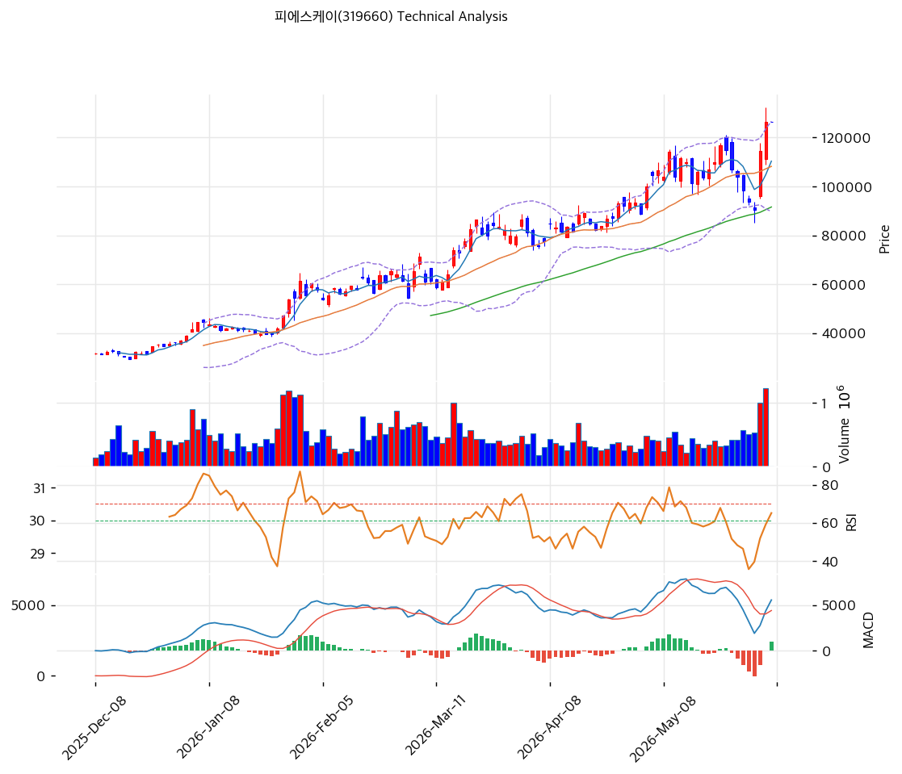

# 피에스케이(319660) 기술적 분석 보고서

---

## 가격 위치

현재가 **126,500원** (보합) — **52주 신고가** 갱신, 52주 위치 **100%** (고가 126,500원 / 저가 18,180원). 1년 **+596%** (18,180→126,500). 모든 메모리 고객 Capex 상향 + 1Q26 OPM 30% 어닝 서프라이즈. 외국인 20일 +47.5만주 순매수. RSI 64.7 중립, 스토캐 85.2 과매수.

## 이동평균선

| 이평선 | 값 | 이격도 | 위치 |
|------|---:|----:|:---:|
| MA5 | 110,360원 | +14.6% | 위 |
| MA20 | 108,210원 | +16.9% | 위 |
| MA60 | 91,603원 | +38.1% | 위 |
| MA120 | 69,408원 | +82.3% | 위 |
| MA200 | 53,760원 | +135.3% | 위 |

**완전 정배열 True**. MA200 대비 +135.3%, MA20 대비 +16.9% 이격. 1년 +596% 급등으로 중장기 이격 큼. MA5·MA20(11만원대) 대비 현재가 +15\~17%로 단기 상승 가속.

## 모멘텀 지표

- **RSI 64.7 (중립)** — 70 미만, 과매수 직전. 추가 모멘텀 여유
- **MACD 5,578 / 시그널 4,610 / 히스토 +969** — 매수 + 확장 진행. 상승 모멘텀 강함
- **스토캐스틱 K=85.2 / D=60.0** — 골든크로스 **과매수**(85 초과)
- **볼린저밴드** — 상단 126,672 / 중심 108,210 / 하단 89,748, 폭 34.1%, **상단 근접/돌파**. 변동성 확대
- **거래량비** — 당일 데이터 공백(보합)

## 피보나치 되돌림 (스윙 18,180 / 126,500)

| 레벨 | 가격 | 성격 |
|------|---:|------|
| 0.236 | 100,900원 | 1차 지지 (MA60 위) |
| 0.382 | 85,100원 | 2차 지지 (MA60 근접) |
| 0.5 | 72,340원 | 중기 지지 (MA120 위) |
| 0.618 | 59,560원 | 깊은 조정 |
| 0.786 | 41,360원 | 추가 조정 |

## 지지/저항 (S&R)

- **저항**: 126,500원(52주 고가) / 126,672원(BB 상단) / 129,030원(전략 TP·피봇 R1)
- **지지**: **110,360원(MA5)** / **108,210원(MA20·BB 중심·PRZ)** / 100,900원(피보 0.236) / 91,603원(MA60) / 89,748원(BB 하단)

## 종합 시그널 & 전략

**시그널: 매수 2 / 매도 1 / 중립 3 → 매수우위** (정배열 + MACD 확장 vs 스토캐 과매수)

- **전략**: HOLD(홀드) — **TP 129,030원 / SL 126,500원**. WAIT(관망) e1 126,500원 / e2 108,210원
- **눌림목 매수**: 1년 +596% + 스토캐 85.2 과매수로 신고가 추격은 신중. 단 RSI 64.7로 극단은 아님. **MA5 110,360원 ~ MA20 108,210원(PRZ) 눌림목 분할 매수** 권고. 깊은 조정 시 피보 0.236 100,900원
- **상방**: 52주 고가 126,500원 돌파 시 129,030원 → 하나 목표 160,000원. 고객 capex 상향·실적 모멘텀이 동력
- **하방**: MA20 108,210원 이탈 시 100,900원 → MA60 91,603원. capex 사이클 둔화 시 조정
- **변곡점**: 메모리 고객 Capex 상향 지속이 추세 핵심. 스토캐 과매수로 단기 조정 가능하나 펀더멘털(OPM 30%·다변화) 견고
