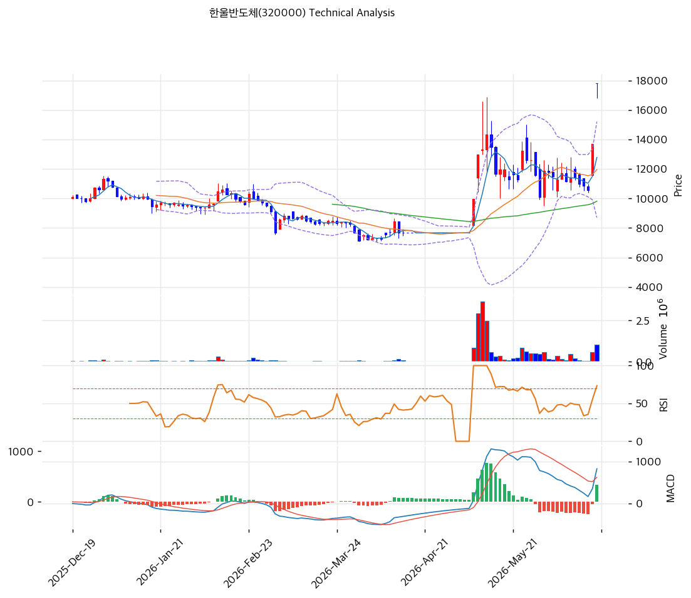

# 기술적분석

2026-06-20 | T2 Technical Analysis

***

## 차트

***

## 1. 가격 현황

| 항목        | 값                              |
| --------- | ------------------------------ |
| 현재가       | 17,820원 (+29.98%, 2거래일 연속 상한가) |
| 52주 고가    | 17,820원 (당일 = 신고가)             |
| 52주 저가    | 7,119원 (액면병합 반영)               |
| 52주 범위 위치 | 100% (사실상 최고가)                 |
| 거래량비      | 3.18x (급증)                     |
| 비고        | 2026.5 액면병합(5:1)·거래재개 후 6주간 급등 |

> 액면병합 거래재개일(2026-05-08) 9,970원에서 약 6주 만에 17,820원으로 **포물선형 급등**, 무라타 MOU(6/18)로 2거래일 연속 상한가. 모든 이평선 위(MA5 +39%·MA20 +49%·MA200 +75%)로 **극단적 과열**. RSI 75.2 과매수, 거래량 3.18x 급증. ⚠️ 액면병합 후 거래일이 6주뿐이라 중장기 이평선(MA120·MA200)은 신뢰도 제한적.

***

## 2. 차트 패턴 분석

### 2.1 캔들스틱 패턴

| 패턴            | 위치      | 신뢰도 | 해석           |
| ------------- | ------- | --- | ------------ |
| 연속 상한가(점상 근접) | 17,820원 | 중   | 테마 급등, 매물 공백 |
| 거래량 급증        | 3.18x   | 중   | 단기 과열·교차     |
| 갭상승 후 고점      | 신고가     | 중   | 차익실현 부담      |

※ 주요 캔들 패턴: 망치형, 역망치형, 장악형, 도지, 샛별/석별, 적삼병/흑삼병, 하라미, 유성형, 교수형 등

### 2.2 가격 구조 패턴

* **포물선형 급등(parabolic) — 과열 정점** (신뢰도: 중상) 9,970→17,820원 6주 급등. MA20 대비 +49%, MA200 대비 +75% 이격. 단기 조정 시 낙폭 클 수 있음.
* **신고가·매물 공백** (신뢰도: 중) 당일 신고가라 위쪽 저항 부재(매물대 없음). 단 차익실현·유증 일정이 하방 압력.

※ 주요 구조 패턴: 이중천정/바닥, 삼각수렴, 쐐기형, 깃발형, 페넌트, 컵앤핸들, 박스권 등

### 2.3 다이버전스

* **과매수 극단 — 단기 조정 경계** (신뢰도: 중) RSI 75.2·스토캐 골든크로스(상승)이나 과매수권. 가격 포물선·지표 과열로 급락 전환 위험 내재.

※ RSI·MACD 기반 | 상승 다이버전스 = 가격↓ 지표↑, 하락 다이버전스 = 가격↑ 지표↓

### 2.4 패턴 종합 판단

액면병합 거래재개 후 6주간 9,970→17,820원으로 **포물선형 급등**한 극단적 과열 국면이다. 무라타 MOU 호재로 2거래일 연속 상한가를 쳤고, 당일 신고가라 위쪽 매물 저항은 없으나 RSI 75.2·MA200 대비 +75% 이격으로 **과열의 정점**에 있다. 테마성 급등주는 호재 소멸·차익실현 시 급락(연속 하한가)이 빈번하며, **8월 유상증자 일정·관리종목 요건이 하방 압력**으로 작용한다. 추격 매수는 극도로 위험하며, 기술적으로는 이평선 이격 축소(MA20 11,955원 회귀)나 테마 모멘텀 확인 후 접근이 필요. 신고가 갱신 실패 시 빠른 되돌림 가능.

***

## 3. 이동평균선 — 극단적 정(+)이격

| MA    | 값      | 현재가 괴리율 | 위치 |
| ----- | ------ | ------- | -- |
| MA5   | 12,784 | +39.4%  | 위  |
| MA20  | 11,955 | +49.1%  | 위  |
| MA60  | 9,815  | +81.6%  | 위  |
| MA120 | 9,712  | +83.5%  | 위  |
| MA200 | 10,152 | +75.5%  | 위  |

**해석**: 현재가가 모든 이평선 대비 +39\~83% 위로 **극단적 과열**. 정배열(aligned)은 False — 단기 급등으로 이평선 배열이 정렬되지 못한 채 가격만 수직 상승한 전형적 테마 급등 패턴. 이런 이격은 통계적으로 되돌림(MA20 11,955원 부근) 압력이 매우 강하다. ⚠️ 액면병합 후 6주 데이터라 MA120·MA200은 참고만.

***

## 4. 보조 지표

### RSI(14) — 75.2 (과매수 🔴)

70 초과 과매수권. 포물선 급등으로 단기 조정·횡보 압력 누적.

### MACD(12,26,9)

| 항목        | 값      |
| --------- | ------ |
| MACD      | \~825  |
| Signal    | \~485  |
| Histogram | \~+340 |
| 크로스 상태    | 매수(확산) |

**해석**: MACD 매수·히스토그램 양(+) 확대로 단기 모멘텀은 강하나, 급등 막바지의 과열 신호일 수 있음. 모멘텀 꺾임 시 빠른 데드크로스 가능.

### 볼린저밴드(20, 2σ)

| 항목        | 값            |
| --------- | ------------ |
| 상단        | 15,206       |
| 중단 (MA20) | 11,955       |
| 하단        | 8,704        |
| 밴드 폭      | 54.4% (초고변동) |
| 현재 위치     | 상단 돌파        |

**해석**: 현재가 17,820원은 상단(15,206원)을 큰 폭 돌파(밴드 초과). 밴드폭 54.4% 초고변동. 밴드 상단 돌파 후 복귀 시 중단(11,955원)까지 되돌림 가능. 극단적 변동성 구간.

### 스토캐스틱(14, 3, 3)

| 항목      | 값      |
| ------- | ------ |
| Slow %K | 74.7   |
| Slow %D | 49.8   |
| 크로스 상태  | 골든크로스  |
| 판단      | 과매수 근접 |

**해석**: K=74.7 과매수 근접, 골든크로스로 단기 상승. 80 상회 시 과매수 진입.

***

## 5. 지지/저항

### 5.1 종합 지지/저항 테이블

| 구분      | 가격         | 근거                  |
| ------- | ---------- | ------------------- |
| 저항      | 18,340     | PRZ(약)·피봇 R2        |
| 저항      | 18,167     | 피봇 R1               |
| **현재가** | **17,820** | 신고가(2거래일 상한가)       |
| 지지      | 17,127     | 피봇 S1               |
| 지지      | 16,433     | 피봇 S2·전략 SL         |
| 지지      | 15,206     | 볼린저 상단              |
| 지지      | 13,435     | 피보 0.786            |
| 지지      | 12,754     | PRZ(약)·피보 0.618·MA5 |
| 지지      | 11,955     | MA20·볼린저 중단         |
| 지지      | 9,815      | MA60                |
| 지지      | 8,704      | 볼린저 하단              |

> 신고가라 위쪽 매물 저항은 없으나, 아래쪽 지지가 멀다. 단기 급락 시 MA20(11,955원)·MA60(9,815원)까지 갭이 큼. 유증 예정 발행가 4,865원은 현재가의 27% 수준(병합 전 기준이나 참고).

***

## 6. 시그널 종합

| 지표    | 내용             | 시그널 |
| ----- | -------------- | --- |
| 차트 패턴 | 포물선 급등·신고가     | 🟢  |
| 이동평균선 | 극단 정이격(과열)     | 🔴  |
| RSI   | 75.2 — 과매수     | 🔴  |
| MACD  | 매수(확산)         | 🟢  |
| 볼린저밴드 | 상단 돌파, 밴드폭 54% | 🔴  |
| 스토캐스틱 | 골든크로스, K=74.7  | ⚪   |
| 거래량   | 3.18x 급증       | ⚪   |

**종합 판단**: 🟢 매수 2개 / 🔴 매도 2개(과열) / ⚪ 중립 3개 → **중립 (강한 모멘텀 vs 극단 과열)**

포물선형 급등으로 모멘텀(MACD 매수)은 강하나, RSI 75.2·MA200 대비 +75% 이격·볼린저 상단 돌파로 **과열이 극단**이다. 테마 급등주 특성상 호재 소멸·차익실현 시 급락 위험이 크고, **8월 유상증자·관리종목 요건**이 하방을 누른다. ⚠️ **추격 매수 절대 금물**, 보유자도 분할 익절·타이트 손절(16,433원 이탈)이 합리적. 테마 트레이딩이라도 이격 축소 후 접근.

***

## 7. 전략 제안

### 보유 중인 경우

* **분할 익절 (과열 관리)**
* 익절: 상한가 풀림·음봉 전환 시 분할 매도, 17,000원대 일부 차익
* 손절: 16,433원(피봇 S2) 이탈 시 / MA20(11,955원) 이탈 시 전량
* 리스크/리워드: 초고변동(밴드폭 54%)·연속 하한가 위험, 비중 축소

### 진입 대기인 경우

* **관망 (추격 금지)**
* 진입 부적합: 포물선 정점·과매수·유증/관리종목 리스크
* 굳이 트레이딩 시: MA20(11,955원) 회귀·지지 확인 후 소량, 무라타 MOU의 실제 수주 전환·본업 턴어라운드 확인이 우선
* ⚠️ 유상증자 일정(신주배정기준일 7/1, 상장 8/28)·법차손 관리종목 요건 반드시 확인
