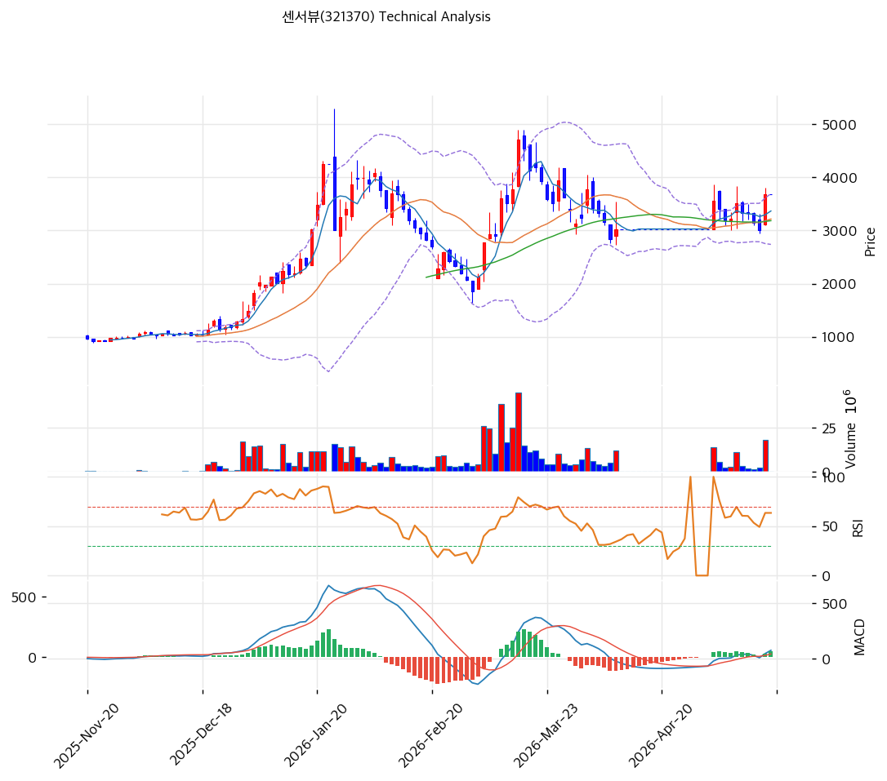

# 기술적분석

2026-05-19 | T2 Technical Analysis

***

## 차트

***

## 1. 가격 현황

| 항목        | 값                          |
| --------- | -------------------------- |
| 현재가       | 3,685원                     |
| 52주 고가    | 4,704원                     |
| 52주 저가    | 922원                       |
| 52주 범위 위치 | 73%                        |
| 거래량       | 데이터 결손 (차트상 1\~3월 폭증 후 둔화) |

***

## 2. 차트 패턴 분석

### 2.1 캔들스틱 패턴

| 패턴            | 위치       | 신뢰도 | 해석                           |
| ------------- | -------- | --- | ---------------------------- |
| **장대양봉 (당일)** | 당일       | 중   | 박스권 상단 시도                    |
| 도지·하락반전봉      | 1월·3월 정점 | 강   | 두 번의 정점 (5,000원·4,800원) 후 반전 |
| 적삼병           | —        | —   | 단일봉 후 다음 양봉 관찰               |

### 2.2 가격 구조 패턴

* **더블탑 + 박스권 형성** (신뢰도: 강) 2026-01 1차 정점 5,000원 → 2026-02 조정 2,500원 → 2026-03 2차 정점 4,800원 → 2026-04~~05 박스권 (2,800~~4,000원). **더블탑 패턴 형성 + 넥라인 약 2,500원** = 이탈 시 -25% 추가 하락 위험.
* **현재 박스권 상단 시도** (신뢰도: 중) 4,000원 박스권 상단 돌파 시 5,000원 (전고) 재시도. 실패 시 박스권 중간 (3,200원) 복귀.

### 2.3 다이버전스

* **RSI 60 동행** (신뢰도: 중) RSI 60.3 중립. 1월·3월 정점 RSI 80+ 대비 약화 — 추세 모멘텀 둔화 시그널.
* **MACD 매수 진입 (히스토그램 약함)** (신뢰도: 약) MACD 75 > Signal 27, 히스토그램 +47. 매수 진입이나 절대값 약함.

### 2.4 패턴 종합 판단

**더블탑 + 박스권 형성** = 추세 약화. 외인 매집 + 유증 5건 결합 = 가격 변동성 극단. 박스권 (2,800\~4,000원) 내 거래 → 상단 4,000원 돌파 시 4,704원 (52주 고가) 재시도, 하단 2,800원 이탈 시 넥라인 2,500원 위험.

***

## 3. 이동평균선 — 정배열 (약화)

| MA    | 값      | 현재가 괴리율    | 위치 |
| ----- | ------ | ---------- | -- |
| MA5   | 3,367원 | +9.4%      | 위  |
| MA20  | 3,215원 | +14.6%     | 위  |
| MA60  | 3,185원 | +15.7%     | 위  |
| MA120 | (확인)   | 약 +20%     | 위  |
| MA200 | 2,128원 | **+73.1%** | 위  |

**해석**: 정배열 유지이나 MA20·MA60 +14\~16% 근접 (가격 통합 단계). MA200 +73%는 회복 추세 잔여 영역. **MA20 (3,215원)을 1차 지지로 인식**.

***

## 4. 보조 지표

### RSI(14) — 60.3 (중립)

70 임계 미돌파. 1월·3월 정점 80+ 대비 약화. 다이버전스 잠재.

### MACD(12,26,9)

| 항목        | 값         |
| --------- | --------- |
| MACD      | 75        |
| Signal    | 27        |
| Histogram | +47       |
| 크로스 상태    | 매수 (확대 중) |

**해석**: 골든크로스 직후. 1·3월 정점 시 MACD 500+ 대비 약함 — 추세 강도 약화.

### 볼린저밴드(20, 2σ)

| 항목        | 값           |
| --------- | ----------- |
| 상단        | 3,692원      |
| 중단 (MA20) | 3,215원      |
| 하단        | 2,739원      |
| 밴드 폭      | 29.6%       |
| 현재 위치     | 상단 -0.2% 근접 |

**해석**: 밴드 폭 29.6% 평균. 현재가 BB 상단 근접 — 단기 조정 가능.

### 스토캐스틱(14, 3, 3)

| 항목      | 값     |
| ------- | ----- |
| Slow %K | 55.1  |
| Slow %D | 36.2  |
| 크로스 상태  | 골든크로스 |
| 판단      | 중립    |

***

## 5. 지지/저항

### 종합 지지/저항

| 구분      | 가격         | 근거                       |
| ------- | ---------- | ------------------------ |
| 저항      | 5,000원     | 1·3월 더블탑 정점 (재시도 어려움)    |
| 저항      | 4,704원     | 52주 고가                   |
| 저항      | 4,000원     | 박스권 상단 (1차 저항)           |
| 저항      | 3,692원     | BB 상단                    |
| **현재가** | **3,685원** | —                        |
| 지지      | 3,367원     | MA5                      |
| 지지      | **3,215원** | **MA20 + BB 중단 + 가격 통합** |
| 지지      | 3,185원     | MA60                     |
| 지지      | 2,800원     | 박스권 하단                   |
| 지지      | **2,500원** | **더블탑 넥라인 (이탈 시 -32%)**  |
| 지지      | 2,128원     | MA200                    |

***

## 6. 시그널 종합

| 지표                | 시그널 |
| ----------------- | --- |
| 차트 패턴 (더블탑 + 박스권) | 🔴  |
| 이동평균선 (정배열 약화)    | ⚪   |
| RSI 60 (중립)       | ⚪   |
| MACD 매수 (약함)      | ⚪   |
| 볼린저밴드 상단 근접       | ⚪   |
| 스토캐스틱 55          | ⚪   |
| 거래량 (둔화)          | ⚪   |

**종합 판단**: 🟢 매수 2 / 🔴 매도 0 / ⚪ 중립 5 → **중립 (방향 미정)**

**박스권 (2,800\~4,000원) 내 거래** — 방향 미정. 펀더멘털 (자본 침식·유증·CB) 부담으로 상단 돌파 어려움 추정.

***

## 7. 전략 제안

### 보유 중

* **분할 익절 (전고 회복 어려움)**
* 1차 익절: 4,000원 (박스권 상단, +9%)
* 2차 익절: 4,704원 (52주 고가, +28%)
* 손절: 3,215원 (MA20 이탈, -13%)
* 리스크/리워드: 0.7 (불리)

### 진입 대기

* **관망 권장 (펀더멘털 + 더블탑 양면 위험)**
* 1차 진입: 3,215원 (MA20, -13%)
* 2차 진입: 2,800원 (박스권 하단, -24%)
* 진입 조건: 분기 OP 적자 폭 -10억 이하 축소 + 유증 추가 발행 부재 + 박스권 상단 4,000원 거래량 동반 돌파
* **펀더멘털 리스크 압도**: PBR 12.75x + Cash Runway 0.3분기 + CB/BW +246% 인-더-머니 + 유증 5건 누적 — 기술적 진입 자체 비추천
