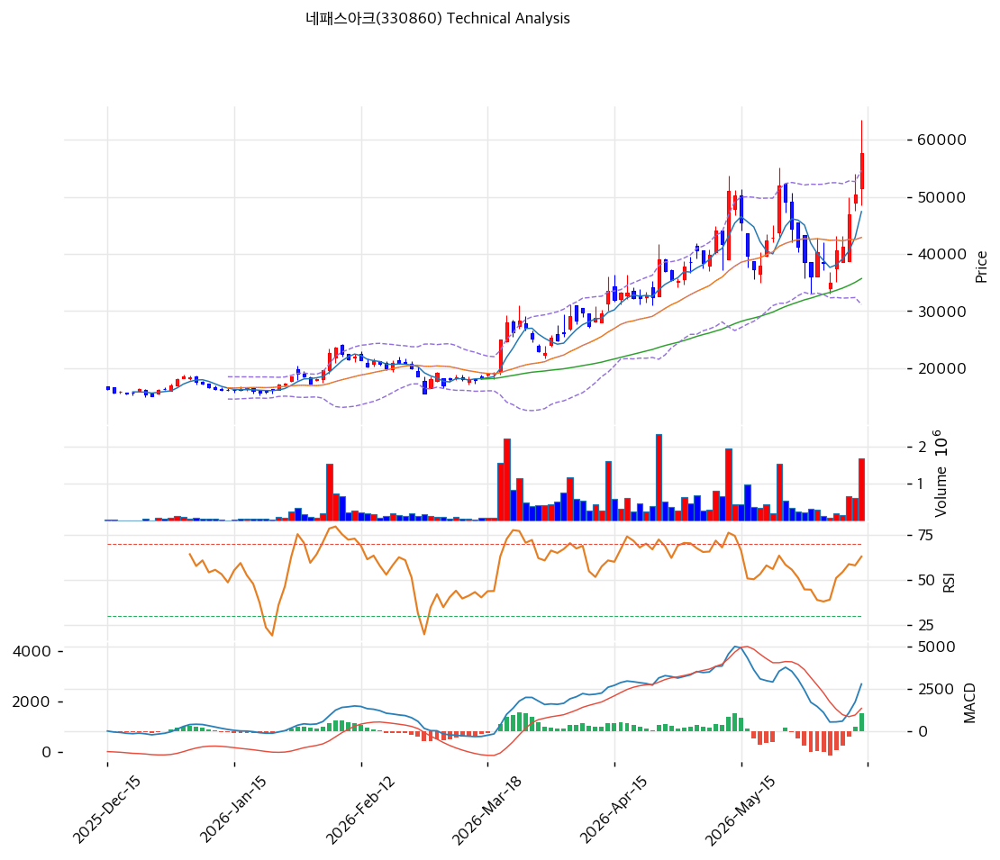

# 네패스아크(330860) 기술적 분석

2026-06-15 | T2 Technical Analysis

---

## 차트

---

## 1. 가격 현황

| 항목 | 값 |
|------|-----|
| 현재가 | 57,700원 (+14.26%) |
| 52주 고가 | 63,500원 |
| 52주 저가 | 10,980원 |
| 52주 범위 위치 | \~90% (신고가권) |
| 거래량 | 20일 평균 대비 **3.81x** (폭증) |

> 52주 저점(10,980원) 대비 약 5.3배 폭등. 당일 +14.26%·거래량 3.81배 폭증으로 강한 분출. 완전 정배열이나 MA200 대비 +149%의 극단적 장기 과열이 공존한다.

---

## 2. 차트 패턴 분석

### 2.1 캔들스틱 패턴

| 패턴 | 위치 | 신뢰도 | 해석 |
|------|------|--------|------|
| 장대양봉 + 거래량 폭증 | 당일 (+14.26%, 3.81x) | 강 | 매수 — 강한 분출 |
| 완전 정배열 | 최근 | 강 | 매수 — 모든 MA 위 |
| MA200 +149% 괴리 | — | 중 | 단기 과열 경계 |

※ 주요 캔들 패턴: 망치형, 역망치형, 장악형, 도지, 샛별/석별, 적삼병/흑삼병, 하라미, 유성형, 교수형 등

### 2.2 가격 구조 패턴

- **신고가권 분출 + 거래량 3.81배** (신뢰도: 강)
  HBM4 컨트롤러 테스트·증설·LS 목표가 상향 모멘텀으로 거래량 3.81배 동반 +14% 장대양봉. 전고(63,500원) 돌파 시 추세 가속.

- **장기 상승 추세 과열** (신뢰도: 강)
  MA200(23,201원) 대비 +149%의 극단적 괴리로 1년 5.3배 강세. 추세 강하나 평균회귀 압력 큼.

※ 주요 구조 패턴: 이중천정/바닥, 헤드앤숄더, 삼각수렴, 쐐기형, 깃발형, 페넌트, 컵앤핸들, 박스권 등

### 2.3 다이버전스

- **뚜렷한 다이버전스 없음 — 추세 추종** (신뢰도: 중)
  가격 분출·RSI 66.9 상승·MACD 매수 확대 동행. 거래량 폭증 동반. 스토캐스틱 74.5 과매수권으로 단기 과열 경계.

※ RSI·MACD 기반 | 상승 다이버전스 = 가격↓ 지표↑, 하락 다이버전스 = 가격↑ 지표↓

### 2.4 패턴 종합 판단

거래량 3.81배를 동반한 **강한 신고가권 분출** 국면이다. 완전 정배열·MACD 매수 확대로 추세가 강하나 MA200 +149%·스토캐스틱 74.5의 단기 과열이 동반된다. HBM4 테스트·증설·목표가 상향이 펀더멘털을 받친다. 5.3배 폭등 후 추격은 손익비 불리, 눌림목(MA20 42,902원·피보 0.236 51,027원) 확인이 안전하다.

---

## 3. 이동평균선 — 완전 정배열 (강세)

| MA | 값 | 현재가 괴리율 | 위치 |
|----|-----|--------------|------|
| MA5 | 47,440원 | +21.6% | 위 |
| MA20 | 42,902원 | +34.5% | 위 |
| MA60 | 35,703원 | +61.6% | 위 |
| MA120 | 26,900원 | +114.5% | 위 |
| MA200 | 23,201원 | +148.7% | 위 |

**해석**: 현재가 > 모든 MA의 완전 정배열 강세. 단기선(MA20 42,902원)과 +34.5% 괴리로 단기 과열 극심. MA200 대비 +149%의 극단적 괴리는 1년 5.3배 폭등의 결과로 평균회귀 압력이 매우 크다. 조정 시 MA20(42,902원)·MA60(35,703원)이 지지대.

---

## 4. 보조 지표

### RSI(14) — 66.9 (중립, 과매수 근접)

당일 급등으로 과매수(70) 직전. 강한 모멘텀이나 단기 과열 신호.

### MACD(12,26,9)

| 항목 | 값 |
|------|-----|
| MACD | 2,778 |
| Signal | 1,718 |
| Histogram | +1,060 |
| 크로스 상태 | 매수 구간 (히스토그램 확대) |

**해석**: MACD가 Signal 위에서 히스토그램을 크게 확대하는 강한 상승 모멘텀. 0선 위 강세.

### 볼린저밴드(20, 2σ)

| 항목 | 값 |
|------|-----|
| 상단 | 54,660원 |
| 중단 (MA20) | 42,902원 |
| 하단 | 31,145원 |
| 밴드 폭 | 54.8% |
| 현재 위치 | 상단 돌파 |

**해석**: 현재가 57,700원이 밴드 상단(54,660원)을 상회 — 강한 상승 압력이나 단기 과열. 밴드 폭(55%) 확대. 되돌림 시 중단(MA20 42,902원)까지 조정 여지.

### 스토캐스틱(14, 3, 3)

| 항목 | 값 |
|------|-----|
| Slow %K | 74.5 |
| Slow %D | 59.8 |
| 크로스 상태 | 골든크로스 |
| 판단 | 과매수권 진입 |

---

## 5. 지지/저항 — 추세선 · 피보나치 · PRZ 통합

### 5.1 피보나치 되돌림

| 구분 | 비율 | 가격 | 현재가 대비 |
|------|------|------|-----------|
| **현재가/Swing High** | — | 57,700원 | — |
| 되돌림 | 0.236 | 51,027원 | -11.6% |
| 되돌림 | 0.382 | 43,311원 | -24.9% |
| 되돌림 | 0.5 | 37,075원 | -35.7% |
| 되돌림 | 0.618 | 30,839원 | -46.6% |
| 되돌림 | 0.786 | 21,960원 | -61.9% |

### 5.2 종합 지지/저항 테이블

| 구분 | 가격 | 근거 |
|------|------|------|
| 저항 | 64,617원 | 피봇 R1 |
| 저항 | 63,500원 | 52주 고가 |
| **현재가** | **57,700원** | 신고가권·볼린저 상단 |
| 지지 | 54,660원 | 볼린저 상단 |
| 지지 | 51,027원 | 피보 0.236 |
| 지지 | 49,667원 | 피봇 S1 |
| 지지 | 43,106원 | MA20·피보 0.382 (PRZ) |
| 지지 | 41,633원 | 피봇 S2 |
| 지지 | 35,703원 | MA60 |

---

## 6. 시그널 종합

| 지표 | 내용 | 시그널 |
|------|------|--------|
| 차트 패턴 | 신고가권 분출 + 거래량 3.81x | 🟢 |
| 이동평균선 | 완전 정배열, MA20 +34.5% | 🟢 |
| RSI | 66.9 — 과매수 근접 | ⚪ |
| MACD | 매수구간, 히스토그램 확대 | 🟢 |
| 볼린저밴드 | 상단 돌파, 밴드폭 55% | ⚪ |
| 스토캐스틱 | 과매수, 골든크로스 | 🔴 |
| 거래량 | 3.81x — 폭증 | 🟢 |

**종합 판단**: 🟢 매수 3개 / 🔴 매도 1개 / ⚪ 중립 3개 → **매수우위 (강한 분출 + 단기 과열)**

거래량 3.81배를 동반한 강한 신고가권 분출이다. 완전 정배열·MACD 매수 확대로 추세가 강하나 MA200 +149%·스토캐스틱 과매수의 단기 과열이 공존한다. HBM4 테스트·증설·목표가 상향이 펀더멘털을 받친다. 추격보다 눌림목(피보 0.236 51,027원·MA20 42,902원) 대응이 정석.

---

## 7. 전략 제안

### 보유 중인 경우
- **홀드 (분할 익절 병행)**
- 익절 라인: 63,500원(전고)·64,617원(피봇 R1) 1차 / 돌파 시 추세 추종
- 손절 라인: 49,667원(피봇 S1) / 적극적으론 MA20 42,902원
- 리스크/리워드: 5.3배 폭등·신고가로 신규 손익비 불리

### 진입 대기인 경우
- **추격 자제, 눌림목 대기**
- 1차 진입가: 51,027원 (피보 0.236)
- 2차 진입가: 43,106원 (MA20·피보 0.382 PRZ)
- 진입 조건: 거래량 3.81배 급등 추격은 위험. 조정 시 피보 0.236·MA20(43,000\~51,000원) 지지 확인 후 분할. HBM4 컨트롤러 퀄 승인·분기 OP 50억대 정착이 펀더멘털 하방 지지.
