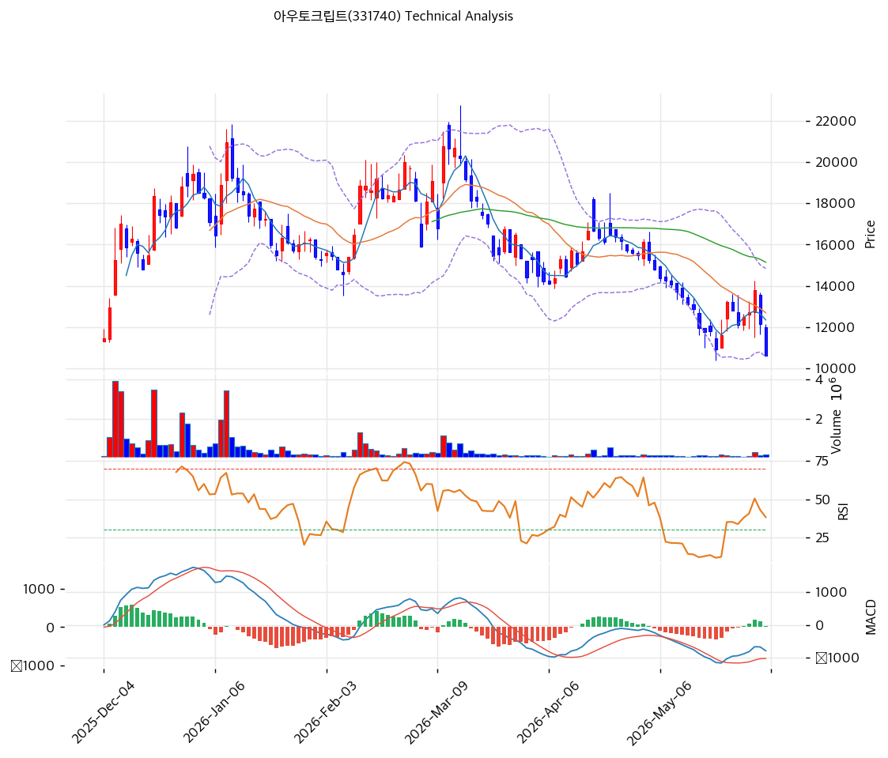

# 아우토크립트(331740) 기술적 분석 보고서

---

## 가격 위치

현재가 **10,650원** (-12.35%) — 상장 종가 30,850원(52주 고가) 대비 **-65% 급락**, 공모가 22,000원 대비 -52%. 52주 위치 **1.6%(바닥권)**, 52주 저가 10,310원 근접. 신규 상장주 수급 부담 + 적자 우려로 상장 후 우하향. 거래량비 1.47배(투매성). RSI 35.5 중립(과매도 근접), 볼린저 하단 근접 — **추가 하락보다 바닥 모색** 국면이나 추세 미반전.

## 이동평균선

| 이평선 | 값 | 이격도 | 위치 |
|------|---:|----:|:---:|
| MA5 | 12,356원 | -13.9% | 아래 |
| MA20 | 12,702원 | -16.2% | 아래 |
| MA60 | 15,149원 | -29.8% | 아래 |
| MA120 | 16,131원 | -34.0% | 아래 |
| MA200 | 15,147원 | -29.8% | 아래 |

**완전 역배열(하락추세)** — 현재가가 모든 이평선 아래. 상장 후 지속 하락으로 단기·중기 이평선이 위에서 저항. 반등 시 1차 저항은 MA20 12,702원.

## 모멘텀 지표

- **RSI 35.5 (중립)** — 30 과매도 위, 침체권. 추가 하락 압력 제한적이나 반전 신호는 미약
- **MACD -791 / 시그널 -813 / 히스토 +22** — 매수 전환(히스토 (+) 전환), 하락 모멘텀 둔화 신호
- **스토캐스틱 K=46.5 / D=59.3** — 데드크로스, 중립
- **볼린저밴드** — 상단 14,843 / 중심 12,702 / 하단 10,561, 폭 33.7%, **하단 근접/이탈**. 과매도 반등 가능 구간
- **거래량비 1.47x** — 당일 -12% 급락에 거래 증가(투매)

## 피보나치 되돌림 (스윙 고가 30,850 / 현재 저점권)

| 레벨 | 가격 | 성격 |
|------|---:|------|
| 0.236 | 16,563원 | 반등 시 1차 저항 |
| 0.382 | 20,468원 | 2차 저항 |
| 0.5 | 23,625원 | 중기 저항 |
| 0.618 | 26,782원 | 깊은 반등 |
| 0.786 | 31,276원 | 전고점권 |

※ 상장 후 급락으로 되돌림은 모두 상단 저항으로 작용. 신규 상장주 변동성 극대 유의.

## 지지/저항 (S&R)

- **저항**: **11,643원(피봇 R1)** / **12,674원(PRZ 약: MA20·피봇 R2)** / 12,702원(MA20) / 12,964원(하락 추세선) / 15,149원(MA60)
- **지지**: **10,133원(피봇 S1)** / 9,627원(피봇 S2) / 10,310원(52주 저가) / 10,561원(BB 하단)

## 종합 시그널 & 전략

**시그널: 매수 1 / 매도 0 / 중립 5 → 중립(매수우위)** (급락 후 과매도 반등 가능성)

- **전략**: HOLD(홀드) — TP 31,467원 / SL 9,627원. WAIT(진입가능) e1 10,133원 / e2 12,702원
- **눌림목/바닥 매수**: 상장 후 -65% 급락 + RSI 35.5 + BB 하단 + MACD 히스토 (+) 전환으로 **단기 과매도 반등 가능 구간**. 단 역배열 하락추세 미반전 → **9,600\~10,100원(피봇 S1·S2) 분할 매수 후 MA20 12,700원 돌파 확인** 접근. 52주 저가 10,310원 지지 여부 관건
- **상방**: 반등 시 MA20 12,700원 → 피보 0.236 16,563원. 펀더멘털(흑전·로열티) 가시화가 추세 반전 동력
- **하방**: 52주 저가 10,310원·피봇 S2 9,627원 이탈 시 신저가. 신규 상장주 수급 부담 잔존
- **변곡점**: 의무보유 해제 물량 소화 + 양산 로열티·흑전 가시화가 추세 분기점. 적자 신규 상장주로 비중·손절 엄격 관리
